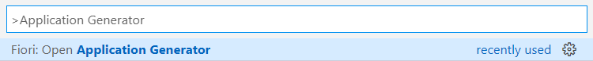
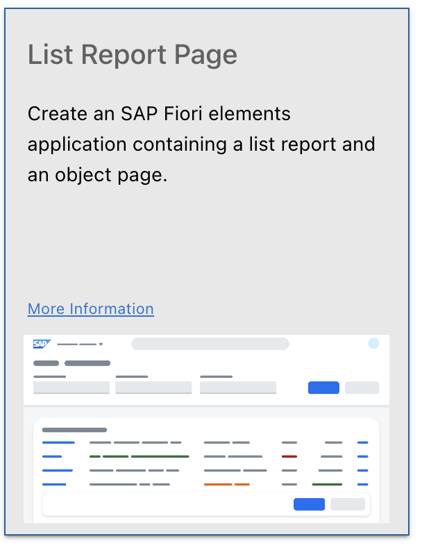
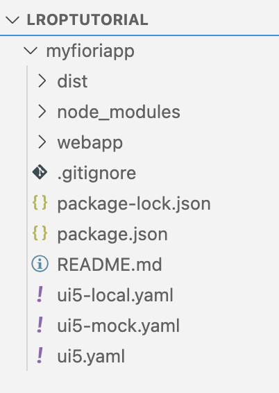
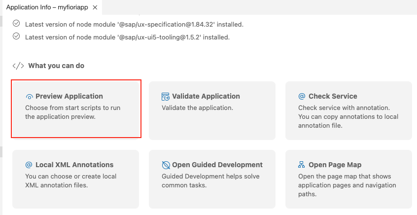
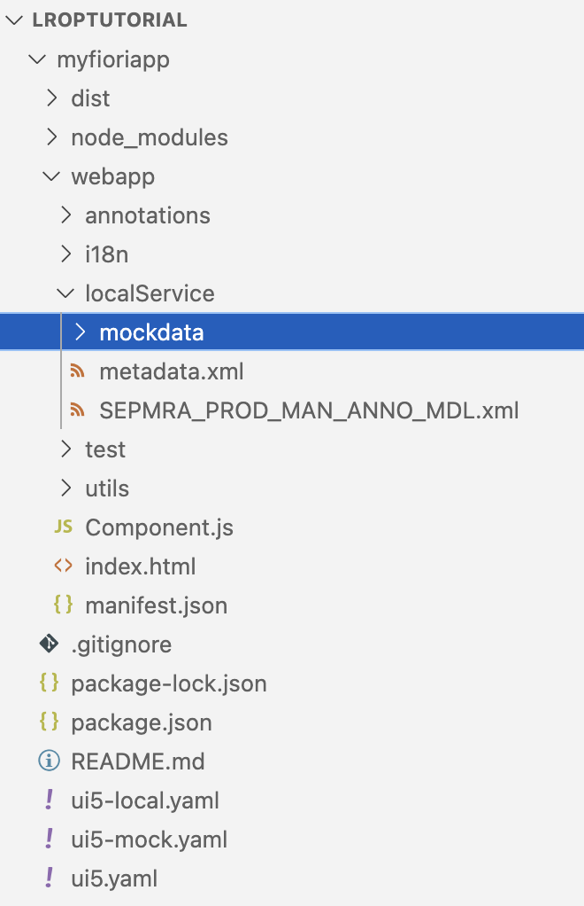

# Set Up and Generate a New SAP Fiori App Project
<!-- description --> Create a simple SAP Fiori elements List Report Page using SAP Fiori tools.

## Prerequisites
 - You must have access to the Gateway Demo System. This tutorial shows you how to access it: [Create an Account on the Gateway Demo System](gateway-demo-signup)
 - You must be able to access the following OData service URL (ES5 service): `https://sapes5.sapdevcenter.com/sap/opu/odata/sap/SEPMRA_PROD_MAN/`
 - You must have Visual Studio Code and SAP Fiori tools installed or have your SAP Business Application Studio environment configured.

## You will learn
- How to generate an SAP Fiori elements application with SAP Fiori tools
- How to test run your application using both mock data and real data

## Intro
The purpose of this tutorial is to familiarize you with the process for creating applications using the SAP Fiori tools Application Generator, as well as the process for testing your application with both mock and real data.

In this case, you will create an SAP Fiori elements list report page displaying a list of products. This list report will be modified in later tutorials using the other extensions available in SAP Fiori tools.

---

### Set up the work environment


Before generating the application, create a root folder for your project wherever you would like to store it. Name it whatever you like. For the sake of this tutorial, we will call it **`lroptutorial`**. Open this folder in your development environment.

<!-- border -->


### Launch Application Generator


SAP Fiori tools includes an Application Generator that provides a wizard-style approach for creating applications based on SAP Fiori elements page types. You are going to use it to create your List Report Page app.

In Visual Studio Code, open the Command Palette using **CMD/CTRL + Shift + P**, type **`Application Generator`**, and select **Fiori: Open Application Generator**.

<!-- border -->

>In Visual Studio Code, the **Command Palette** provides convenient access to a variety of commands. These commands give you access to certain functionality in Visual Studio Code, including the custom commands that are part of SAP Fiori tools.

>If this is the first time SAP Fiori Generator is being installed, you will see the following screen while the installation is in process. Installation is still in progress while the loading indicator is visible. This may take a few minutes.

<!-- border -->


### Select application template


The **Command Palette** will then close and a new tab for the Application Generator will open. Since the purpose of this tutorial is to create an SAP Fiori elements List Report Page app, ensure that **SAP Fiori** is selected in the Template Type menu.

<!-- border -->

Select the **List Report Page** tile and press **Next**.

<!-- border -->


### Configure service for List Report Page


With the page type selected, it is time to connect a data source. You will use the OData service mentioned in the prerequisite section of this tutorial.

Select **Connect to an OData Service** from the dropdown menu. A field to enter the OData service URL will appear. Copy and paste the service URL:

```
https://sapes5.sapdevcenter.com/sap/opu/odata/sap/SEPMRA_PROD_MAN/
```

You may be prompted to enter credentials to access the service. Enter your username and password, and click the **Login** button.


>These credentials were the ones you created if you had to request access to the OData service.

After successfully connecting to the supplied OData service,  click **Next** to customize the template.

Two more fields will appear. One for the **Main Entity** and another for the **Navigation Entity**. Since this list report is intended to display products, select `SEPMRA_C_PD_Product` for **Main Entity**. The application is simply meant to display a list of products, so set the **Navigation Entity** to **`None`**.

Click  **Next**.


### Configure the main project attributes


With the page type and data source defined, the next step is to configure the main project attributes:


|  Project Attribute     | Description     | Value
|  :------------- | :------------- | :-------------
| **Module name** |  **Set the name of the module for this application that will be loaded at runtime. It also determines the directory name of generated application**           | **`myfioriapp`**
| **Application title** |  **Set the application title that will be displayed in the header of the application**           | **`Manage Products`**
| **Application namespace** |  **Set a unique package name for the application module being created**    | **`namespace1`**
| **Description** |  **Add a description for your project**          | **`SAP Fiori elements application for managing products`**
| **Project folder path** |  **Select the folder where you would like to save your project**   | Click the folder selection icon and select the root folder you created in step 1.
| **Minimum SAPUI5 version** |  **Choose minimum SAPUI5 version for your application**   | Use the default suggested value

Select **No** for the three radio button settings: **Add deployment configuration**, **Add FLP configuration**, and **Configure advanced options**. Click **Finish**.


At this point, your application folder will be generated based on the input from above.

Your project structure should look like the image below.    

<!-- border -->

Once your project has been generated, **Application Information** page will be shown for the project you have created. **Application Information** page gives you a quick overview of the most essential information for your project. You can find more information on **Application Information** page here: <https://help.sap.com/viewer/17d50220bcd848aa854c9c182d65b699/Latest/en-US/c3e0989caf6743a88a52df603f62a52a.html>.

>Do not close the Application Information page as it will be needed later. In case you do, open the Command Palette using **CMD/CTRL + Shift + P**, type **Application Info**, and select **Fiori: Open Application Info**


### Preview app with real backend data


Since the given OData service came with pre-configured backend annotations, you can preview your app right away.

From the **Application Information** page, click on the tile **Preview Application**.

<!-- border -->

From the options, you will need to select a npm script. Select `start` and press **`Enter`** to preview your app with backend data. A new browser window will open with your List Report Page application running. Click **Go** to see display the list of products.

<!-- border -->

>You may need to enter the credentials you created if you had to request access to the OData service.


### Preview your application with mock Data


SAP Fiori tools also provides the option to run your application with mock data, which can be used when you face a slow internet connection or an unavailable backend system. For the best learning experience with this tutorial, we will use this option to preview the app.

To download the mock data we have provided for you, navigate to the [SAP Fiori tools Sample repository on GitHub](https://github.com/SAP-samples/fiori-tools-samples/blob/main/V2/mockData/SEPMRA_PROD_MAN/data.zip). Click **Download** to download the zip file of the project.


Extract the zip file to a location of your choice. Drag the extracted folder into the `localService` folder in your app, under `**webapp**` > `**localService**`



From the Visual Studio Code **Explorer** on your left, right-click your project and select **Preview Application**.

From the options, you will need to select a npm script. Select `start-mock` and press **`Enter`** to preview your app with mock data.

<!-- border -->

A new browser window opens with your List Report Page application running with mock data.

At this point, you should have the following:

- A List Report SAP Fiori elements project generated by the SAP Fiori tools Application Generator

- A running application using real backend data

Good job! In the next tutorial, you will enhance the functionality of this application by configuring the List Report Page using SAP Fiori tools.


