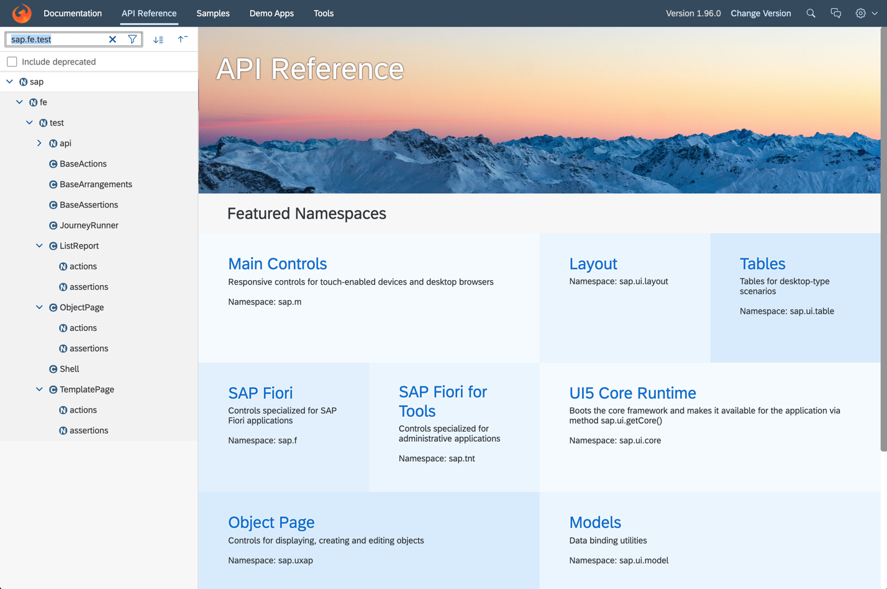
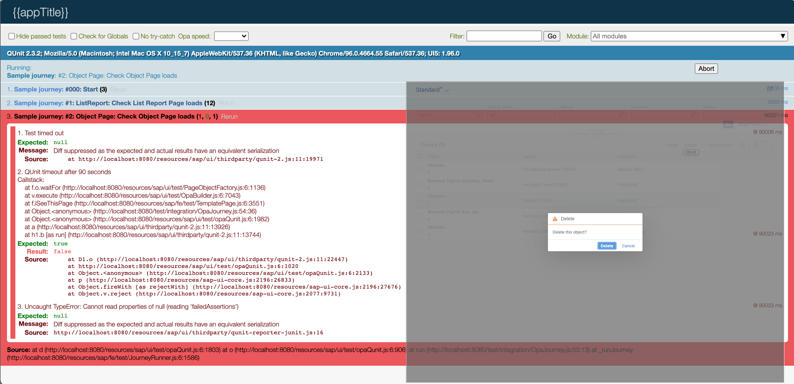

# Write OPA Tests for an SAP Fiori Elements for OData V4 Application
<!-- description --> Reuse test functions from the SAP Fiori elements for OData V4 OPA test library to write OPA (One Page Acceptance) tests.

## Prerequisites
   - An OData V4 service and an SAP Fiori elements for OData V4 application that was generated based on that service.
   To achieve this, we recommend that you run through the tutorial [Create a Travel App with SAP Fiori Elements Based on OData V4 RAP Service](fiori-tools-rap-prepare-service).

## You will learn
  - How to use the generated OPA test files within the embedded test structure
  - How to start the tests within the development environment
  - How to implement OPA tests using the SAP Fiori elements for OData V4 OPA test library

---

### Introduction


1. Why should you use the SAP Fiori elements for OData V4 OPA test library to write OPA tests?

    The OPA test library provides a set of test functions that can be reused within OPA tests of SAP Fiori elements for OData V4 applications. When you write such OPA tests, you only need to test the application-specific functionalities. The core functionalities provided by SAP Fiori elements are already tested by the framework itself.

    Nevertheless, you need to implement certain steps to test the specific functionalities of the app, e.g. starting the app, loading data into the list-report, navigating between a list-report and an object-page, saving business objects, etc. To implement these steps within an OPA test, you can reuse the test functions of the OData V4 OPA test library and you don´t need to re-implement these functions. This saves time and avoids redundancy.

    Another advantage of using the OData V4 OPA test library is that updates for the test functions due to framework changes are automatically provided by the framework. This ensures that your tests will not break.

2. Generated OPA test folders and files

    When an SAP Fiori elements app is generated using SAP Fiori tools, the files you need for executing OPA tests are already provided. You can find these files in the `/test` folder of the generated application.

    These test structures are created when you generate your application based on a RAP service.

3. OData service and application used for this tutorial

    - To demonstrate the usage of the SAP Fiori elements for OData V4 OPA test library within this tutorial, an application based on a RAP service is used. These resources are taken from the output of the tutorial [Create a Travel App with SAP Fiori Elements Based on OData V4 RAP Service](fiori-tools-rap-prepare-service), which allows you to use the SAP Business Technology Platform to create an individual service and the application.

    - You can also clone a CAP-based application developed in the tutorial [Create an Incident Management App with SAP Fiori Elements for OData V4](fiori-tools-cap-prepare-dev-env). Use branch `/sampleSolution` to clone the complete application from the GitHub repository with the URL below:
    ```URL
    https://github.com/SAP-samples/fiori-elements-incident-management/tree/sampleSolution
    ```
      In this branch of the repository the `/test` folder is already available and you can directly start the tests. If you run through the CAP-based tutorial manually, the `/test` folder will not be created when the application is generated. However, you can copy the folder from the `/sampleSolution` branch into the application to execute the tests.

    - You can, of course, also use any other service/application to apply the steps shown within this tutorial. When you implement the test functions, you have to align the parameter values of the functions accordingly.

4. Data used for executing the application

    You can run your tests using either static or dynamic mock data.

    - Static mock data

        This is the preferred option for executing OPA tests. You can store the mock data as json files in the `/localService/mockdata` folder and each time the server and the application are restarted, the same set of data is loaded. This means the tests are always based on the same set of data.

        For this tutorial, a very simple set of static mock data is used, which consists of two json files: `Travel.json` and `Booking.json`. The data that is contained in these files is sufficient to run the test functions used in the tutorial. You can downloaded these files from the GitHub repository with the URL below:
        ```URL
        https://github.com/SAP-samples/fiori-elements-incident-management/tree/sampleSolution/app/incidents/webapp/localService/mockdata_RAP_service
        ```

        You can find the two files in the `/mockdata_RAP_service` folder of this branch. You can copy these files to the `/localService/mockdata` folder of the application. Note that these mock data files can only be used for the application that was created by going through the steps of the tutorial [Create a Travel App with SAP Fiori Elements Based on OData V4 RAP Service](fiori-tools-rap-prepare-service).

    - Dynamic mock data

        The mock server generates mock data dynamically when you start the application. Note that, when you use dynamic mock data, you cannot rely on the same set of test data always being used.

&nbsp;


### Test resources within an SAP Fiori elements application


1. Test folders that are created when an app is generated by SAP Fiori tools

    The resources you need to execute OPA tests are located in the folder `/webapp/test`.

    <!-- border -->

    The folder `/integration` contains the files for running the OPA tests and the OPA journey itself. The page objects for the list-report and the object-page are located within the files of the sub-folder `/pages`.

2. Files within the test folders

    - `opaTests.qunit.html`

        This is the file that is started when you execute the tests via console command or **Preview Application** (see Step 3 of this tutorial). Within this html-file, the java-script file `OpaTests.qunit.js` is started.

    - `OpaTests.qunit.js`

        This file imports the page objects and the OPA journeys that you execute. The journeys are started using the `JourneyRunner`, which allows you to define some advanced options related to the OPA configuration (see details about the `JourneyRunner` in chapter 3 of this step).

        ```javascript
        sap.ui.require(
            [
                'sap/fe/test/JourneyRunner',
                'sap/fe/demo/travellist/test/integration/FirstJourney',
                'sap/fe/demo/travellist/test/integration/pages/TravelList',
                'sap/fe/demo/travellist/test/integration/pages/TravelObjectPage',
                'sap/fe/demo/travellist/test/integration/pages/BookingObjectPage'
            ],
            function(JourneyRunner, opaJourney, TravelList, TravelObjectPage, BookingObjectPage) {
                'use strict';
                var JourneyRunner = new JourneyRunner({
                    // start index.html in web folder
                    launchUrl: sap.ui.require.toUrl('sap/fe/demo/travellist') + '/test/flpSandbox.html'
                });
            
                JourneyRunner.run(
                    {
                        pages: { 
                            onTheTravelList: TravelList,
                            onTheTravelObjectPage: TravelObjectPage,
                            onTheBookingObjectPage: BookingObjectPage
                        }
                    },
                    opaJourney.run
                );
            }
        );
        ```

        >The `launchUrl:` parameter (see line 13 in the coding fragment above) contains the `/index.html` as a starting page in your file. Please change this to `/test/flpSandbox.html`. This is necessary to start the application within the shell, which allows you to use test functions that are related to the shell controls (see Step 6, chapter 5: Navigate back to the list-report).


      - `FirstJourney.js`

        This is a first journey to demonstrate some basic steps within an OPA test. The journey starts the application, checks the list-report shown and loads data into the list-report table. By clicking on a row a navigation to the object-page is triggered and the successful loading of the object-page is checked. As a last step, the application is closed. This journey is intended as a basic starting point to which you can add your own specific tests for an enhanced test automation.

        ```javascript
        sap.ui.define([
            "sap/ui/test/opaQunit"
        ], function (opaTest) {
            "use strict";

            var Journey = {
                run: function() {
                    QUnit.module("First journey");

                    opaTest("Start application", function (Given, When, Then) {
                        Given.iStartMyApp("travellist-tile");
                        Then.onTheTravelList.iSeeThisPage();
                    });

                    opaTest("Navigate to ObjectPage", function (Given, When, Then) {
                        // Note: this test will fail if the ListReport page doesn't show any data
                        When.onTheTravelList.onFilterBar().iExecuteSearch();
                        Then.onTheTravelList.onTable().iCheckRows();

                        When.onTheTravelList.onTable().iPressRow(0);
                        Then.onTheTravelObjectPage.iSeeThisPage();
                    });

                    opaTest("Teardown", function (Given, When, Then) { 
                        // Cleanup
                        Given.iTearDownMyApp();
                    });
                }
            }
            return Journey;
        });
        ```

        >In line 10 of the coding fragment above, the application is started by using the function `iStartMyApp()`. Please add the name (semantic object and action) as a parameter to the function `iStartMyApp("travellist-tile")`. You can find the name of your application in the file **/webapp/test/flpSandbox.html** in the `applications:` parameter, which should look similar to the one listed below. Line 3 contains the name of the application.


        ```flpSandbox.html
        ...
          applications: {
    				"travellist-tile": {
    					title: "Travel Management",
    					description: "Fiori elements",
    					additionalInformation: "SAPUI5.Component=sapuidemo.travellist",
    					applicationType: "URL",
    					url: "../"
    				}
    			}
        ...
        ```


      - `pages/TravelList.js`, `pages/TravelObjectPage.js`, `pages/BookingObjectPage.js`

        These are the files where the test library is included (see sap.ui.define statement) and where you can implement application-specific actions and assertions.

        ```javascript
        sap.ui.define(['sap/fe/test/ListReport'], function(ListReport) {
            'use strict';

            var CustomPageDefinitions = {
                actions: {},
                assertions: {}
            };

            return new ListReport(
                {
                    appId: 'sap.fe.demo.travellist',
                    componentId: 'TravelList',
                    entitySet: 'Travel'
                },
                CustomPageDefinitions
            );
        });
        ```

3. The `JourneyRunner` class

    This class is used to simplify the start of OPA journeys and to control central OPA5 configuration parameters. An instance of the class is created in the file `OpaTests.qunit.js` (see chapter 2 in this step). The instance defines the application and the page objects, which are used for the OPA test, and the `run` method of the class executes the journey.

    Please see further options of this class in the SAPUI5 documentation under

    ```URL
    https://sapui5.hana.ondemand.com/#/api/sap.fe.test.JourneyRunner
    ```

&nbsp;


### Start the tests


To start the OPA journey `FirstJourney.js`, you can choose from one of the following options:

- Start via Script from the file `package.json`

    RAP-based applications like the one used for this tutorial, typically provide a start-script command, which is available in the `package.json` file.

    Check the file for an entry like the one below.
    ```package.json
    "scripts": {
      ...
      "int-test": "fiori run --config ./ui5-mock.yaml --open 'test/integration/opaTests.qunit.html'"
      ...
    }
    ```
    If this entry is available, you can start the tests using the following command from the console.
    ```console
    npm run int-test
    ```
    This command starts a server and automatically opens a separate browser tab for the OPA tests.

    You can also start the tests using the application preview by right-clicking the `webapp/` folder of the application and selecting **Preview Application**. In the context menu, choose the option **int-test**.


- Start server and tests manually

    For a CAP-based application you can start the server using one of the following options:
    ```console
    npm start
    ```
    or
    ```console
    cds watch
    ```
    This depends on the way the application was implemented.


    In a separate browser tab, use the following URL to trigger the execution of the OPA tests:
    ```URL
    http://localhost:<port>/<application-name>/webapp/test/integration/opaTests.qunit.html
    ```
    Depending on the structure of the application, you need to align the port and path accordingly.

If you change the OPA journey while the server is running and while the tests are open in a browser tab, a refresh is triggered automatically. To restore the mock data, you need to restart the server and the tests.

&nbsp;


### Documentation for the SAP Fiori elements for OData V4 OPA test library


The test library is documented in the API reference of the SAPUI5 documentation.

1. Open the [SAPUI5 API Reference](https://sapui5.hana.ondemand.com/#/api) and search for the structure **sap.fe.test**.

    The folder structure containing the documentation looks as shown in the following screenshot:

    <!-- border -->

    The `/api` folder contains the test functions you can call from OPA journeys. The folders `/ListReport`, `/ObjectPage` and `/TemplatePage` contain the access points that allow you to address the API test functions for specific UI areas.

2. Access points in folders `ListReport`, `ObjectPage` and `TemplatePage`

    With only a few exceptions, the actions and assertions within these folders just provide the possibility to address specific UI areas within the application. These areas are e.g. the filter bar, a table, the object-page header, etc.

    In the example below, the list-report table is loaded by calling function `iExecuteSearch()`. This function actually presses the **Go** button on the list-report to trigger the loading of data. Since this button is part of the filter bar, the access point `onFilterBar()` is called executing the search.

    ```Javascript
    When.onTheTravelList.onFilterBar().iExecuteSearch();
    ```

3. The test functions within the SAP Fiori elements for OData V4 test library

    The `/api` folder includes all the available test functions of the library. This folder consists of actions and assertions divided into the UI areas that can be addressed (see previous chapter).

    The screenshot below shows the selected API link **Filter Bar Actions** and the content area. The content area shows all the test functions representing actions for the filter bar that you can call from an OPA journey.  

    <!-- border -->

4. Naming and parameter conventions

    The test functions in the `/api` folder follow certain rules in terms of naming and parameters.

    The function names and their meaning are listed in the table below.

    | Name              | Meaning                                                 |
    | :---------------- | :------------------------------------------------------ |
    | `iExecute...`       | press a button                                          |
    | `iCheck...`         | check an UI object for content, properties, ...         |
    | `iChange...`        | change the content of a field                           |
    | `iAdd/iRemove...`   | add/remove content to/from a list (e.g. filter-fields)  |
    | `iPress...`         | click into a table-row or table-cell                    |
    | etc.              |                                                         |


    The basic principle of OPA test functions is to identify a UI object and then use it to carry out an action like pressing a button or checking content (assertion). Therefore, almost all functions of the API have an identifier as a first parameter, which can either be an object containing parts of the stable ID of the UI control, or a string containing the label as a constant value.

    Assertions often have a state parameter, which allows you to check for any properties of a UI control. The coding sample below shows the assertion to check the visibility and enablement of a button. The identifier is passed as part of the service and action name.

    ```Javascript
    When.onTheTravelObjectPage.onHeader()
        .iCheckAction({ service: "com.c_salesordermanage_sd", action: "ChangeOrderStatus"},
                      { visible: true, enabled: false });
    ```

5. Chaining of functions

    When you call several functions that belong to the same UI area, the functions can be chained to ease readability. In the example below, the following assertions are executed on the object-page:

    - in the header the **Edit** and the **Change Order Status** buttons are checked
    - with `.and.then.`, the control returns to the object-page (`onTheTravelObjectPage`) and a local test function `iSeeFacetActionButton()`, which is not part of the API, is called
    - in the footer area, the **Save** button is checked

    ```Javascript
    When.onTheTravelObjectPage
      .onHeader()
        .iCheckEdit({ visible: true, enabled: false })
        .and.iCheckAction({ service: "com.c_salesordermanage_sd", action: "ChangeOrderStatus"},
                          { visible: true, enabled: false })
        .and.then.iSeeFacetActionButton("OrderData", "com.c_salesordermanage_sd.FacetFormAction",
                                        { visible: true, enabled: true })
        .and.onFooter()
            .iCheckSave({ visible: true, enabled: true })
    ```

&nbsp;


### Enhancing the OPA journey - testing the list-report


Steps 5 and 6 of this tutorial demonstrate the adoption of the SAP Fiori elements for OData V4 OPA test library.  

The OPA test journey available in file `FirstJourney.js` is just a starting point for you to enhance the tests for the list-report and the object-page. This journey currently starts the application and loads the list-report table. Then, a function checks whether data is available in the table. A navigation to the object-page is executed before the application is closed in the last step.

In the following chapters, you will add further tests for the list-report to get to know some typical operations on the UI objects needed to do integration testing. The tests are applied to the application's list-report, as shown in the screenshot below.

<!-- border -->


1. Check the content within the list-report table

    You can use the test function `iCheckRows()` to check whether data has been loaded in the table. By simply passing a constant value as the only parameter, you can check that the correct number of records is loaded. Enhance the existing assertion to pass the expected number of loaded records as a parameter. In the example below, 5 records are expected.

    ```Javascript
    opaTest('Navigate to ObjectPage', function(Given, When, Then) {
        When.onTheTravelList.onFilterBar().iExecuteSearch();
        Then.onTheTravelList.onTable().iCheckRows(5);
    });
    ```

    To perform the required check whether specific values are available in the fields of a list-report table, you can use the test function `iCheckRows()`. To do so, pass a condition as a parameter to identify a value within a column of the table. In the example below, column **Travel** is checked for value **2**.

    ```Javascript
    ...
      Then.onTheTravelList.onTable()
          .iCheckRows(5)
          .and.iCheckRows({ "Travel": "2" });
    });
    ```

    You can check connected description/ID field values by passing the complete content to the test function. In the example below, the content **Ryan (594)** is checked in the column **Customer**.

    ```Javascript
    ...
      Then.onTheTravelList.onTable()
          .iCheckRows(5)
          .and.iCheckRows({ "Travel": "2" })
          .and.iCheckRows({ "Customer": "Ryan (594)" });
    });
    ```

2. Load filtered data into the list-report table

    Load filtered data into the list-report to avoid too much data being loaded. You can use the filter bar to do this. You can set values in the filter fields with the test function `iChangeFilterField()`. Add the coding below right at the end of test 1 to set a filter field and to reload the data.

    ```Javascript
    ...
      When.onTheTravelList.onFilterBar()
          .iChangeFilterField("Status", "A")
          .and.iExecuteSearch();
      Then.onTheTravelList.onTable()
          .iCheckRows(1);
    });
    ```

    The filter field **Status** is set to value **A** for "Accepted" to load all records with that status. Additionally, another assertion is entered to check that exactly one record is loaded with this filter.


    To again load all available data, clear the filter field by calling the same function with an empty string as the value. Reloading the data shows 5 records.

    ```Javascript
    ...
      When.onTheTravelList.onFilterBar()
          .iChangeFilterField("Status", "", true)
          .and.iExecuteSearch();
      Then.onTheTravelList.onTable().iCheckRows(5);
    });
    ```

3. Execute an action on a selected item in the list-report

    Before executing standard or custom-bound actions, you can select an item in the list-report table by using the test function `iSelectRows()`. As with the check function for rows, you can determine the selection by a condition. The action to be executed will be the deletion of a travel item. Do this by calling the test function `iExecuteDelete()`.

    The following test fragment selects a single row and deletes the travel item by executing the standard delete action.

    ```Javascript
    ...
      When.onTheTravelList.onTable()
          .iSelectRows({ "Customer": "Ryan (594)" })
          .and.iExecuteDelete();
    });
    ```
    Since these actions are related to the list-report table, you use the identifier `onTable()` to access the corresponding functions. You don´t need to provide a parameter for `onTable()`, since there´s only one table available on the list-report. For more functions related to the list-report table, please have a look at the content of **TableActions** and **TableAssertions** within the API documentation (see step 4 of this tutorial).

    >There are several test functions for pressing and checking standard buttons like Edit, Delete and Save, that are managed by the SAP Fiori elements framework. Such test functions are e.g. iExecuteEdit/iCheckEdit, iExecuteDelete()/iCheckDelete(), etc. The test library provides the functions iExecuteAction() and iCheckAction() to perform action and assertions on custom action buttons. To identify the button you need to provide an identifier as a parameter for the function (see the related API documentation).


    Once the journey reaches the delete function, it stops and after some time you´ll see an error message in the log area (see screenshot below). The standard delete action shows a dialog, which asks the user to confirm the deletion. This dialog also needs to be handled by the OPA test, i.e. you have to confirm the deletion by pressing the **Delete** button.

    <!-- border -->

    Several test functions are available for handling dialogs within OPA journeys. Please check the **Dialog...Actions/Assertions** within the API documentation. To confirm the dialog to delete the travel item, use the function `onDialog().iConfirm()` as shown in the coding sample below.

    ```Javascript
    ...
      When.onTheTravelList.onTable()
          .iSelectRows({ "Customer": "Ryan (594)" })
          .and.iExecuteDelete();
      When.onTheTravelList.onDialog().iConfirm();
    });
    ```

    >Because you have deleted one of the records, restarting the journey results in an error. This is because the journey checks for 5 records to be loaded. You can either deactivate the deletion of the record by adding **`//`** in front of each line, or restart the server each time before running the journey to reset the mock data.


4. Navigate to the object-page

    To add further tests, you can navigate from the list-report to the object-page.

    To navigate to the object-page, click on one of the loaded items in the list-report table. You can do this by using the table action `iPressRow()`. The parameter corresponds to the one used in the `iSelectRows()` function. You can pass a zero- based line index or a condition, which defines the row to be clicked. See the coding fragment below showing the test function using a condition to navigate to the object-page.

    ```Javascript
    ...
      When.onTheTravelList.onTable().iPressRow({ "Customer": "Prinz (608)" });
    });
    ```

&nbsp;


### Testing the object-page


The object-page contains further UI objects you can test using OPA tests. There are header elements, sections, forms, tables, etc. You can also navigate down to sub-object-pages and edit and save data - so testing a complete workflow of loading/creating, changing and saving of data is possible.

<!-- border -->

1. Checking fields on the object-page header

    To confirm that the correct record is loaded in the object-page, check the title using the test function `iCheckTitle()` from the header assertions. Additionally, you can check if the item loaded can be edited by testing the properties `visible` and `enabled` of the Edit button. Add the `iCheckEdit()` assertion to the existing checks. Since this is another header assertion you don´t need to repeat the `onHeader()` command.

    ```Javascript
    ...
      Then.onTheTravelObjectPage
          .iSeeThisPage()
          .and.onHeader().iCheckTitle("Business Trip for Christine, Pierre")
          .and.iCheckEdit({ visible: true, enabled: true });
    });
    ```

2. Check a field in a form of a section

    You can use the form-assertions to check fields within the sections of an object-page. As implemented for most of the test functions, you can use both strings and objects as parameters for identifying the UI controls you want to check. When you provide a string, the test functions expect the label of a control to be passed as a value. If an object is provided as the parameter, the internal name of the control is expected. The test function then creates the stable ID used for the control for identification.

    The following example shows both options of passing the parameters to identify the field **Agency** and to check its content. In the first call of the test function `iCheckField()`, strings are used to identify the field. The second call uses the internal names for the section, form and field and also passes the content with the elements `value` and `description`.

    You can use function-chaining to enhance the existing checks for the page and the header controls. Using `.and.then.` returns the control to the page to then use the `onForm()` command to check the field.

    ```Javascript
    ...
      Then.onTheTravelObjectPage
          .iSeeThisPage()
          .and.onHeader().iCheckTitle("Business Trip for Christine, Pierre")
          .and.iCheckEdit({ visible: true, enabled: true })
          .and.then.onForm("General Information").iCheckField("Agency", "Hot Socks Travel (70007)")
          .and.then.onForm({ section: "GeneralInfo", fieldGroup: "Travel" }).iCheckField({ property: "AgencyID" }, { value: "70007", description: "Hot Socks Travel" });
    });
    ```

    The second call of the test function `iCheckField()` uses internal names for the `section`, form (`fieldGroup`) and the field (`property`). You can find these names in the corresponding annotations of the metadata.xml file. See below fragments of the metadata showing the identifiers. You can also take these identifiers from the CDS definitions in the back end.

    ```XML
    ...
      <Annotations Target="SAP__self.TravelType">
      ...
        <Annotation Term="SAP__UI.Facets">
          <Collection>
            <Record Type="SAP__UI.CollectionFacet">
              <PropertyValue Property="Label" String="General Information"/>
              <PropertyValue Property="ID" String="GeneralInfo"/>                                 <!-- identifier for the section parameter -->
              <PropertyValue Property="Facets">
                <Collection>
                  <Record Type="SAP__UI.ReferenceFacet">
                    <PropertyValue Property="Label" String="General"/>
                    <PropertyValue Property="ID" String="Travel"/>                                <!-- identifier for the form parameter -->
                    <PropertyValue Property="Target" AnnotationPath="@SAP__UI.Identification"/>
                  </Record>
      ...
        <Annotation Term="SAP__UI.Identification">
          <Collection>
            <Record Type="SAP__UI.DataField">
              <PropertyValue Property="Value" Path="Description"/>
            </Record>
            <Record Type="SAP__UI.DataField">
              <PropertyValue Property="Value" Path="CustomerID"/>
            </Record>
            <Record Type="SAP__UI.DataField">
              <PropertyValue Property="Value" Path="AgencyID"/>                                   <!-- identifier for the field parameter -->
            </Record>
          </Collection>
        </Annotation>
    ...      
    ```


3. Change the section and check a field in an object-page table

    Object-pages can contain several tables within the sections. To address these tables you can call the `onTable()` command that was already used in the examples above when columns in the list-report were checked. Now you have to pass an identifier for the specific table to be checked. This can either be a string representing the header title of the table, or an object containing the ID of the navigation property that is used to associate the main entity of the object-page to the entity managed in the table. In this example it is the association between the Travel entity (parent) and the Booking entity (child) represented by the navigation property `_Booking` in the definitions of the Travel entity type.

    Again, you can use the test function `iCheckRows()` for checking a specific column within the table. Before checking the table, you need to switch the section to show the **Bookings** table using the test function `iGoToSection()` of the object-page.

    ```Javascript
    ...
      When.onTheTravelObjectPage.iGoToSection("Bookings");
      Then.onTheTravelObjectPage.onTable({ property: "_Booking" }).iCheckRows({ "Airline": "Sunset Wings (SW)"}, 4);
    });
    ```


4. Change a field and save the Travel item in the object-page

    You will now test the whole workflow of changing the field **End Date** to a new value, saving the Travel item and checking the changed field and the confirmation message shown.

    - First you need to show the section **General Information** on the UI again. Therefore, again call the test function `iGoToSection()`.
    - Then you need to set the object-page to Edit mode to be able to change data. You can click the Edit button in the header area by using the header action `iExecuteEdit()`.
    - Now you change the field **End Date** to the new value **Aug 31, 2021** using the function `iChangeField()`. The field is located within the field-group **Dates** of section **General Information**. These values are sent to the `onForm()` command to allow access to the field.
    - After changing the field, you need to save the Travel item by calling `iExecuteSave()` in the footer area.
    - With assertion `iSeeMessageToast()` you can check the result of the save process, which finishes with a confirmation message shown as a message toast. This assertion is located in the base assertions, so you don´t need to pass a qualifier related to pages or areas of the UI.
    - To conclude the workflow, you check the changed field using assertion function `iCheckField()`.

    ```Javascript
    ...
      When.onTheTravelObjectPage.iGoToSection("General Information");
      When.onTheTravelObjectPage.onHeader().iExecuteEdit();
      When.onTheTravelObjectPage.onForm({ section: "GeneralInfo", fieldGroup: "Dates" }).iChangeField({ property: "EndDate" }, "Aug 31, 2021");
      When.onTheTravelObjectPage.onFooter().iExecuteSave();
      Then.iSeeMessageToast("Object saved.");
      Then.onTheTravelObjectPage.onForm({ section: "GeneralInfo", fieldGroup: "Dates" }).iCheckField({ property: "EndDate" }, { value: "Aug 31, 2021" });
    });
    ```

5. Navigate back to the list-report

    As a last step, you will navigate back from the object-page to the list-report. You can do this by calling the shell function `iNavigateBack()`, which just presses the back button of the shell. To be able to call this function, you must have  started the application within SAP Fiori launchpad (see Step 2, chapter 2: Files within the test folders). After navigating back, you again check the list-report using test function `onTheTravelList.iSeeThisPage()`.

    ```Javascript
    ...
      When.onTheShell.iNavigateBack();
      Then.onTheTravelList.iSeeThisPage();
    });
    ```

&nbsp;

---

In this tutorial you learned how to work with the SAP Fiori elements for OData V4 test library. Please check the [SAPUI5 API  Reference](https://sapui5.hana.ondemand.com/#/api) to apply more of the test functions provided by the reuse library.

Enjoy your future projects!

---
