# Run a SAP Fiori Elements Application using Mockserver
<!-- description --> Using mockserver and advance features in running SAP Fiori Elements application.

## Prerequisites
-An OData V4 service and an application based on that service that was generated by **SAP Fiori tools**.
-Starting point could be to run through the tutorial [Create a Travel App with SAP Fiori Elements Based on OData V4 RAP Service](fiori-tools-rap-prepare-service).

## You will learn
  - How to use mock server with SAP Fiori elements application
  - How to create mock data with Data Editor
  - How to add additional services to mock server

---

### Introduction


1. Check the dependency that the mock server is installed.

    Check `package.json`

    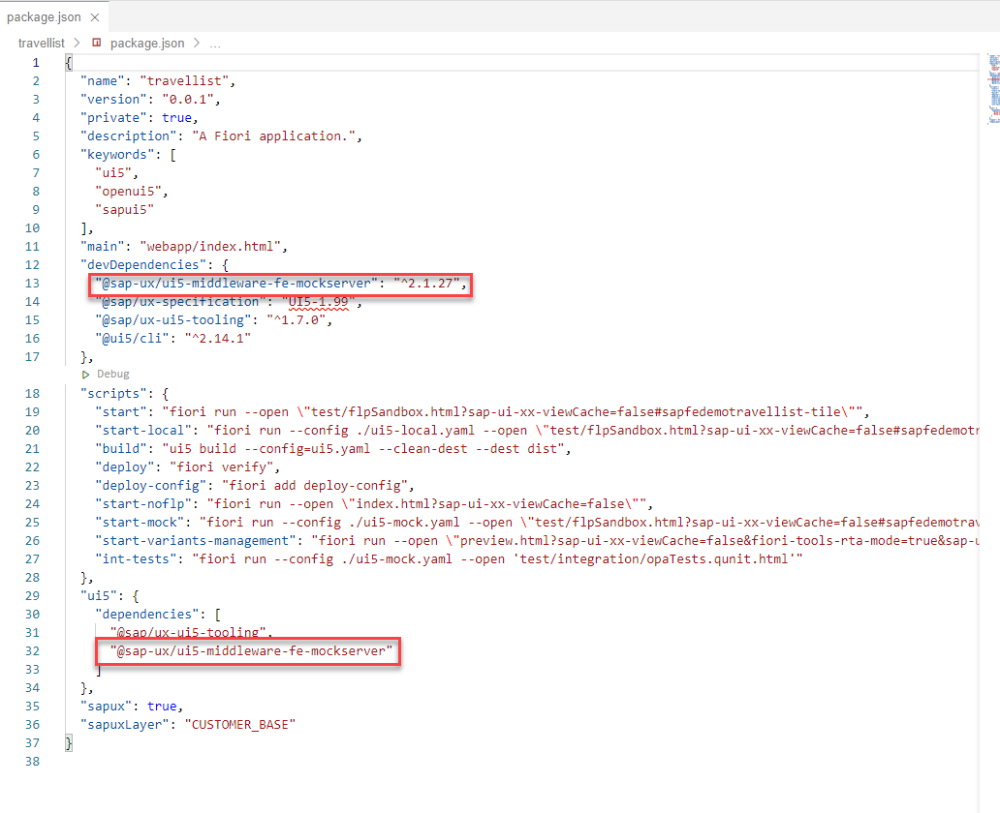

     Check `ui5-mock.yaml`

    

2. If you need to install mock server manually to a project, see the following.

    ```URL
    https://github.com/SAP/open-ux-odata
    ```


### Start Mockserver


1. In the SAP Business Application Studio open the context menu by right clicking on your `webapp` folder and select menu entry **Preview Application**.

     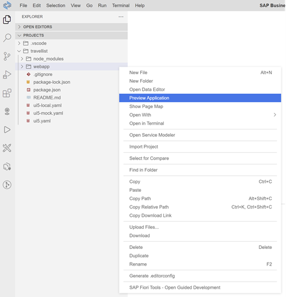

2. From the dropdown menu select `start-mock`

    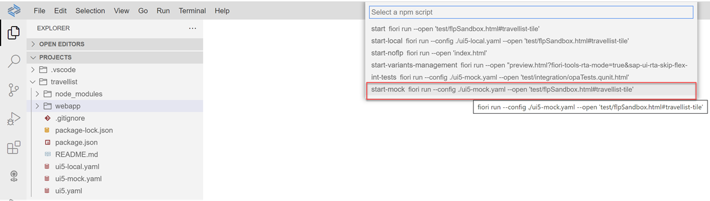

     If you see some status message in the console window and a popup-message telling you that the application will open in a new browser tab, click the `Open` button to switch to the new browser tab.

      In the new browser tab showing your application, choose **Go** to load data.

      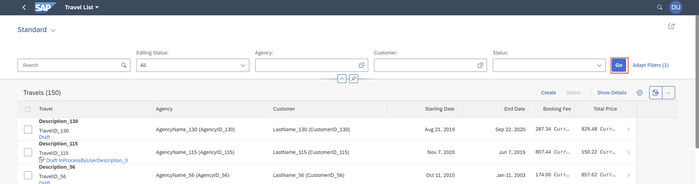


### Using Data Editor


When running an application using `start-mock` the mock data is generated on the fly.  But, by using the Data Editor you can generate mock data that will be stored as **.json** format under the  `webapp/localService/data` folder. Therefore, allowing you to change data and make it more meaningful for your application.

1. In the SAP Business Application Studio open the context menu by right clicking on your `webapp` folder and select menu entry **Open Data Editor**.

    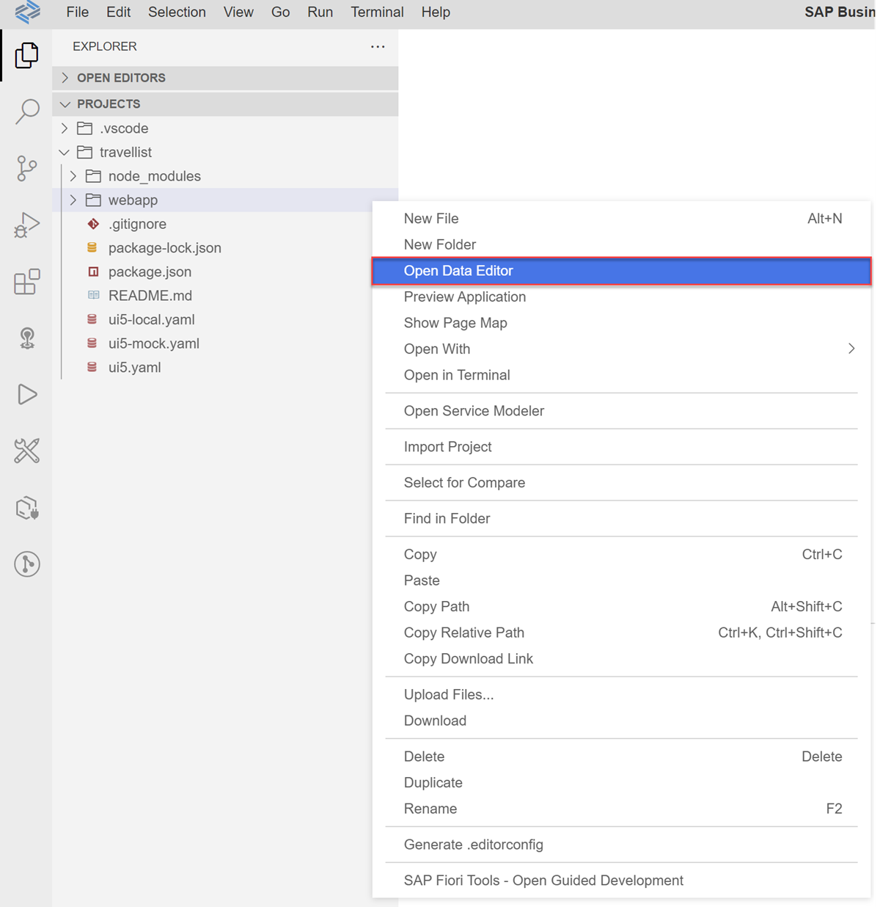

2. Data Editor opens with No Data. Click on `Create Mock Data`

    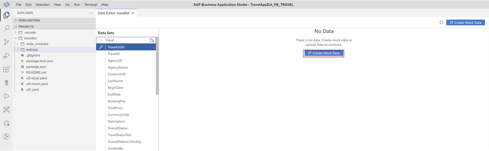

     Data will be generated for each entity and property combination and stored under `webapp/localService/data`

     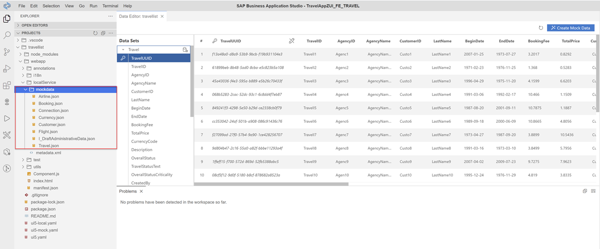

3. Preview your application using `start-mock` again and the application will be using mock data from the stored location.


### Adding an Additional Services to Mockserver


In the step above you generated mock data for your table.  But your application also has a filter bar that is still connected to the backend for its Value Help.   

  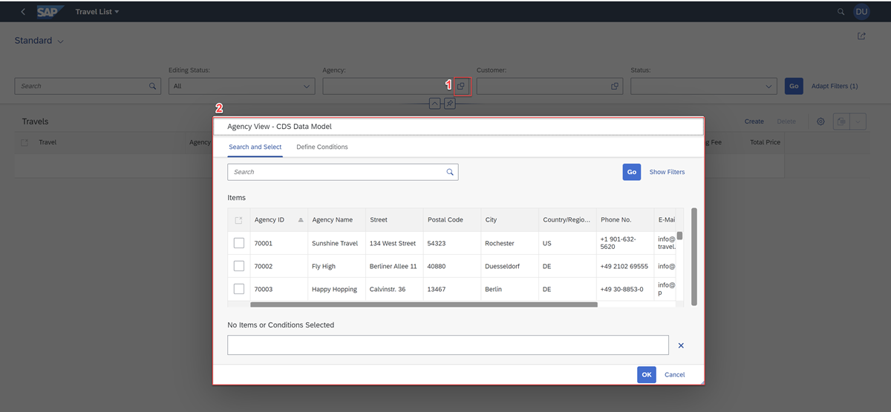

You can also see the call in your `metadata.xml` file.

  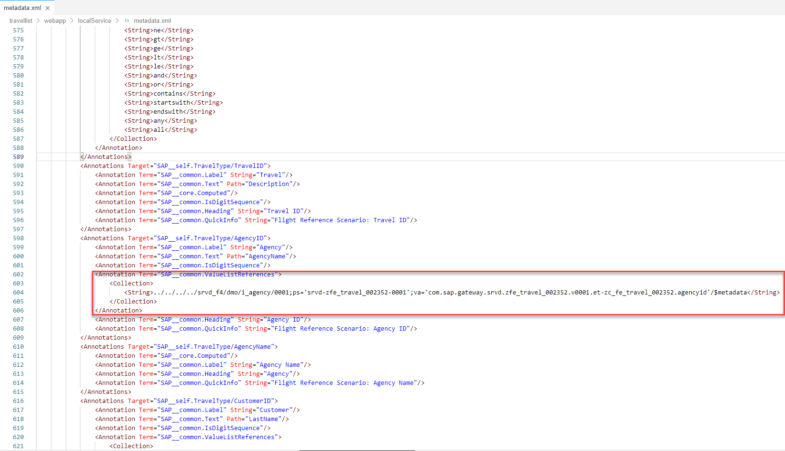

To test this out you can also disable the backend and check that the Value Help does not open. Open your `ui5-mock.yaml` file, and comment out the backend call.

  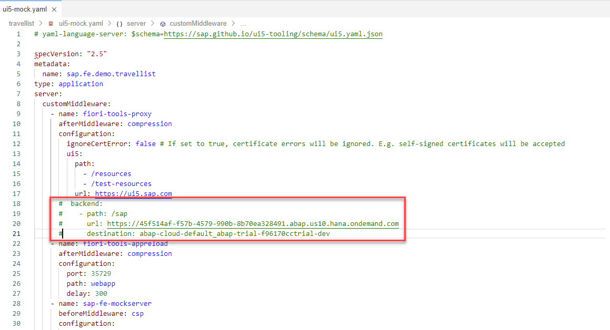

  Validate that Agency Value help does not open.

>If you still see data in Value Help,please make sure you stop your server and restart.

  Before proceeding to the next steps, please enable your backend.  

To be completely off-line, you would need to add additional mock services for each of the Value List References in your `metadata.xml`. In this step you will add a mock service for  **Agency** that will support your Value Help.

1.  To mock the service for Agency value Help you need the following:

    * Agency Value Help metadata file
    * Agency Value Help service URL (`urlPath`)
    * A `config.json` file that will tell mock server where to find these file
    * Adjust your `ui5-mock.yaml` file to read your new  `config.json` file

2.  Agency Value Help metadata

    Open the application and click on the **Agency** Value Help button.

    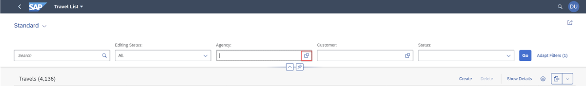


    Go back to your projects **Terminal** , you should see a dedicated *info server:ux-proxy* call to a new **$metadata** file.

    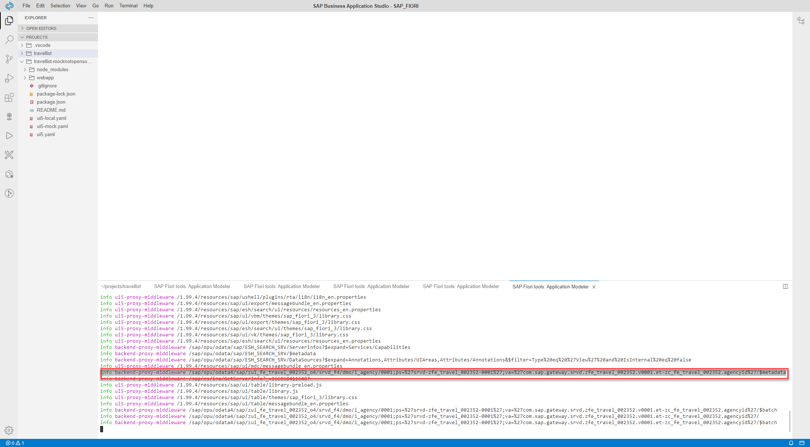

    >It might help to use notepad to construct the following `url`.

    Construct a new URL to your Agency value help metadata file by combining from your running application `https://xxxx.xxx` + Metadata Call

    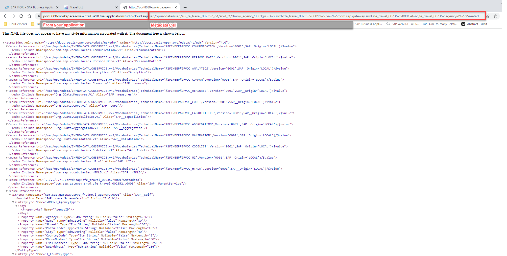

    You should see the new metadata document, save it to `webapp/localService/AgencyVHMetadata.xml`    

3. Agency Value Help service URL (`urlPath`)        

    `urlPath` - is the path you copied from your  *info server:ux-proxy* without the **$metadata**

4. Putting it all together in a new `config.json` file.  

    Right-click on `localService` folder and select `New File`. Create the `config.json` under the following path `webapp/localService/config.json`.


5. From your `ui5-mock.yaml` file copy the service-configuration.


    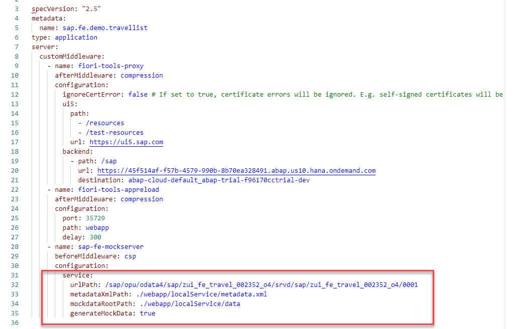

    Depending on where you place your `config.json` adjust the path for the metadata file in `metadataPath` and the mock data in `mockdataPath`.

    ```json
    [{
      "urlBasePath": "/sap/opu/odata4/sap/zfe_ui_travel_o4_######/srvd/sap/zfe_ui_travel_o4_######/0001",
      "name": "",
      "metadataPath": "./metadata.xml",
      "mockdataPath": "./data",
      "generateMockData": true
    }]
    ```
    Paste the code into your new `config.json` file.

    >You will need to add parenthesis and double quotes since the format of the `.json` file is different then the `.yaml` file.


    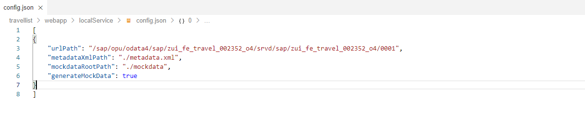

6. In your `ui5-mock.yaml` switch the configuration to use the `config.json` file that you created earlier.

    >It is extremely important that the `yaml` file reflects hierarchy.

    In order to do that you need to replace your `sap-fe-mockserver` code snippet with this:

    ```yaml
    name: sap-fe-mockserver
    beforeMiddleware: csp
    configuration:
      mockFolder: webapp/localService
    ```

7. Validate that your mock server still works by executing `start-mock` command under **Preview Application**   

    >If you are running into issues, make sure your formatting of the `ui5-mock.yaml` is correct.

    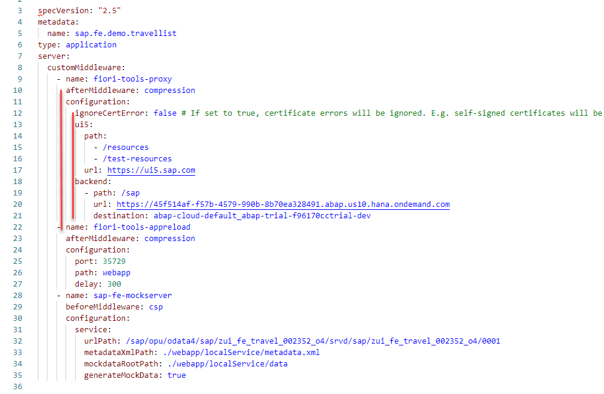

8. Adding the new configuration to your `config.json`
    * `urlPath` - is the path you copied from your  *info server:ux-proxy* without the **$metadata**
    * `metadataPath` - reflects the path and the name of your new metadata file that was saved in the above step.

    ```json
    {
        "urlPath": "/sap/opu/odata4/sap/zfe_ui_travel_o4_######/srvd_f4/dmo/i_agency/0001;ps=%27srvd-zfe_ui_travel_######-0001%27;va=%27com.sap.gateway.srvd.zfe_ui_travel_######.v0001.et-zfe_c_travel_######.agencyid%27",
        "name": "",
        "metadataPath": "./AgencyVHMetadata.xml",
        "mockdataPath": "./data",
        "generateMockData": true
    }
    ```

    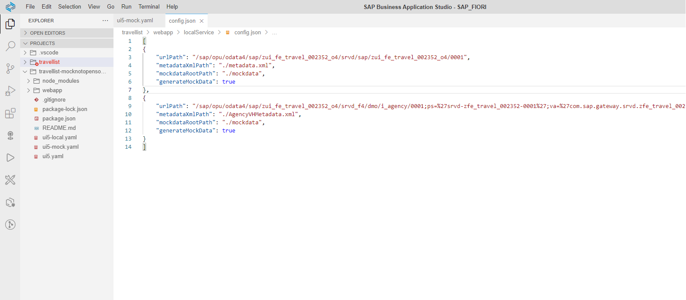

    After restarting your application using `start-mock` you should see mock values in your value help dialog for Agency.

    

    >Currently the data editor only supports the saving of a single mock service. For the time being, you may see a difference between table data (which was created in Step 2) and value help.


---
