# Generate an SAP Fiori Elements Application based on a RAP-based Service
<!-- description --> Generate an SAP Fiori elements application and add additional features like flexible column layout and initial loading using SAP Fiori tools.

## Prerequisites
- Your SAP Business Technology Platform account is setup correctly to use the SAP Business Application Studio. For details check the following links:
[Get a Free Account on SAP BTP Trial](hcp-create-trial-account)
[Set Up SAP Business Application Studio for Development](appstudio-onboarding)
- Ensure that you have finished all steps in previous tutorials:
  [Prepare the RAP-Based Travel Service](fiori-tools-rap-prepare-service)

## You will learn
  - How to set up SAP Business Application Studio for SAP Fiori elements application development
  - How to generate an SAP Fiori elements application

## Intro
Up to now you have used the preview mode within the ABAP Development Tools to check the changes of the related OData service. You will now create an SAP Fiori elements application based on the RAP back-end service that was created in the previous chapters.

---

### Create development space

1. When you start the SAP Business Application Studio for the first time, you will see a page similar to the screenshot below showing information about the different development spaces. You might also see your development space overview where no development space is active. In either case click the  **Create Dev Space** button to create a new development space.

    <!-- border -->

2. Now you see a dialog that allows you to define the parameters of your development space, like the name of the development space, its type and additional extensions. Enter a name in field **Create a New Dev Space** and select the **SAP Fiori** type for your development space. Press **Create Dev Space** to confirm the dialog.

    <!-- border -->

    Your development space is now listed in the overview. Wait until the status has changed from **STARTING** to **RUNNING**. After the initial creation this is done automatically.

    >In case your development space was stopped, you can restart it by clicking the start button (for example after a longer idle time).

    <!-- border -->

3. Click the name of your development space once it is started to open it in SAP Business Application Studio.

&nbsp;

### Create an SAP Fiori elements application

SAP Fiori tools includes an Application Generator that provides a wizard-style approach for creating applications based on SAP Fiori elements page types and the RAP back-end service you created in the previous chapters. You are going to use it to create your list report page app.

Once you are in the development space, you will see a **Welcome** page from which you can create the application project.

1. Open a folder: from the hamburger menu, open **File** > **Open Folder...** and choose the folder **projects**. It is displayed in the **Open Folder** dialog. Confirm the dialog by choosing **OK**.
   
    <!-- border -->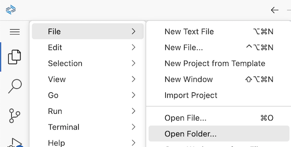

2. From the hamburger menu, open **View->Command Palette...**, type **`Application Generator`**, and select **Fiori: Open Application Generator**.

3. Select the tile **List Report Page** and click **Next**.

    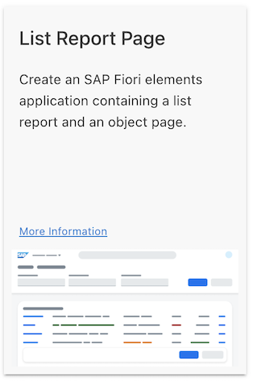

4. Now the application has to be connected to the OData service that was created in the previous chapter  [Prepare the RAP-Based Travel Service](fiori-tools-rap-prepare-service)

    Enter the parameters by selecting the according values from the drop-down lists provided. For the **Service** field choose your individual OData service `ZUI_FE_TRAVEL_######_O4`.

    >Note: If you see an error within the footer indicating that your organization and space in Cloud Foundry have not been set, please have a look at **Step 3: Set up organization and space** of the tutorial [Develop and Run SAP Fiori Application With SAP Business Application Studio](abap-environment-deploy-cf-production).

    <!-- border -->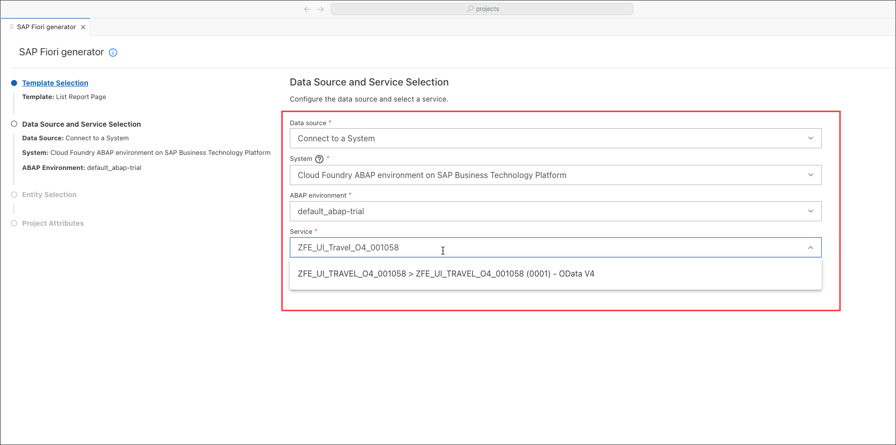

    Click **Next**.

5. Choose the main entity `Travel` as shown in the screenshot.
   
    Select `No` for `Automatically add columns to the list page`. There is no need to create default annotations, because you will maintain annotations in backend in the next tutorial [Refine the List Report with Annotations](fiori-tools-rap-modify-list-report). 

    <!-- border -->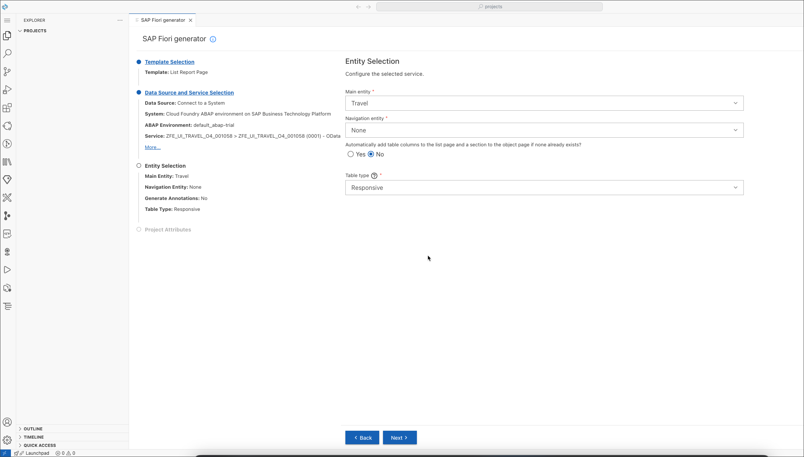

    Click **Next**.

6. Maintain further application attributes as shown in the screenshot below.

    >Be sure to choose exactly the **Module name** and the **Application namespace** as shown above, because these are referenced in the sample code.

    <!-- border -->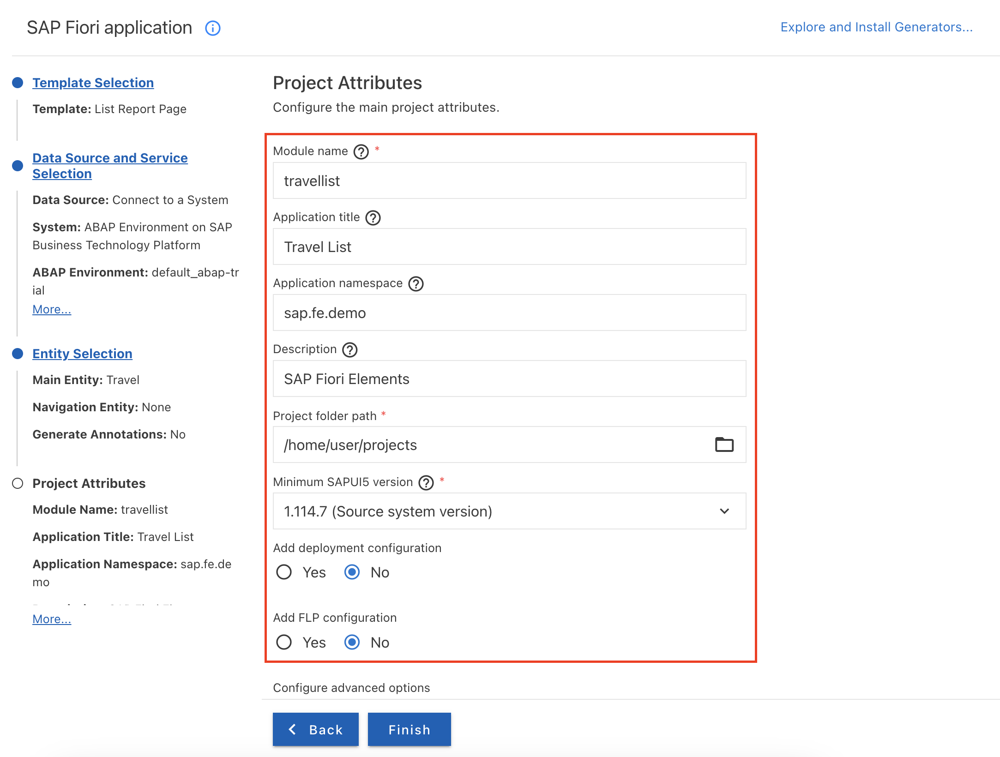

    Click **Finish** to complete the input of application parameters. The new SAP Fiori elements application is now generated using the service and the configurations you provided in this step.

    After the project is generated, an Application Information page is shown giving you an overview of project details and tasks that you may perform on this project. 

    >It is recommended that you keep this page open as it will be used in other steps. You can open it any time using selecting menu **View->Command Palette...** and select **Fiori: Open Application Info**

    <!-- border -->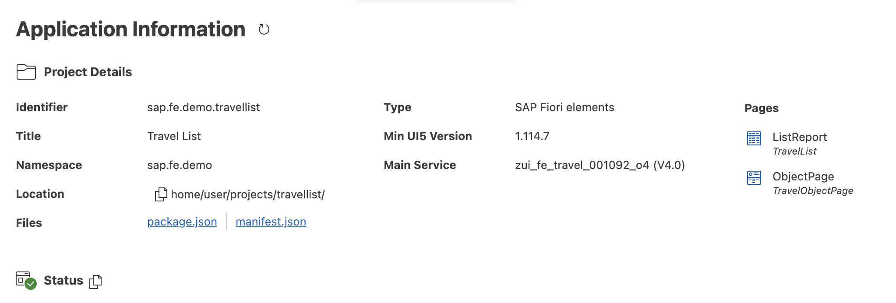

    You will also see a new folder `travellist` inside the `PROJECTS` folder.

    <!-- border -->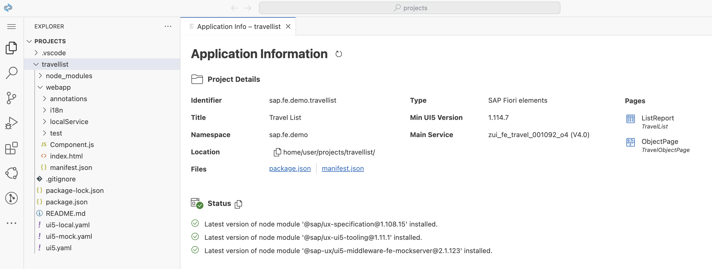

    &nbsp;

### Start the application

1. On the Application Information page select the `Preview Application` tile.
   

    <!-- border -->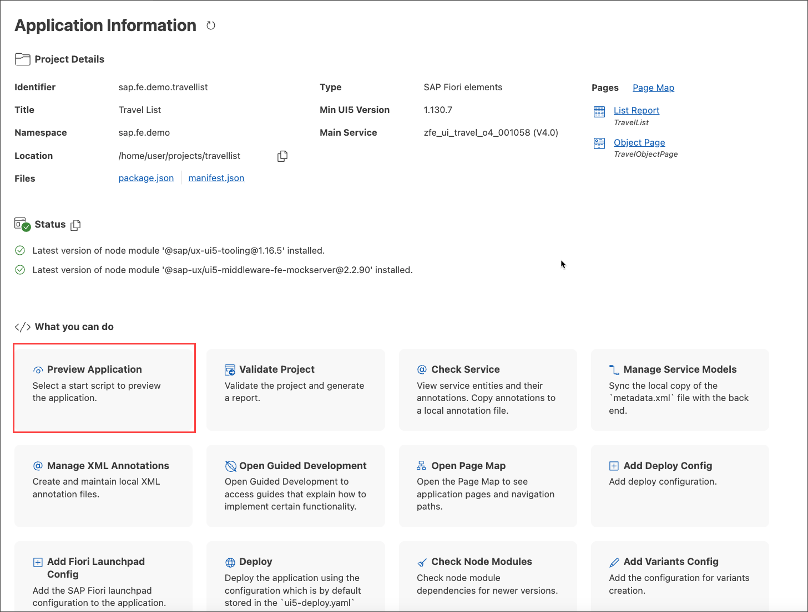

    In the quickpicks menu select option `Start travellist` in the section ` Run Configurations`.

    <!-- border -->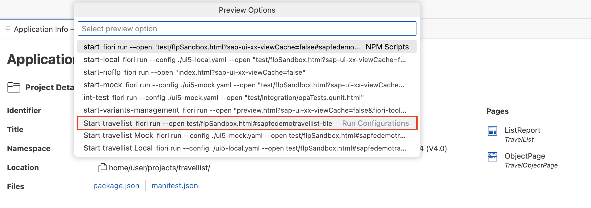

    You may see some status messages in the console window and the application will open in a new browser tab.

    <!-- border -->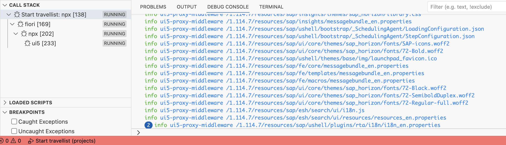

    Your application is showing the data provided by the OData service based on the metadata defined in the CDS views and metadata extension files.

    >There are no visible columns in the table right now. You will add metadata extension file and maintain annotations in backend in the next tutorial.

    <!-- border -->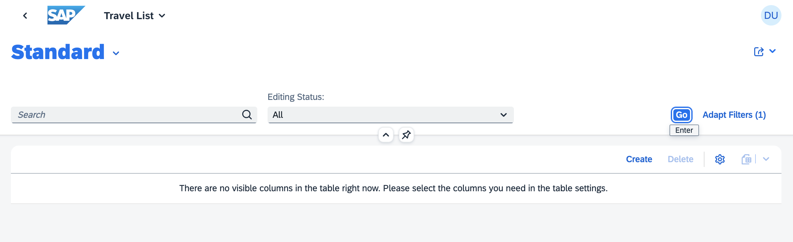

    
    >Now you have two ways to check your changes: the quick check in backend for intermediate status and the second one is the real preview of the fronted application. Remember that the first way is just the preview of data service and not the real application.

