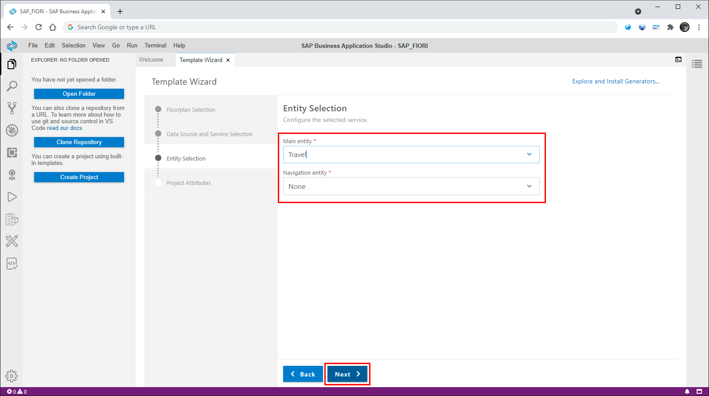
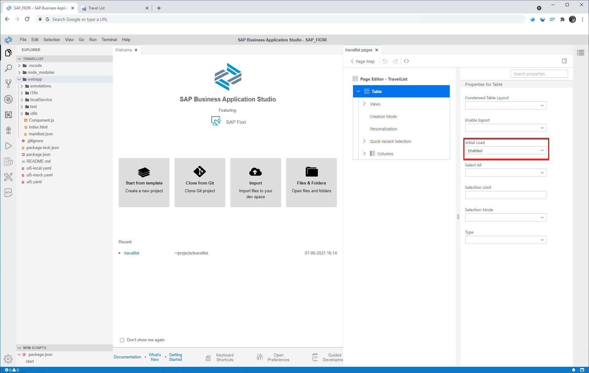

## Prerequisites
- Your SAP Business Technology Platform account is setup correctly to use the SAP Business Application Studio. For details check the following links:
[Get a Free Trial Account on SAP Business Technology Platform](hcp-create-trial-account)
[Set Up SAP Business Application Studio for Development](appstudio-onboarding)
- Ensure that you have finished all steps in previous tutorials:
[Prepare the RAP service](fiori-tools-rap-prepare-service)
[Refine the List Report with Annotations](fiori-tools-rap-modify-list-report)
[Refine the Object Page with Annotations](fiori-tools-rap-modify-object-page)

## Details
### You will learn
  - How to set up SAP Business Application Studio for SAP Fiori elements application development
  - How to generate an SAP Fiori elements application
  - How to modify an SAP Fiori elements application to add features like flexible column layout and  initial load of data

Up to now you have used the preview mode within the ABAP Development Tools to check the changes of the related OData service. You will now create an SAP Fiori elements application based on the RAP back-end service that was created and refined in the previous chapters.

---

[ACCORDION-BEGIN [Step 1: ](Create development space)]

1. When you start the SAP Business Application Studio for the first time, you will see a page similar to the screenshot below showing information about the different development spaces. You might also see your development space overview where no development space is active. In either case click the  **Create Dev Space** button to create a new development space.

    !

2. Now you see a dialog that allows you to define the parameters of your development space, like the name of the development space, its type and additional extensions. Enter a name in field **Create a New Dev Space** and select the **SAP Fiori** type for your development space. Press **Create Dev Space** to confirm the dialog.

    !

    Your development space is now listed in the overview. Wait until the status has changed from **STARTING** to **RUNNING**.

    !

    >You can maintain your development space (e.g. start/stop, change and delete) using the icons provided on the right.

3. Click the name of your development space once it is started to open it in SAP Business Application Studio.

    !

    >Note: If you see an error within the footer indicating that your organization and space in Cloud Foundry have not been set, please have a look at **Step 3: Set up organization and space** of the tutorial [Develop and Run SAP Fiori Application With SAP Business Application Studio](abap-environment-deploy-cf-production).

&nbsp;

[DONE]
[ACCORDION-END]

[ACCORDION-BEGIN [Step 2: ](Create an SAP Fiori elements application)]

Using SAP Fiori tools, you will now create an SAP Fiori elements application based on the RAP back-end service you created in the previous chapters.

1. Start the process by selecting the **View** > **Find Command...** menu option.

    !

2. Find and select **`Fiori: Open Application Generator`**. You can start typing the first letters and choose the completed command from the proposal list.

    !

3. On the **Floorplan Selection** page choose tile **List Report Object Page** and click **Next**.

    !

4. Now the application has to be connected to the OData service that was created in the previous chapter  [Prepare the RAP service to be used for the application](fiori-tools-rap-prepare-service)

    Enter the parameters by selecting the according values from the drop-down lists provided. For the **Service** field choose your individual OData service **`ZUI_FE_TRAVEL_######_O4`**.

    !

    >Note: If you cannot find your system and service in the drop-down fields, please ensure that your organization and space in Cloud Foundry have been set. Have a look at **Step 3: Set up organization and space** of the tutorial [Develop and Run SAP Fiori Application With SAP Business Application Studio](abap-environment-deploy-cf-production).

    Click **Next**.

5. Choose the main entity **`Travel`** as shown in the screenshot.

    !

    Click **Next**.

6. Maintain further application attributes as shown in the screenshot below.

    !

    Click **Finish** to complete the input of application parameters. The new SAP Fiori elements application is now generated using the service and the configurations you provided in this step.

    Once this process has finished you will see the welcome page again and a confirmation message.

    !

    &nbsp;

[VALIDATE_1]
[ACCORDION-END]

[ACCORDION-BEGIN [Step 3: ](Start the application)]

1. Open the generated application in a new workspace: select menu option **File** > **Open Workspace...** and choose your application. It is displayed in the **Open Workspace** dialog with name `travellist` which is the module name you entered as an application parameter.

    Select your application and confirm the dialog by choosing **Open**.

    !

    Your application is now opened within the tree-view on the left of the Business Application Studio.

    !

2. To start your application, you need to switch to the `Run Configurations` view by pressing the arrow-button on the left side toolbar.

    !

    There are two run configurations for you application. Start the first one named `Start travellist` by pressing the green arrow.

    !

    If you will see some status messages in the console window and a popup-message telling you that the application will open in a new browser tab. Click the `Open` button to switch to the new browser tab.

    !

    In the new browser tab showing your application, choose **Go** to load data.

    !

    The application shows the data provided by the OData service based on the metadata defined in the CDS views and metadata extension files.

    &nbsp;

[DONE]
[ACCORDION-END]

[ACCORDION-BEGIN [Step 4: ](Activate flexible column layout)]

With the flexible column layout you can have the list report and the object page open at the same time without the need to navigate back and forth between them.

1. In the SAP Business Application Studio open the context menu by right clicking on your `webapp` folder and select the menu entry **Show Page Map**.

    !

2. In the left area of the page map you see the UI structure of your application listing the tiles of the list report and the object page. In the right area labeled **Global Page Settings** you can select the **Layout Settings**. Choose option **Flexible Column Layout** and then select the **Mid-Expanded** option for the two columns layout. Leave the default for the three columns layout unchanged.

    When done, choose **Apply** and wait for the confirmation message.

    !

3. Refresh the application and choose **Go** to load data into the list report table. Select any of the items within the table to open the object page.

    !

    Now the object page is displayed together with the list report. When you select another item in the list report, the object page is updated.

    &nbsp;

[DONE]
[ACCORDION-END]

[ACCORDION-BEGIN [Step 5: ](Activate initial loading of data)]

As a last step of the tutorial you will activate the initial load feature that will trigger the loading of data within the list report automatically, i.e. without having to choose **Go**.

1. Open the page map once again as shown in the previous step by choosing the **Show Page Map** option in the context menu of your application folder.

2. In the UI structure of your application switch to edit mode of the **List Report** tile.

    !

3. Now the structure of the list report is shown. Open the properties of the list report table.

    !

4. In the list of **Properties for table** select the value **Enabled** for the property **Initial Load**. This setting is immediately active without the need of any confirmation.

    !

5. Refresh your application and you will see that the data of the list report table is loaded immediately without choosing **Go**.

    !

    &nbsp;

[VALIDATE_2]
[ACCORDION-END]

---

Over the past four tutorials, you have used the SAP ABAP RESTful Application Programming Model, SAP Fiori tools and SAP Fiori elements for OData V4 to build this application. You have learned how to:

- Refine a RAP based service with additional annotations to improve the user interface

- Use the wizard-style approach of SAP Fiori tools to generate an application based on an existing service

- Configure the application using the page map

All of these tools (and more) can be used with any of the available SAP Fiori elements page types. Enjoy your future projects!

---
