## Prerequisites
 - You have prepared your OData service as described in the previous tutorial [Prepare the RAP Service](fiori-tools-rap-prepare-service).

## Details
### You will learn
  - How to add additional columns and filter fields
  - How to add list report header information
  - How to define a value help as a drop-down list
  - How to define criticality ratings

>Whenever your unique suffix for creating objects is needed, the object names within this tutorial are named with suffix "######". For the screenshots, the suffix "000100" was used.

In the CDS files of your RAP-based service you can add annotations to refine the user interface. These CDS annotations will be translated into OData annotations used by SAP Fiori elements to generate the UIs. UI annotations are stored within metadata extension files to separate them from the CDS view structure for better reading.

---

[ACCORDION-BEGIN [Step 1: ](Create metadata extension file for travel entity)]


Annotations controlling the UI can be stored in metadata extension files. In this section such a file will be created for the Travel entity and a first annotation will be added.


Right click the `ZC_FE_TRAVEL_######` projection view for the Travel entity to open the context menu. Choose **New Metadata Extension**.

!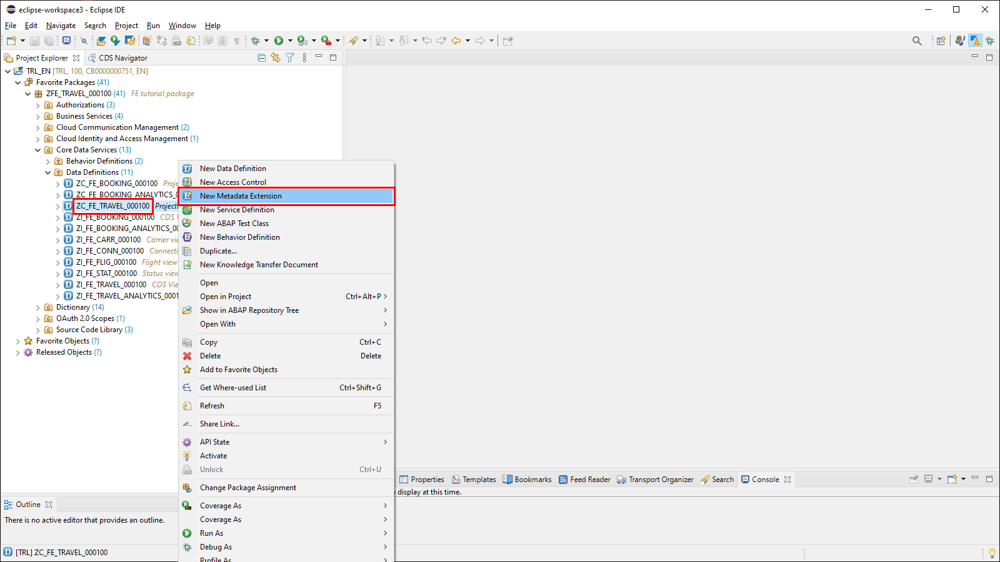

Enter the name of your metadata extension file. Choose the same name as your projection view file name **`ZC_FE_TRAVEL_######`** and enter a description as well. Choose **Next**.

!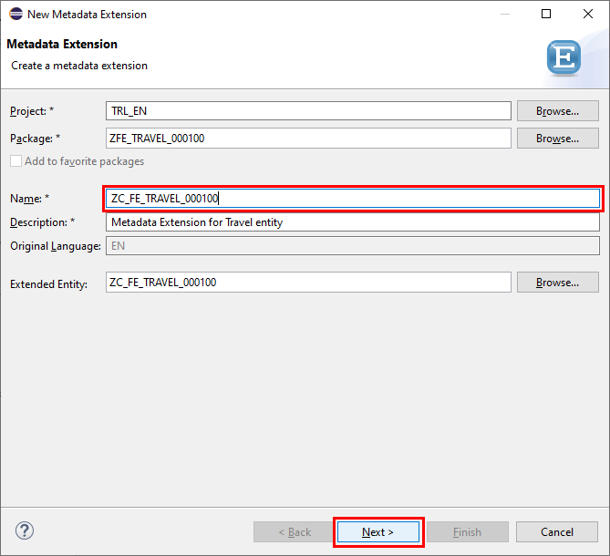

A transport request is already assigned to the metadata extension file. Choose **Finish** to confirm the creation of the file.

!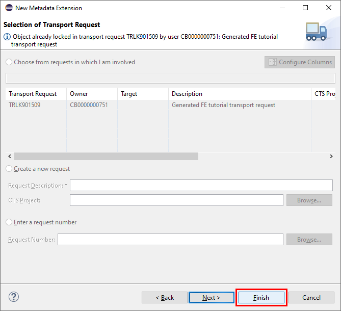


Now open the new metadata extension file `ZC_FE_TRAVEL_######` within the **Metadata Extensions** folder. To show a first column within the list report table, add the content shown in the coding example below. You can use code completion by pressing **`CTRL-SPACE`** at the related coding positions, e.g. when adding the `@UI.lineItem` annotation, just type **`@UI`** and then press **`CTRL-SPACE`** to choose the entry from the list of proposals.

```CDS
@Metadata.layer: #CORE
annotate view ZC_FE_TRAVEL_###### with
{
    @UI.lineItem: [{ position: 10 }]
    TravelID;
}
```


To finish this step, choose **Save** and **Activate** to take over the changes in your metadata extensions file.

!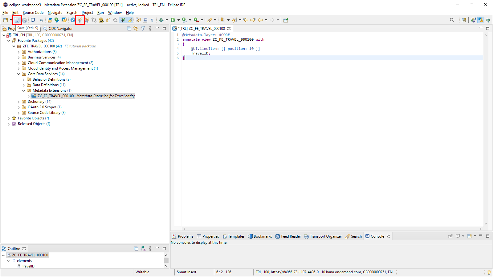


Check your changes by refreshing the preview of your application and choose **Go** to load the data.

!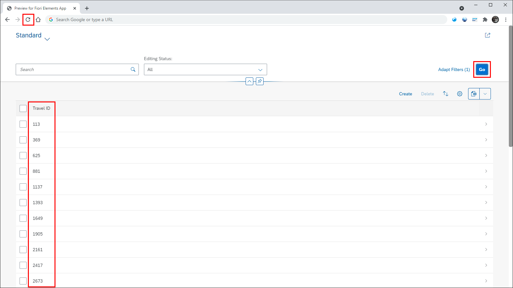

You will now see the column **Travel ID** made visible on the list report table by the `@UI.lineItem` annotation added to the metadata extensions file. The data shown in the column is loaded from the database with the request triggered by the **Go** button.

[VALIDATE_1]

[ACCORDION-END]

[ACCORDION-BEGIN [Step 2: ](Add table columns and filter bar selection fields)]
To see some more data on the list report you are now adding more columns to the table, and to simplify the selection of data you will add filter fields to the filter bar.

Please open the metadata extensions file `ZC_FE_TRAVEL_######` located in folder `Core Data Services` > `Metadata Extensions`.

Now add the fields with the corresponding `lineItem` annotations to the metadata extensions file as shown in the code fragment below. The property `position` controls the order of the columns within the list report table.

```CDS
@UI.lineItem: [{ position: 20 }]
AgencyID;

@UI.lineItem: [{ position: 30 }]
CustomerID;

@UI.lineItem: [{ position: 40 }]
BeginDate;

@UI.lineItem: [{ position: 50 }]
EndDate;

@UI.lineItem: [{ position: 60 }]
BookingFee;

@UI.lineItem: [{ position: 70 }]
TotalPrice;

@UI.lineItem: [{ position: 80 }]
OverallStatus;

@UI.lineItem: [{ position: 90 }]
LocalLastChangedAt;
```

As a result, after saving and activating the metadata extensions file and then refreshing the preview of your application, you will see the additional columns shown in the list report table.

!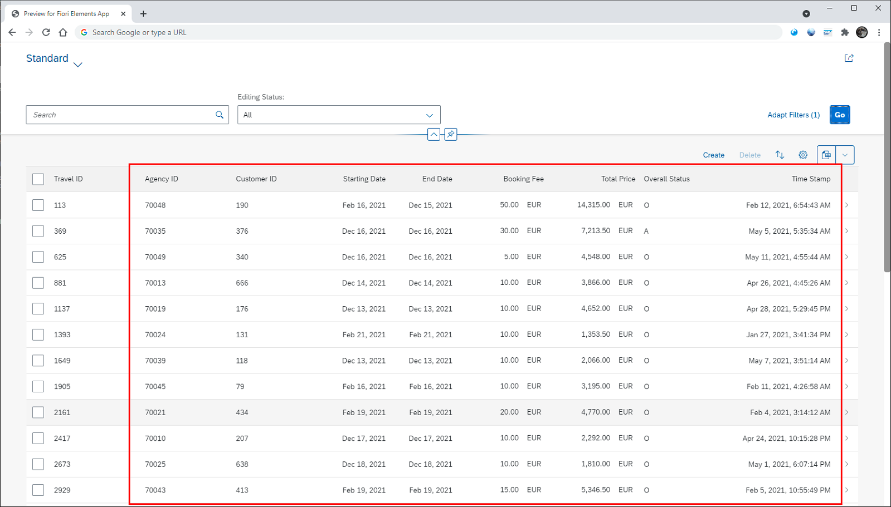

>Note: The default table type of a list report is the responsive table. If you reduce the size of your browser window, some columns will disappear and an action `Show Details` appears in the table toolbar (as of SAPUI5 version 1.90). If you use the property `importance: #HIGH` in your `lineItem` annotation, you can make sure that the information of the column will be shown independently of the browser window size.

To assign specific fields to the filter bar you will use the `selectionField` annotation. Add this annotation to the three existing fields `AgencyID`, `CustomerID` and `OverallStatus` as shown in the coding example below.

```CDS
@UI.lineItem: [{ position: 20 }]
@UI.selectionField: [{ position: 10 }]
AgencyID;

@UI.lineItem: [{ position: 30 }]
@UI.selectionField: [{ position: 20 }]
CustomerID;

@UI.lineItem: [{ position: 80 }]
@UI.selectionField: [{ position: 30 }]
OverallStatus;
```

Again save and activate the file and refresh the application to see the changes on the UI.

You can now filter the data loaded into the list report by specifying values for these additional selection fields.

!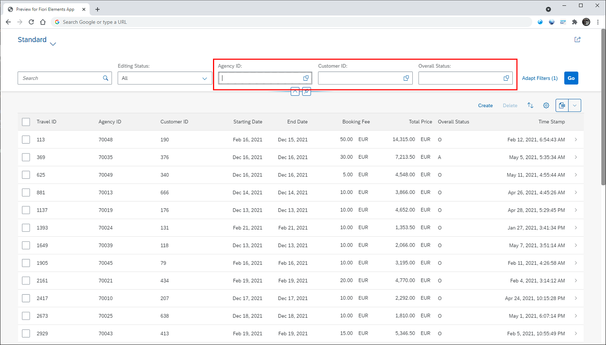

[DONE]
[ACCORDION-END]

[ACCORDION-BEGIN [Step 3: ](Add header information and default sorting)]

Now the list report table will be sorted by the last updated travel records and also the number of records available in the database will be made visible. To achieve this, add header information to the metadata extensions file right above the view annotation:

```CDS
@Metadata.layer: #CORE

@UI: {
    headerInfo: {
        typeName: 'Travel',
        typeNamePlural: 'Travels'
    },
    presentationVariant: [{
        sortOrder: [{
            by: 'LocalLastChangedAt',
            direction: #DESC
        }],
        visualizations: [{
            type: #AS_LINEITEM
        }]
    }]
}

annotate view ZC_FE_TRAVEL_###### with
{
...
```

The `@UI.headerInfo` annotation contains information about the naming of the main entity in singular and plural format and it shows the number of records available in the database in the table title. The  table title is determined by the `typeNamePlural` property.

The `@UI.presentationVariant` annotation controls the sorting of the table by field `LocalLastChangedAt` via `sortOrder` property. The `visualizations` property determines that the sorting is applied to the list report table.

Save and activate the metadata extensions file and refresh the application preview to see the result on the UI.

!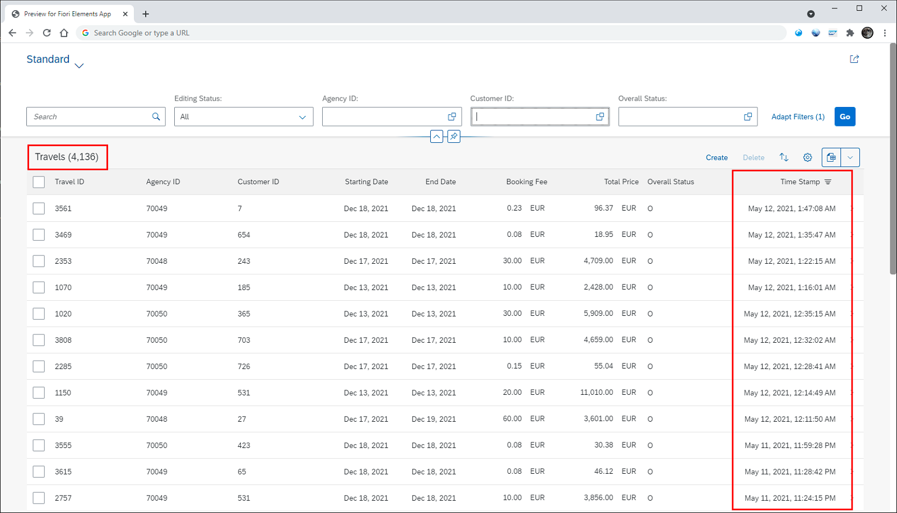

[DONE]
[ACCORDION-END]
[ACCORDION-BEGIN [Step 4: ](Refine columns that have IDs)]

Instead of showing IDs for the fields Travel ID, Agency ID and Customer ID, one would preferably show descriptions or names. Additionally, some labels of specific fields will be changed globally to make the new label accessible wherever the fields are used on the list report or object page.

You will achieve this by using specific annotations which are implemented within the projection view `ZC_FE_TRAVEL_######`. Therefore, open the projection view located in folder **Core Data Services** > **Data Definitions** which contains the root view definitions for the Travel entity.

!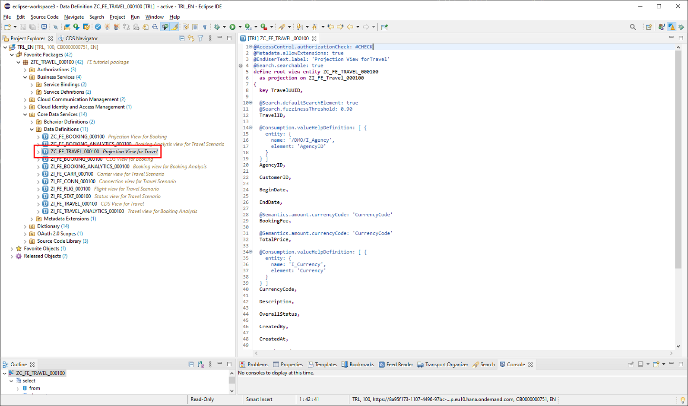

Add the `@EndUserText` and `@ObjectModel` annotations to the fields as shown in the coding fragments below.

Annotation `@EndUserText.label` defines the column label for the related fields. `@ObjectModel.text.element` controls the source of the content shown for the related field. For field `TravelID` this will be the `Description` field from this view. `AgencyID` and `CustomerID` will get their content from the related field through the corresponding association.

```CDS
@EndUserText.label: 'Travel'
@ObjectModel.text.element:  [ 'Description' ]
TravelID,
```
```CDS
@EndUserText.label: 'Agency'
@ObjectModel.text.element: ['AgencyName']
AgencyID,
_Agency.Name as AgencyName,
```
```CDS
@EndUserText.label: 'Customer'
@ObjectModel.text.element: ['LastName']
CustomerID,
_Customer.LastName as LastName,
```
```CDS
@EndUserText.label: 'Status'
OverallStatus,
```
```CDS
@EndUserText.label: 'Last Changed At'
LocalLastChangedAt,
```
The semantic key for the view will be `TravelID`. The content of the field will be highlighted, and the draft indicator will be shown while the Travel item is being worked on.

Add the corresponding annotation `@ObjectModel.semanticKey` before the definition of the view.

```CDS
...
@Search.searchable: true

@ObjectModel.semanticKey: ['TravelID']

define root view entity ZC_FE_TRAVEL_######
...
```

After saving and activating the file and refreshing the application, you will see the changed labels and content for the fields **Travel**, **Agency**, **Customer**, **Status** and **Last Changed At**.

!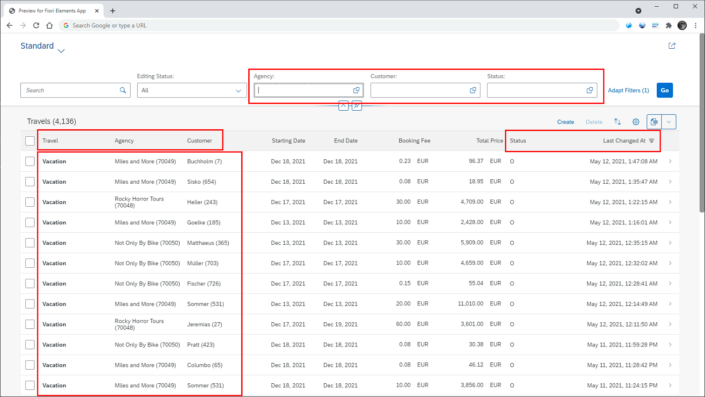


[VALIDATE_2]

[ACCORDION-END]
[ACCORDION-BEGIN [Step 5: ](Implement value help for selection fields Customer and Status)]

When you choose the value help icon of the selection field **Customer** in the filter bar, you get a dialog which provides the option to conditionally load data by the customer ID. For better usability you would rather select customer data like name or address from a list.

1. To implement the value help, assign the annotation `@Consumption.valueHelpDefinition` to the field `CustomerID` within the projection view `ZC_FE_TRAVEL_######`.

    ```CDS
    @EndUserText.label: 'Customer'
    @ObjectModel.text.element: ['LastName']
    @Consumption.valueHelpDefinition: [{ entity : {name: '/DMO/I_Customer', element: 'CustomerID'  } }]
    CustomerID,
    _Customer.LastName as LastName,
    ```
      The entity property `name` points to the data view and `element` contains the key for the selection.

2. After saving, activating and refreshing your application, the field **Customer** provides the improved value help that allows a user-friendly selection of customer data within the **Search and Select** tab. You are still able to do a conditional selection by choosing the **Define Conditions** tab on the dialog. By entering search values such as the **Last Name** and choosing **Go**, the result is shown in the table. Selecting specific lines in the table and choosing **OK** will load a selected list of Travel items into the list report.

    !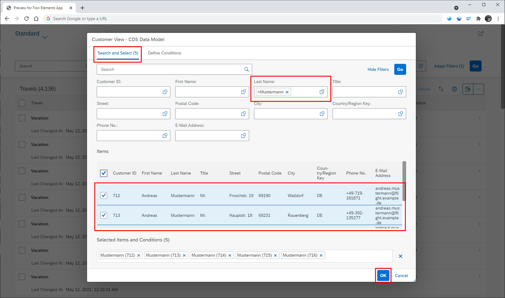

Selection field **Status** also shows a conditional value help by default. From a user perspective it would be nice to get a list of values presented as a drop-down list, since the number of different values is very limited.


1. In the projection view for the Travel entity `ZC_FE_TRAVEL_######` the annotation for the value help has to be defined for the `OverallStatus` field. As with the field `CustomerID` (see above), the annotation `@Consumption.valueHelpDefinition` is used with properties `name` and `element` containing the appropriate values.

    ```CDS
    ...
    @EndUserText.label: 'Status'
    @Consumption.valueHelpDefinition: [{ entity : {name: 'ZI_FE_STAT_######', element: 'TravelStatusId'  } }]
    OverallStatus,
    ...
    ```

    Save and activate the view.

2. Open the CDS view for the status description `ZI_FE_STAT_######`. Just above the view definition, insert an `@ObjectModel.resultSet.sizeCategory` annotation with value `#XS`. This results in a drop-down list.

    ```CDS
    ...
    @EndUserText.label: 'Travel Status view entity'
    @ObjectModel.resultSet.sizeCategory: #XS -- drop down menu for value help
    define view ZI_FE_STAT_######
    ...
    ```

    Save and activate the view.


3. After refreshing the application the **Status** field is now a drop-down list. Select one or more of the available status codes and choose **Go** to load the filtered list.

    !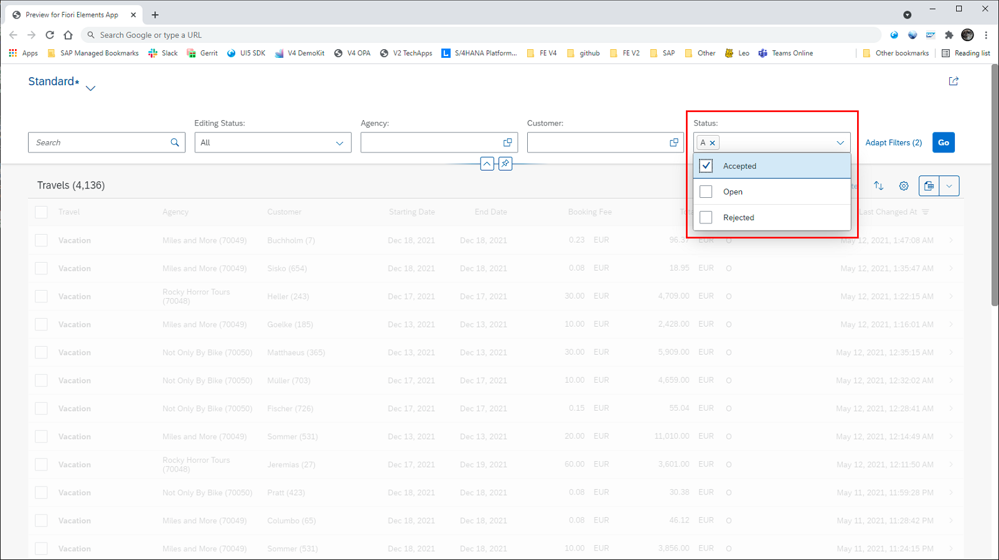


[DONE]
[ACCORDION-END]
[ACCORDION-BEGIN [Step 6: ](Display a description for Status)]

The column **Status** currently shows the internal codes stored within `OverallStatus`, but instead the description for these codes should be displayed.

Although the related association is set correctly for `ZI_FE_TRAVEL_######` and descriptions are available through `ZI_FE_STAT_######`, the corresponding text annotation for the projection view is missing.

1. You can check the association already available within the CDS view for the Travel entity `ZI_FE_TRAVEL_######` in folder **Data Definitions** (line 6) and the publication of this association to make it available for projection views (line 14).

    ```CDS
    define root view entity ZI_FE_TRAVEL_######
      as select from ZFE_ATRAV_######
      association [0..1] to /DMO/I_Agency as _Agency on $projection.AgencyID = _Agency.AgencyID
      association [0..1] to I_Currency as _Currency on $projection.CurrencyCode = _Currency.Currency
      association [0..1] to /DMO/I_Customer as _Customer on $projection.CustomerID = _Customer.CustomerID
      association [0..1] to ZI_FE_STAT_###### as _TravelStatus on $projection.OverallStatus = _TravelStatus.TravelStatusId
      composition [0..*] of ZI_FE_Booking_###### as _Booking
      {
        key TRAVEL_UUID as TravelUUID,
        ...

        ...
        _Customer,
        _TravelStatus
      }
    ```

2. Now the access to the status description has to be set within the projection view  `ZC_FE_TRAVEL_######`. Add the text annotation `@ObjectModel.text.element` for field `OverallStatus` as shown below (line 2). To load the description the corresponding field from the status description view has to be accessed by the association `_TravelStatus` (line 5).

    ```CDS
    @EndUserText.label: 'Status'
    @ObjectModel.text.element: ['TravelStatusText']
    @Consumption.valueHelpDefinition: [{ entity : {name: 'ZI_FE_STAT_######', element: 'TravelStatusId'  } }]
    OverallStatus,
    _TravelStatus.TravelStatusText as TravelStatusText,
    ```
    Save and activate the view.

3. With these settings the description is displayed in the column **Status** but additionally, the key is shown within parentheses. You can use the `@UI.textArrangement` annotation with value `#TEXT_ONLY` to omit the key. Open the metadata extensions file  `ZC_FE_TRAVEL_######` and add the text arrangement annotation to the field `OverallStatus` (line 3).

    ```CDS
    @UI.lineItem: [{ position: 80 }]
    @UI.selectionField: [{ position: 30 }]
    @UI.textArrangement: #TEXT_ONLY
    OverallStatus;
    ```
    Save and activate the metadata extensions file.

4. After refreshing your application you will see the status description within the **Status** column.

    !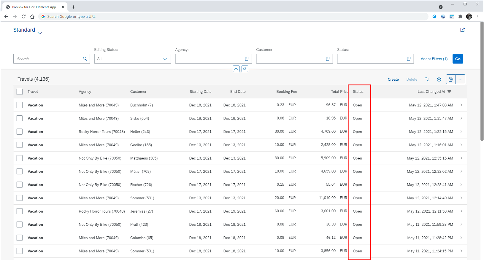

[DONE]
[ACCORDION-END]

[ACCORDION-BEGIN [Step 7: ](Implement the criticality feature)]

The values of the **Status** field can be semantically colored to visually differentiate the meaning. This can be achieved by using the criticality property for the `@UI.lineItem` annotation.

1. The criticality feature requires specific values for the different colors to be shown on the UI. Therefore, a new field `OverallStatusCriticality` will be defined in the CDS view  `ZI_FE_TRAVEL_######`. This field will be filled with color codes derived from the values of the field `overall_status`. See the coding fragment below which shows a case structure to define the content of the new field `OverallStatusCriticality` within lines 5 to 10.

    ```CDS
    ...
    description as Description,

    overall_status as OverallStatus,
    case overall_status
      when 'O'  then 2    -- 'open'       | 2: yellow colour
      when 'A'  then 3    -- 'accepted'   | 3: green colour
      when 'X'  then 1    -- 'rejected'   | 1: red colour
                else 0    -- 'nothing'    | 0: unknown
    end                   as OverallStatusCriticality,

    @Semantics.user.createdBy: true
    created_by as CreatedBy,
    ...
    ```
Take over the case structure into the CDS view just below the field `overall_status`. Save and activate the view.

2. Adding a new field to the CDS view is a structural change which requires a recreation of the corresponding draft table `ZFE_DTRAV_######`. This draft table contains all the fields of the CDS view.

    You can apply a quick fix within the behavior definition file `ZI_FE_TRAVEL_######` in folder **Core Data Services** > **Behavior Definitions**. Open this file in your editor and you will immediately see the error shown in the line where the draft table for the Travel entity is referenced.

    Click on the light bulb icon on the left in that line or position your cursor on the draft table file name `ZFE_DTRAV_######` and press **`CTRL + 1`**. The system proposes to recreate the draft table. By double-clicking on the proposal, the recreation of the table will be started.

    !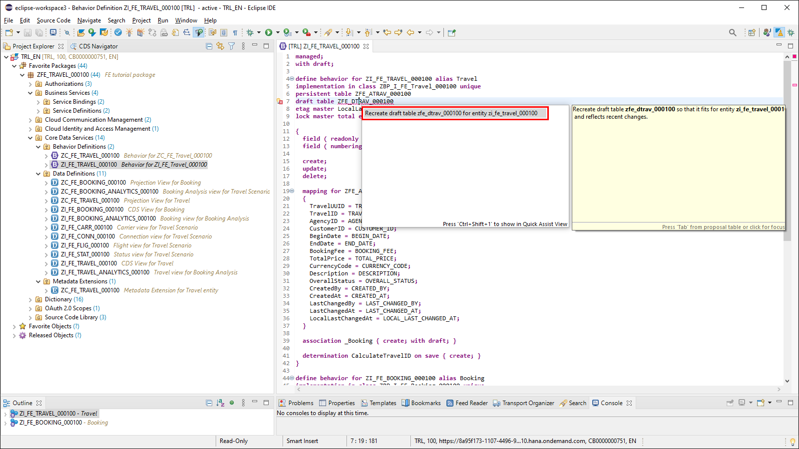

    As soon as the recreation is finished, you will see the draft table `ZFE_DTRAV_######` loaded into the editor containing the new field `OverallStatusCriticality`.

    !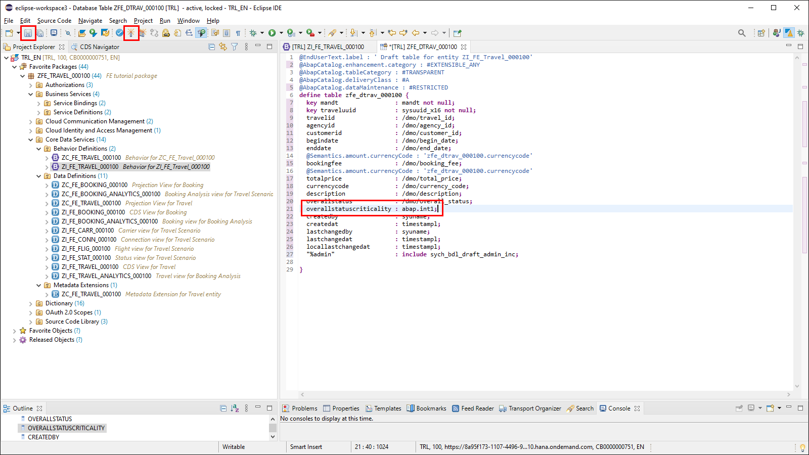

    Save and activate the draft table and then also activate the behavior definition file `ZI_FE_TRAVEL_######` which is still open in your editor. The error disappears as soon as the behavior definition is activated.


3. To be able to use the new field within UI annotations you need to take it over to the projection view of the travel entity `ZC_FE_TRAVEL_######`. Insert the field `OverallStatusCriticality` just below the definition for the field `OverallStatus` (see line 7 in the coding fragment).

    ```CDS
    ...
    @ObjectModel.text.element: ['TravelStatusText']
    @Consumption.valueHelpDefinition: [{ entity : {name: 'ZI_FE_STAT_######', element: 'TravelStatusId'  } }]
    OverallStatus,
    _TravelStatus.TravelStatusText as TravelStatusText,

    OverallStatusCriticality,

    CreatedBy,
    ...
    ```

    Save and activate the projection view.

4. As a last step you need to add the criticality to the metadata extensions file for the Travel entity `ZC_FE_TRAVEL_######`.

    This can be done by adding the property `criticality` with value  `OverallStatusCriticality` to the `@UI.lineItem` annotation of field `OverallStatus`  (see line 5 in the coding fragment).

    ```CDS
    ...
    @UI.lineItem: [{ position: 70 }]
    TotalPrice;

    @UI.lineItem: [{ position: 80, criticality: 'OverallStatusCriticality' }]
    @UI.selectionField: [{ position: 30 }]
    @UI.textArrangement: #TEXT_ONLY
    OverallStatus;

    @UI.lineItem: [{ position: 90 }]
    LocalLastChangedAt;
    ...
    ```

    Save and activate the metadata extension file.


Refresh your application and reload the data by choosing **Go** in the list report. Now the content of column **Status** is shown in different colors depending on the value of the field.

!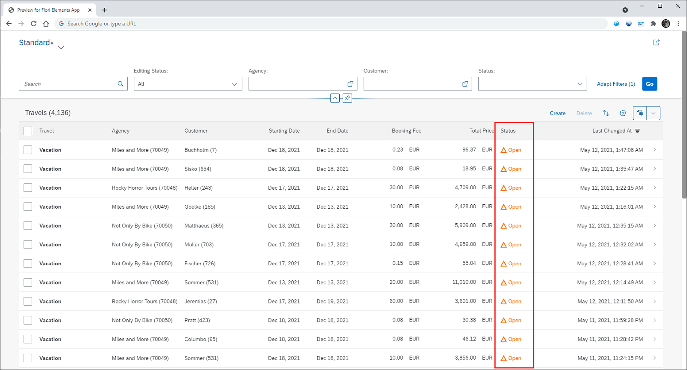


[VALIDATE_3]

[ACCORDION-END]

---
