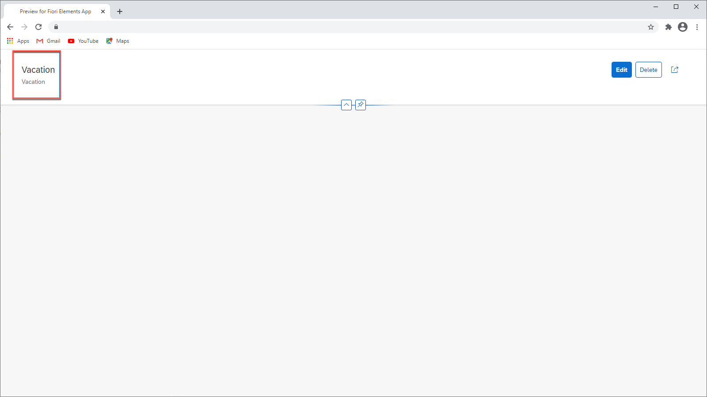
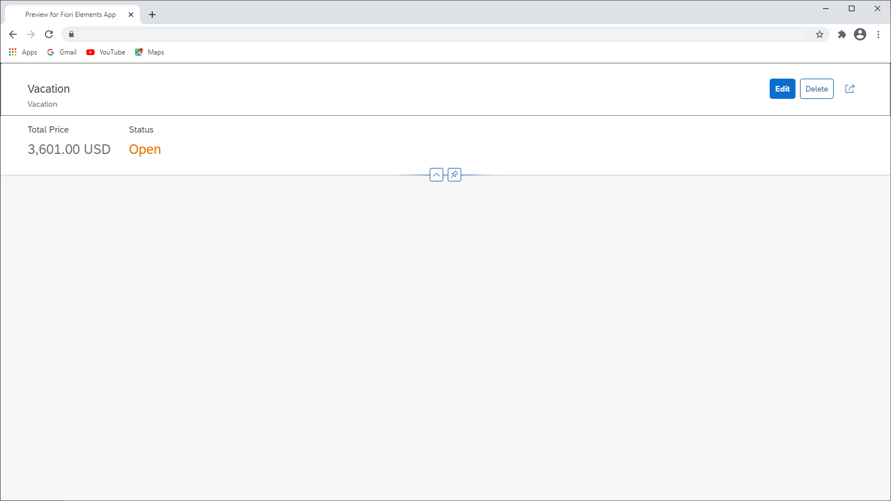
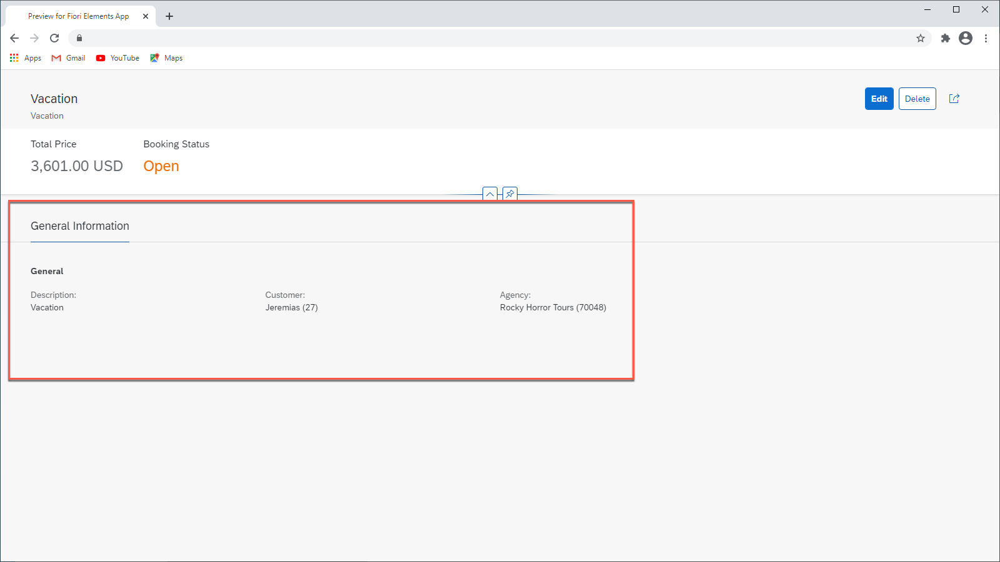
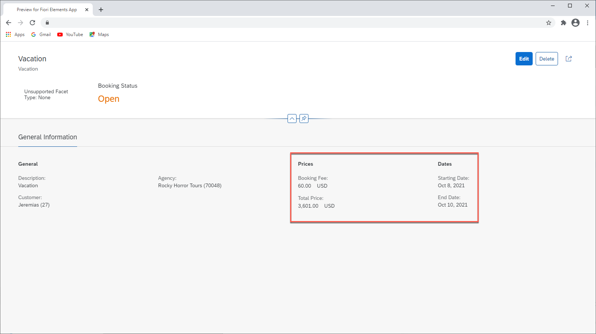
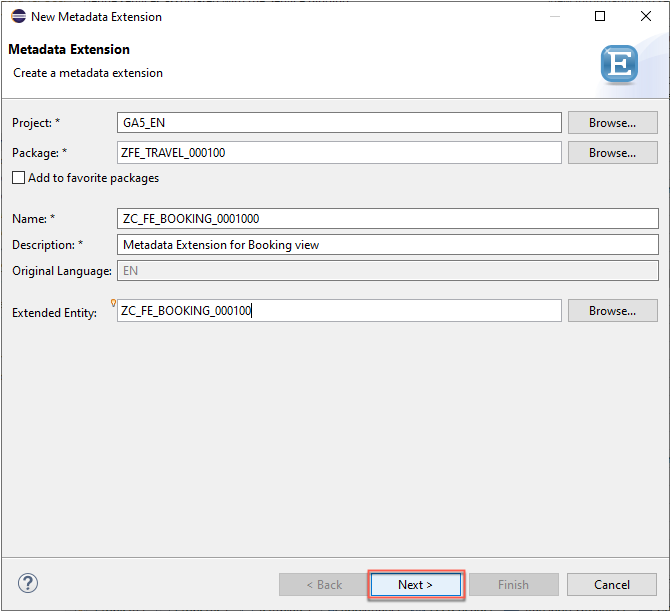
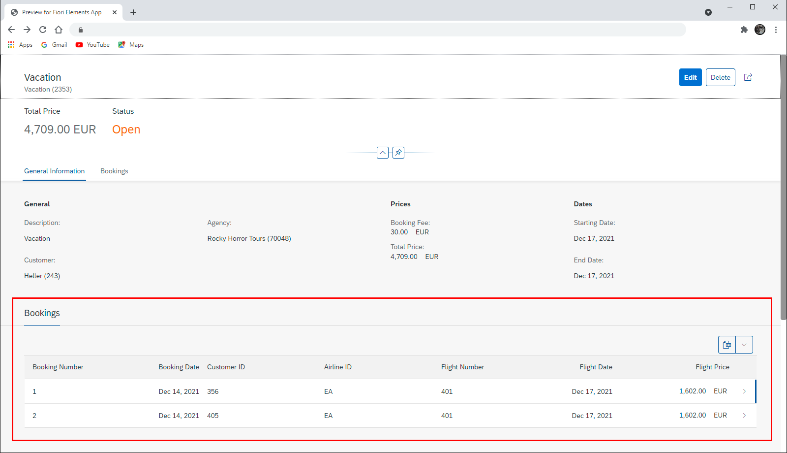
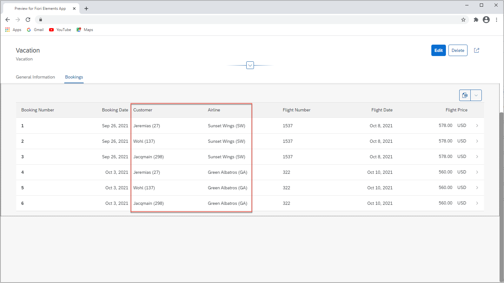
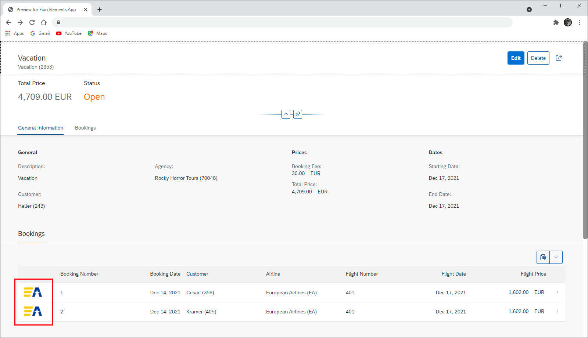

## Prerequisites
- You have prepared your OData service as described in the previous tutorial [Prepare the RAP service](fiori-tools-rap-prepare-service).
- You have finished the previous tutorial [Refine the List Report with Annotations](fiori-tools-rap-modify-list-report).


## Details
### You will learn
  - How to add a title and a subtitle to the object page header
  - How to add key data to the object page header
  - How to add a section and use field groups to structure data
  - How to add a table
  - How to include pictures in a table

>Whenever your unique suffix for creating objects is needed, the object names within this tutorial are named with suffix "######". For the screenshots the suffix "000100" was used.

---

[ACCORDION-BEGIN [Step 1: ](Add title and subtitle to object page header)]

Clicking on any item of the list report will show the object page for this item. The object page currently shows only some standard buttons and does not contain any further fields or actions.
 In this step you will add annotations to show a title and a subtitle in the object page header.

1. Open the metadata extensions for the Travel view `ZC_FE_TRAVEL_######`. In the previous tutorial [Refine the List Report with Additional Annotations](fiori-tools-rap-modify-list-report) you already defined header information in step 3. Now you will enhance the annotation `@UI.headerInfo` with a `title` and a `description` property.

    ```CDS
    ...

    @UI: {
        headerInfo: {
            typeName: 'Travel',
            typeNamePlural: 'Travels',
            title: {
                type: #STANDARD, value: 'Description'
            },
            description: {
                value: 'TravelID'
            }
        },
    ...

    ```

    Choose **Save** and **Activate**.

2. Refresh the app preview. You will see an object page containing a title and a subtitle in the header and an empty content section.

    !


[DONE]
[ACCORDION-END]

[ACCORDION-BEGIN [Step 2: ](Add data points to object page header)]

In this step you will add some key information to the object page header using data points.

1. As in the steps before, open the metadata extensions file for the Travel view `ZC_FE_TRAVEL_######`.

    Add the `@UI.facet` annotation with two objects of type `#DATAPOINT_REFERENCE`.
    ```CDS
    ...
    annotate view ZC_FE_TRAVEL_###### with
    {

        @UI.facet: [
          {
              id: 'TravelHeaderPrice',
              purpose: #HEADER,
              type: #DATAPOINT_REFERENCE,
              position: 10,
              targetQualifier: 'PriceData'
          },
          {
              id: 'TravelHeaderOverallStatus',
              purpose: #HEADER,
              type: #DATAPOINT_REFERENCE,
              position: 20,
              targetQualifier: 'StatusData'
           }
      ]

      @UI.lineItem: [{ position: 10}]
      TravelID;  
      ...      
    ```

2. Annotating properties `TotalPrice` and `OverallStatus` with `@UI.datapoint` using the `targetQualifier` from the facet definition in step 1 will assign the properties to the header facet accordingly.

    ```CDS
    ...

    @UI.lineItem: [{ position: 70}]
    @UI.dataPoint: { qualifier: 'PriceData', title: 'Total Price'}
    TotalPrice;

    @UI.lineItem: [{ position: 80, criticality: 'OverallStatusCriticality' }]
    @UI.selectionField: [{ position: 30}]
    @UI.textArrangement: #TEXT_ONLY
    @UI.dataPoint: { qualifier: 'StatusData', title: 'Status', criticality: 'OverallStatusCriticality' }
    OverallStatus;

    ...

    ```
    Choose **Save** and **Activate**.

3. Refresh the app preview. The two new data points show up in the object page header. The labels are taken from property `title`, the color of **Status** from property `criticality` of the `datapoint` annotations .

    !


[DONE]
[ACCORDION-END]

[ACCORDION-BEGIN [Step 3: ](Add new section with title)]

In this step you will add a section to the content area of the object page. The section will contain a form with three data fields.

1. Open the metadata extensions file for the Travel view `ZC_FE_TRAVEL_######` and enter the facet annotations that define the section **General Information** as a collection facet, using the type `Collection`. Add a second facet as a child of **General Information** with facet type `#IDENTIFICATION_REFERENCE` to create a form with title **General**. Add the code from line 8 to line 21 to your existing UI facet definition.


    ```CDS
    ...
    annotate view ZC_FE_TRAVEL_###### with
    {

      @UI.facet: [
      ...

        {
          label: 'General Information',
          id: 'GeneralInfo',
          type: #COLLECTION,
          position: 10
        },
        {
          label: 'General',
          id: 'Travel',
          type: #IDENTIFICATION_REFERENCE,
          purpose: #STANDARD,
          parentId: 'GeneralInfo',
          position: 10
        }
      ]

    ...

    }
    ```

2. Add a new property `Description` and annotate this and the properties `AgencyID` and `CustomerID` with `@UI.Identification` to position these fields under **General**.

    ```CDS
    annotate view ZC_FE_TRAVEL_###### with
    {

    ...

      @UI.lineItem: [{ position: 10}]
      TravelID;

      @UI.identification: [{ position: 10 }]
      Description;

      @UI.lineItem: [{ position: 20}]
      @UI.selectionField: [{ position: 10}]
      @UI.identification: [{ position: 30 }]
      AgencyID;

      @UI.lineItem: [{ position: 30}]
      @UI.selectionField: [{ position: 20}]
      @UI.identification: [{ position: 20 }]
      CustomerID;
    ...
    }
    ```

    Choose **Save** and **Activate**.

3. Refresh the app preview. The new form **General** is shown in section **General Information** containing the three fields.

    !

[VALIDATE_3]

[ACCORDION-END]

[ACCORDION-BEGIN [Step 4: ](Add 2 field groups to section)]

A field group contains one or more data fields inside a UI container. In this step you define two field groups in the section **General Information**.

1. Open the metadata extensions file for the Travel view `ZC_FE_TRAVEL_######`.

    First, define a field group for the beginning and end date of a travel item and for the prices. The facet type for a field group is `#FIELDGROUP_REFERENCE`. Add the code from line 8 to line 25 to the end of the `@UI.facet` section.

    ```CDS
    annotate view ZC_FE_TRAVEL_###### with
    {

      @UI.facet: [
        {

        ...
        {
          id: 'Dates',
          purpose: #STANDARD,
          type: #FIELDGROUP_REFERENCE,
          parentId: 'GeneralInfo',
          label: 'Dates',
          position: 30,
          targetQualifier: 'DatesGroup'
        },
        {
          id: 'Prices',
          purpose: #STANDARD,
          type: #FIELDGROUP_REFERENCE,
          parentId: 'GeneralInfo',
          label: 'Prices',
          position: 20,
          targetQualifier: 'PricesGroup'
        }
      ]
    ...

    }
    ```

2. Annotate the properties `BeginDate` and `EndDate `with `@UI.fieldGroup`. Make sure you use the same field group qualifier `DatesGroup` but different positions in each annotation. Apply the same for the properties `BookingFee` and `TotalPrice` using field group annotations with qualifier `PricesGroup`.

    ```CDS
     ...

     @UI.lineItem: [{ position: 40}]
     @UI.fieldGroup: [{ qualifier: 'DatesGroup', position: 10 }]
     BeginDate;

     @UI.lineItem: [{ position: 50}]
     @UI.fieldGroup: [{ qualifier: 'DatesGroup', position: 20 }]
     EndDate;

     @UI.lineItem: [{ position: 60}]
     @UI.fieldGroup: [ { qualifier: 'PricesGroup', position: 10} ]
     BookingFee;

     @UI.lineItem: [{ position: 70}]  
     @UI.fieldGroup: [{ qualifier: 'PricesGroup', position: 20 }]
     TotalPrice;

     ...
    ```

    Choose **Save** and **Activate**.

3. Refresh the app preview. There are two additional field groups showing price and date information.

    !


[DONE]
[ACCORDION-END]


[ACCORDION-BEGIN [Step 5: ](Show Bookings Table in new section)]

In this step you will add a new section that contains a table with booking information. This requires access to another entity `Booking` via an association and an additional metadata extensions file.

1. Open the metadata extensions file for the Travel view `ZC_FE_TRAVEL_######`. In the facet annotation block, add a new facet `Booking` with type `#LINEITEM_REFERENCE`. Add the code from line 7 to line 14 to the end of the `@UI.facet` section. Choose **Save** and **Activate**.

    ```CDS
    ...
    annotate view ZC_FE_TRAVEL_###### with
    {
      ...
      @UI.facet: [
        ...
        {
          id: 'Booking',
          purpose: #STANDARD,
          type: #LINEITEM_REFERENCE,
          label: 'Bookings',
          position: 20,
          targetElement: '_Booking'
        }
      ]
    ...

    ```
    The property `targetElement: _Booking` references the association to the booking table that will be shown in the booking section. You can look up the definition of Booking in the projection view of Travel `ZC_FE_TRAVEL_######`.

2. In the project explorer open the folder `Data Definitions`, right-click on projection view `ZC_FE_BOOKING_######` and create a new metadata extensions file from the context menu. Enter **`ZC_FE_BOOKING_######`** as name and **`Metadata Extension for Booking view`** as description.

    !

    Choose **Next** and then **Finish**.

3. In the metadata extensions file `ZC_FE_BOOKING_######` use `@UI.lineItem` annotations to add some fields from the Booking view `ZC_FE_BOOKING_###### Projection View for Booking` to the bookings table. Replace the content of `ZC_FE_BOOKING_######` by the following code:

    ```CDS
    @Metadata.layer: #CORE

    annotate view ZC_FE_BOOKING_######
      with
    {
        @UI.lineItem: [ { position: 10 } ]
        BookingID;

        @UI.lineItem: [ { position: 20 } ]
        BookingDate;

        @UI.lineItem: [ { position: 30 } ]
        CustomerID;

        @UI.lineItem: [ { position: 40 } ]
        CarrierID;

        @UI.lineItem: [ { position: 50 } ]
        ConnectionID;

        @UI.lineItem: [ { position: 60 } ]
        FlightDate;

        @UI.lineItem: [ { position: 70 } ]
        FlightPrice;

    }
    ```
    Choose **Save** and **Activate**.

4. Refresh the app preview. The booking table is now displayed in the new **Bookings** section of the object page.

    !


5. Instead of showing IDs for the fields Customer ID and Airline ID, one would preferably show descriptions or names.

    This will be made possible by using specific annotations which are implemented within the projection view `ZC_FE_BOOKING_######`. Therefore, open the projection view which contains the root view definitions for the booking entity.

    Add the `@ObjectModel` and `@EndUserText` annotations to the fields as shown in the coding fragments below.

    Annotation `@EndUserText.label` defines the column label for the related fields. Using annotation `@ObjectModel.text.element` controls the source of the content shown for the related field. Fields `CarrierID` and `CustomerID` will get their content through the corresponding association.

    ```CDS
    @EndUserText.label: 'Customer'
    @ObjectModel.text.element: ['LastName']
    CustomerID,
    _Customer.LastName as LastName,
    ```

    ```CDS
    @EndUserText.label: 'Airline'
    @ObjectModel.text.element: ['CarrierName']
    CarrierID,
    _Carrier.Name as CarrierName,
    ```
  Choose **Save** and **Activate**.

6. Refresh the app preview. The booking table is now displayed in the new **Bookings** section of the object page with descriptions for **Customer** and **Airline**.

    !

[DONE]
[ACCORDION-END]


[ACCORDION-BEGIN [Step 6: ](Add airline pictures in Bookings table)]
In this step you will add the airline logo in a new column at the beginning of the booking table.

1. To achieve this, open the metadata extensions file `ZC_FE_BOOKING_######` and add the following code lines to the annotation structure.

    ```CDS
        ...
        @UI.lineItem: [ { position: 05, label: ' ', value: '_Carrier.AirlinePicURL' } ]
        _Carrier;
        ...
    ```

    Choose **Save** and **Activate**.

2. Refresh the app preview. The booking table is now displayed with the airline logo in the first column.

    !

[VALIDATE_6]

[ACCORDION-END]

---
