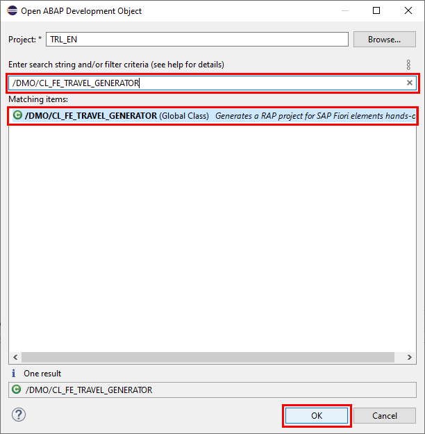
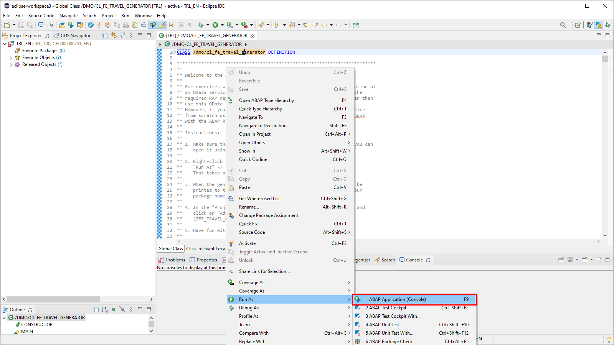
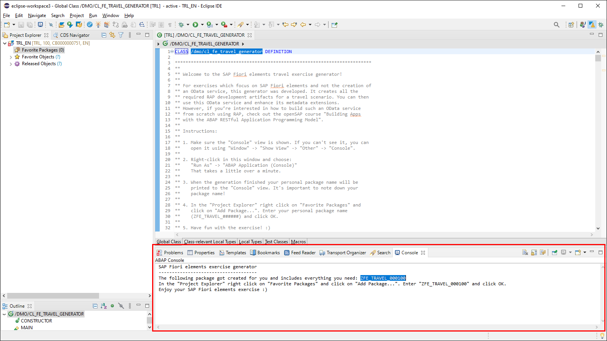
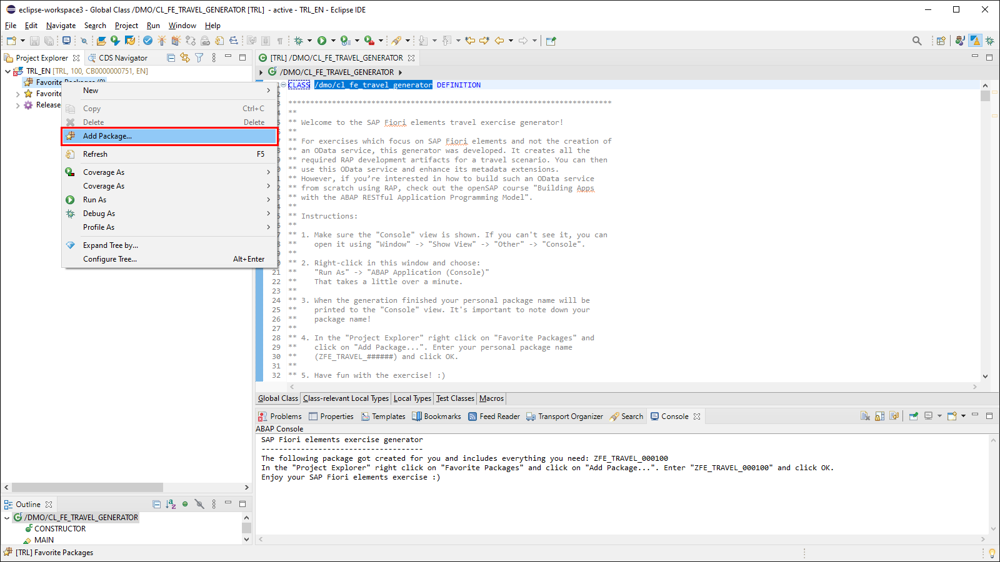
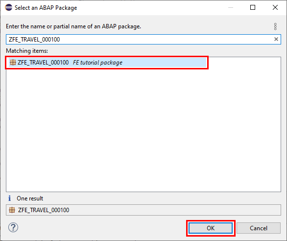
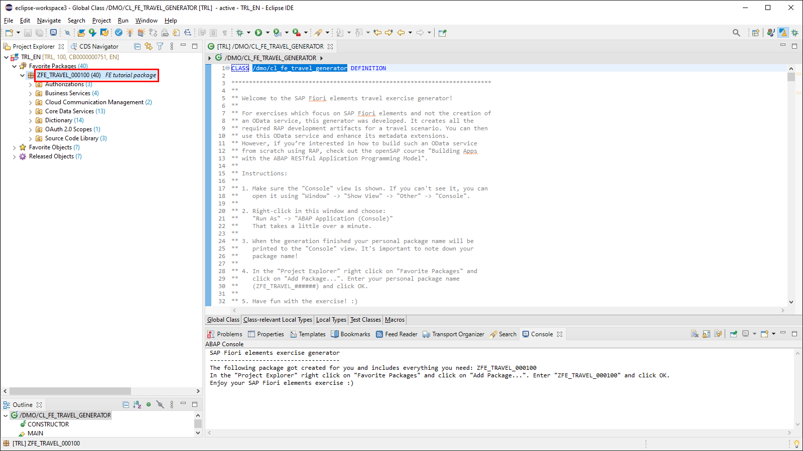

## Prerequisites
 - You need a trial account for the SAP Business Technology Platform. Follow these instructions in case you need to set up an account: [Get a Free Trial Account on SAP Cloud Platform](hcp-create-trial-account).
 - Prepare your SAP Business Technology Platform ABAP Environment: [Create an SAP Cloud Platform ABAP Environment Trial User](abap-environment-trial-onboarding) -- be sure to also check the prerequisites of this linked tutorial which include the installation of the ABAP Development Tools.

## Details
### You will learn
  - How to generate a RAP service as a preparation for this tutorial
  - How to publish and test the RAP service using the preview option of the ABAP Development Tools

This tutorial shows how to create an individual RAP-based OData service, which can be used within all the steps of the upcoming chapters of the tutorials presented within the tutorial group.

For more information about the ABAP RESTful Application Programming Model (RAP), especially related to the different CDS view files used in the upcoming chapters, please refer to the documentation pages of [Get to Know the ABAP RESTful Application Programming Model](abap-environment-restful-programming-model).

---

[ACCORDION-BEGIN [Step 1: ](Start the service generator)]

This tutorial requires an individual OData service having a unique suffix for each participant. This is necessary due to the fact that, within a specific ABAP cloud back-end system, all the development objects (e.g. packages, data-elements, classes, etc.) are globally available for all trial users who are connected to the same system. Since the creation of such an OData service is not the main part of these tutorials, a service generator is used to quickly create an individual service.

>Whenever your unique suffix for creating objects is needed, the object names within this tutorial are named with suffix "######". For the screenshots taken from a real service, the suffix "000100" was used.

1. Load the ABAP generator class

    Be sure to have opened the ABAP perspective within the ABAP Development Tools. In case you don´t see the ABAP perspective icon at the top right of the application (see screenshot below), open the ABAP perspective by **Window** > **Perspective** > **Open Perspective** > **Other...** and choose the ABAP entry within the list of perspectives. Click **Open** to confirm the dialog.

    !

    Now choose the toolbar action **Open ABAP Development Object** to open the ABAP class that is needed to generate the service.

    !

    The name of the class is **`/DMO/CL_FE_TRAVEL_GENERATOR`**. Select the class and confirm the dialog by choosing **OK**.

    !

2. Start the generator class

    As soon as the class is loaded within the editor, open the context menu via right mouse click and start the service by choosing **Run As** > **ABAP Application (Console)**.

    !

    The generation of the service may take some time. After the process has finished you will see a console message similar to the message shown in the screenshot below.

    !

3. Assign the new package to your favorite packages

    To keep a better overview of your packages, add them by right clicking on the **Favorite Packages** container and choosing the **Add Package...** option.

    !

    Enter the name of your package **`ZFE_TRAVEL_######`** shown in the console message in the dialog and confirm by choosing **OK**.

    !

    Now you see the package assigned to your favorite packages.

    !

[DONE]
[ACCORDION-END]

[ACCORDION-BEGIN [Step 2: ](Publish the service)]

1. Publish the service

    You must publish the service to be able to use it within your applications. To do so, open the service binding file `ZUI_FE_TRAVEL_######_O4` in the **Business Services** > **Service Bindings** folder and choose **Publish**. You will see a progress bar while the process is running.

    !

2. Start the service preview

    When the service is published, its entities are shown within a tree view under **Service Version Details**.

    You can now use the service to create SAP Fiori elements applications.

    To immediately see the service running in an application you can start the preview mode within the ABAP Development Tools. Simply select the main entity **Travel** in the tree view and choose **Preview...** on the right.

    !

3. Logon to the service preview

    A separate browser window opens and you need to logon with your cloud trial account. Choose **Log On** after you have entered your credentials.

    !

    After logging on, a generated list report object page application is shown in preview mode. Since there are no line item annotations available, no columns are shown in the list report table.

    !

    Adding annotations to enrich the service will be the main part of this tutorial - this will now be done within the upcoming steps in the next chapters.

[VALIDATE_1]
[ACCORDION-END]

---
