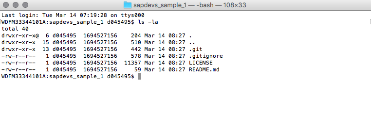
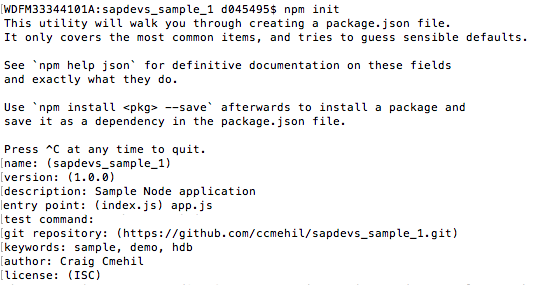
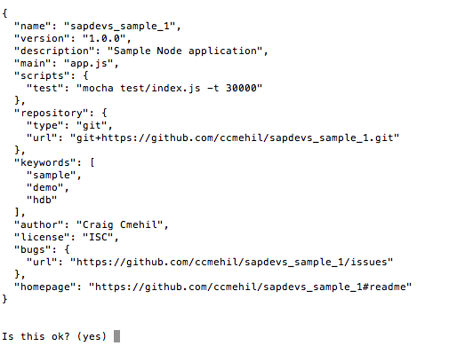
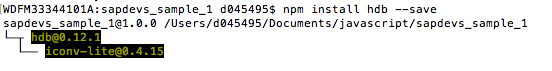
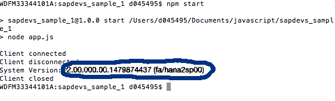
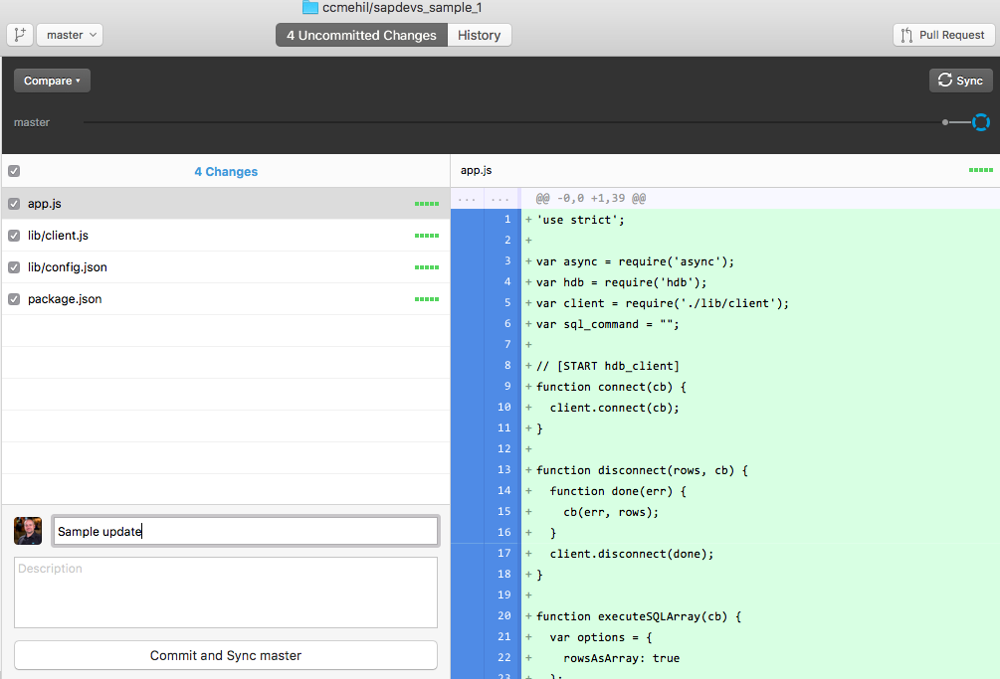
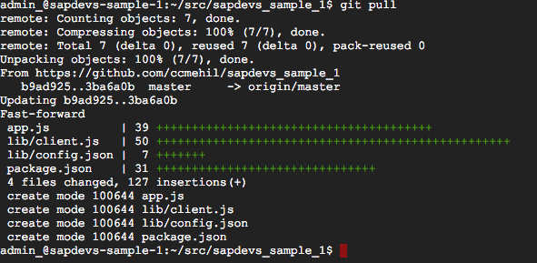
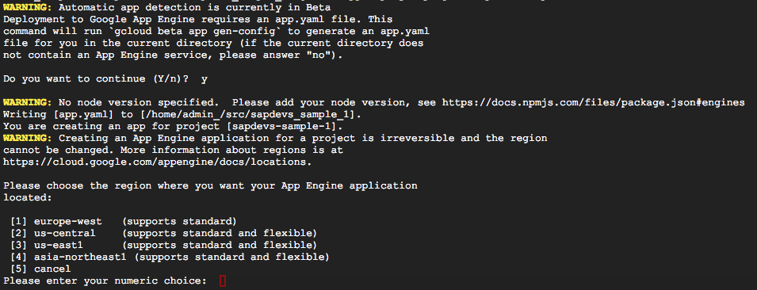

## Prerequisites  
 - **Proficiency:** Beginner
 - **Tutorials:** [Google App Engine Setup](https://www.sap.com/developer/tutorials/gae-setup.html)


## Next Steps
 - [Google App Engine Website](https://www.sap.com/developer/tutorials/gae-webapp.html)

## Details
### You will learn  
Now that you have your initial setup in place it is time to generate your initial application and install the HDB libraries. 

### Time to Complete
**15 Min**

---

[ACCORDION-BEGIN [Step 1: Initialize your Application](Initialize your Application)]

There are multiple ways to work with your source code and your repository. The following describes only one way. 



In order to initialize your application you will need to clone your repository to your local machine and from your command prompt run the:

`npm init`

This will initialize the Node.js application.





[DONE]
[ACCORDION-END]

[ACCORDION-BEGIN [Step 2: Modify Package File](Modify Package File)]

To make development within the Google Cloud environment work properly it is necessary to modify the newly created `package.json` file.

`"scripts": { },`

The full listing would now be,

```
  "scripts": {
    "start": "node app.js",
    "monitor": "nodemon app.js",
    "deploy": "gcloud app deploy app.yaml",
    "test": "mocha test/index.js -t 30000"
  },
```

Be sure to also include the Node.js version for your application as well.

```
"engines": {
    "node": ">=4.3.2"
  }
```

This can be added to the end before the last `}` and be sure to include a `,` before the entry.


[DONE]
[ACCORDION-END]


[ACCORDION-BEGIN [Step 3: YAML File](YAML File)]

From the previous step you added a deploy option and indicated a `app.yaml` file which is used by the cloud platform for deployment options. Create a new file with the same name in the root folder of your newly create project with the following contents.

```
runtime: nodejs
env: flex

skip_files:
 - ^node_modules$
```

[DONE]
[ACCORDION-END]

[ACCORDION-BEGIN [Step 4: Install HDB Library](Install HDB Library)]

To install the [HDB library](https://github.com/SAP/node-hdb) you will run the following from your command line,

`npm install hdb --save`

This will automatically install the library locally and add the dependency to the `package.json` file so the system understands to also install the library when you deploy the application. 



[DONE]
[ACCORDION-END]

[ACCORDION-BEGIN [Step 5: Create Application File](Create Application File)]

Now to begin with the actual coding. To make life easy you should grab the `client.js` from the examples. This example has that in a sub folder called `lib` and also in that file is a `config.json` file which contains the server connection information.

```
{
  "host": "XXXXXXXX",
  "port": 30041,
  "user": "CODEJAMMER",
  "dbn" : "DB1",
  "password": "XXXXXXX"
} 
```
From this point you will need to create a new file called `app.js` which will contain the main coding. For the purposes of this example the code will grab the version of the SAP HANA database from the system and output it to the console. A more complex example would also have a web server listening port and output the value to a webpage loaded via the browser.

```
'use strict';

var async = require('async');
var hdb = require('hdb');
var client = require('./lib/client');
var sql_command = "";

// [START hdb_client]
function connect(cb) {
  client.connect(cb);
}

function disconnect(rows, cb) {
  function done(err) {
    cb(err, rows);
  }
  client.disconnect(done);
}

function executeSQLArray(cb) {
  var options = {
    rowsAsArray: true
  };
  client.exec(sql_command, options, cb);
}

function executeSQL(cb) {
  client.exec(sql_command, cb);
}
// [END hdb_client]

sql_command = "SELECT VALUE FROM SYS.M_SYSTEM_OVERVIEW WHERE NAME = 'Version'";
async.waterfall([connect, executeSQL, disconnect], function (err, rows) {
    client.end();
    if (err) {
        return console.error(err);
    }
    console.log("System Version: " + rows[0].VALUE);
});
```

You will notice the code also uses the `async` library which can be added via the command, `npm install async --save`

Now to execute the code, simply run the command `npm start` which will execute the command in the `package.json` file defined under the `Scripts` section for `start`



[DONE]
[ACCORDION-END]

[ACCORDION-BEGIN [Step 6: Sync and Deploy](Sync and Deploy)]

Now you will need to synchronize your changes to GitHub.



Now you will need to return to the Google Cloud Shell where you will run a `git pull` command to bring down the changes from GitHub.



Now you can execute the `npm start` command again to test the application or you can choose to deploy the application by the following command.

`gcloud app deploy --project sapdevs-sample-1`

You will first need to choose the deployment region, as this is Node.js based be sure to choose the region with a flexible environment.

 

Now as the code does not work for continuous input and output with no listening ports the deployment will give an error, but it will also give the output.

```
Updating service [default]...failed.                                                                                                                                        
ERROR: (gcloud.app.deploy) Error Response: [9] 
Application startup error:
> sapdevs_sample_1@1.0.0 start /app
> node app.js
Client connected
Client disconnected
System Version: 2.00.000.00.1479874437 (fa/hana2sp00)
Client closed
```

[DONE]
[ACCORDION-END]


## Next Steps
- [Google App Engine Website](https://www.sap.com/developer/tutorials/gae-webapp.html))
