## Prerequisites  
 - **Proficiency:** Beginner

## Next Steps
 - [Google App Engine install HDB](https://www.sap.com/developer/tutorials/gae-nodehdb.html)

## Details
### You will learn  
Setup your first Google App Engine account and application. This tutorial will walk you through the setup of a new project and repository that will become a Node.js application running on Google App Engine.

### Time to Complete
**15 Min**

---

[ACCORDION-BEGIN [Step 1: Create a new Project](Create a new Project)]

Your first step after signing into the [Google Cloud Platform](https://cloud.google.com/nodejs/) and creating your account will be to create a new project.

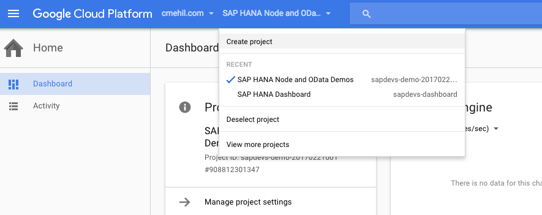

You can name the project whatever you like, in this tutorial the name `sapdevs-sample-1` was used.

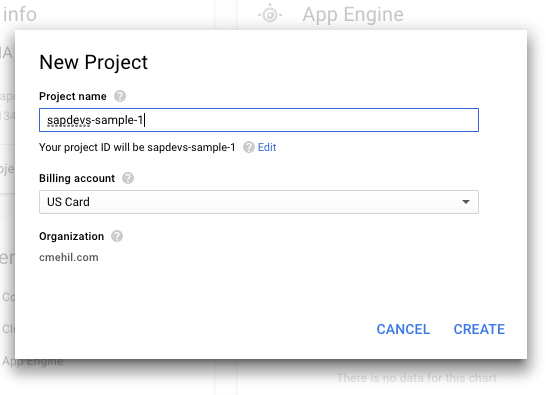

[ACCORDION-END]

[ACCORDION-BEGIN [Step 2: Begin Development](Begin Development)]

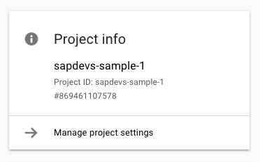

With the project now created and associated with a billing account you are now able to begin development.

In the top left corner select development in the menu.

[ACCORDION-END]

[ACCORDION-BEGIN [Step 3: Repository Menu](Repository Menu)]

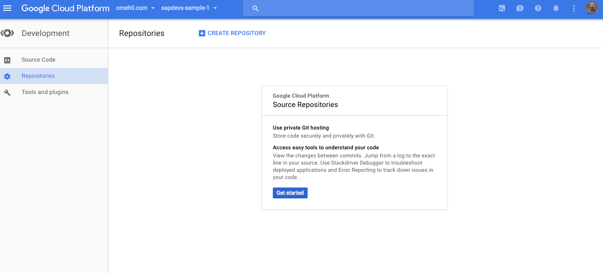

From the development menu you will need to create a repository for your code.

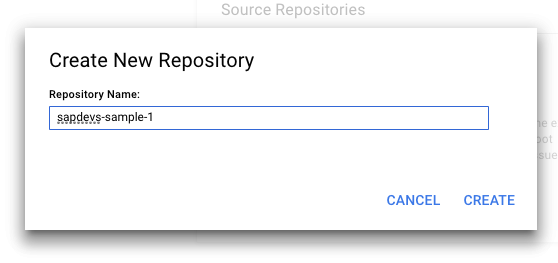

In this tutorial the repository was named to match the project name, `sapdevs-sample-1`

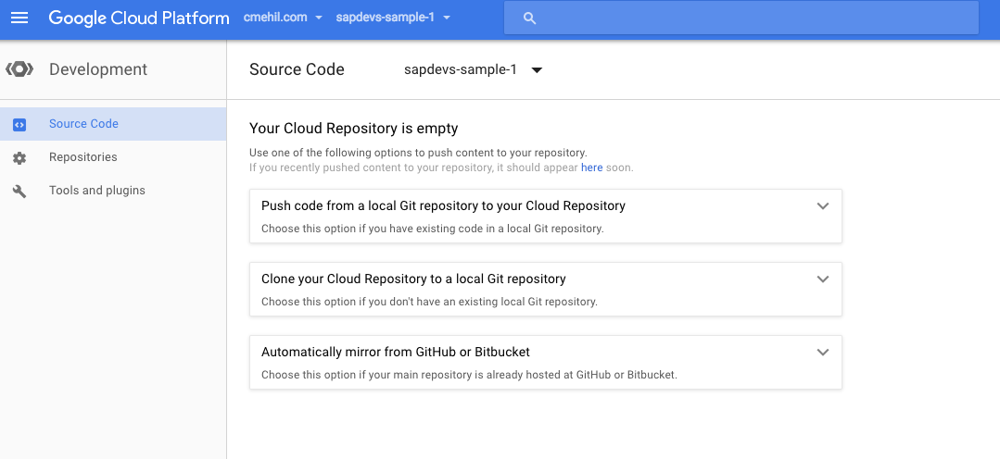

[ACCORDION-END]

[ACCORDION-BEGIN [Step 4: Link Repository](Link Repository)]

Now that the new repository is created it is still empty. The next step is to link the repository, clone or push code to it.

In this particular case, the choice has been to use the "mirror" option and to accomplish that means that a new repository will need to be created in GitHub or Bitbucket first.

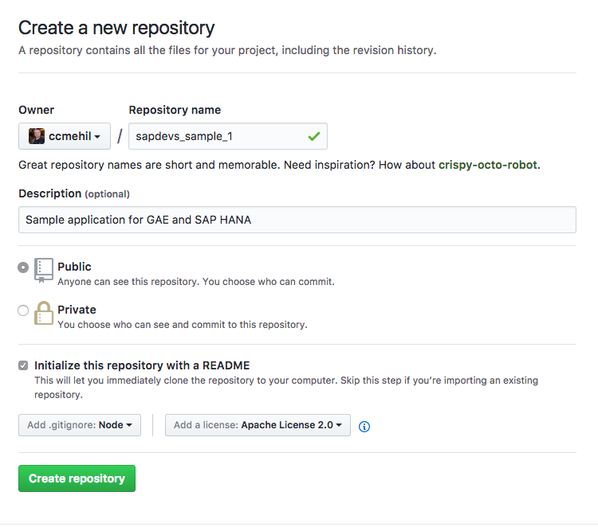

With this repository created, back in the Google Console you will be able to link the two together.

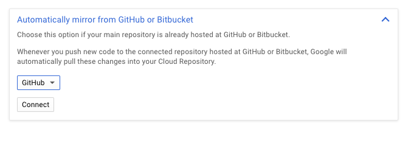

In this case as the example uses GitHub then the GitHub account is what is linked and then a list of available repositories will be listed.

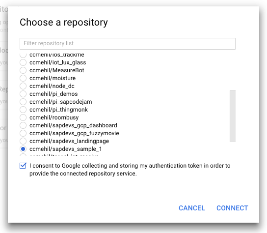

Once successfully linked and mirrored then the initially created content will be available.

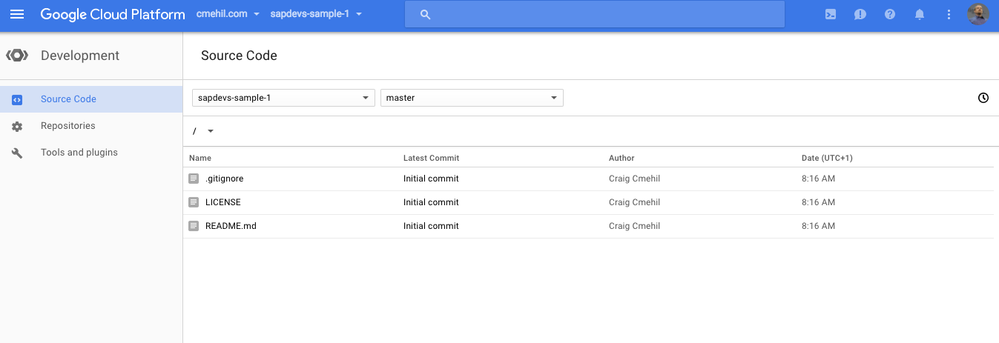

[ACCORDION-END]

[ACCORDION-BEGIN [Step 5: Open Cloud Shell](Open Cloud Shell)]

In the top right you will find the option to launch the Cloud Shell.

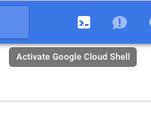

From the shell you will need to switch to the `src` directory.

[ACCORDION-END]

[ACCORDION-BEGIN [Step 6: Clone your repository](Clone your repository)]

In the `src` directory you will now need to clone your repository.

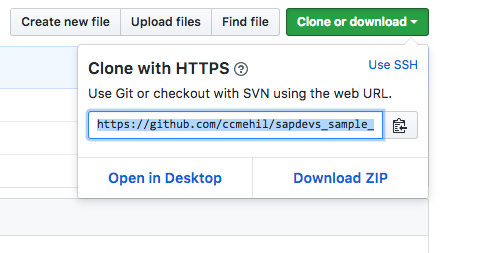

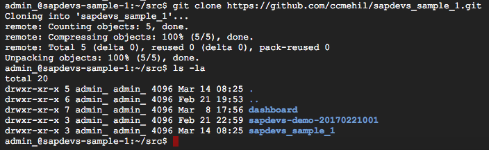

`git clone xxxxxxxxxx`

Once it is cloned you will see the code in your directory.

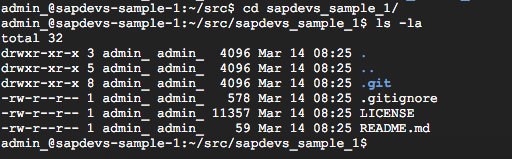

[ACCORDION-END]

