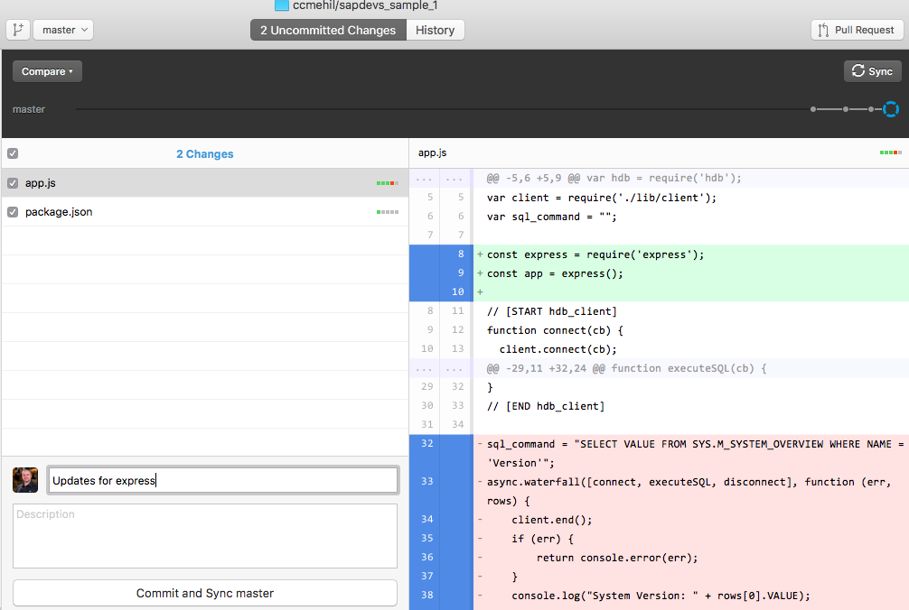
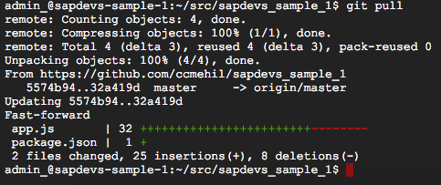

## Prerequisites  
 - **Proficiency:** Beginner
 - **Tutorials:** [Google App Engine Install HDB](https://www.sap.com/developer/tutorials/gae-nodehdb.html)


## Next Steps
 - Select a tutorial from the [Tutorial Navigator](http://www.sap.com/developer/tutorial-navigator.html) or the [Tutorial Catalog](http://www.sap.com/developer/tutorials.html)

## Details
### You will learn  
Now to modify your code to implement a full web application with port listening and continuous interaction with SAP HANA

### Time to Complete
**15 Min**

---

[ACCORDION-BEGIN [Step 1: Install express](Install express)]

Now you will need to add additional node module, run the command `npm install express --save`.

Now open your `app.js`, here you will add the following to the top of your code.

```
var sql_command = "";

const express = require('express');
const app = express();

// [START hdb_client]
```

[DONE]
[ACCORDION-END]

[ACCORDION-BEGIN [Step 2: Modify Output](Modify Output)]

Now to modify the output, previously the output was simply a `console.log` out put so a slight modification will output to the web browser.

```
app.get('/', function (req, res) {
  sql_command = "SELECT VALUE FROM SYS.M_SYSTEM_OVERVIEW WHERE NAME = 'Version'";
  async.waterfall([connect, executeSQL, disconnect], function (err, rows) {
      client.end();
      if (err) {
          return console.error(err);
      }
      res.send("System Version: " + rows[0].VALUE);
  });
})
```

[DONE]
[ACCORDION-END]

[ACCORDION-BEGIN [Step 3: Add listening port](Add listening port)]

Now to the bottom of the file you will add the following code which will enable a listening port and web interface.

```
if (module === require.main) {
  // [START server]
  const server = app.listen(process.env.PORT || 8080, () => {
    const port = server.address().port;
    console.log(`App listening on port ${port}`);
  });
  // [END server]
}

module.exports = app;
```

[DONE]
[ACCORDION-END]

[ACCORDION-BEGIN [Step 4: Sync and Deploy](Sync and Deploy)]

Now you will need to synchronize your changes to GitHub.



Now you will need to return to the Google Cloud Shell where you will run a `git pull` command to bring down the changes from GitHub.



Now you can execute the `npm start` command again to test the application or you can choose to deploy the application by the following command.

`gcloud app deploy --project sapdevs-sample-1`

The result this time should be very different from the first attempt.

```
Updating service [default]...|Stopping version [sapdevs-sample-1/default/20170314t151959].                                                                                  
Updating service [default]...-WARNING: Error stopping version [sapdevs-sample-1/default/20170314t151959]: INTERNAL: This flexible version cannot be modified, it can only be
 deleted.
WARNING: Version [sapdevs-sample-1/default/20170314t151959] is still running and you must stop or delete it yourself in order to turn it off. (If you do not, you may be cha
rged.)
Updating service [default]...done.                                                                                                                                          
Deployed service [default] to [https://sapdevs-sample-1.appspot.com]
You can stream logs from the command line by running:
  $ gcloud app logs tail -s default
To view your application in the web browser run:
  $ gcloud app browse
admin_@sapdevs-sample-1:~/src/sapdevs_sample_1$
```

[DONE]
[ACCORDION-END]

[ACCORDION-BEGIN [Step 5: Viewing in the Browser](Viewing in the Browser)]

In order to access your now deployed app you will need to go to the `App Engine` and from here you can see the URL of your new service.


Clicking the URL in the right corner will load the app itself.

`System Version: 2.00.000.00.1479874437 (fa/hana2sp00)`

[DONE]
[ACCORDION-END]


## Next Steps
- Select a tutorial from the [Tutorial Navigator](http://www.sap.com/developer/tutorial-navigator.html) or the [Tutorial Catalog](http://www.sap.com/developer/tutorials.html)
