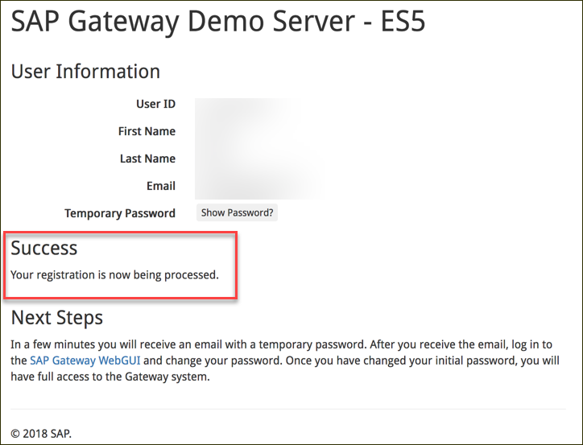

## Details
### You will learn
  - How to create an account on the SAP Gateway Demo System (ES5).

At the end of this tutorial, you will have a username and password, and will be able to sign in to the Gateway web front end.

---

[ACCORDION-BEGIN [Step 1: ](Go to sign up page)]

First we need to create an account on the SAP Gateway System.  The system will use your sap.com profile information to create the account.

Click this link in your browser: [Gateway Registration system](https://register.sapdevcenter.com/SUPSignForms).

>In order to sign up for an account on the Gateway Demo System, you must have an account on **sap.com**.  To register for an account on sap.com, navigate to [https://www.sap.com](https://www.sap.com/index.html), and then click on the **person icon** in the upper left hand corner of the web page. Once your account is set up, you can continue to register.

You should see this page:

[DONE]
[ACCORDION-END]

[ACCORDION-BEGIN [Step 2: ](Fill out registration form)]

Verify all of your user information on the web page.   Please be certain your email address is correct.  If this address is incorrect, please fix it in your sap.com user profile.

Next, read the Terms and Conditions, and check the box next to the line **I have read and understood the Terms and Conditions**.

When ready, click **Register**. This might take a couple of seconds.

The screen will change and the word **Success** will appear.  

Your username and a temporary password are displayed on the registration screen. The username is **User ID**, and you can click **Show Password?** to reveal the temporary password.

[DONE]
[ACCORDION-END]

[ACCORDION-BEGIN [Step 4: ](Go to SAP Gateway SAP GUI for HTML)]

Once you received your registration email, go to the [SAP Gateway SAP GUI for HTML](https://sapes5.sapdevcenter.com/).  Enter the username and initial password from your email.

[DONE]
[ACCORDION-END]

[ACCORDION-BEGIN [Step 5: ](Change password)]

The system will request that you change your initial password to a new password which only you know.

When your password is changed, you will see a confirmation dialog. Click **Continue**.

[DONE]
[ACCORDION-END]

[ACCORDION-BEGIN [Step 7: ](Go to SAP Easy Access page)]

You should now see the **SAP Easy Access** screen.  Your account is now active and ready for use.

Enter the URL of the SAP Easy Access page below and click **Validate**.

[VALIDATE_7]

[ACCORDION-END]

---

## Additional Information

### Account Maintenance

- If you need to reset your password, please visit the [SAP Gateway Registration system](https://register.sapdevcenter.com/SUPSignForms) again.  The system will reset your password and email you the new temporary password.

### Problems?  Need Help?
There are two different forums, depending on what type of trouble you are experiencing.  *Please use the correct one, or it will take longer to answer your questions.*

- For questions about SAP Gateway (this includes using the Gateway server, creating services, or accessing ODATA) please post any questions to the [SAP Gateway Community](https://community.sap.com/topics/gateway) Q&A system.  

- For any problems with registration, or password changes, please email <rac-support@sap.com>.
