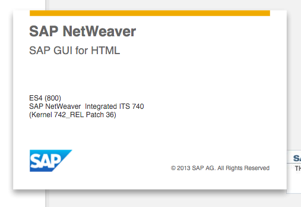

## Details
### You will learn
  - How to create an account on the Gateway demo system (ES5)  

At the end of this tutorial, you will have a username and password, and will be able to sign in to the Gateway web front end.


---

[ACCORDION-BEGIN [Question 1: ](Where do I sign up?)]

#### [Sign up here!](https://register.sapdevcenter.com/SUPSignForms)

The sign up uses your [SAP Cloud Identity](https://accounts.sap.com/) to verify you.  (So, if you don't have an SAP website account, create one first!) The Gateway server uses your User ID as your account name.  You provide your name, and email address.  Once you have accepted the terms and conditions, the server will create an account, and then email you the temporary password.

[DONE]
[ACCORDION-END]

[ACCORDION-BEGIN [Question 2: ](What happens next?)]

Connect to the SAP Gateway Web GUI: <https://sapes5.sapdevcenter.com>

When you receive the email, open up a web browser and point it to the Web GUI.  The server will ask you to change your temporary password.  Once you have done that, you can access the Gateway Service.


[DONE]
[ACCORDION-END]


[ACCORDION-BEGIN [Question 3: ](What if I forgot or lost my username or password?)]

Go back to the [sign-up form](https://register.sapdevcenter.com/SUPSignForms). The form will find you in the system, display your username, and allow you to reset your password. Once your password is reset you will get an email confirming that the password has been reset.


[DONE]
[ACCORDION-END]

[ACCORDION-BEGIN [Question 4: ](How do I connect to the system?)]

The [Web GUI](https://sapes5.sapdevcenter.com/) is the only way to connect to the system.



>For security reasons we have disabled connections from the Windows or Java GUI client.  Please use the Web GUI instead.*


[DONE]
[ACCORDION-END]

[ACCORDION-BEGIN [Question 5: ](What can I do with the System?)]

The main purpose of the system is to learn about consuming SAP NetWeaver Gateway Services. All URL's to Gateway for this system start with:

```URL
https://sapes5.sapdevcenter.com/sap/opu
```

Please have a look at the Sample Services and how to use them. The system is only for consumption of OData Services not for building new ones. If you are interested in building new services you have the option of choosing one of the other systems on the previous entry page. We will not hand out authorizations for developing any ABAP on this system.


[DONE]
[ACCORDION-END]

[ACCORDION-BEGIN [Question 6: ](What is on the System?)]

The System is an SAP ECC (Enterprise Core Components) filled with some Demo Data. You do have read and write authorizations to all modules but are restricted form accessing administrative functionality. Furthermore the system allows you to access the development tools but does not allow development itself. Debugging with viewing permissions is however possible.


[DONE]
[ACCORDION-END]

[ACCORDION-BEGIN [Question 7: ](What if I need help?)]

If you have a question about SAP Gateway, please post a message in the [Gateway Community](https://www.sap.com/community/topics/gateway.html).

For problem with registration or system availability only, please email the system support team at <a href="mailto:rac-support@sap.com">rac-support@sap.com</a>.

[DONE]
[ACCORDION-END]
