## Details
### You will learn  
  - **THIS TUTORIAL SERIES CAN ONLY BE EXECUTED AT TECHED**  as it is. Please find us at the Google booth in the AppSpace and we will provide everything you will need.
  - How to connect to Google BigQuery and run different queries
  - How to configure your SAP HANA, express edition instance to connect to Google BigQuery and perform development tasks

Add additional information: Background information, longer prerequisites

---

[ACCORDION-BEGIN [Step 1: ](Connect to the cloud shell)]

Go back to the Google Chrome window and open a `gcloud` console:


Click **Run in cloud shell**. When prompted, click **Enter** twice and leave the passphrases blank for this trial account.

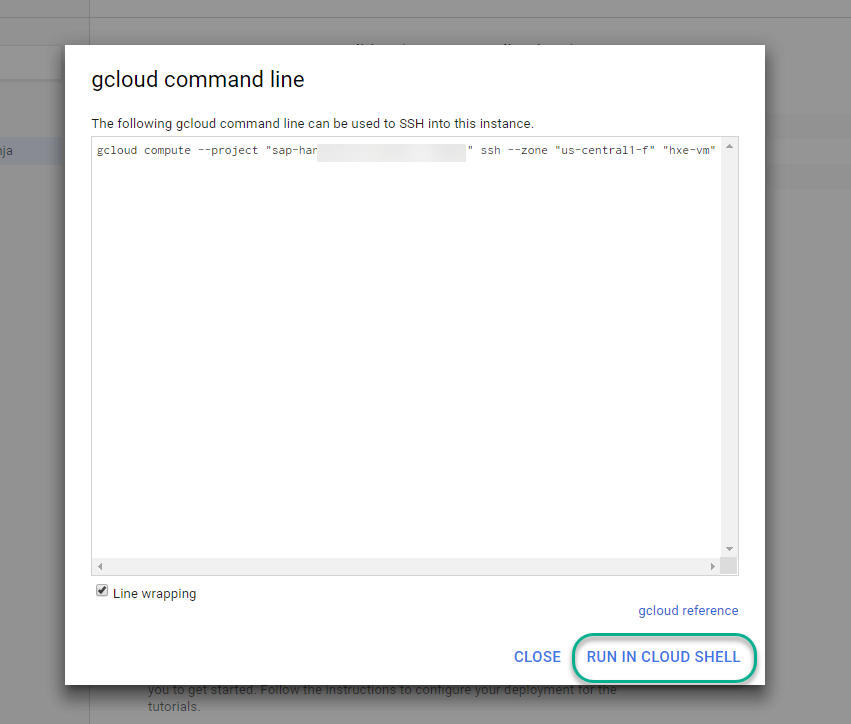


[DONE]

[ACCORDION-END]

[ACCORDION-BEGIN [Step 2: ](Run the configuration script)]

Use the following two commands to create a file and edit it using the embedded editor

```text
touch setup.sh
edit setup.sh
```
When prompted, confirm you want to open the editor

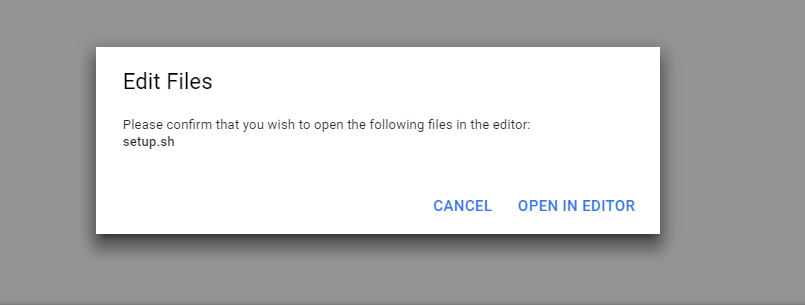

You will find a `Notepad` icon on the desktop or open called `setup.sh`. Copy the contents into the editor


Use the following command in the console to add execution permissions to the file

```
chmod +x setup.sh
```

And use the script to find out the name of your instance and zone:

```
./setup.sh
```

Use the name of your instance (`hxe-vm`) and zone as parameters to the script


```
./setup.sh PARAMETER1 PARAMETER2
```

For example:

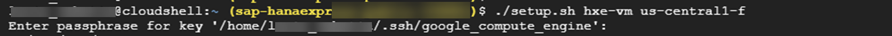

When prompted for the passphrase, press **Enter**. **You will be prompted several times so do not leave the script unattended**.

The script will perform several setup steps. Essentially, it will configure the ODBC and Simba drivers so that SAP HANA can connect to Google BigQuery.

The script will also restart the database. Continue with the next step while this happens.

[DONE]
[ACCORDION-END]


[ACCORDION-BEGIN [Step 3: ](Download master data from Google BigQuery)]

Use a **new tab in the browser** to open [Google BigQuery](https://console.cloud.google.com/bigquery).

Look for `noaa-gsod` in the list of datasets

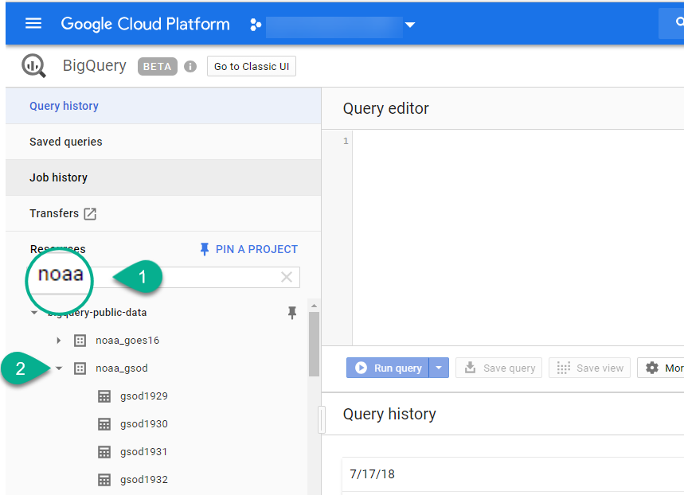

Locate the `stations` table and click on **Query Table**.

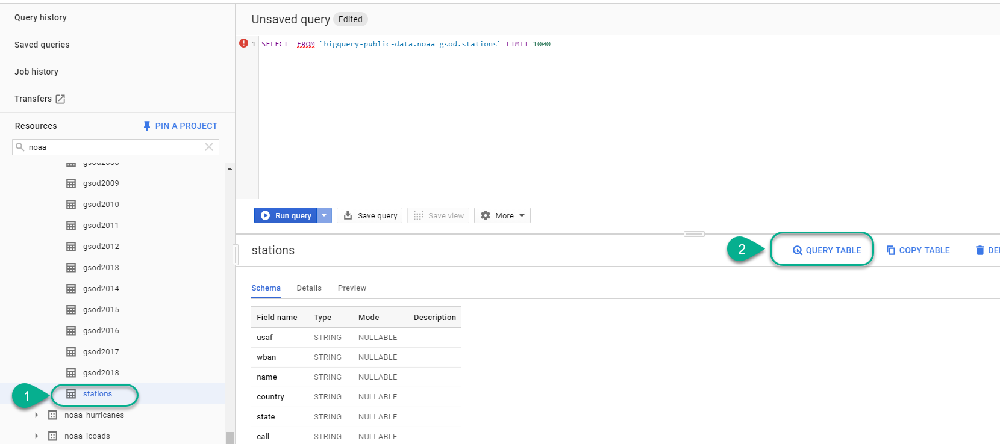

Add a `*` to the query and run it:

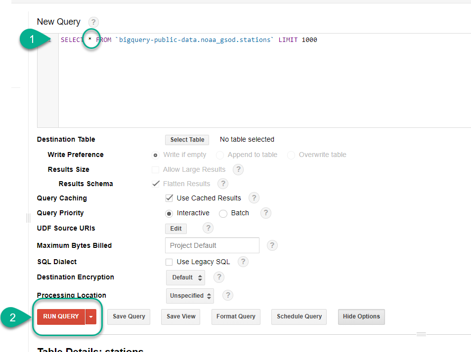

Click **Download as CSV**


And keep the CSV file open as you will need the data.


[DONE]
[ACCORDION-END]

[ACCORDION-BEGIN [Step 4: ](Create a Dataset in Google BigQuery)]

Click on the name of your project and then on **Create Dataset**.

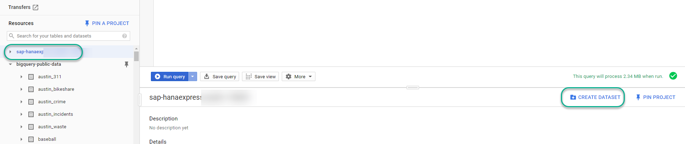

Call it `HeatDeath` and click **Create dataset**


[DONE]

[ACCORDION-END]

[ACCORDION-BEGIN [Step 5: ](Query stations closer to your current location)]

We loaded the same dataset you downloaded from the `stations` table into SAP HANA and used a geospatial function to find out which stations are closer to our current location in Las Vegas.

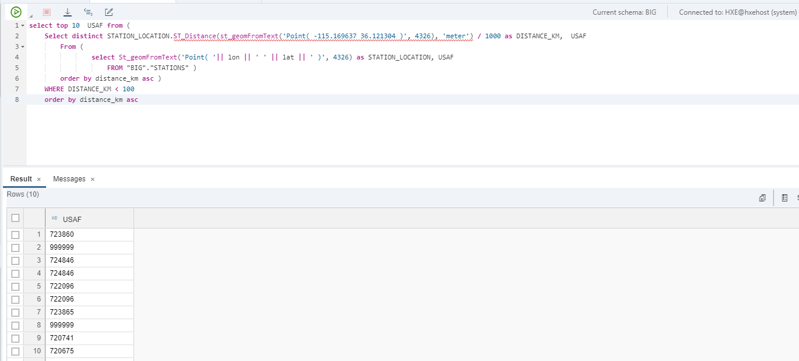

You will use the resulting station IDs to create a smaller dataset of weather measurements in Google BigQuery. This dataset will be consumed directly from SAP HANA. Paste the following query into the SQL console

```SQL
SELECT * FROM `bigquery-public-data.noaa_gsod.*` where stn in ( "723860", "724846", "722096", "723865", "720741", "720675", "720675", "690170", "692584", "746141");

```

For example:

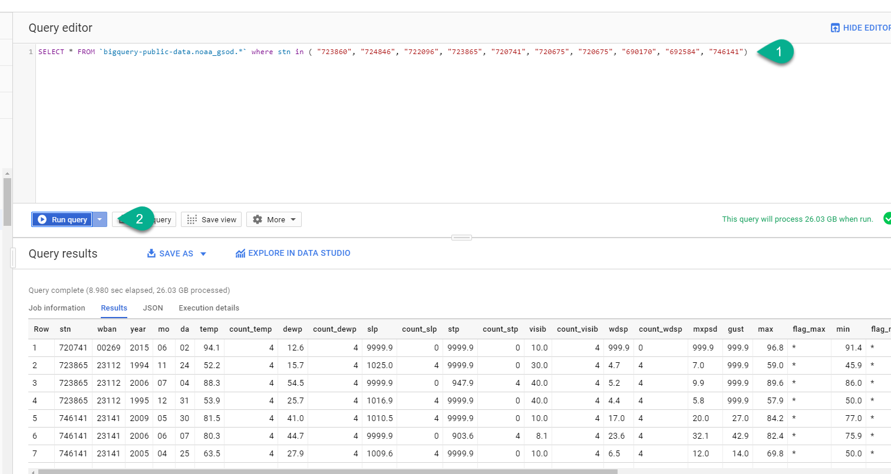

Click **Save as table**

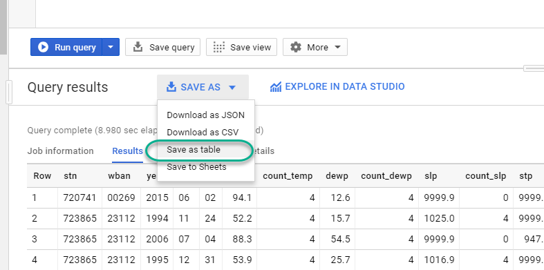

Call it `RESULTS`

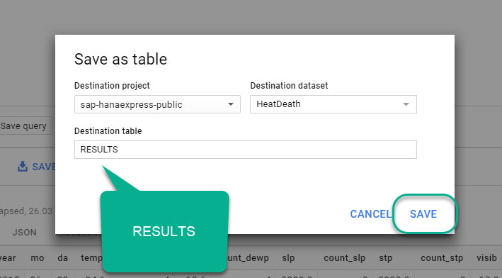

[DONE]
[ACCORDION-END]

[ACCORDION-BEGIN [Step 6: ](Check the setup has finished and tweak the environment)]

Go back into the console where the setup script was running. By now, it should have finished. If it hasn't, wait for it.
Execute the following command to log in to the XS Advanced CLI:

```
sudo su - hxeadm
xs login -a https://hxehost:39030

```
Use `HanaRocks1` as the password

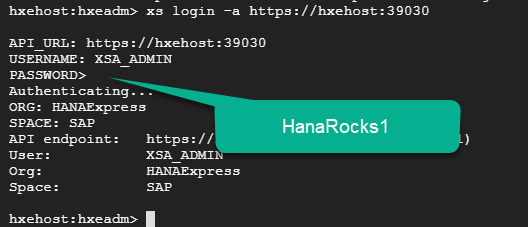

Paste the following command to prepare your environment for development:

```text
xs scale di-core -m 512M
```

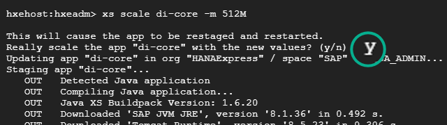

Use the following two commands to map the tenant database to the development space.

When prompted for a password, use `HanaRocks1`. You can press **Enter** when prompted for the default SYSTEM user.

```text
xs enable-tenant-database HXE
xs map-tenant-database -o HANAExpress -s development HXE
```

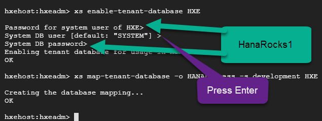

Copy the results of the following command into the validation to complete it.

```text
xs apps | grep webide
```

[VALIDATE_1]
[ACCORDION-END]

---
