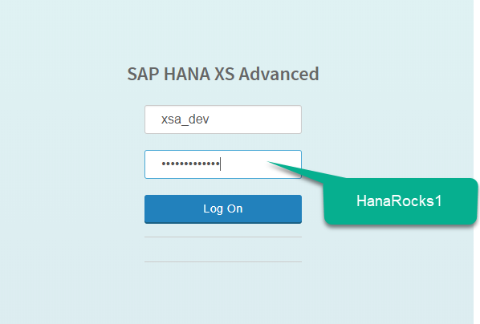
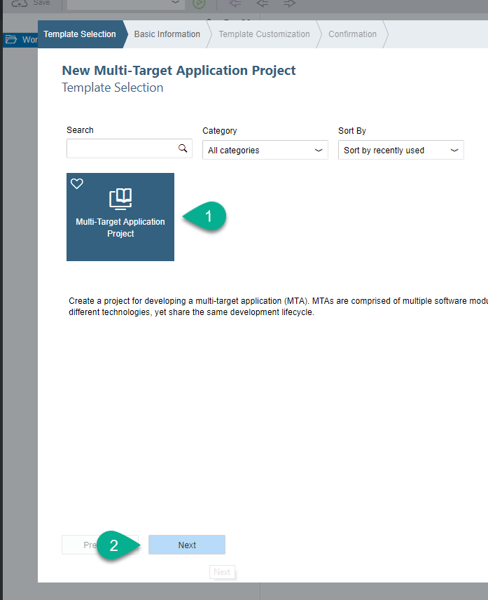
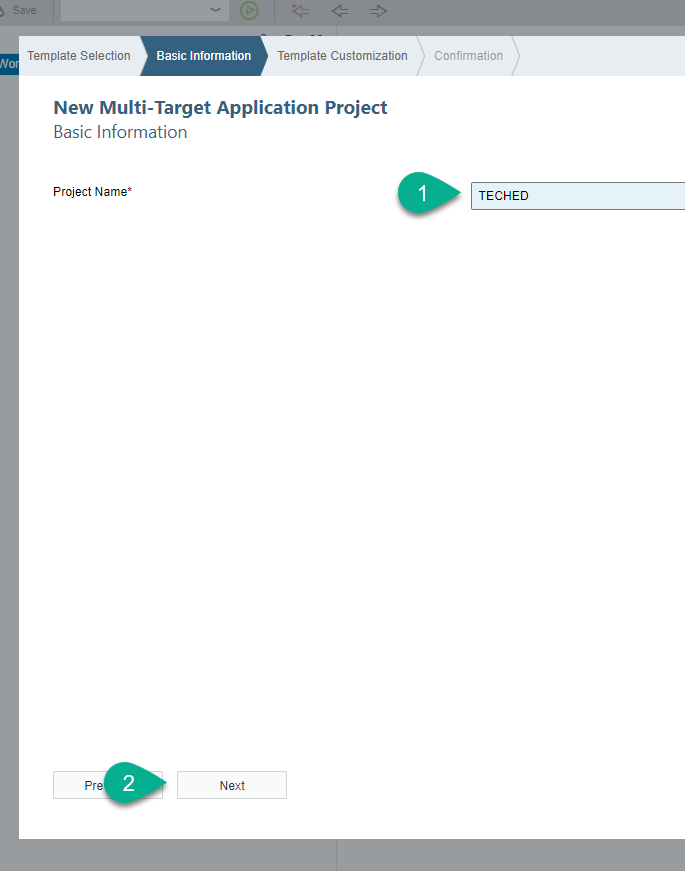
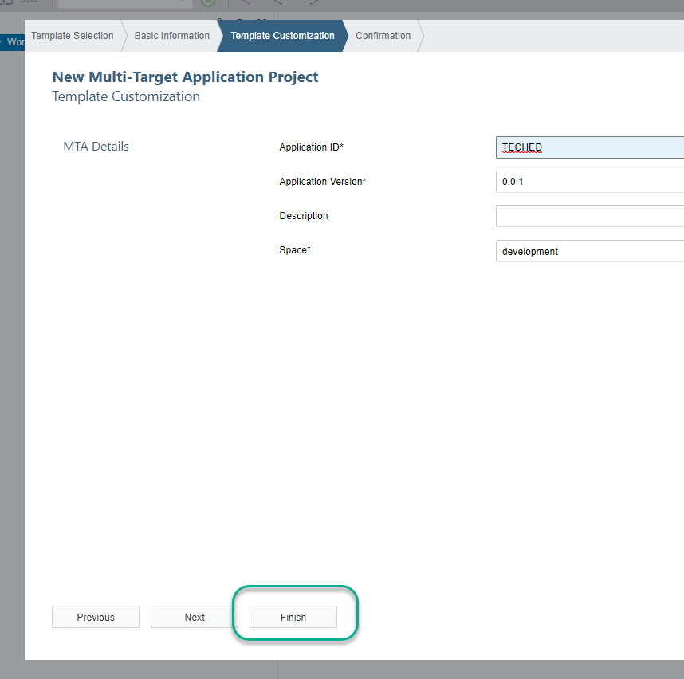
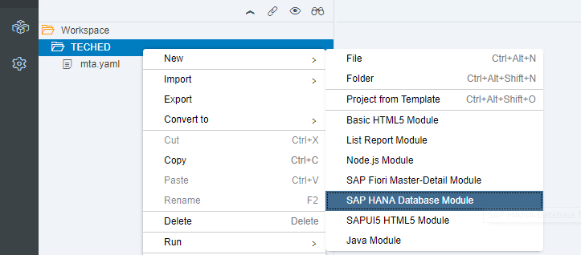
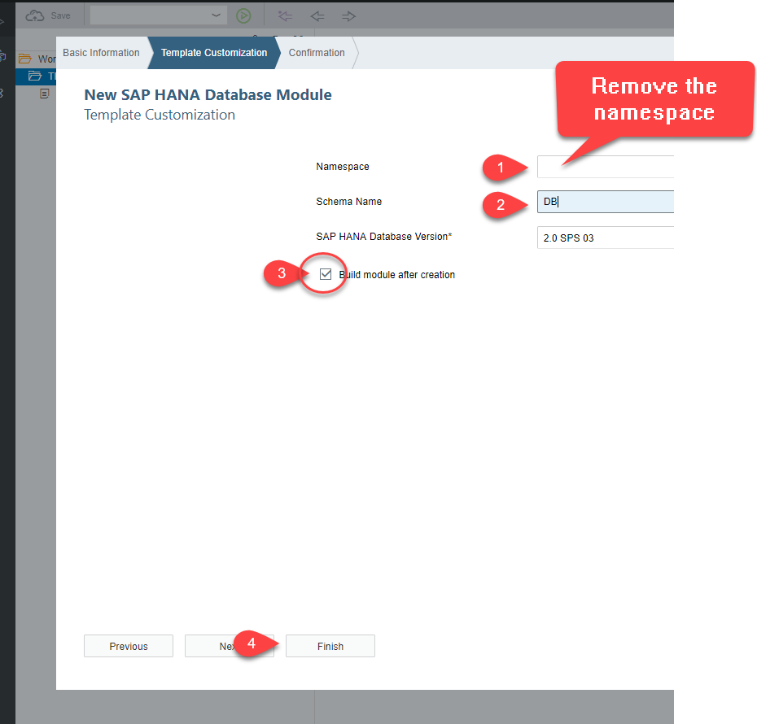
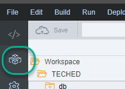
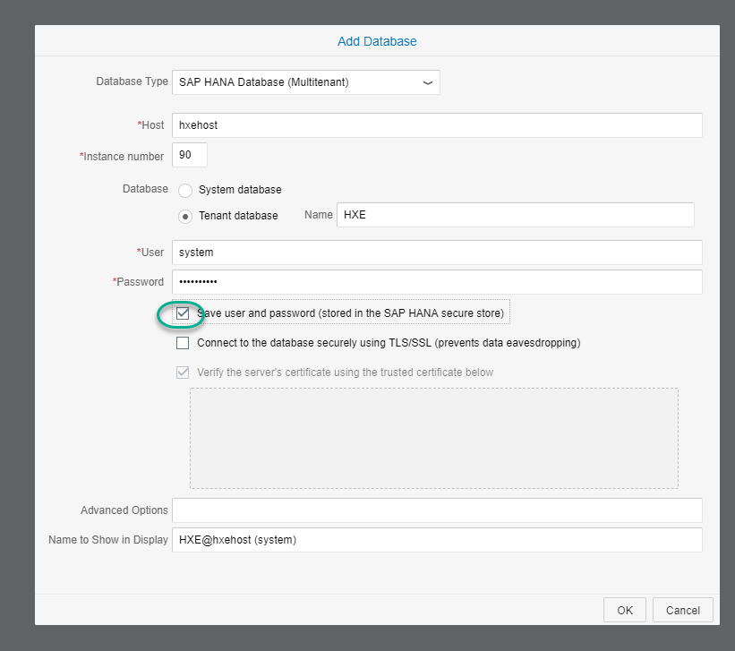
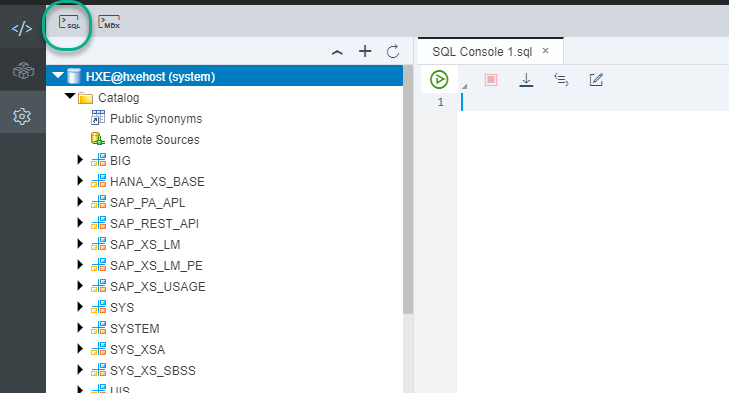
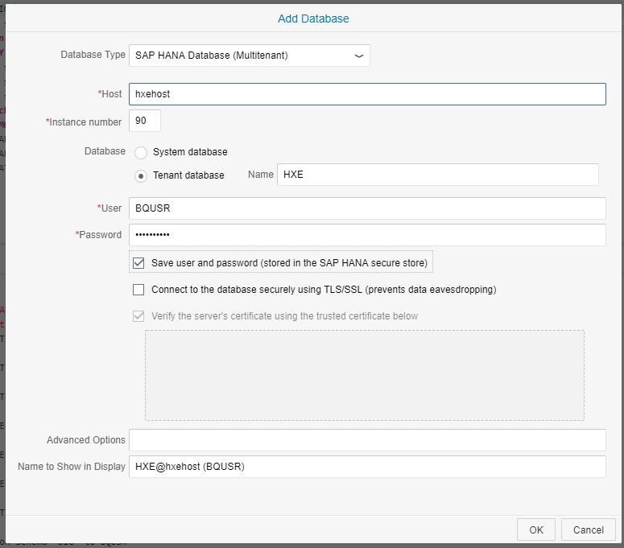

## Details
### You will learn  
  - **THIS TUTORIAL SERIES CAN ONLY BE EXECUTED AT TECHED**  as it is. Please find us at the Google booth in the AppSpace and we will provide everything you will need.
  - Connect to SAP Web IDE for SAP HANA and create a Multi Target Application
  - Create a database module based on an HDI container
  - Connect to the physical tenant database and create a plain schema
  - Create a Virtual Source to connect to Google BigQuery and import data

---

[ACCORDION-BEGIN [Step 1: ](Connect to SAP Web IDE for SAP HANA)]

Open a new incognito tab and log in to SAP Web IDE for SAP HANA using the following URL:

```text
https://hxehost:53075
```
Use `XSA_DEV` as a user and `HanaRocks1` as a password



**Close** the initial wizard and right-click on the workspace. Choose **New -> Project from Template**.


Choose `Multi Target Application` and click **Next**.



Call the project `TECHED` and click **Next**.



Leave the default values and click **Finish**.




[DONE]
[ACCORDION-END]

[ACCORDION-BEGIN [Step 2: ](Create a database module)]

Right-click on the project and choose **New -> SAP HANA Database Module**.



Use the name `db` and click **Next**


**Remove the namespace** and use `DB` for the schema. Check `Build module after creation` and click **Finish**



[DONE]

[ACCORDION-END]


[ACCORDION-BEGIN [Step 3: ](Create a plain schema and a user)]

You will first create a plain schema and a user. You will use that user to execute predictive analytics procedures and later access the plain schema from your HDI container.

Go into the database explorer



When prompted about adding a database, click **Yes**.
Use the following parameters to connect to the database:

- Host:
```text
hxehost
```
- Tenant database: `HXE`
- User: `SYSTEM`
- Password: `HanaRocks1`



Open a SQL console



Execute the following SQL statements

```text
CREATE USER BQUSR PASSWORD "HanaRocks1" NO FORCE_FIRST_PASSWORD_CHANGE;
CREATE SCHEMA BIG;
GRANT "SELECT","SELECT METADATA", "EXECUTE", "CREATE ANY", "DELETE", "UPDATE", "INSERT", "DROP"  ON SCHEMA "BIG" TO BQUSR WITH GRANT OPTION;
grant CREATE REMOTE SOURCE to BQUSR;
GRANT AFL__SYS_AFL_AFLPAL_EXECUTE_WITH_GRANT_OPTION TO BQUSR;
GRANT AFL__SYS_AFL_APL_AREA_EXECUTE to  BQUSR;
GRANT AFLPM_CREATOR_ERASER_EXECUTE TO  BQUSR;
CREATE REMOTE SOURCE BIGQUERY ADAPTER "odbc" CONFIGURATION FILE 'property_bq.ini' CONFIGURATION 'DSN=GoogleBQ';
grant create virtual table on remote source BIGQUERY to DB_1#OO;

```

[DONE]

[ACCORDION-END]

[ACCORDION-BEGIN [Step 4: ](Get the name of your project)]

Open a new browser tab with the following URL:

```text
https://console.cloud.google.com/home/dashboard
```

Copy the name of the project ID. Keep this value handy as you will need it later.


[DONE]
[ACCORDION-END]

[ACCORDION-BEGIN [Step 5: ](Connect as the new user)]

Connect to the tenant database again using the **+** sign. Use the user `BQUSR` and `HanaRocks1` as the password.



Copy the following SQL statement. Replace `PROJECT_ID` with the ID you copied from step 4.

```text
CREATE REMOTE SOURCE BIGQUERY ADAPTER "odbc" CONFIGURATION FILE 'property_bq.ini' CONFIGURATION 'DSN=GoogleBQ';
CREATE VIRTUAL TABLE "BIG"."BQRESULTS" at "BIGQUERY"."PROJECT_ID"."HeatDeath"."RESULTS"
```

**Execute** the statements and you should see the remote source has been created. You will also see the RESULTS table you created in Google `BigQuery`.


Use the following SQL statement in a **new SQL console** to complete the validation below

```text
SELECT min("year") FROM "BIG"."BQRESULTS";
```

From what year is the earliest record in your dataset in Google `BigQuery`?


[VALIDATE_1]
[ACCORDION-END]

---
