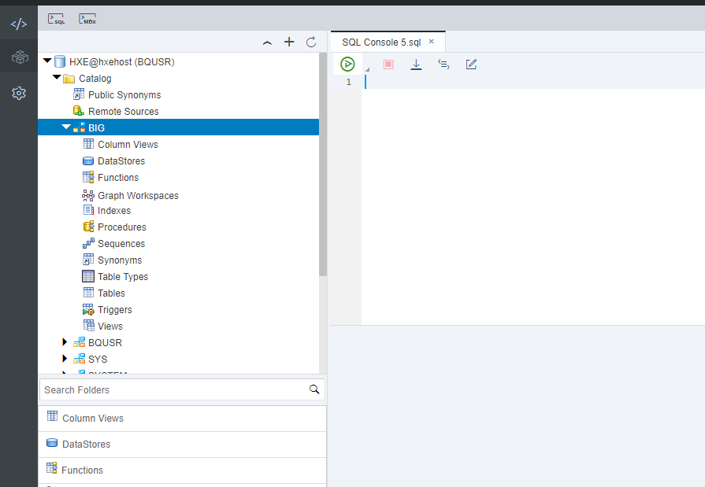
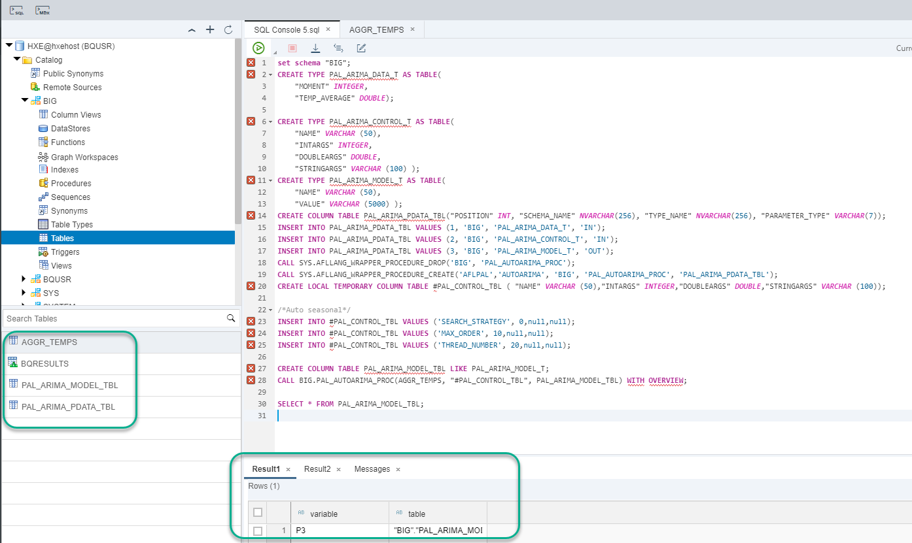
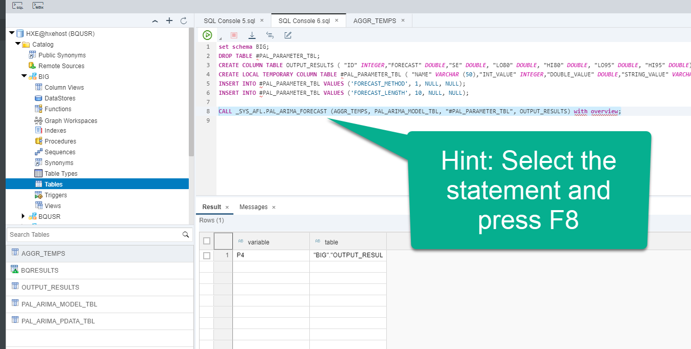
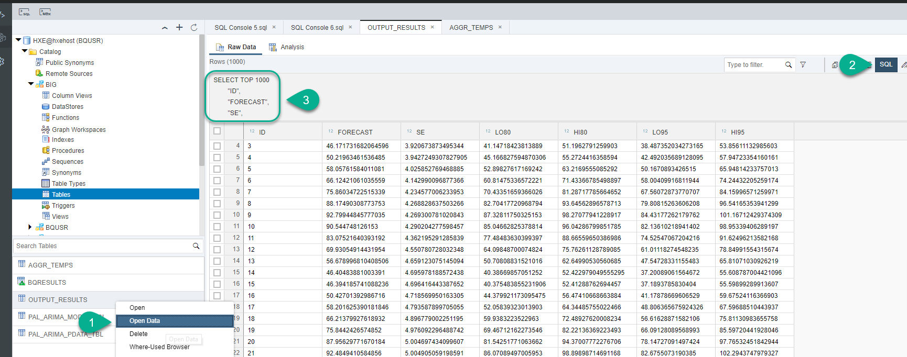
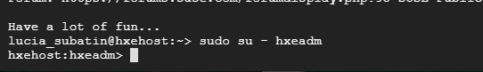

## Details
### You will learn  
  - How to create tables using SQL in a classic schema
  - How to train and run an ARIMA predictive model in a classic schema
  - How to create a user-provided service to access the plain schema from an HDI container

**THIS TUTORIAL SERIES CAN ONLY BE EXECUTED WITH A LIVE INSTRUCTOR**  as it is.

All of these artifacts can also be created as design-time artifacts to be deployed in the HDI container. This approach will allow you to manually execute the SQL commands and learn how to create the user-provided service. The recommendation when possible is to create the remote source in the database and replicate it in the HDI container.

---

[ACCORDION-BEGIN [Step 1: ](Create a columnar table)]

Start by clearing all open SQL tabs. Open a new one.



You will create a new columnar table and aggregate data from BigQuery into it.  Execute the following SQL command.

```text
create column table "BIG"."AGGR_TEMPS" as
( SELECT  cast(concat("year", "mo") as INTEGER) as "MOMENT", AVG("temp") AS "TEMP_AVERAGE"
FROM "BIG"."BQRESULTS"
GROUP BY "year", "mo"
ORDER BY "MOMENT" ASC  )

```

You should now see two tables in the schema `BIG`


[DONE]
[ACCORDION-END]

[ACCORDION-BEGIN [Step 2: ](Run the predictive training)]

Clear the SQL console and add the following SQL statements

```text

set schema "BIG";
CREATE TYPE PAL_ARIMA_DATA_T AS TABLE(
    "MOMENT" INTEGER,
	"TEMP_AVERAGE" DOUBLE);

CREATE TYPE PAL_ARIMA_CONTROL_T AS TABLE(
    "NAME" VARCHAR (50),
    "INTARGS" INTEGER,
    "DOUBLEARGS" DOUBLE,
	"STRINGARGS" VARCHAR (100) );
CREATE TYPE PAL_ARIMA_MODEL_T AS TABLE(
    "NAME" VARCHAR (50),
    "VALUE" VARCHAR (5000) );
CREATE COLUMN TABLE PAL_ARIMA_PDATA_TBL("POSITION" INT, "SCHEMA_NAME" NVARCHAR(256), "TYPE_NAME" NVARCHAR(256), "PARAMETER_TYPE" VARCHAR(7));
INSERT INTO PAL_ARIMA_PDATA_TBL VALUES (1, 'BIG', 'PAL_ARIMA_DATA_T', 'IN');
INSERT INTO PAL_ARIMA_PDATA_TBL VALUES (2, 'BIG', 'PAL_ARIMA_CONTROL_T', 'IN');
INSERT INTO PAL_ARIMA_PDATA_TBL VALUES (3, 'BIG', 'PAL_ARIMA_MODEL_T', 'OUT');
CALL SYS.AFLLANG_WRAPPER_PROCEDURE_DROP('BIG', 'PAL_AUTOARIMA_PROC');
CALL SYS.AFLLANG_WRAPPER_PROCEDURE_CREATE('AFLPAL','AUTOARIMA', 'BIG', 'PAL_AUTOARIMA_PROC', 'PAL_ARIMA_PDATA_TBL');		
CREATE LOCAL TEMPORARY COLUMN TABLE #PAL_CONTROL_TBL ( "NAME" VARCHAR (50),"INTARGS" INTEGER,"DOUBLEARGS" DOUBLE,"STRINGARGS" VARCHAR (100));

/*Auto seasonal*/
INSERT INTO #PAL_CONTROL_TBL VALUES ('SEARCH_STRATEGY', 0,null,null);
INSERT INTO #PAL_CONTROL_TBL VALUES ('MAX_ORDER', 10,null,null);
INSERT INTO #PAL_CONTROL_TBL VALUES ('THREAD_NUMBER', 20,null,null);

CREATE COLUMN TABLE PAL_ARIMA_MODEL_TBL LIKE PAL_ARIMA_MODEL_T;
CALL BIG.PAL_AUTOARIMA_PROC(AGGR_TEMPS, "#PAL_CONTROL_TBL", PAL_ARIMA_MODEL_TBL) WITH OVERVIEW;

SELECT * FROM PAL_ARIMA_MODEL_TBL;
```

>While the training is running, take a look at the SQL commands above.
The ARIMA model is an auto-regressive algorithm. More information here.

Once the execution has finished, you should see two new tables and three additional tabs.



[DONE]

[ACCORDION-END]


[ACCORDION-BEGIN [Step 3: ](Run the predictive model)]

You can now run the actual predictive model. Copy the following SQL statements into a new SQL console:

```text
set schema BIG;
CREATE COLUMN TABLE OUTPUT_RESULTS ( "ID" INTEGER,"FORECAST" DOUBLE,"SE" DOUBLE, "LO80" DOUBLE, "HI80" DOUBLE, "LO95" DOUBLE, "HI95" DOUBLE);
CREATE LOCAL TEMPORARY COLUMN TABLE #PAL_PARAMETER_TBL ( "NAME" VARCHAR (50),"INT_VALUE" INTEGER,"DOUBLE_VALUE" DOUBLE,"STRING_VALUE" VARCHAR (100));
INSERT INTO #PAL_PARAMETER_TBL VALUES ('FORECAST_METHOD', 1, NULL, NULL);
INSERT INTO #PAL_PARAMETER_TBL VALUES ('FORECAST_LENGTH', 10, NULL, NULL);
```
Once it is finished, execute the following statement:



```text
CALL _SYS_AFL.PAL_ARIMA_FORECAST (AGGR_TEMPS, PAL_ARIMA_MODEL_TBL, "#PAL_PARAMETER_TBL", OUTPUT_RESULTS) with overview;
```
> Note: You can select the statement and press execute of `F8`

Right-click on `OUTPUT_RESULTS` and choose **Open Data**. Copy the SQL statement into the validation below to complete it.



[VALIDATE_1]

[ACCORDION-END]

[ACCORDION-BEGIN [Step 4: ](Create a user-provided service)]

Go back to the console. Make sure you are logged in as `hxeadm`.

If you are not, execute `sudo su - hxeadm`



Execute the following command to create a user-provided service using the XS CLI in the `development` space.

```
xs t -s development
xs cups CROSS_SCHEMA_BIG -p "{\"host\":\"hxehost\",\"port\":\"39015\",\"user\":\"BQUSR\",\"password\":\"HanaRocks1\",\"driver\":\"com.sap.db.jdbc.Driver\",\"tags\":[\"hana\"] , \"schema\" : \"BIG\" }"
```

Copy the results of the last command to complete the validation below


[VALIDATE_2]
[ACCORDION-END]

---
