## Details
### You will learn  
  - **THIS TUTORIAL SERIES CAN ONLY BE EXECUTED AT TECHED**  as it is. Please find us at the Google booth in the AppSpace and we will provide everything you will need.

  - How to access plain schema from an HDI Container
  - How to create database objects using design-time artifacts
  - How to create a calculation view of type cube


---

[ACCORDION-BEGIN [Step 1: ](Add the user-provided service to your Multi Target Application)]

Go into the coding tools in SAP Web IDE for SAP HANA. Right-click on the database module and choose **`Modeling actions -> Add External SAP HANA Service`**.

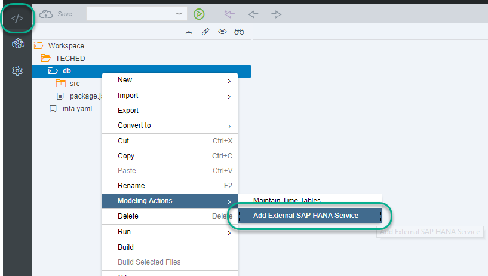

Mark `Existing User Provided Service` and use the name `CROSS_SCHEMA_BIG`.

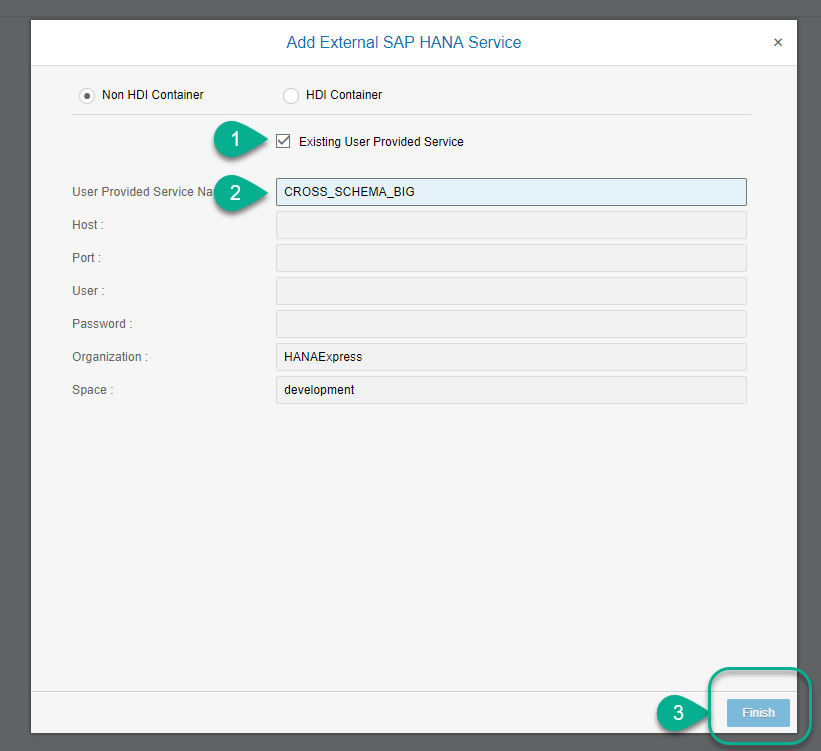

Click **Finish**.

[DONE]
[ACCORDION-END]

[ACCORDION-BEGIN [Step 2: ](Import tables and data)]

To make the most of your time, you will import some pre-created tables and data to compare the current temperature measurements to the predictions.

Right-click on the project and use **Import -> File or Project**.


Choose the file `db.zip` in the Desktop of your computer

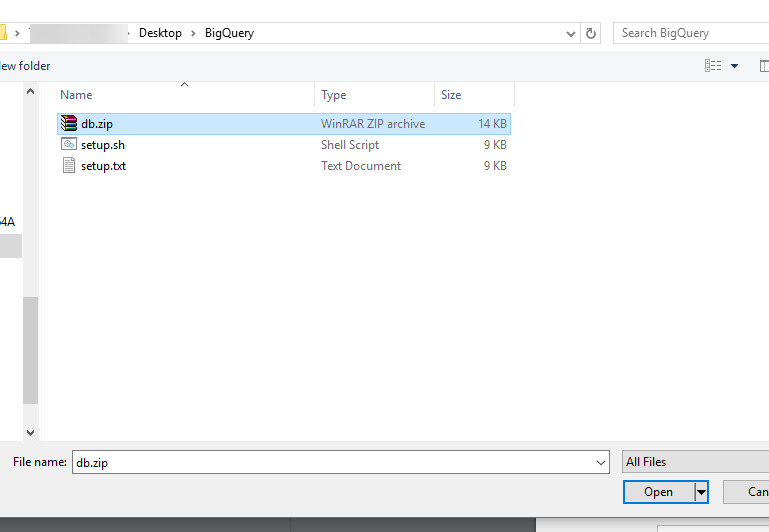

Leave the default values and click **OK**

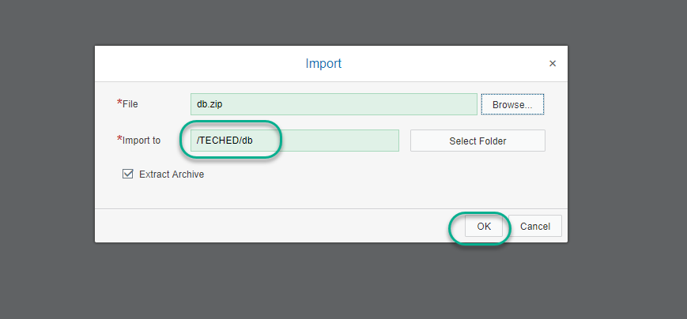

Confirm overwriting the existing files

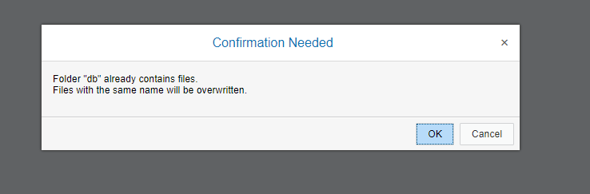

Once imported, expand the `db` module and **Build** the two inner folders

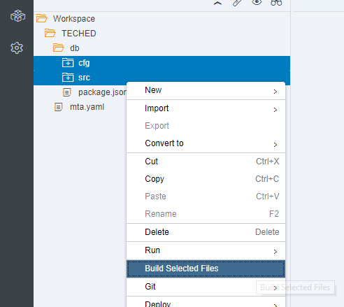

[DONE]

[ACCORDION-END]


[ACCORDION-BEGIN [Step 3: ](Create a Calculation View)]

The import has created two tables and filled them with data. Those tables include a mapping for the periods to interpret the output of the predictive algorithm and some **fake** current measurements.

The objective of the calculation view you will create is to compare the predicted temperatures to current (fake) measurements.

You will find an empty folder called `models`. Right-click on it and choose **New -> Calculation View**.

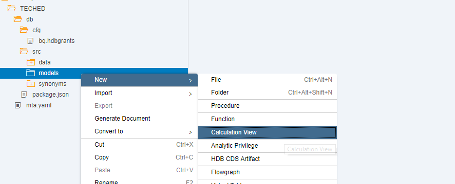

Call it `HEAT_DEATH` and click **OK**

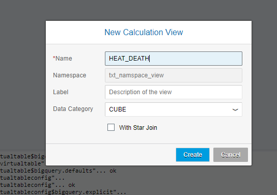

Start by clicking on the `join` node and then clicking on the canvas to drop it

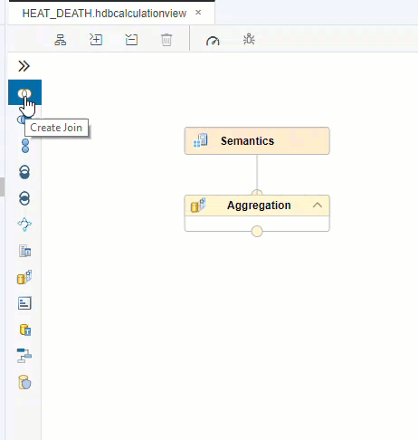

Click on the **+** sign to add a data source.

Check the `CROSS_SCHEMA_BIG` service and search for `OUT`. Choose the `OUTPUT_RESULTS` table and click **Finish**.


Click the **+** again to add another source. Choose `PERIODS`.

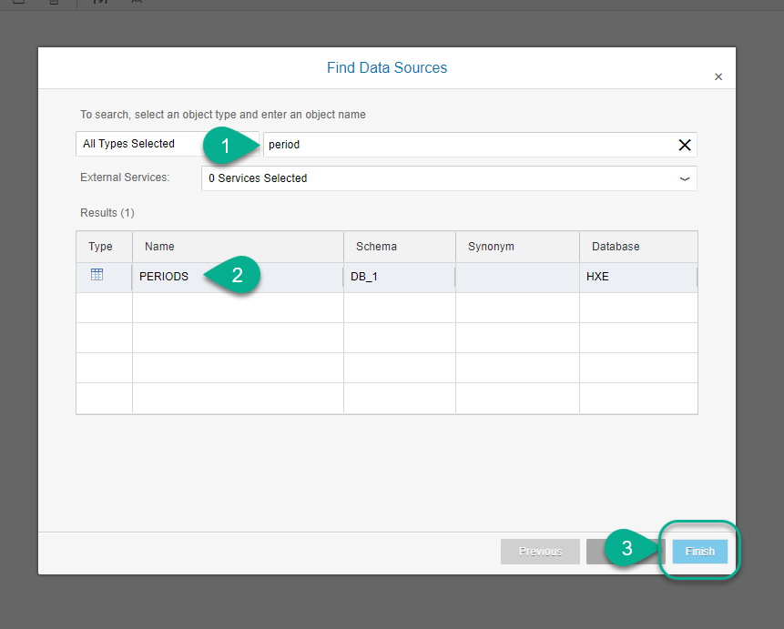

Double-click on the Join node

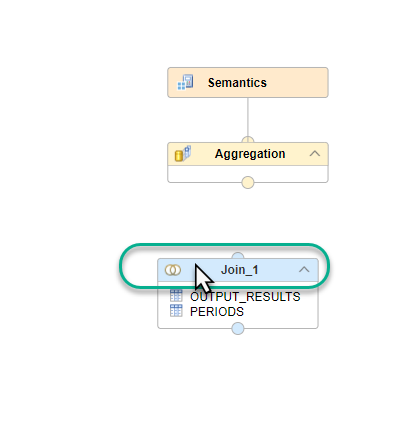

And drag the `ID` column from the left to the `ID` column on the right to connect them

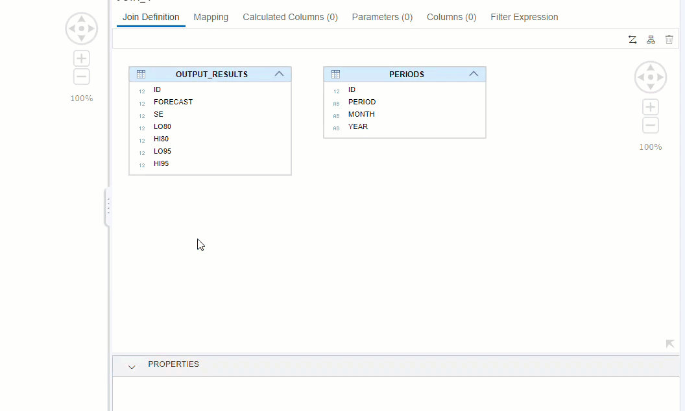

Set the join to `inner`, set the cardinality to `1..1` and click **Mapping**.


Double-click or drag the columns `PERIOD`, `FORECAST` and `HI95` to the output


[DONE]
[ACCORDION-END]

[ACCORDION-BEGIN [Step 4: ](Join data from current temperature)]

Drop a new `join` node into the canvas. Join the existing node with a new one using the connecting arrow on `Join_1`.

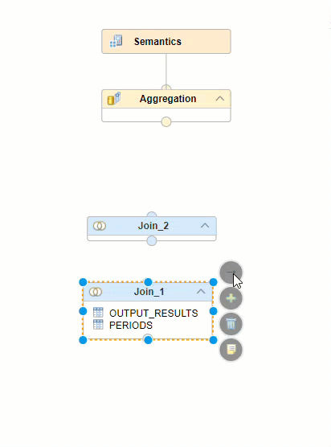

Use the **+** sign to add another data source


Add `CURRENT_TEMP`, which was imported from the local `db.zip` file

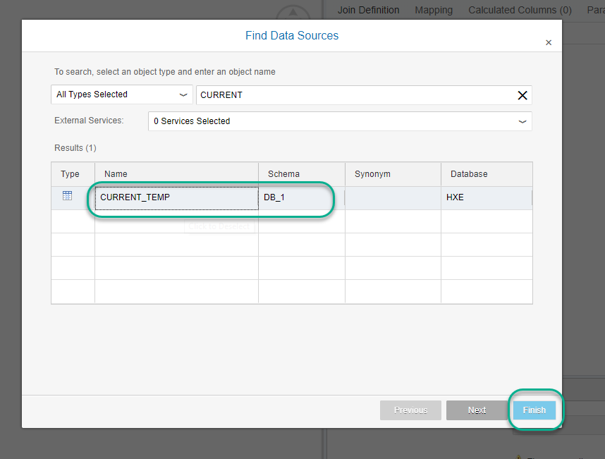

Join them by `PERIOD`

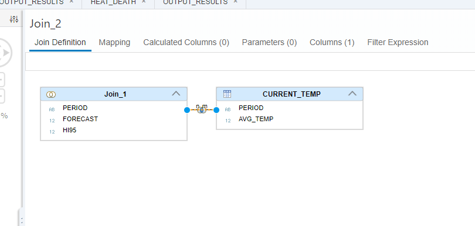

Add `AVG_TEMP`, `PERIOD`, `FORECAST` AND `HI95` to the mapping

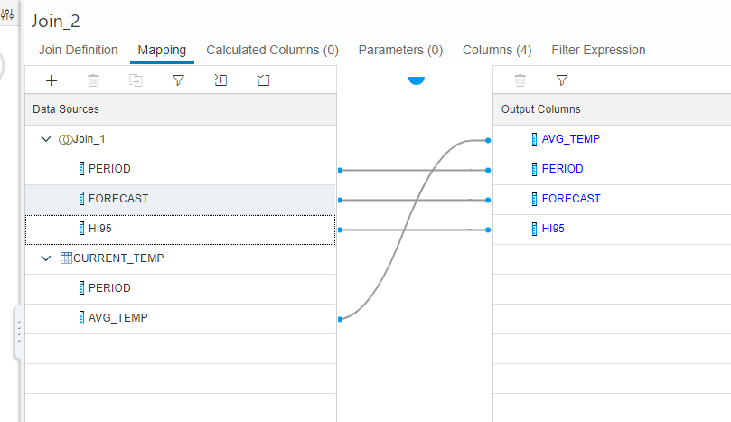

Connect the second join to the `Aggregation` node

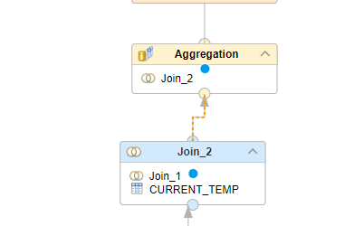

Add all of the columns to the output

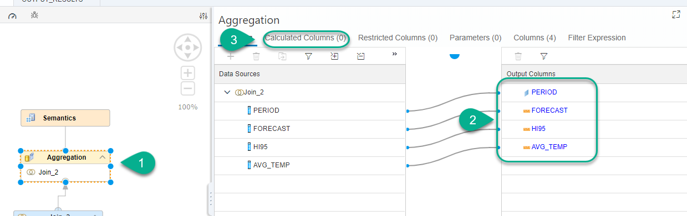

Click on **Calculated Columns** and add a calculated column

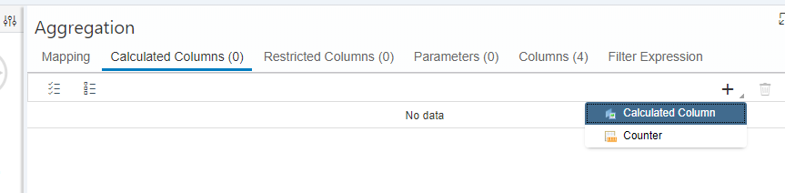

Open the editor for calculated columns

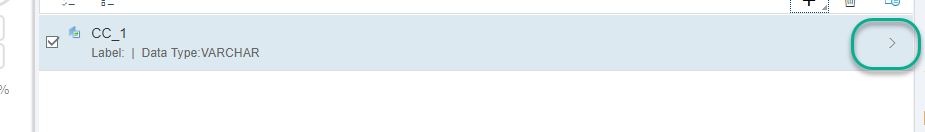

Call the column `FLAG_HEAT_DEATH`, set it to `Column engine` and add the following formula:

```text
IF("AVG_TEMP">"HI95",'Y','N')
```
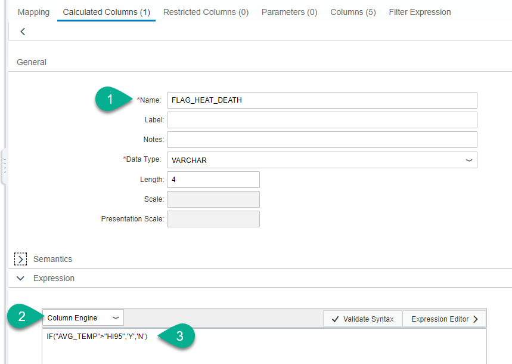

[DONE]
[ACCORDION-END]

[ACCORDION-BEGIN [Step 5: ](Save, build and preview)]

**Save** and **Build** the view

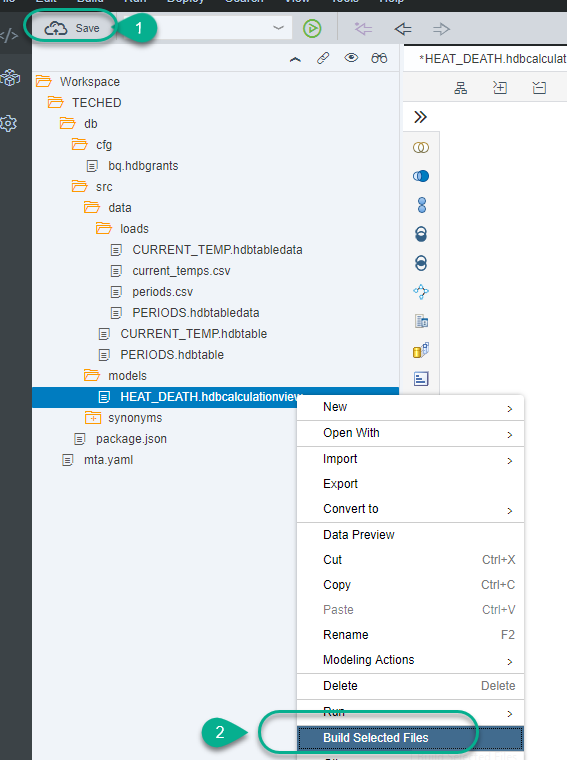

Once the build is complete, right-click on the view and use **Data Preview** to view the results

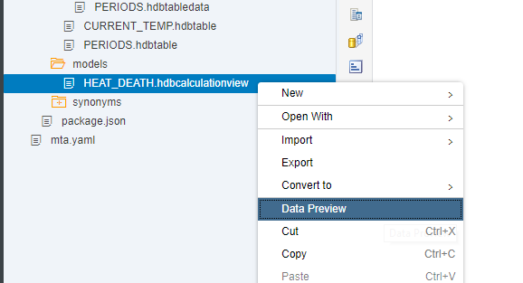

You can drag the `PERIOD` into the `Label Axis` and the `AVG_TEMP` and `FORECAST` into the `Value Axis`. A line chart will be enough to visualize this

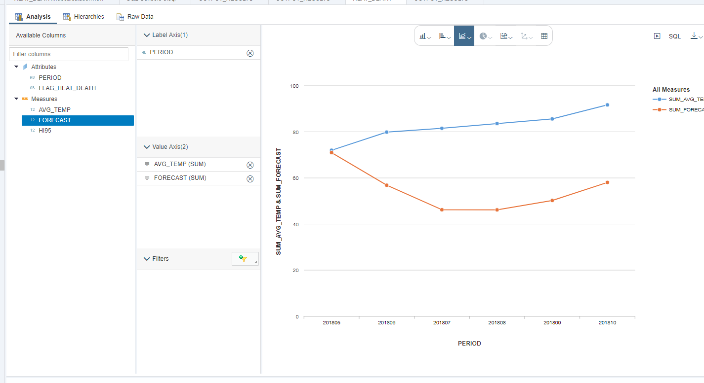

Click on **Raw Data** to complete the validation below.


[VALIDATE_1]
[ACCORDION-END]

---
