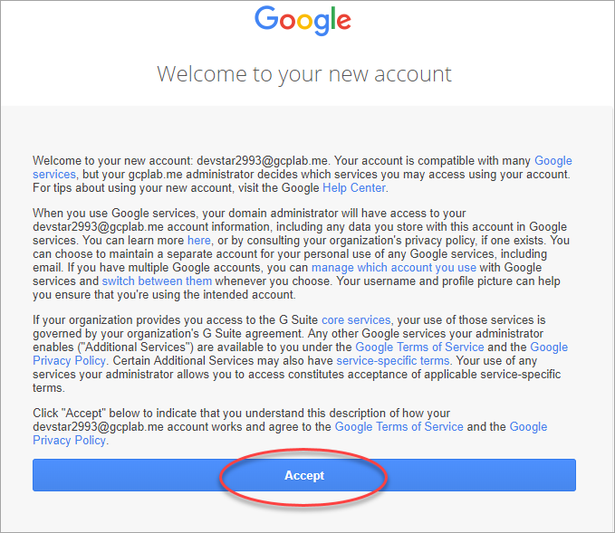
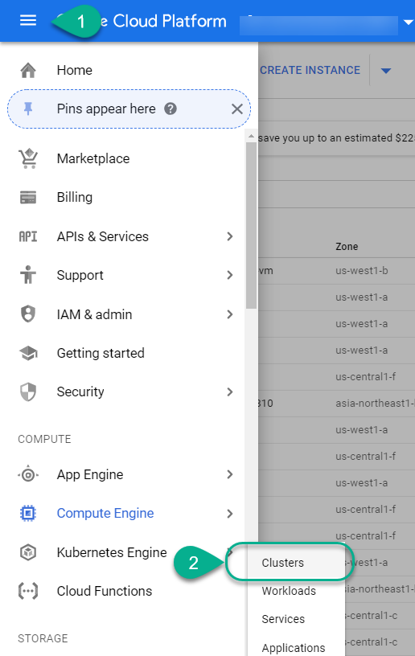

## Details
### You will learn

How to connect to the Google Cloud Platform and setup a project.

---
[ACCORDION-BEGIN [Step 1: ](Log in to the SAP Community to track completion)]

**Sign in or register** by clicking on the person icon in the top right corner. If you are registering for the first time, all you need is an email address you can validate using your mobile phone.

This will mark your progress and enable you to claim your prizes.

Use your email address

[DONE]
[ACCORDION-END]

[ACCORDION-BEGIN [Step 2: ](Log in to your Google account)]

The experts at the booth will provide you with access details. Open a new **incognito window** using Google Chrome.

And navigate to the Google Cloud launcher: `https://console.cloud.google.com/launcher`

Click **SIGN IN**.

And use the user name provided to you by the experts ...

... and the password as provided to you by the experts.

You will be presented with the terms and policies applied to the test account.

[DONE]
[ACCORDION-END]

[ACCORDION-BEGIN [Step 3: ](Configure your project)]

Click **Select a project**.

You will find a pre-created project. Select it.

[DONE]
[ACCORDION-END]

[ACCORDION-BEGIN [Step 4: ](Navigate to Google Kubernetes Engine)]

Use the menu on the left side to navigate to the Google Kubernetes Engine. Click **Clusters**

Complete the validation below and go back to the mission page to continue with step 2.

You are getting closer to your first prize!

[VALIDATE_1]
[ACCORDION-END]

---
