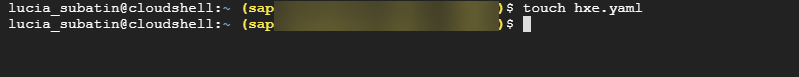
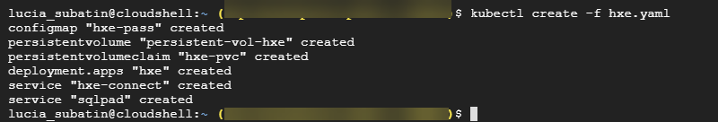
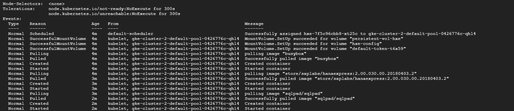

## Details
### You will learn
  - How to create a deployment file using the Google cloud console
  - How to create and deploy services, persistent volumes and containers in Google Kubernetes Engine

---

[ACCORDION-BEGIN [Step 1: ](Open the editor)]

Use the following command to create a file

```text
touch hxe.yaml
```


Use the following command to open the editor:

```text
edit hxe.yaml
```

Accept to open the editor when prompted


[DONE]
[ACCORDION-END]


[ACCORDION-BEGIN [Step 2: ](Create the deployment file)]

Copy the following text into the editor

```text

kind: ConfigMap
apiVersion: v1
metadata:
  creationTimestamp: 2018-01-18T19:14:38Z
  name: hxe-pass
data:
  password.json: |+
    {"master_password" : "HXEHana1"}
---
kind: PersistentVolume
apiVersion: v1
metadata:
  name: persistent-vol-hxe
  labels:
    type: local
spec:
  storageClassName: manual
  capacity:
    storage: 150Gi
  accessModes:
    - ReadWriteOnce
  hostPath:
    path: "/data/hxe_pv"
---
kind: PersistentVolumeClaim
apiVersion: v1
metadata:
  name: hxe-pvc
spec:
  storageClassName: manual
  accessModes:
    - ReadWriteOnce
  resources:
    requests:
      storage: 50Gi
---
apiVersion: apps/v1
kind: Deployment
metadata:
  name: hxe
  labels:
    name: hxe
spec:
  selector:
    matchLabels:
      run: hxe
      app: hxe
      role: master
      tier: backend
  replicas: 1
  template:
    metadata:
      labels:
        run: hxe
        app: hxe
        role: master
        tier: backend
    spec:
      initContainers:
        - name: install
          image: busybox
          command: [ 'sh', '-c', 'chown 12000:79 /hana/mounts' ]
          volumeMounts:
            - name: hxe-data
              mountPath: /hana/mounts
      volumes:
        - name: hxe-data
          persistentVolumeClaim:
             claimName: hxe-pvc
        - name: hxe-config
          configMap:
             name: hxe-pass
      imagePullSecrets:
      - name: docker-secret
      containers:
      - name: hxe-container
        image: "store/saplabs/hanaexpress:2.00.033.00.20180925.2"
        ports:
          - containerPort: 39013
            name: port1
          - containerPort: 39015
            name: port2
          - containerPort: 39017
            name: port3
          - containerPort: 8090
            name: port4
          - containerPort: 39041
            name: port5
          - containerPort: 59013
            name: port6
        args: [ "--agree-to-sap-license", "--dont-check-system", "--passwords-url", "file:///hana/hxeconfig/password.json" ]
        volumeMounts:
          - name: hxe-data
            mountPath: /hana/mounts
          - name: hxe-config
            mountPath: /hana/hxeconfig
      - name: sqlpad-container
        image: "sqlpad/sqlpad"
        ports:
        - containerPort: 3000

---
apiVersion: v1
kind: Service
metadata:
  name: hxe-connect
  labels:
    app: hxe
spec:
  type: LoadBalancer
  ports:
  - port: 39013
    targetPort: 39013
    name: port1
  - port: 39015
    targetPort: 39015
    name: port2
  - port: 39017
    targetPort: 39017
    name: port3
  - port: 39041
    targetPort: 39041
    name: port5
  selector:
    app: hxe
---
apiVersion: v1
kind: Service
metadata:
  name: sqlpad
  labels:
    app: hxe
spec:
  type: LoadBalancer
  ports:
  - port: 3000
    targetPort: 3000
    protocol: TCP
    name: sqlpad
  selector:
    app: hxe


```

The file will be automatically saved.


[DONE]
[ACCORDION-END]

[ACCORDION-BEGIN [Step 3: ](Deployment time!)]

Use the following command to deploy the artifacts in the `yaml` file.

```text

kubectl create -f hxe.yaml
```



[DONE]
[ACCORDION-END]

[ACCORDION-BEGIN [Step 4: ](Monitor deployment)]

Use the following command to see follow the progress of deployment of the containers

```text
kubectl describe pods
```



Paste the results of the following command in the validation below

```text
kubectl get deployments
```

[VALIDATE_1]
[ACCORDION-END]


---
