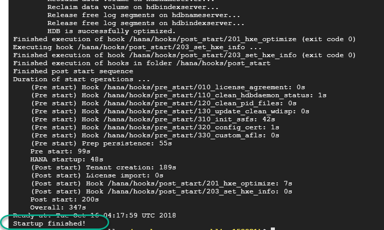
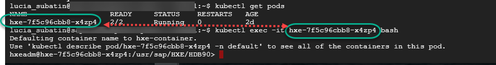
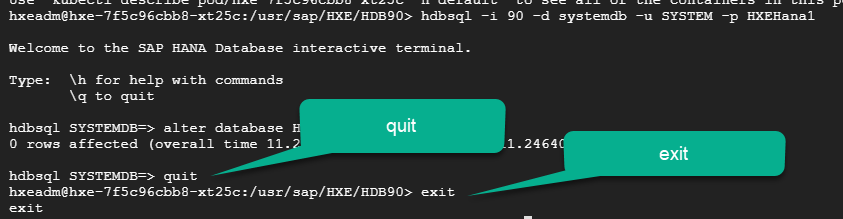

## Details
### You will learn
  - How to monitor deployment and check the logs for a container
  - How to connect to the bash console in the SAP HANA, express edition container

---

[ACCORDION-BEGIN [Step 1: ](Check the database has started)]

Use the following command to make sure the database has finished starting.

```text
kubectl logs deployment/hxe -c hxe-container
```

You should see the message **Startup finished** in the logs. If you do not see it, repeat the command in a minute or until startup has completed.



[DONE]
[ACCORDION-END]


[ACCORDION-BEGIN [Step 2: ](Connect to the container)]

Use the following command to get the name of the pod

```text
kubectl get pods
```

Use the name of the pod (starting in `hxe-`) to replace it in the command below

```text
kubectl exec -it <<pod-name>> bash
```
For example:

  

[DONE]
[ACCORDION-END]

[ACCORDION-BEGIN [Step 3: ](Connect to the SQL console)]

```SQL
hdbsql -i 90 -d systemdb -u SYSTEM -p HXEHana1
```

Paste the following command into the SQL prompt

```sql
alter database HXE add 'docstore';
```

Use `quit` to exit the SQL command line and `exit`

  

[DONE]
[ACCORDION-END]

[ACCORDION-BEGIN [Step 4: ](Connect to SQLPAD)]

Use the following command to get the services which expose your connections to the database and the SQL client

```text
kubectl get services
```

[VALIDATE_1]
[ACCORDION-END]

---
