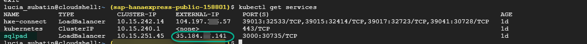
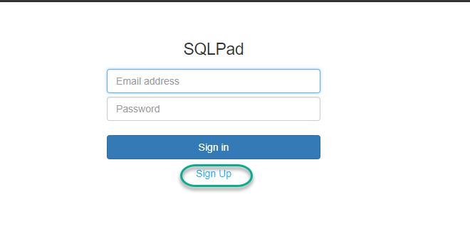
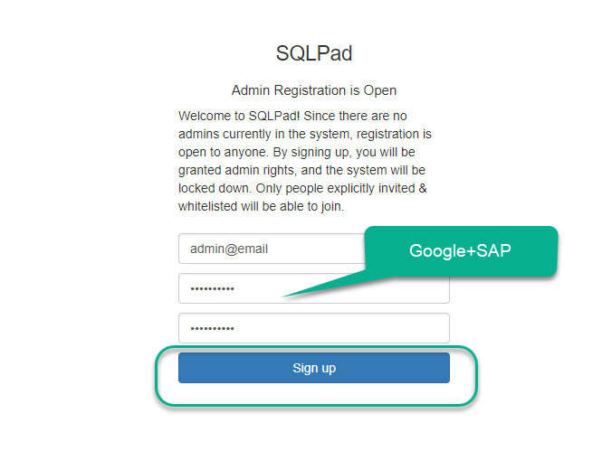
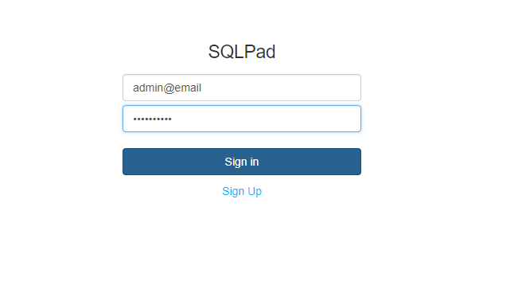
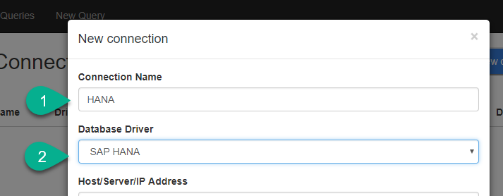

## Details
### You will learn
  - Use SQLPAD running in a container to connect to SAP HANA, express edition on another container in the same pod
  - Get information about services in Google Kubernetes Engine
  - Use text fuzzy search, document store and a geospatial query in SAP HANA, express edition

---

[ACCORDION-BEGIN [Step 1: ](Copy the external IP address)]

**Copy** the external IP address from the previous command for the service called `sqlpad`




[DONE]
[ACCORDION-END]


[ACCORDION-BEGIN [Step 2: ](Log in to SQLPAD)]

**Open a new tab**. Paste the IP address followed by port 3000


Hit **Enter** and click on **Sign up**



Use the following credentials to set up the administration access

-   Email: `admin@email`
-   Password: `Google+SAP`



Repeat the credentials to log in



[DONE]
[ACCORDION-END]

[ACCORDION-BEGIN [Step 3: ](Connect to the database)]

Click `admin -> Connections` on the right upper corner.


Click **New Connection**


Call it `HANA` and choose the SAP HANA driver



Go back to the cloud console.  **Copy the external IP address** for the service `hxe-connect`


Paste it into the `Host Server IP address` and complete the rest of the fields to access your tenant database


Click **Save**.

[DONE]
[ACCORDION-END]

[ACCORDION-BEGIN [Step 4: ](Create a collection and insert values)]

Click **New Query**. Execute the following statements one by one to create a collection and insert a set of quotes.

These quotes also have the coordinates to the closest breweries in town. You will be helping Homer find the closest brewery.

```sql
create collection quotes;

insert into quotes values ( { "FROM" : 'HOMER', "TO" : 'BART',  "QUOTE" :  'I want to share something with you: The three little sentences that will get you through life. Number 1: Cover for me. Number 2: Oh, good idea, Boss! Number 3: It wai like that when I got here.', "MOES_BAR" : 'Point(  -86.880306 36.508361 )', "QUOTE_ID" : 1  });

insert into quotes values ( { "EPISODE" : 'GRADE SCHOOL CONFIDENTIAL', "FROM" : 'HOMER',   "QUOTE" :  'Wait a minute. Bart''s teacher is named Krabappel? Oh, I''ve been calling her Crandall. Why did not anyone tell me? Ohhh, I have been making an idiot out of myself!', "QUOTE_ID" : 2, "MOES_BAR" : 'Point( 2.161018 41.392641 )' });

insert into quotes values ( { "FROM" : 'HOMER',   "QUOTE" :  'Oh no! What have I done? I smashed open my little boy''s piggy bank, and for what? A few measly cents, not even enough to buy one beer. Weit a minute, lemme count and make sure…not even close.', "MOES_BAR" : 'Point( -122.400690 37.784366 )', "QUOTE_ID" : 3 });
```

> ##Note: You can select each sentence to execute them one-by-one.

Take a look at the SQL statements you have just executed. You have created a JSON collection also known as document store or `NoSQL`. Unlike tables, these are key-value pairs. These are not tables and do not have columns, however, SAP HANA allows you to execute SQL statements to query the document store.

[DONE]
[ACCORDION-END]

[ACCORDION-BEGIN [Step 5: ](Move values from document store to columnar store)]

Use the following SQL statement to move the data from the document store onto a newly-created columnar table.

```sql
--Create a columnar table with a text fuzzy search index
create column table quote_analysis
(
	id integer,
	homer_quote text FAST PREPROCESS ON FUZZY SEARCH INDEX ON,
	lon_lat nvarchar(200)

);


-- Copy the quotes form the JSON store to the relational table
insert into quote_analysis
with doc_store as (select quote_id, quote from quotes)
select doc_store.quote_id as id, doc_store.quote as homer_quote, 'Point( 2.151255 41.354159 )'
from doc_store;
```


[DONE]
[ACCORDION-END]

[ACCORDION-BEGIN [Step 6: ](Don't keep Homer waiting)]

The original quotes in the document store contained typos. These typos were all related to the word `wait`. Use fuzzy search to find the highest similarity score to the word `wait`. That same result will also have the closest brewery in town.

```sql
select  id, score() as similarity , lon_lat, TO_VARCHAR(HOMER_QUOTE)
from quote_analysis
where contains(HOMER_QUOTE, 'wait', fuzzy(0.5,'textsearch=compare'))
order by similarity desc
```

Take a note of the value in **ID** for the first result, that is, the result with the highest similarity score.

[DONE]
[ACCORDION-END]

[ACCORDION-BEGIN [Step 7: ](How far does Homer have to go?)]

Assuming Homer is at the Google + SAP booth at SAP TechEd in Barcelona, ask SAP HANA how far away he is from some beer and tapas.

Use the ID returned in the previous query to replace in the placeholder below.

```sql
with doc_store as (select quote_id, moes_bar from quotes)
select st_geomFromText( quote_analysis.lon_lat, 4326).st_distance(st_geomFromtext( doc_store.moes_bar, 4326), 'meter') / 1000 as DISTANCE_KM
from doc_store
inner join quote_analysis on doc_store.quote_id = <<Fill in with the ID of the lowest similarity score>>;
```


[VALIDATE_1]
[ACCORDION-END]

---
