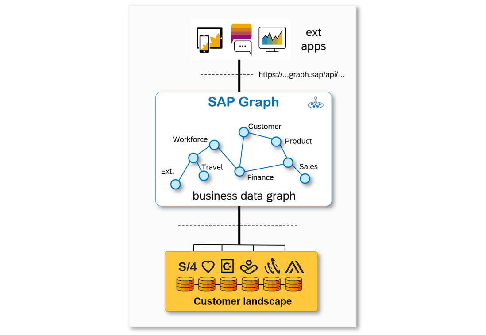
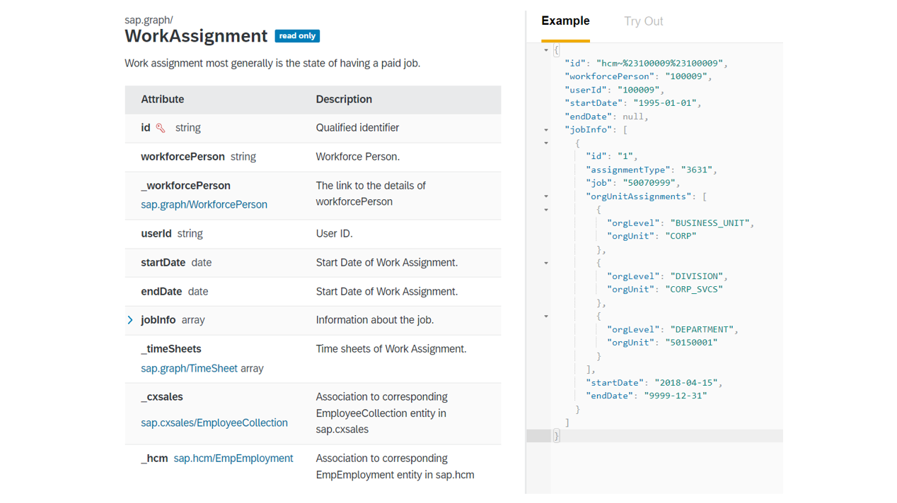
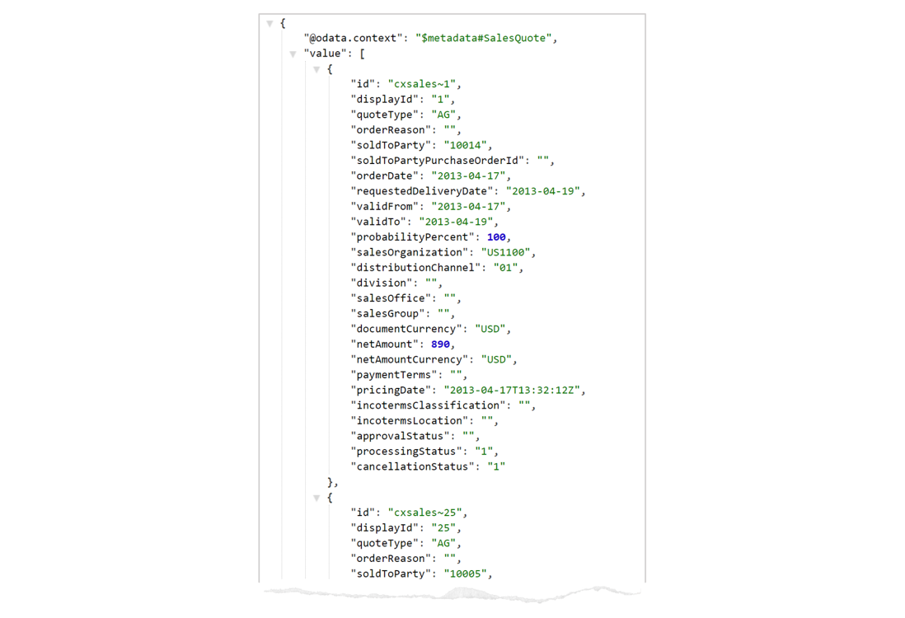

## Details
### You will learn
  - What SAP Graph entails
  - How to navigate connected data entities in the SAP Graph Navigator
  - `hello world` programming essentials to try out SAP Graph

  SAP Graph is a new unified API for SAP. It addresses run-away API complexity and integration challenges by providing developers a single connected and unified view of all their business data, consolidating the data models of data sources like SAP S/4HANA, SAP Sales Cloud and SAP SuccessFactors into one, unified and connected, data model, representing all the data in a landscape. We call this the Business Data Graph.

  !

  A data graph is a connected graph, with data entities serving as the nodes of the graph and edges that represent relationships (which we call associations) between those entities. The nodes of the Business Data Graph are the common enterprise business objects, like Customer, Supplier, Product, Sales and Purchase Order, General Ledger, etc.

SAP Graph was productively released for early adopters in December of 2021. We offer dedicated support for early adopters of this innovative solution. [Sign up to be an early adopter] (https://influence.sap.com/sap/ino/#campaign/2940) of SAP Graph or contact us at sap.graph@sap.com if you are interested.

---

[ACCORDION-BEGIN [Step 1: ](Explore SAP Graph on the SAP Graph Navigator)]

The SAP Graph API is documented in the new [SAP Graph Navigator](https://navigator.graph.sap/entities). Go ahead and follow the link to the SAP Graph Navigator application to explore the API. The index, on the left of the application, shows you over 1,500 entities grouped by data source. The first group of entities are the unified entities. Here is an example of a unified entity, `sap.graph/WorkAssignment`.

!

In this tutorial, you will create a small application that fetches the unified entity `SalesQuote`. Use the SAP Graph Navigator to look up the definition, and corresponding attributes for `SalesQuote`.

[DONE]

[ACCORDION-END]

[ACCORDION-BEGIN [Step 2: ](Prepare the Node Development Environment)]

We will use **Node.js** and **npm** to build this application, and to keep it extremely simple, we will use the **Express** web framework. Not familiar with Node.js and Express? We recommend this article: <https://developer.mozilla.org/en-US/docs/Learn/Server-side/Express_Nodejs/Introduction>. That article also explains how to easily set up a Node development environment, whether you use Windows, MacOS or Linux.

If you prefer to develop in the cloud without installing anything on your computer, SAP offers a great cloud-based development experience alternative in the form of the SAP Business Application Studio. Follow [this tutorial](appstudio-onboarding) for more details on getting your own instance. The rest of this tutorial assumes that you installed Node.js and npm on your computer.

[DONE]

[ACCORDION-END]


[ACCORDION-BEGIN [Step 3: ](Prepare package.json)]

Select a folder (directory) where you want to develop your application. In this folder, you will create a small file called `package.json`, with the following content:

```
{
    "name": "hello-graph",
    "version": "0.0.0",
    "private": true,
    "dependencies": {
        "express": "4.17.1",
        "node-fetch": "2.6.1",
        "universal-cookie": "4.0.4"
    }
}
```
After saving the file, run the following command on your console:

```
 npm install
```
If your node.js environment was properly set up, then this command will install a few standard library packages in a new sub-folder called `node_modules`.

Now, create another sub-folder, next to `node_modules`, called `src`. This is where we will develop our code.

[DONE]
[ACCORDION-END]

[ACCORDION-BEGIN [Step 4: ](Prepare graph.js)]

First, we will create a boilerplate file in the `src` folder, called `graph.js`. This file will contain a class called `Graph`, which provides a nice wrapper for using SAP Graph. At this time, we will show how to read data, via a `get()` function.

Paste the following code into the file and save it. As you can see, it is very simple, and takes advantage of the node-fetch package.

```
const fetch = require("node-fetch");
class Graph {
    async get(req, entity, params) {
        const url = `https://sandbox.api.sap.com/sapgraph/${entity}${params ? `?${params}` : ""}`;
        console.log(url) //for debugging
        const options = {
            method: "get",
            headers:{
                "Accept": "application/json",
                "apiKey": "your APIkey"
            }
        };
        const response = await fetch(url, options);
        console.log(`${response.status} (${response.statusText})`) // for debugging
        const json = await response.json();
        return json;
    }
}

module.exports = Graph;

```
Note that we hard-coded the SAP Graph server that uses SAP API Business Hub sandbox. This allows us to focus here on the data access API, without requiring you to first configure your own SAP Graph business data graph and deal with all the complex aspects of security and authentication, which will be the subject of future tutorial parts.

Since we are accessing the sandbox landscape data via SAP API Business Hub, you will need to insert your API Key (a short string) into the code above. Where do you get this key? Go and login to <https://api.sap.com/settings> and click on **Show API Key** to see and save it.

[DONE]
[ACCORDION-END]

[ACCORDION-BEGIN [Step 5: ](Write a Simple Application)]

Now we are ready to write our first, simple server-side application that uses SAP Graph. Paste the following into a new file, called `hellograph.js`, in the `src` folder:

```
const express = require("express");
const app = express();
const Graph = require("./graph");
const port = 3004;

const graph = new Graph();

app.get('/sap*', async (req, res) => {
    const response = await graph.get(req, `${req.url}`, "");
    res.send(`<pre><code>${JSON.stringify(response, null, 2)}</code></pre>`);
});

app.listen(port, () => { console.log(`Explore SAP Graph at http://localhost:${port}`) });

```
As mentioned, our code uses a popular Node.js package called **Express**. On line 8, we define the action taken when our server-side app is called from a browser. Here, we simply take the URL that we received (`req.url`), and pass it through, as-is, to SAP Graph. We then show the returned data from SAP Graph as a raw result in the browser screen.

Our server-side app is ready. To run it, use your terminal console to enter:

```
node hellograph.js
```
The console will show:

> _Explore SAP Graph at <http://localhost:3004>_

Now the fun begins. The application expects a well-formed query URL to function properly. Open a browser window or tab, and enter the following query URL:

```
http://localhost:3004/sap.graph/SalesQuote?$top=2
```
The browser will invoke your application code, which will call SAP Graph to fetch the data, and if all went well, you will see the following output on your screen:

!

This output should look very similar to what you saw in the SAP Graph Navigator for the `SalesQuote` entity in Step 1.

[DONE]
[ACCORDION-END]

[ACCORDION-BEGIN [Step 6: ](Use SAP Graph Securely with Real Data and Authentication)]

Congratulations, you've made it to the end of this tutorial! You now know how to navigate the connected data entities using SAP Graph Navigator, you've set up a lightweight development environment to test out SAP Graph, and you've verified that you can query unified entities. Continue on with Part 3 of the tutorial series on [blogs.sap.com](https://blogs.sap.com/2021/06/25/part-3-use-sap-graph-securely-with-real-data-authentication/) where you can use SAP Graph securely and with real data.

[VALIDATE_1]

[ACCORDION-END]

---
