## Prerequisites
 - This tutorial is designed for SAP HANA service for SAP Business Technology Platform. Consider newer tutorials designed for SAP HANA Cloud.
 - You have access to the database and SAP BTP cockpit.
 - You have created a multi-target application with a database module [as explained in this tutorial](haas-dm-create-db-mta).
 - Optionally, you have created a remote source [as explained in this tutorial](haas-dm-connect-sdi).

>**This tutorial cannot be completed with a trial account.**

## Details
### You will learn
  - How to create a plain schema, with a table and user to simulate a replicated schema
  - How to create a user-provided service to access a database in SAP HANA service for SAP BTP
  - How to grant permissions to the technical users in your HDI container to access the database

This tutorial is meant to be an example of cross-container access. Simple data models and loading mechanisms were chosen to simulate a schema replicated using tools such as SAP Landscape Transformation or an ABAP schema.

For more information on this process and additional syntax options, refer to the [official documentation on SAP Help](https://help.sap.com/viewer/4505d0bdaf4948449b7f7379d24d0f0d/latest/en-US/a260b05631a24a759bba932aa6d81b64.html).

If you are looking for the steps for an on-premise SAP HANA instance with XS Advanced, such as SAP HANA, express edition, [refer to this tutorial](xsa-create-user-provided-anonymous-service).

---

[ACCORDION-BEGIN [Step 1: ](Create a plain schema)]

Connect to SAP Web IDE Full Stack and enter the Database Explorer. You will see your instance of the SAP HANA database.

> If you cannot see the database, try entering the database explorer from the Database Cockpit and make sure the setting in `Preferences->Database Explorer` are set to the correct region.

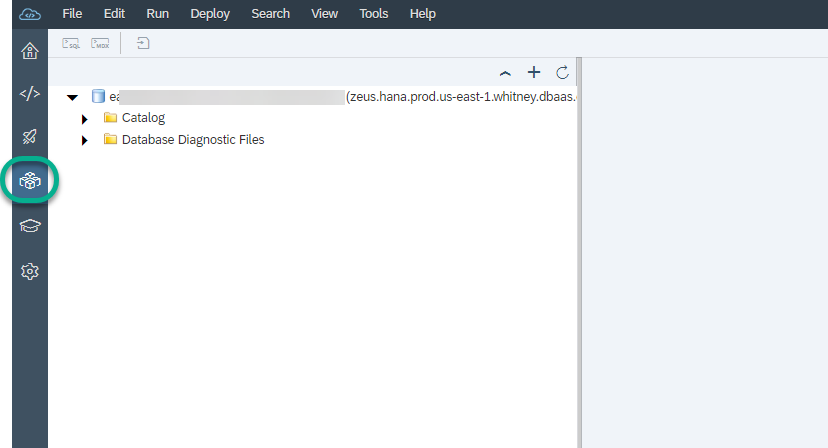

Use the following code to create a schema and a user. You will also create a simple table to use as an example for cross-container access.

You will create a SQL role and assign it to the user `PLUSR` with the permissions granted manually before. This user will be used for the connection between the HDI container and the plain schema, and will grant the role to the HDI container technical user.

```sql
CREATE SCHEMA "PLAIN";
CREATE USER PLUSR PASSWORD "HanaRocks01" NO FORCE_FIRST_PASSWORD_CHANGE ;

CREATE ROW TABLE "PLAIN"."REGIONS" (	REGION NVARCHAR(5), 	DESCRIPTION NVARCHAR(100) );

CREATE ROLE CCROLE;
grant  SELECT, UPDATE, INSERT, DELETE, EXECUTE, SELECT METADATA ON SCHEMA "PLAIN" TO CCROLE with grant option;
grant  CCROLE to PLUSR with admin option;

```

Use the green play button or press **`F8`** to execute the statement.

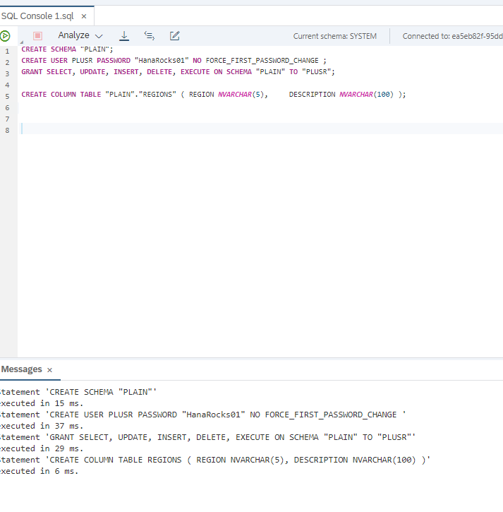

> ## What is going on?
>
>&nbsp;
> You have created a plain schema in your SAP HANA database. When you [created a database module in SAP Web IDE](haas-dm-create-db-mta), an HDI container was automatically generated.
>&nbsp;
>
> 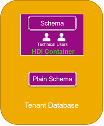
>
>&nbsp;
>
> You can see the SAP HANA service (a database instance, from which you access to the Database Cockpit) of service type `hana-db` and the HDI container of service type `hana` and plan `hdi-shared` listed in the service marketplace
>&nbsp;
> 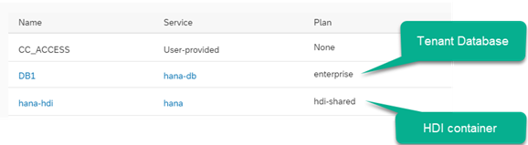
>&nbsp;
> You can also see both connections in the Database Explorer
>&nbsp;
> 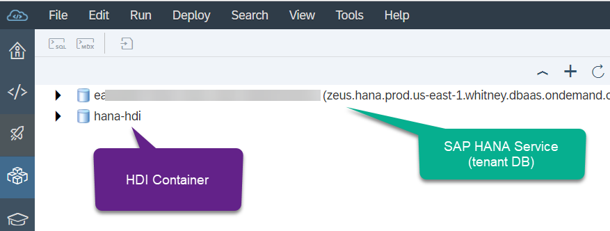

[DONE]
[ACCORDION-END]

[ACCORDION-BEGIN [Step 2: ](Load data)]

Download [this CSV file](https://raw.githubusercontent.com/SAPDocuments/Tutorials/master/tutorials/haas-dm-access-cross-container-schema/plain.csv) into your local computer.

Use the search help to locate schema `PLAIN`.

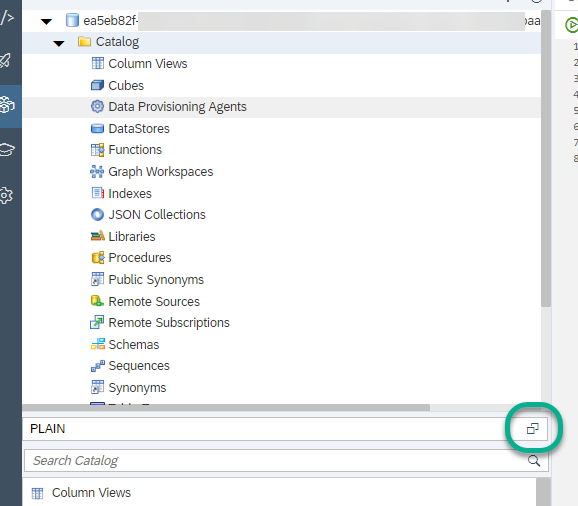

Click on **Tables**. Right-click on the `REGIONS` table and select **Import Data**

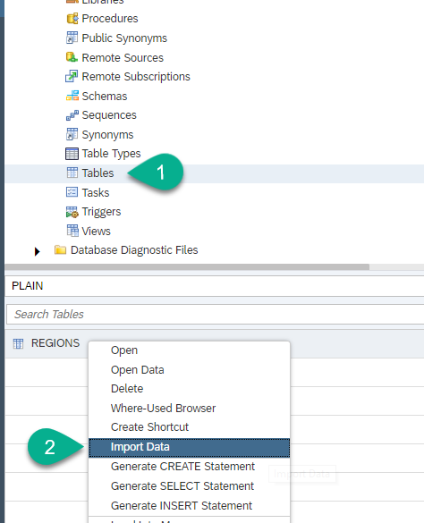

**Browse** for the file you have just downloaded. Keep `PLAIN` and `REGIONS` as the target and click **Step 2**

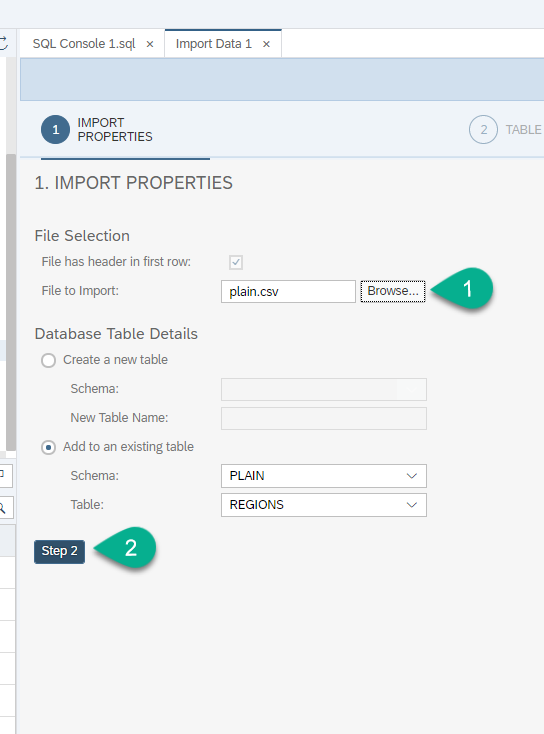

Keep the default table mapping and click **Step 3**

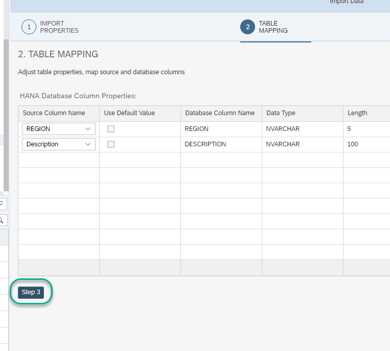

Click **Show Import Summary**

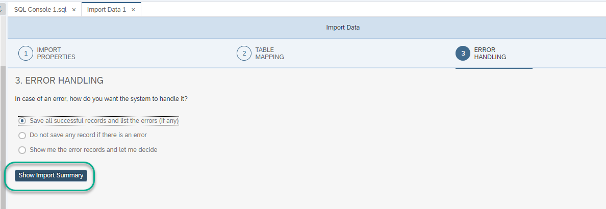

Use **Import Into Database** to load the records

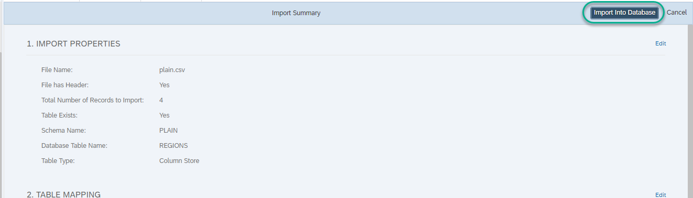

You should see the wizard has imported 4 records

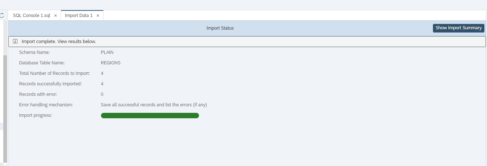

Right-click on the table and choose **Open Data** to see the records loaded into the table.

[DONE]
[ACCORDION-END]


[ACCORDION-BEGIN [Step 3: ](Create a user-provided service)]

You now have a schema with a table and data in it. You have also created a user called `PLUSR` with permissions to perform basic operations on that schema. You will now create a user-provided service to access the schema through the user `PLUSR` from your Multi-Target Application.

Use  **`Tools -> SAP Cloud Platform Cockpit`**  to open the cockpit.

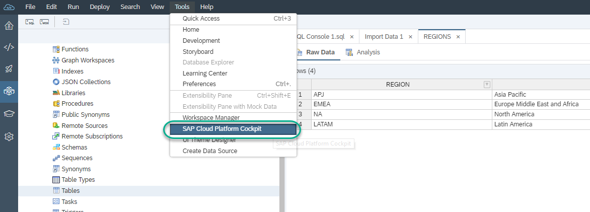

Navigate to your Cloud Foundry account by going back to the Home

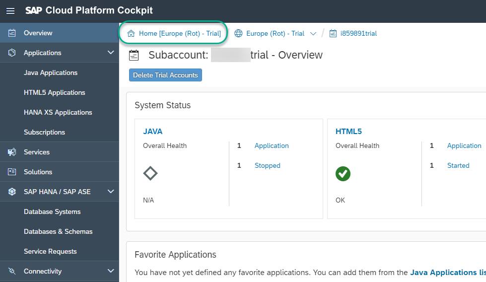

Enter the Cloud Foundry subaccount and into the space in which you are deploying the application. Click **User Provided Services** and **New Instance**

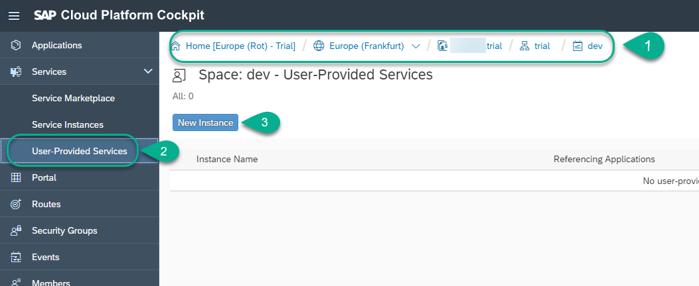

Call the service **`CC_ACCESS`** and use the code below in **Credentials**

```ssh
{
	"user": "PLUSR",
	"password": "HanaRocks01",
	"schema": "PLAIN",
	"tags": "[ \"hana\" ]"
}

```

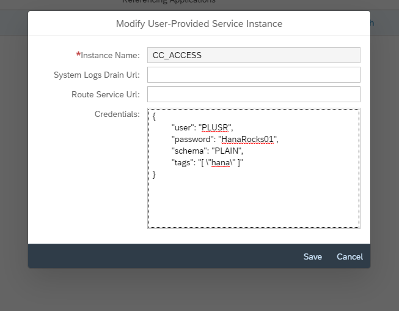

> You can use the Command Line Interface instead of the graphical tools. The sample command for this to prompt for each of the values would be:
> ```ssh
> cf cups CC_ACCESS -p  "user","password","tags","schema"
> ```

Press **Save**.

[DONE]
[ACCORDION-END]

[ACCORDION-BEGIN [Step 4: ](Configure the service for access)]

You will now add the user-provided service as a dependency and configure it as part of a database module. You will also set the original HDI container as the default service for database artifacts.

Go back into SAP Web IDE Full-Stack. Open the file `mta.yaml` in the **MTA Editor** and use the **+** sign to add a resource.

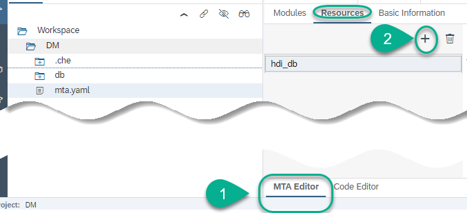

Call the service `external_access` of type `org.cloudfoundry.existing-service`.

Use the following key value pair under **parameters**.

| key | Value |
|:------|:---------|
| `service-name` | `CC_ACCESS` |

Use the following key value pair as **properties**.

| key | Value |
|:------|:---------|
| `ups-service-name` | `${service-name}` |

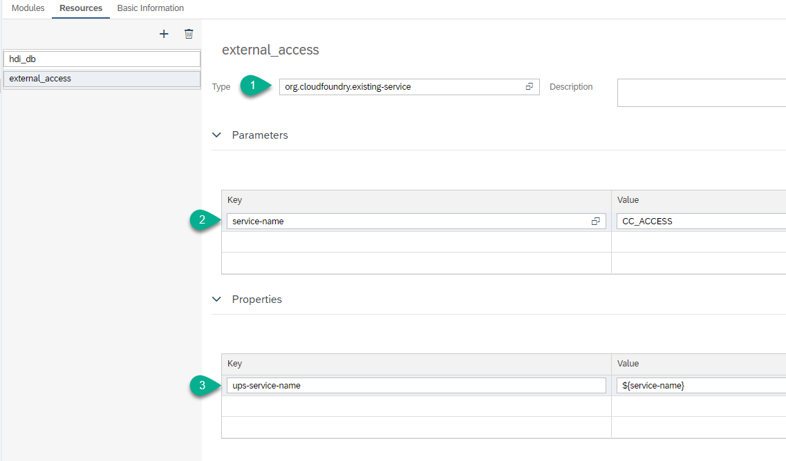

**Save the file.**

Click on the **Modules** tab and add `external_access` in the **`Requires`**  section.

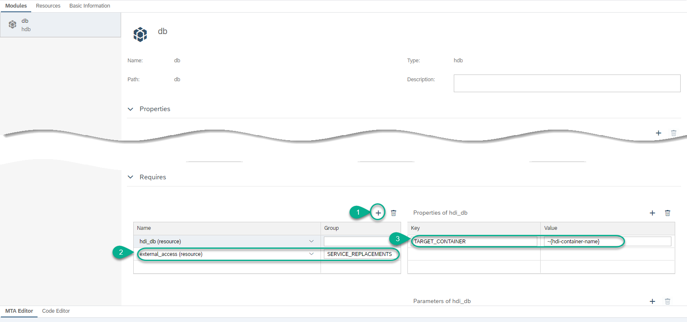

 Use `SERVICE-REPLACEMENTS` as the value for **Groups**.

| Name | Group |
|:------|:---------|
| `external_access` | `SERVICE-REPLACEMENTS` |

Use the following key-value pair as the properties of `external_access`

| key | Value |
|:------|:---------|
| `key` | `external_access` |
| `service` | `~{ups-service-name}` |

Click on `hdi_db` and set the following key-value pair as properties

| key | Value |
|:------|:---------|
| `TARGET_CONTAINER` | `~{hdi-container-name}` |

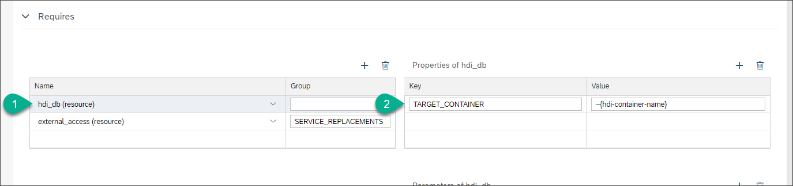

Click **Save**

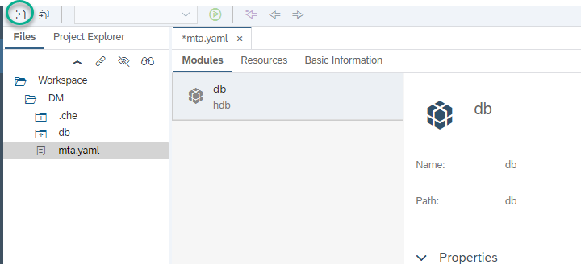

If you switch to the **Code Editor** for the `mta.yaml` file, it should look similar to this:

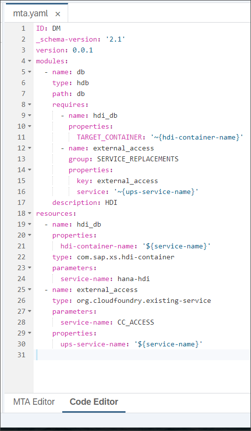

[DONE]
[ACCORDION-END]

[ACCORDION-BEGIN [Step 5: ](Grant permissions to the technical users)]

You will now create an artifact that grants access to the two technical users of your HDI container. These are not real users, but technical ones.

Create a new file under `db`.

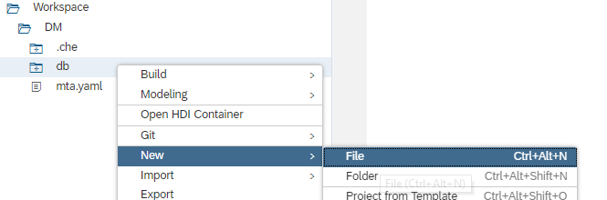

Call it `cfg/plain.hdbgrants`

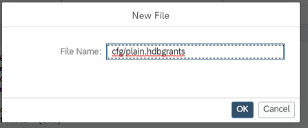

And use the following code in it:

```json

{
  "CC_ACCESS": {
    "object_owner" : {
      "roles" : ["CCROLE" ]
    },
    "application_user" : {
      "roles" : ["CCROLE" ]
    }
  }
}

```

**Save the file**.


[DONE]
[ACCORDION-END]

[ACCORDION-BEGIN [Step 6: ](OPTIONAL -  Grant access to a remote source)]

**This step works only if** you have created a remote source to access a text file [using SAP HANA service smart data integration for SAP BTP in this tutorial](haas-dm-connect-sdi), go back to the Database Explorer and open a new SQL console to your instance of SAP HANA service for SAP BTP.

Execute the following SQL command

```sql

grant "CREATE VIRTUAL TABLE", "DROP", "CREATE REMOTE SUBSCRIPTION", "PROCESS REMOTE SUBSCRIPTION EXCEPTION"  on remote source "LocalFile" to CCROLE with grant option;
```

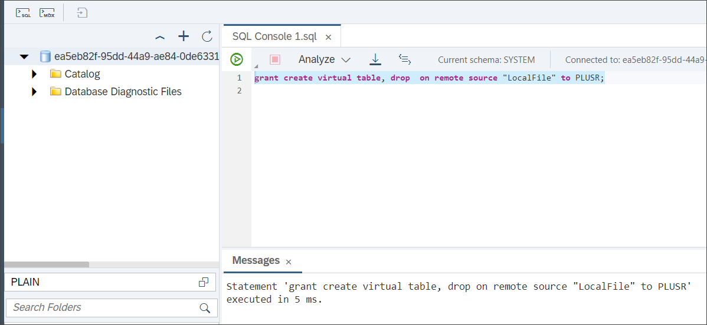


> Alternatively, you can grant the same permissions to the user in the user-provided service, `PLUSR`, and create a separate grants file with them or a new role.
> Here is an example for that `.hdbgrants` file
>
> ```json
{
  "CC_ACCESS": {
    "object_owner" : {
      "global_object_privileges" : [
        {
          "name" : "LocalFile",
          "type" : "REMOTE SOURCE",
          "privileges" : [ "CREATE VIRTUAL TABLE", "DROP", "CREATE REMOTE SUBSCRIPTION", "PROCESS REMOTE SUBSCRITPION EXCEPTION" ]
        }
      ]
    }
  }
}

>```

**Save** the files. **Build** the database module.

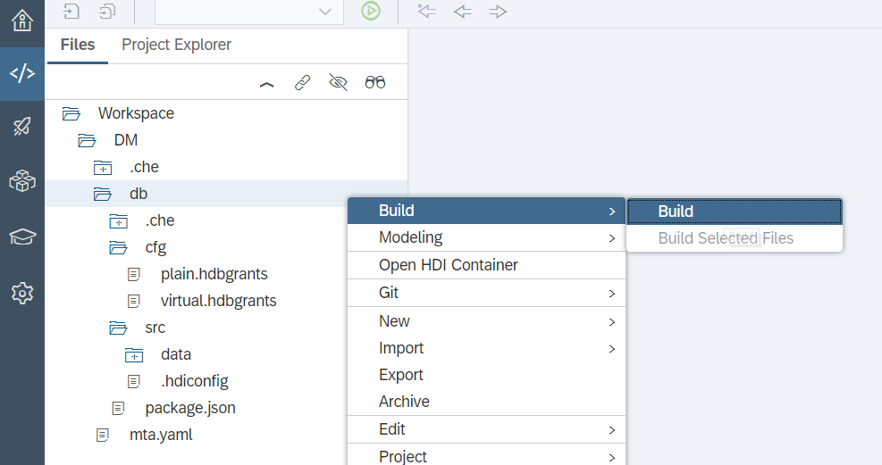


[DONE]
[ACCORDION-END]

[ACCORDION-BEGIN [Step 7: ](Create synonyms)]

You can now create a synonym to access the table in the plain schema. Create a new file in `db\src\data`

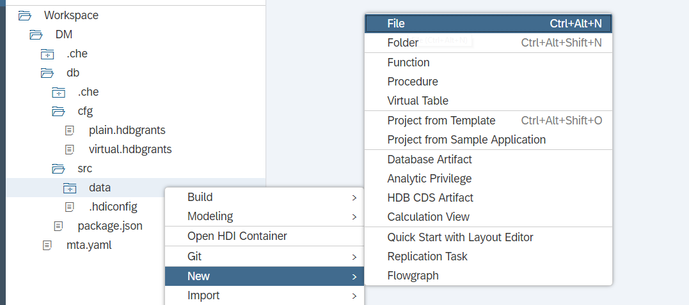

Call it `regions.hdbsynonym`.

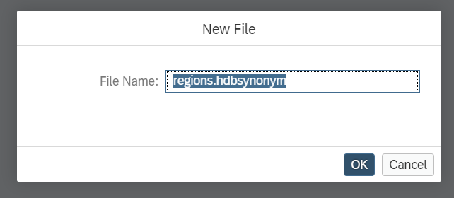

Add a new record with name `REGIONS`, object name `REGIONS` and schema `PLAIN`

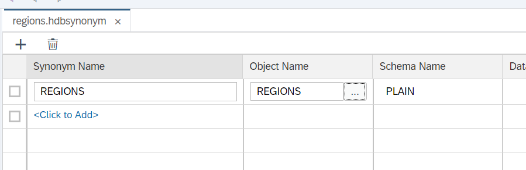

> Alternatively, you can use the value help under `Object name`...
>&nbsp;
> 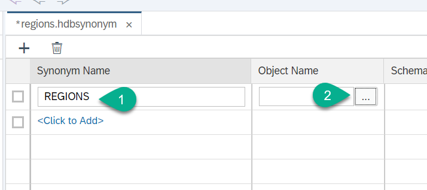
>
> ...and check `CC_ACCESS` in the drop-down menu for external services.
>
> 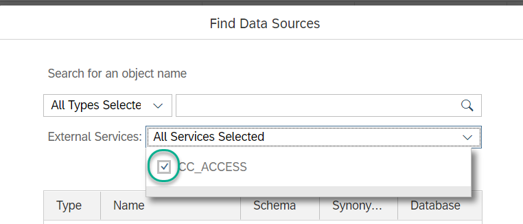

**Build** the synonym.

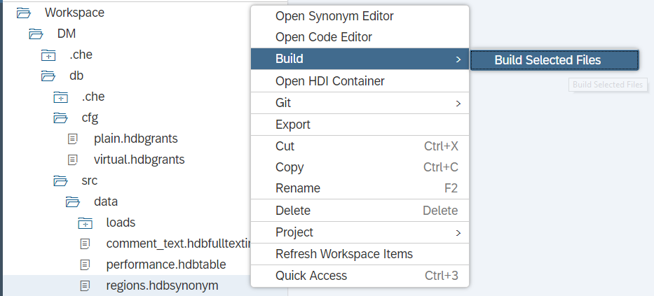

[DONE]
[ACCORDION-END]

[ACCORDION-BEGIN [Step 8: ](Create a view)]

You can now use the table in the classic schema with other objects created in your HDI container.  In `data`, create a new database artifact

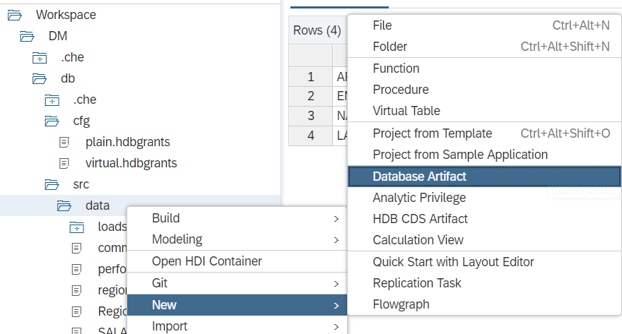

Choose `hdbview` and call it `RegiontextsView`

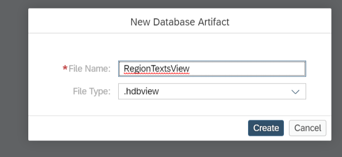

Paste the following code into the view.

```sql
VIEW "RegionTextsView"
	("REGION", "DESCRIPTION" )
	as select "REGIONS"."REGION",
		"REGIONS"."DESCRIPTION"
	from "REGIONS"

```

**Build and save**.

Right-click on the view and choose **Open HDI Container**.

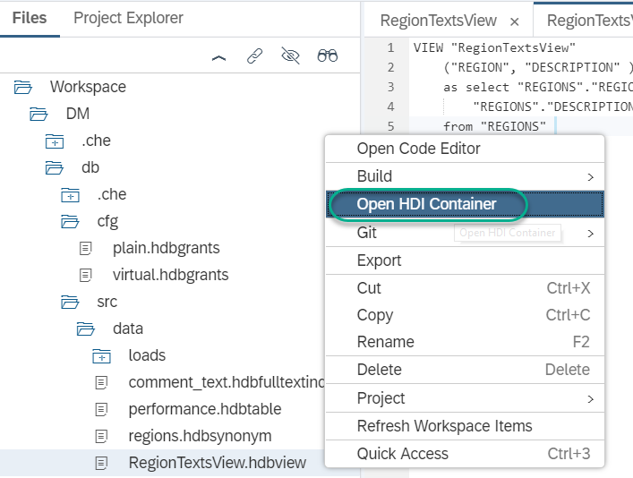

Right-click on the view and choose **Open Data**. Paste the generated SQL statement in the box below to complete the validation.


[VALIDATE_1]
[ACCORDION-END]

[ACCORDION-BEGIN [Step 9: ](Troubleshooting insufficient privileges)]

**Error**: Insufficient privilege: Detailed info for this error can be found with `guid` <GUID>

You can see what is missing by executing the following statement in a SQL console connected to the database

```sql
 call SYS.GET_INSUFFICIENT_PRIVILEGE_ERROR_DETAILS ('<GUID>', ?)
```

This procedure will show the session user name, the technical user (HDI object owner) executing the statement, the privilege (e.g., `SELECT`) and some flags starting with `IS_MISSING`. A `TRUE` value under one of those flags indicates missing authorizations.

Make sure the user in the user provided service has permissions for `SELECT` and `SELECT METADATA` with grant option.


[DONE]
[ACCORDION-END]

---
