## Prerequisites
 - You have created the [prerequisite calculation views](haas-dm-create-cube-calculation-view)
 - You have deployed the SAP HANA Analytics Adapter [to consume Calculation Views from SAP Analytics Cloud](https://blogs.sap.com/2019/04/24/connecting-the-sap-hana-service-on-cloud-foundry-to-sap-analytics-cloud-the-lazy-approach-pt1/)

## Details
### You will learn
  - How to build a HR dashboard using live data from Calculation Views in SAP Cloud Platform, SAP HANA Service
  - How to create each metric displayed in the dashboard
  - General styling tips and tricks

The HR Employee Dashboard displays insightful metrics and charts corresponding to employee data which can be leveraged by HR for reporting needs and to pinpoint where there is room for improvement in an organization.

The left-side panel of the HR Employee Dashboard contains 6 metrics: Headcount, Employees Hired in CY, Total Salary, Average Salary, Average Satisfaction Index and Average Evaluation Rating.

You will learn how to create some of these metrics to replicate this dashboard.

---

[ACCORDION-BEGIN [Step 1: ](Indicator: Headcount Metric)]

The `Headcount` metric displays the number of employees in the organization.

Click on the **Insert Chart** icon found on the ribbon at the top of the page.

The below tile will appear on your canvas. You can drag and drop this tile anywhere on your canvas.

There is an field `ID` in the sample data that you are using to build this dashboard. You can count the number of unique records in the data to determine the headcount. In order to do this, you will create a calculation.

In the Builder panel on the right-side of the screen, click on **+ Add Measure**.

Choose the **+ Create Calculation** option.

In the dropdown menu in the Calculation Editor, choose the **Aggregation** option.

In the **Name** field, type in 'Headcount'. Select COUNT DIMENSIONS for the **Operation** field and select ID for the **Aggregation Dimensions** field. Press **OK**.

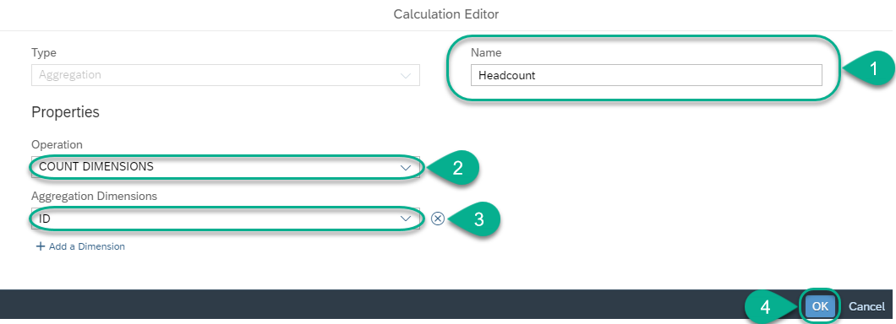

Change the chart structure from a bar/column graph to a numeric point.

Click on the three dots of your newly created Headcount measure and select the **Format** option.

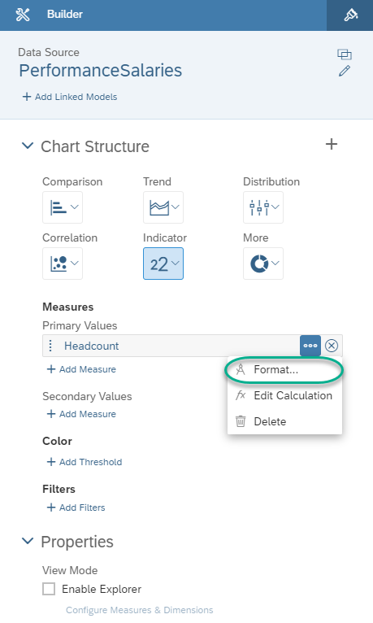

Change the number of decimal places to 0 and then press **OK**.

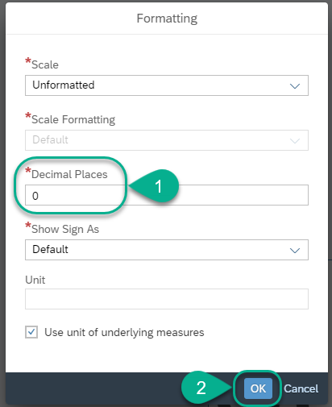

You can change the styling of this chart by clicking on the three dots that appear when the chart is selected. Click on the **Show/Hide** option to determine whether you want to show or hide the chart details, subtitle, primary value labels, etc.

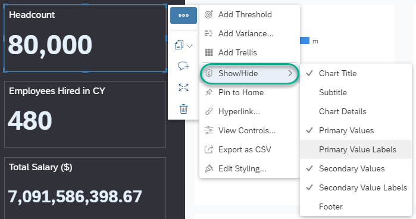

Click on the **Edit Styling** option to change the styling of the chart such as the background color, font size, font color, etc.

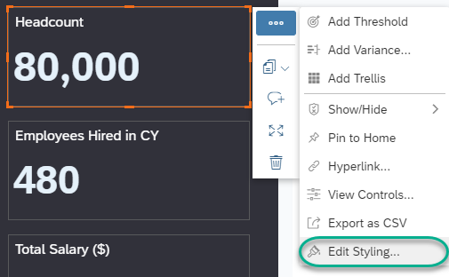

In this dashboard, all of the metrics in the left panel have a light blue font color for the primary value text (which is the value of the metric, in this case 80,000) and have a white font color for the name of the metric (in this example, the name of the metric is Headcount).

[DONE]
[ACCORDION-END]

[ACCORDION-BEGIN [Step 2: ](Indicator: Employees Hired in current year)]

The `Employees Hired in CY` metric displays the number of employees the organization has hired in the current year.

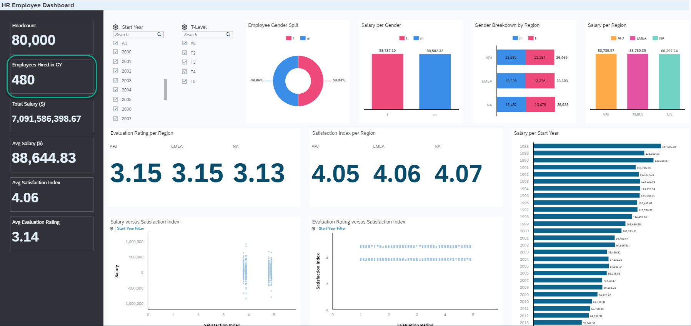

Click on the **Insert Chart** icon found on the ribbon at the top of the page.

The below tile will appear on your canvas. You can drag and drop this tile anywhere on your canvas.

In order to display the number of employees hired in the current year, we will need to use the Headcount measure created in the previous step and apply a current year filter to it.

First, click on **+ Add Measure** and select the Headcount measure.

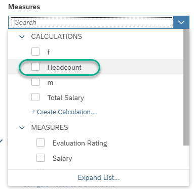

Next, click on **+ Add Filters**.

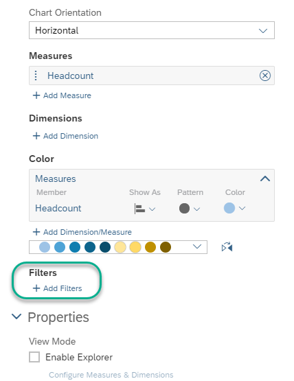

Choose the **Start Year (Member)** option.

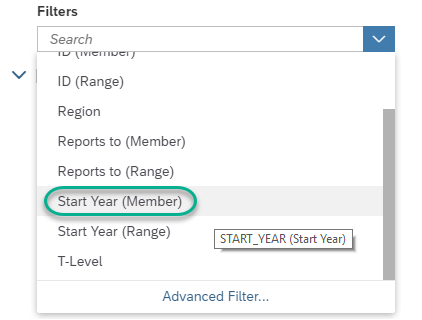

Select the current year in the **Set Filters for Start Year** window. Press **OK**.

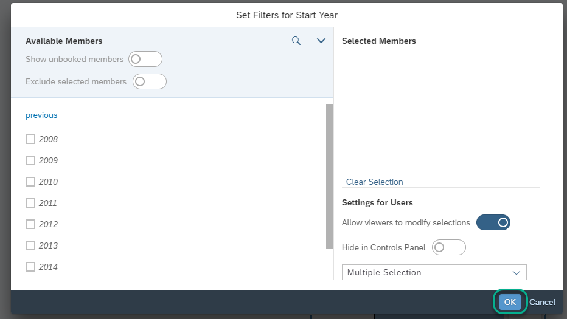

Change the chart structure from a bar/column graph to a numeric point.

Edit the styling of the chart as desired.

The indicators for Total Salary, Average Salary, Average Satisfaction Index and Average Evaluation Rating can be created repeating the above steps.

[DONE]
[ACCORDION-END]

[ACCORDION-BEGIN [Step 3: ](Donut Chart: Employee Gender Split Chart)]

The `Employee Gender Split` chart displays the number of employees identifying themselves as male versus employees identifying themselves as female in the company.

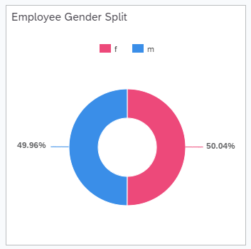

Click on the **Insert Chart** icon found on the ribbon at the top of the page.

You will use the `Headcount` calculation that you previously created in this chart.

In the **Builder** panel on the right-side of the screen, click on **+ Add Measure**.

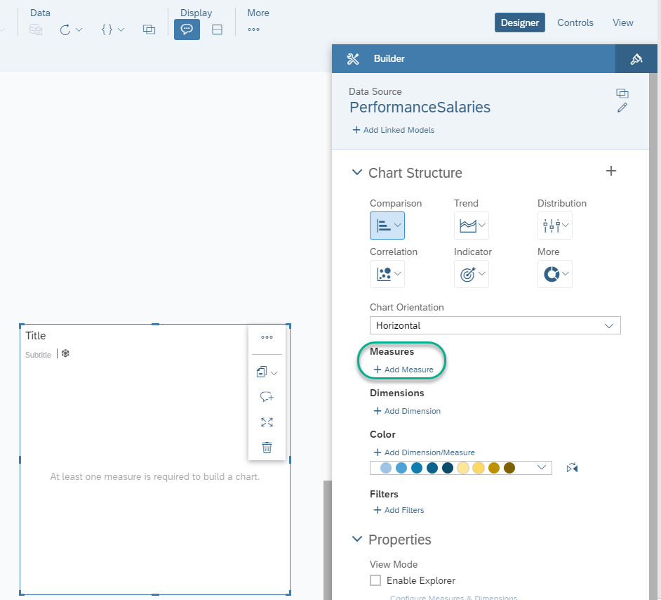

Select `Headcount` as the measure.

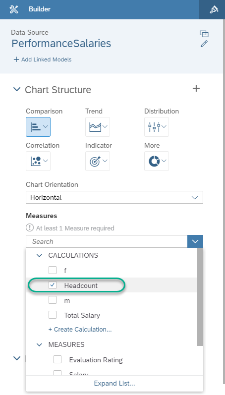

Under the **Color** field, click on **+ Add Dimension/Measure**. Select `Gender`. This will automatically display the number of male and female employees in the company.

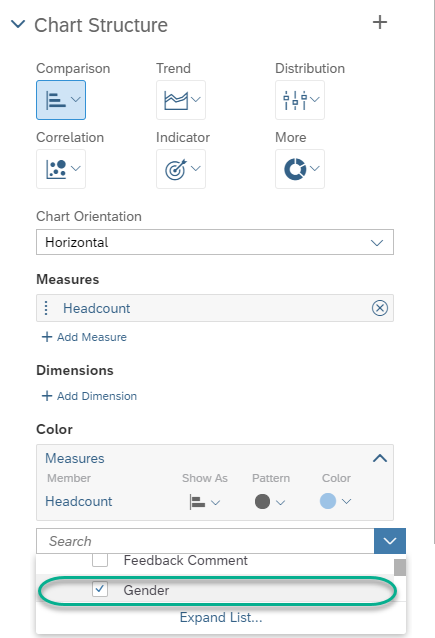

You can change the color palette of the chart as desired. In this example, blue was chosen to represent males and pink was chosen to represent females. Click on **+ Create New Palette** if you want to customize the colors in the chart.

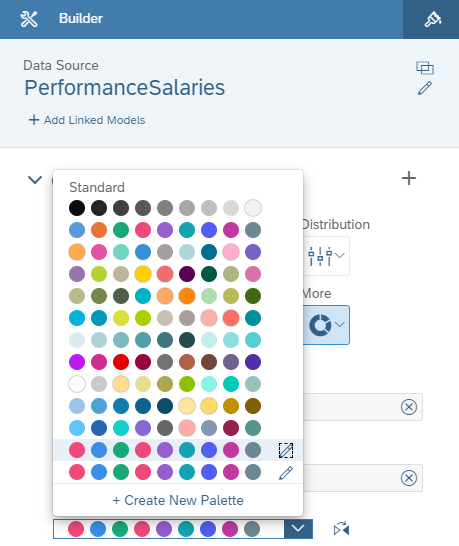

In this example, a custom color palette has been chosen for the `Gender` dimension. If you want to make this color palette consistent in the dashboard when the `Gender` dimension is used in a chart, you can sync the colors for the `Gender` field. This will ensure that every chart that showcases related indicators will have the same color palette.

To do this, click on the three dots next to Gender under the Color field, click on the **Color Sync** option and click on **Sync Colors**.

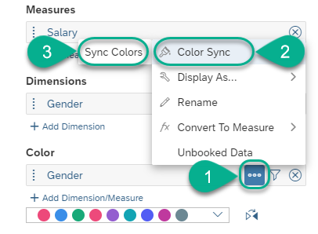

Essentially, the Color Sync option ensures that when the color palette for one chart in a story is changed, all the other charts that have the same color dimension or member will also be updated. This applies to charts that have a single dimension or measure for Color.

Change the chart structure from a bar/column graph to a donut chart.

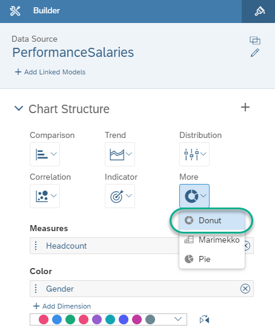

You can double click on the title of the chart to edit it.

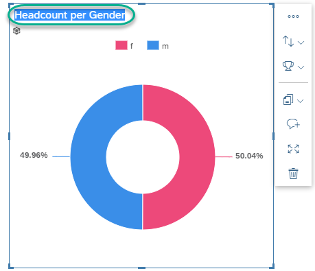

You can edit various aspects of the chart by clicking on the three dots that appear when the chart is selected and then choosing one of the available options.

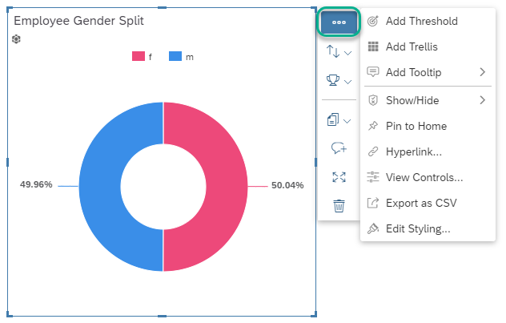

[DONE]
[ACCORDION-END]

[ACCORDION-BEGIN [Step 4: ](Column Chart: Salary per Gender Chart)]

The `Salary per Gender` chart displays the salary distribution per gender.

> Note: Although the salaries have been anonymized for data privacy, the distribution remains similar to the original dataset.

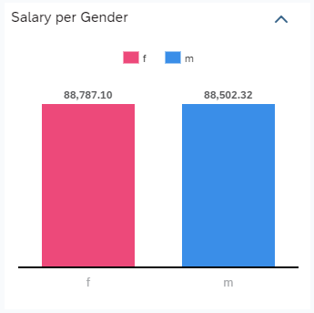

Click on the **Insert Chart** icon found on the ribbon at the top of the page.

In the Builder panel on the right-side of the screen, click on **+ Add Measure**.

Since we are comparing the salary of males versus females, add Salary as the measure.

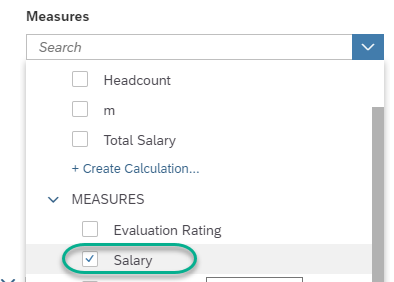

In the Builder panel on the right-side of the screen, click on **+ Add Dimension**.

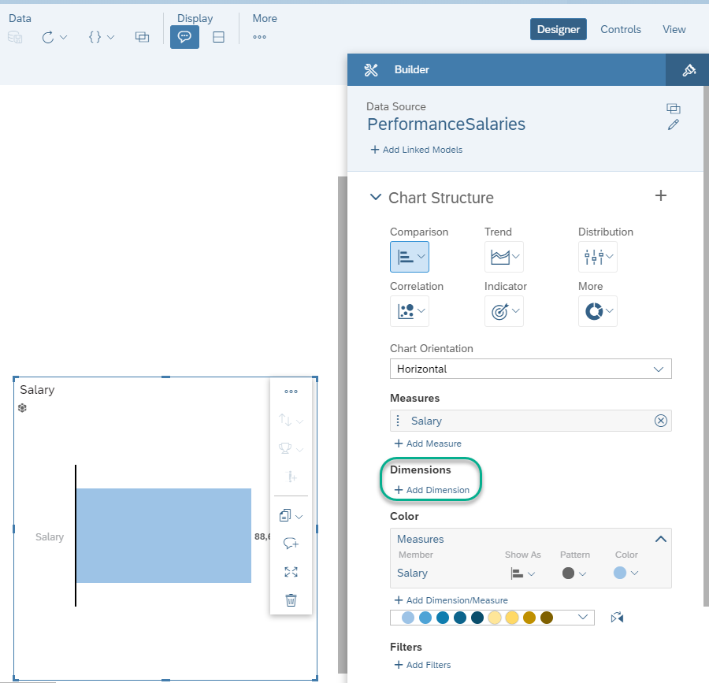

Add Gender as the dimension.

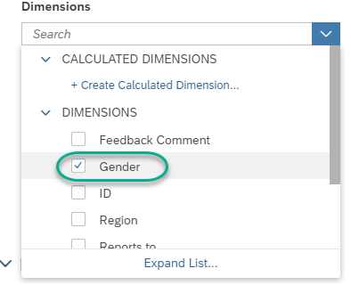

In order to style the chart to display one color for males and another color for females, click on **+ Add Dimension/Measure** under the Color field. Select Gender.

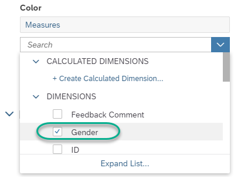

Change the chart orientation from horizontal to vertical.

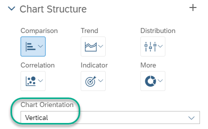

You can edit various aspects of the chart by clicking on the three dots that appear when the chart is selected and then choosing one of the available options.

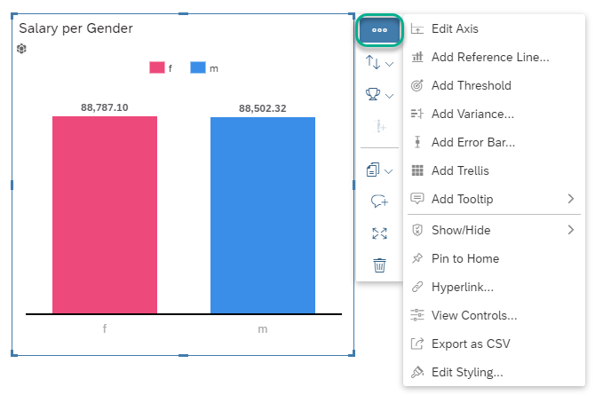

[DONE]
[ACCORDION-END]

[ACCORDION-BEGIN [Step 5: ](Stacked Bar Chart: Gender Breakdown by Region Chart)]

The `Gender Breakdown by Region` chart displays the total headcount by gender and region.

Click on the **Insert Chart** icon found on the ribbon at the top of the page.

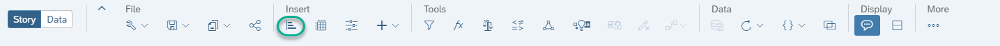

Change the chart structure to **Stacked Bar/Column**.

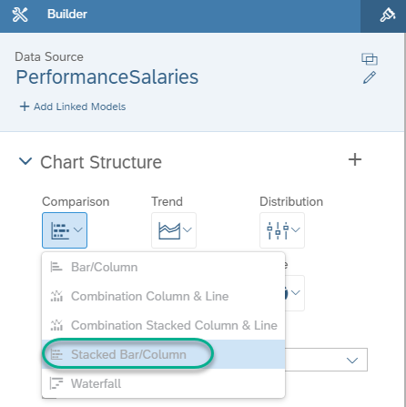

Since we want to display the gender breakdown by region, put Region as a dimension.

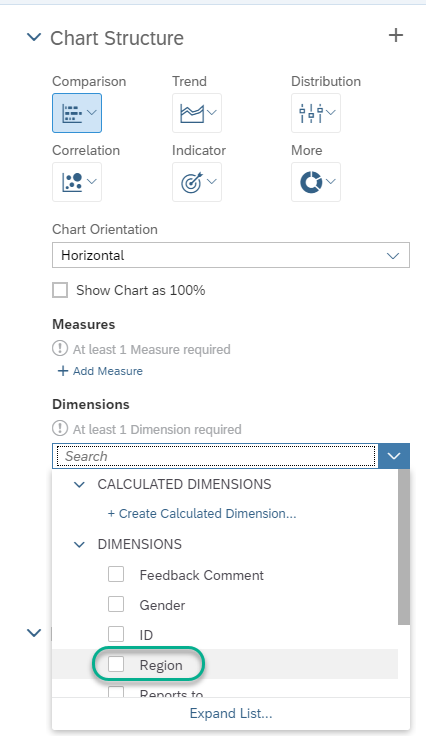

We will need to create two measures for this chart; one measure to count the number of females in the company and the other measure to count the number of males.

In the Builder panel on the right-side of the screen, click on **+ Add Measure**.

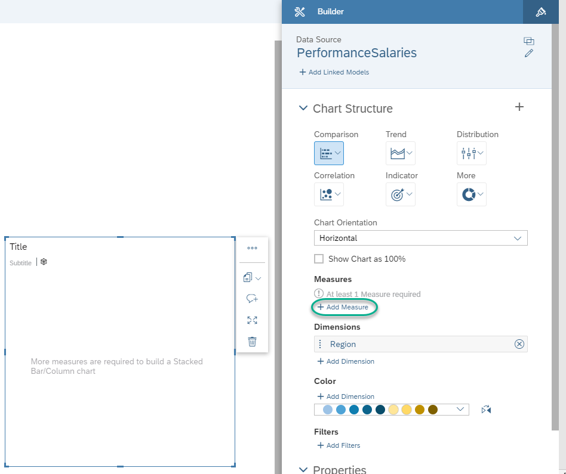

Click on **+ Create Calculation**.

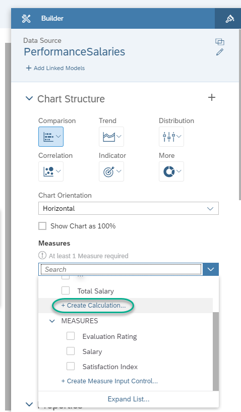

The following calculation counts the number of female employees. Configure the fields as follows:

|  Field Name     | Value
|  :------------- | :-------------
|  Name           | `f`
|  Operation           | `SUM`
|  Measure   | `Headcount`
|  Aggregation Dimension            | `Gender`
|  Use conditional aggregation            | Checked
|  Dimension            | `Gender`
|  Values for Input Controls            | `f`

 Choose **Have Measure values for Conditions** option is chosen for the **Aggregate when aggregation dimensions** field.

 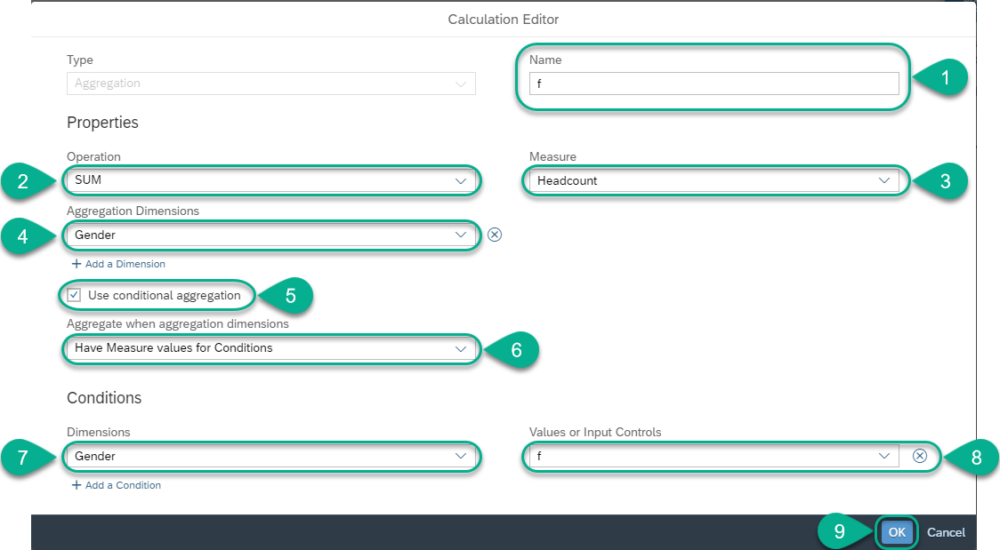

Press **OK**.

Create the same calculation as above, but for male employees.

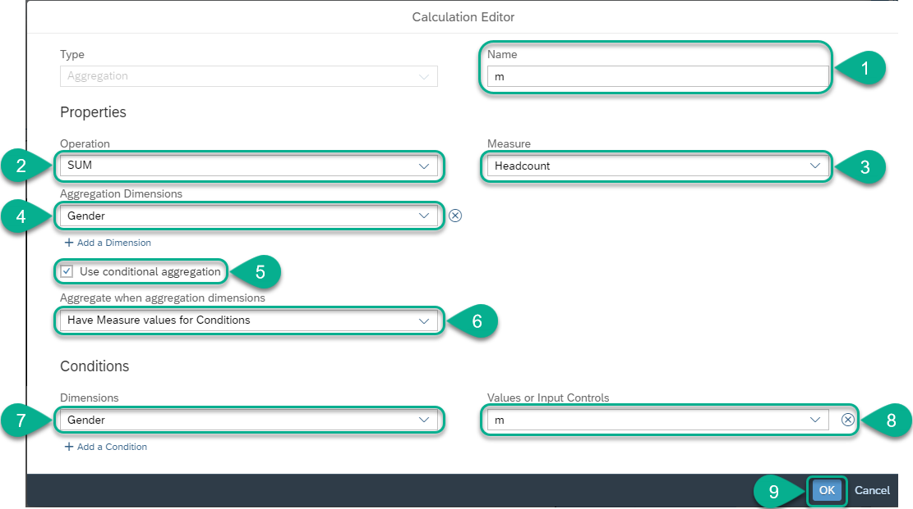

Select the newly created f measure and click on the three dots that appear. Click on **Format**.

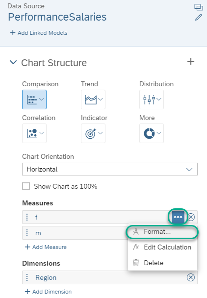

Change the number of decimal places to 0. Press **OK**.

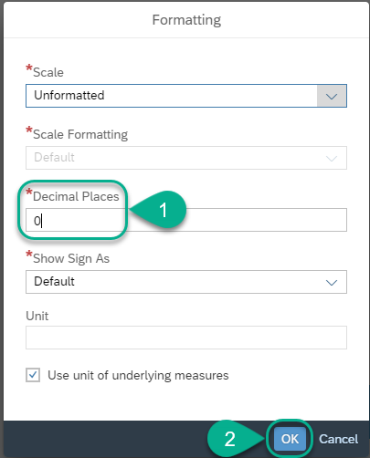

Execute the same steps for the newly created m measure to ensure that it has 0 decimal places.

Change the color palette of this chart (specifically the colors that represent males and females) to correspond with the color palette of the other charts in the dashboard.  

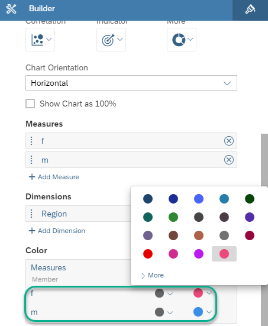

You can change the title of the chart by double clicking on the title. You can also format the chart by clicking on the three dots and choosing the **Edit Styling** option.

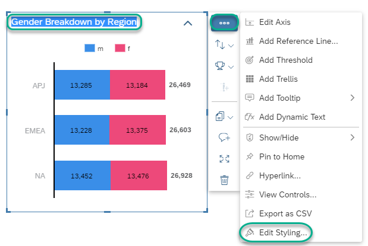

You can repeat similar steps to create a chart for the indicator `Salary per Region`.

[DONE]
[ACCORDION-END]

[ACCORDION-BEGIN [Step 6: ](Bar Chart: Evaluation Rating per Region Chart)]

The `Evaluation Rating per Region` chart displays the average evaluation rating of each region.

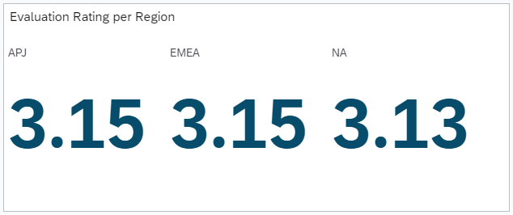

Click on the **Insert Chart** icon found on the ribbon at the top of the page.

Make the chart structure a numeric point.

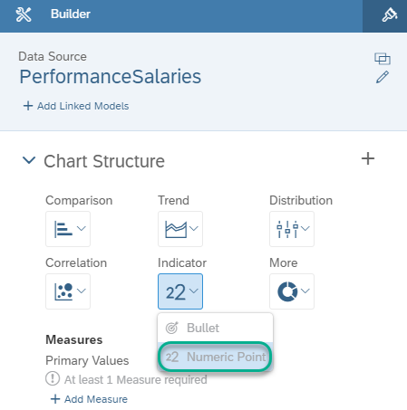

Select Evaluation Rating as the measure.

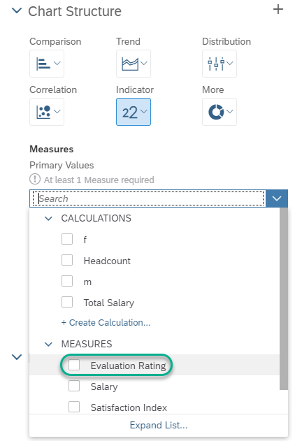

Select the chart and click on the three dots. Click on the **Add Trellis** option.

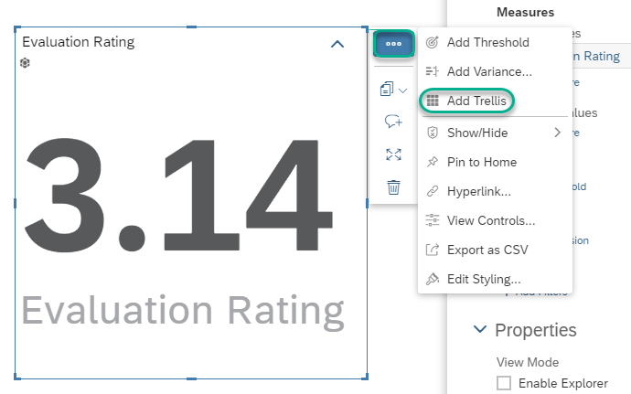

Click on **+ Add Dimension** under the Trellis field.

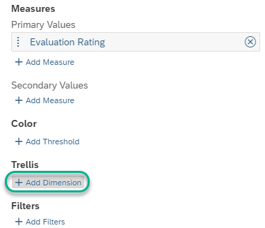

Select the Region dimension.

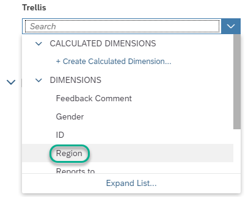

Edit the styling of the chart. In this example, the Chart Details and Primary Value Labels are hidden. The color of the evaluation ratings in the chart have also been edited.

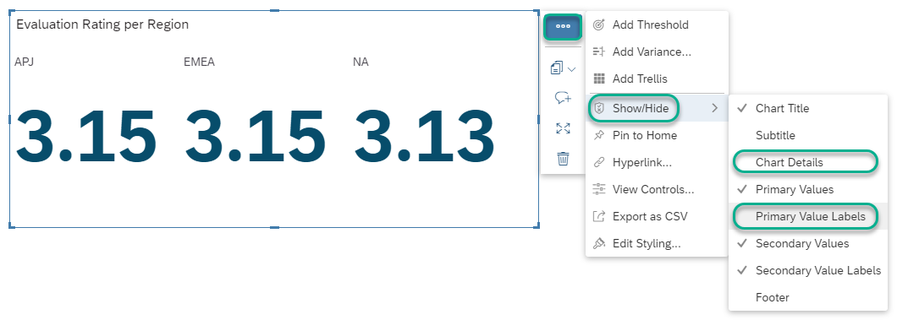

You can repeat these steps to display the `Satisfaction Index per Region`.

[DONE]
[ACCORDION-END]

[ACCORDION-BEGIN [Step 7: ](Bar Chart: Salary per Start Year Chart)]

The `Salary per Start Year` chart displays the average salary of employees each year.

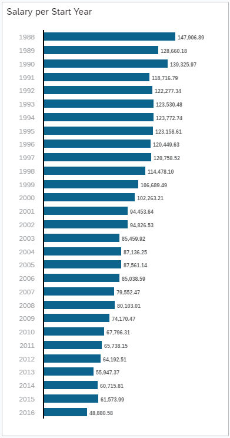

Click on the Insert Chart icon found on the ribbon at the top of the page.

Select Salary as the measure.

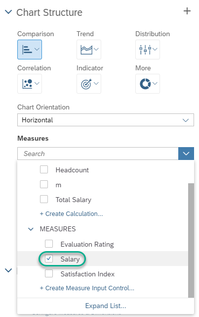

Select Start Year as the dimension.

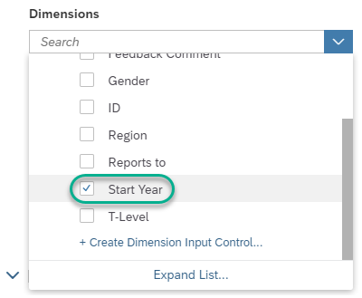

Change the size and styling of the chart. In this example, the size of the chart was increased and the color of the bars was modified.

[DONE]
[ACCORDION-END]

[ACCORDION-BEGIN [Step 8: ](Scatter Plot: Salary versus Satisfaction Index Chart)]

The `Salary versus Satisfaction Index` chart is a scatter plot that displays the salary of employees on one axis and the corresponding satisfaction index on the other axis.

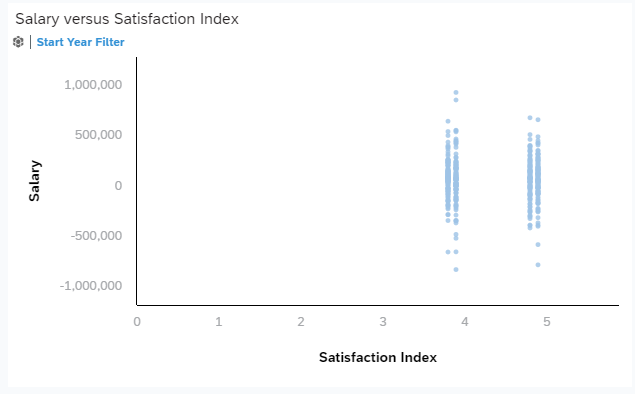

Click on the Insert Chart icon found on the ribbon at the top of the page.

Change the chart structure to a scatter plot.

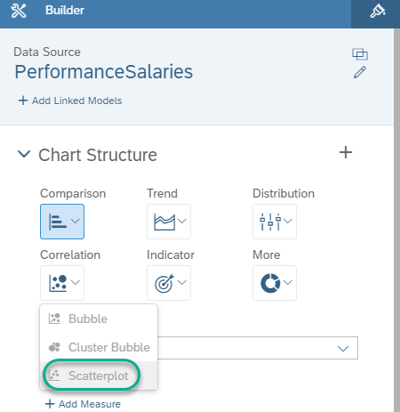

Choose the Satisfaction Index measure for the X-Axis.

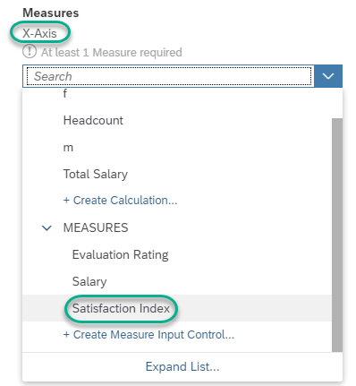

Select the Salary measure for the Y-Axis.

Choose ID for the dimension.

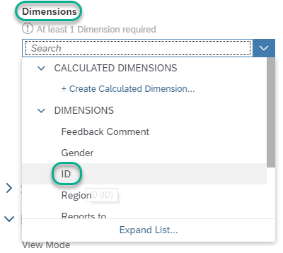

At this current state, the chart only shows partial results because there are too many data points. To resolve this issue, add a filter for the Start Year and narrow the results down to the current year. Under Filters, click on **+ Add Filters**.

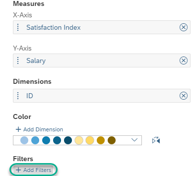

 Click on the **Start Year (Member)** option.

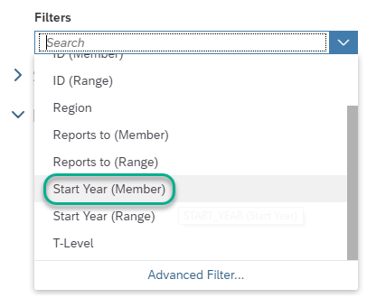

Select the current year and press **OK**.

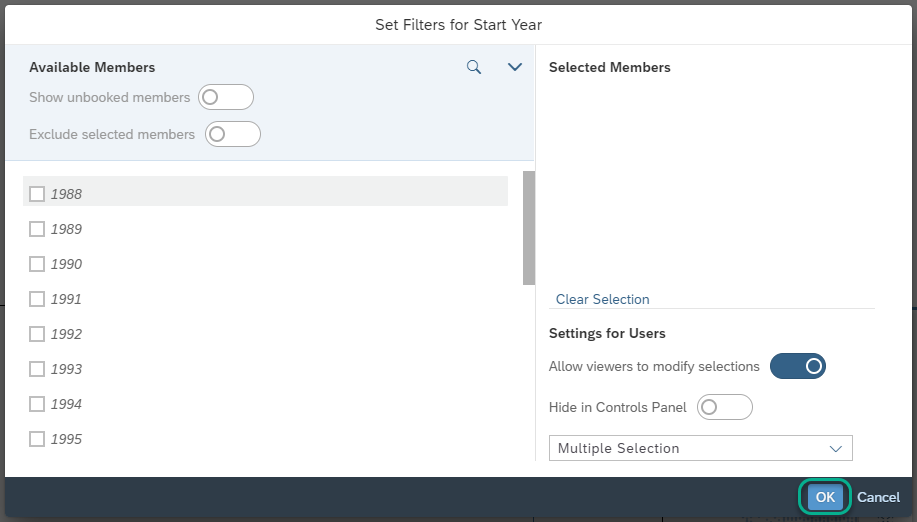

[DONE]
[ACCORDION-END]

[ACCORDION-BEGIN [Step 9: ](Input Controls: Start Year)]

The `Start Year Input Control` allows users to filter the entire dashboard by specific start years.

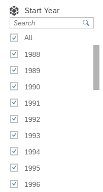

Click on the **Insert Input Control** icon found on the ribbon at the top of the page.

Click on **Dimensions**.

Click on the Start Year dimension and then select **Filter by Member**.

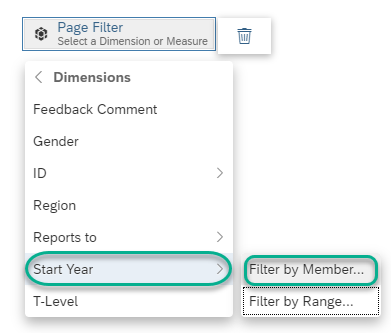

Select the **All Members** checkbox. Press **OK**.

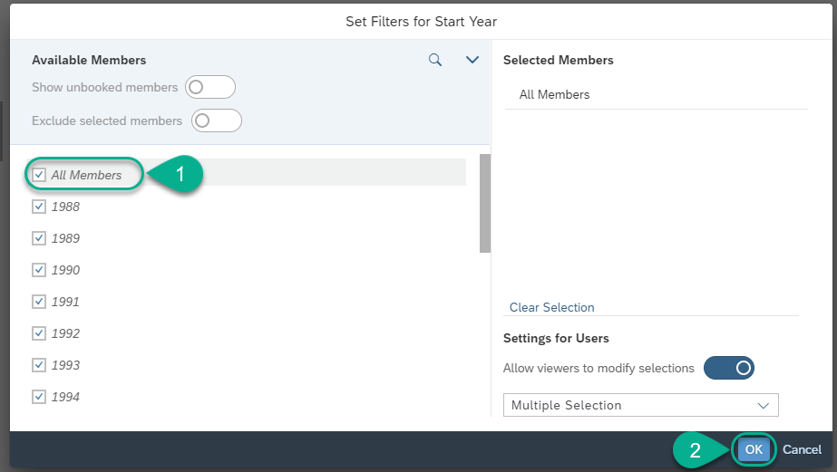

When the dashboard is first viewed, the metrics and charts will encompass data for all the start years. Users can then choose to filter by specific start years if desired.  

You can repeat the same steps to create an input control for the dimension `T-LEVEL`.

[VALIDATE_1]
[ACCORDION-END]

---
