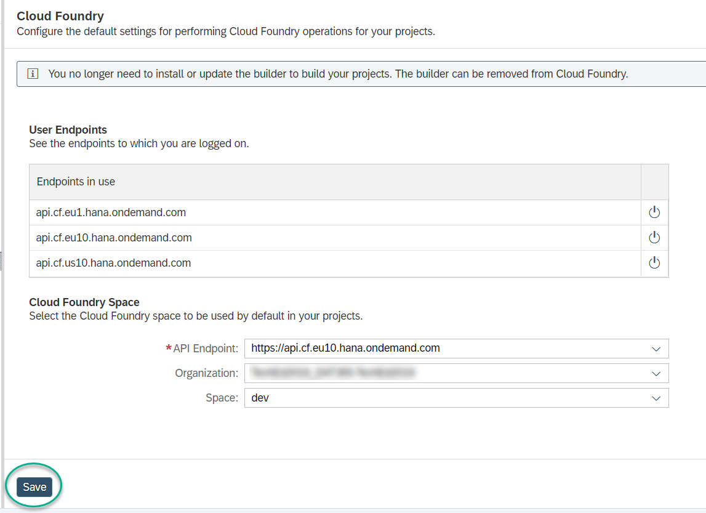

## Prerequisites
 - This tutorial is designed for SAP HANA service for SAP Business Technology Platform. Consider newer tutorials designed for SAP HANA Cloud.
 - You have a paid account in SAP BTP
 - You have created an instance of the SAP HANA service for SAP BTP

>**This tutorial cannot be completed with a trial account.**

## Details
### You will learn
  - How to access SAP Web IDE for Full Stack
  - How to create a project and configure credentials to perform a deployment in the SAP BTP, Cloud Foundry environment

SAP Web IDE Full Stack is currently available in SAP BTP, Neo environment. You will be entering the service from the SAP BTP, Neo environment subaccount, creating a project and configuring credentials to perform a deployment in the SAP BTP, Cloud Foundry environment.

---

[ACCORDION-BEGIN [Step 1: ](Navigate to the SAP BTP, Neo environment subaccount)]

You can start configuring your development environment while the creation of your instance takes place.

Navigate back to the **Subaccounts** page by clicking on the  icon.

Click on the **Neo** tile.

[DONE]
[ACCORDION-END]

[ACCORDION-BEGIN [Step 2: ](Access the SAP Web IDE)]

Navigate to **Services**, search for ***Full*** and click on **SAP Web IDE Full-Stack**.

Click on **Go to Service**. A new tab will open to load the SAP Web IDE Full-Stack. If prompted, log in to the service using your username and password.

[DONE]
[ACCORDION-END]

[ACCORDION-BEGIN [Step 3: ](Configure the SAP BTP, Cloud Foundry environment space)]

You will now configure the SAP BTP, Cloud Foundry environment space that will be used by default in your projects.

Click on the **Preferences** icon  and then click on **Cloud Foundry**.

Select the same API Endpoint that you identified in the Deploying SAP HANA service for SAP BTP tutorial.

>**Note**: Please ensure that the API Endpoint matches your account.

Login with your username and password.

Click **Save**.

[DONE]
[ACCORDION-END]

[ACCORDION-BEGIN [Step 4: ](Enable key SAP Web IDE extensions)]

Click on **Extensions**, search for the following extensions and enable them:

* SAP HANA Database Development Tools
* SAP HANA Database Explorer

Search for the **SAP EIM Smart Data Integration Editors** extension and enable it.

Click **Save**. Then click **Refresh** on the Confirmation Needed popup.

[VALIDATE_1]
[ACCORDION-END]

---
