## Prerequisites
 - You have created an instance of the SAP HANA service for SAP BTP in SAP BTP, Cloud Foundry environment

## Details
### You will learn
  - This tutorial is designed for SAP HANA service for SAP Business Technology Platform. Consider newer tutorials designed for SAP HANA Cloud.
  - How to connect to the SAP HANA cockpit for performing administrative tasks in the physical database

The SAP HANA cockpit is useful because it provides graphical tools to monitor resources and the overall health of your database.

>**This tutorial cannot be completed with a trial account.**

---

[ACCORDION-BEGIN [Step 1: ](Ensure that the instance is created)]

Navigate back to the **SAP BTP cockpit** to check on the progress status of your instance.

Click on the subaccount.

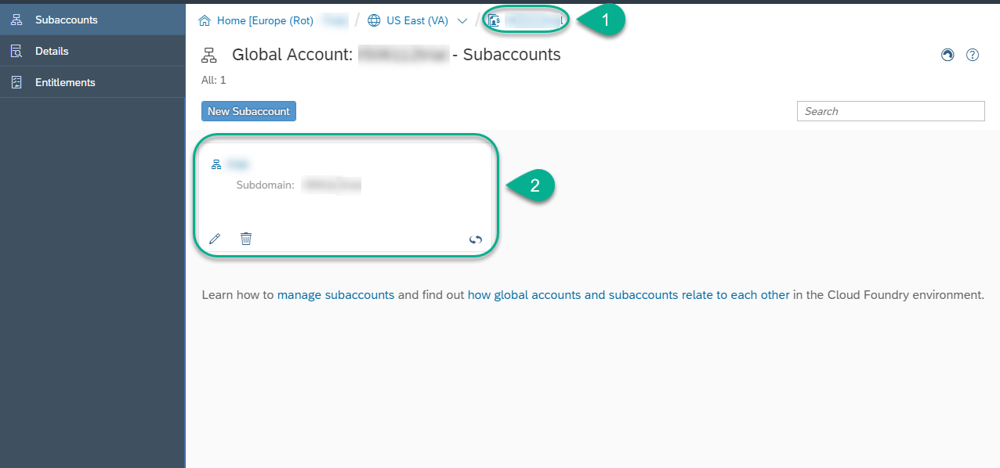

Click on **Spaces** and click on the **dev** space.

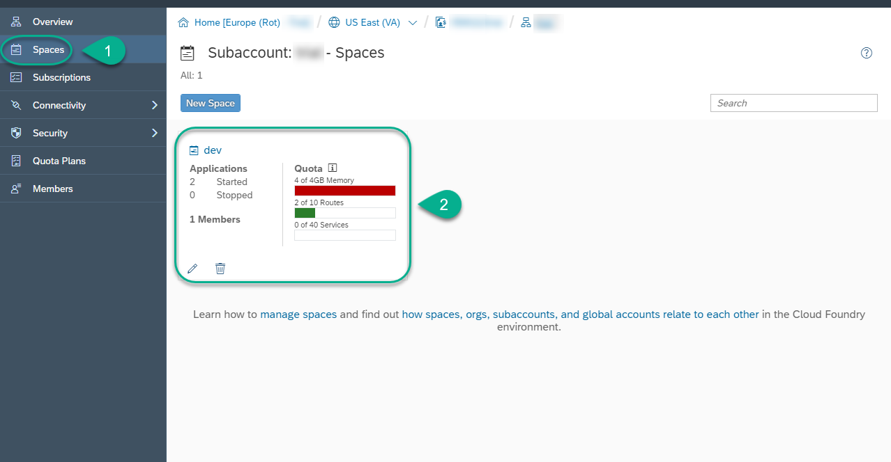

Click on **Service Instances**.

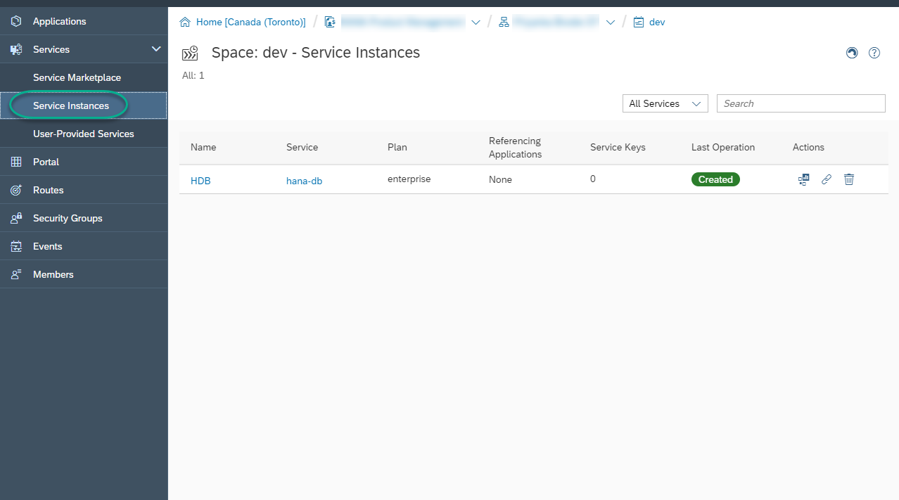

Ensure that you see ***Created*** under **Last Operation** for the HDB instance.

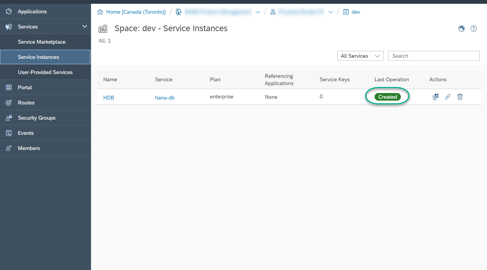

[DONE]
[ACCORDION-END]

[ACCORDION-BEGIN [Step 2: ](Access the SAP HANA service for SAP BTP dashboard)]

Click on the **Open Dashboard** icon  under **Actions**.

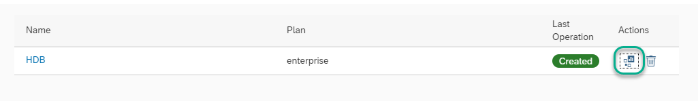

When prompted, click **Authorize** to authorize access for the cockpit.

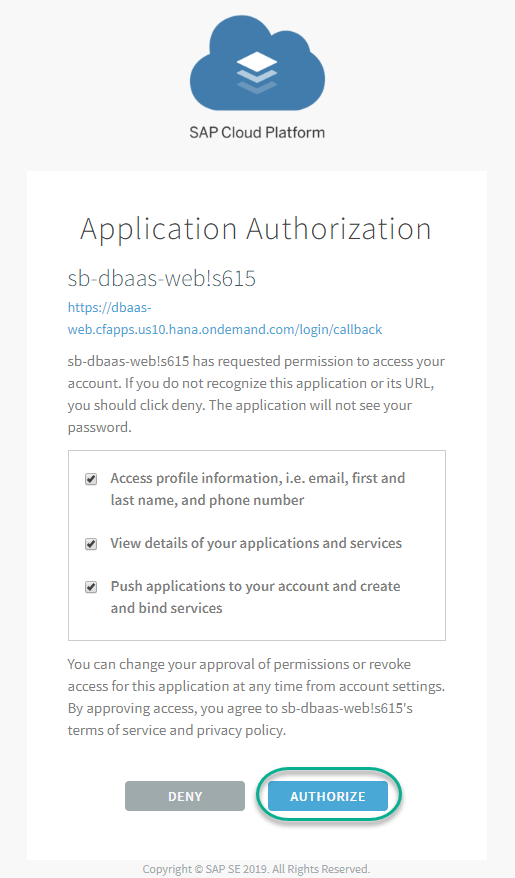

The SAP HANA service for SAP BTP dashboard will open. Notice that you can see the connectivity endpoints and the Cockpit. You are also able to see your database ID.

>**Note**: Keep this tab open as you will use it later.

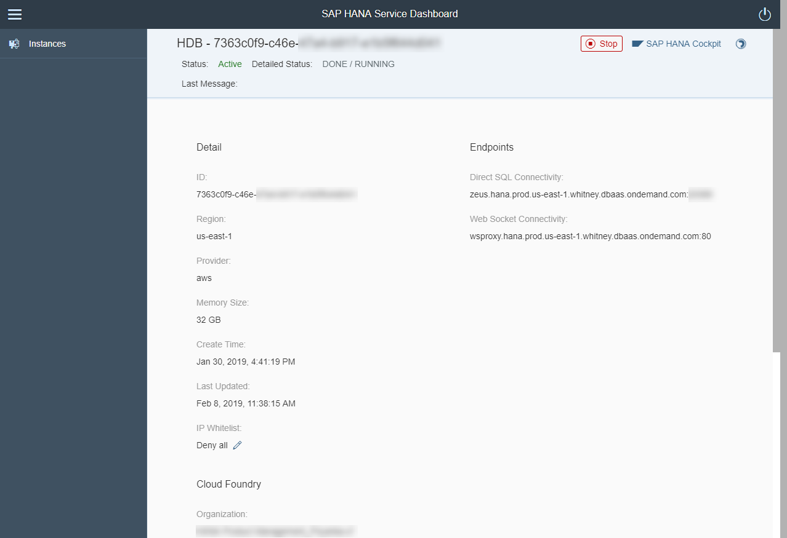

[DONE]
[ACCORDION-END]

[ACCORDION-BEGIN [Step 3: ](Access the SAP HANA cockpit)]

Access the **SAP HANA cockpit** using the button located at the top right corner.

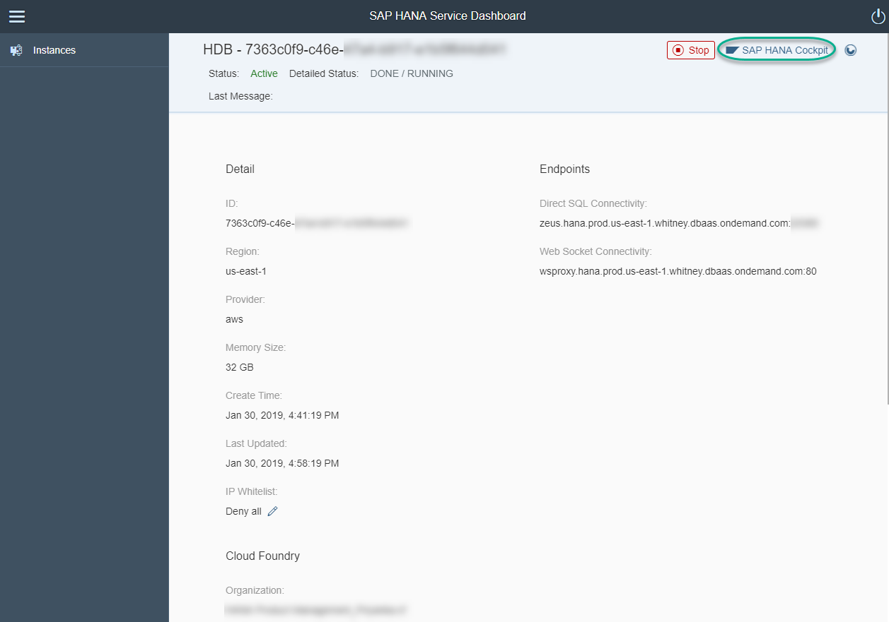

Enter the following credentials and then click **OK** to log in to the database:

**Username**: `SYSTEM`

**Password**: `HanaRocks1`

> Adapt the password to match the one you chose during setup if you changed it.

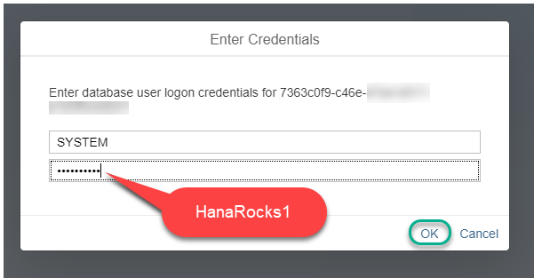

You can now explore the SAP HANA cockpit for your database instance.

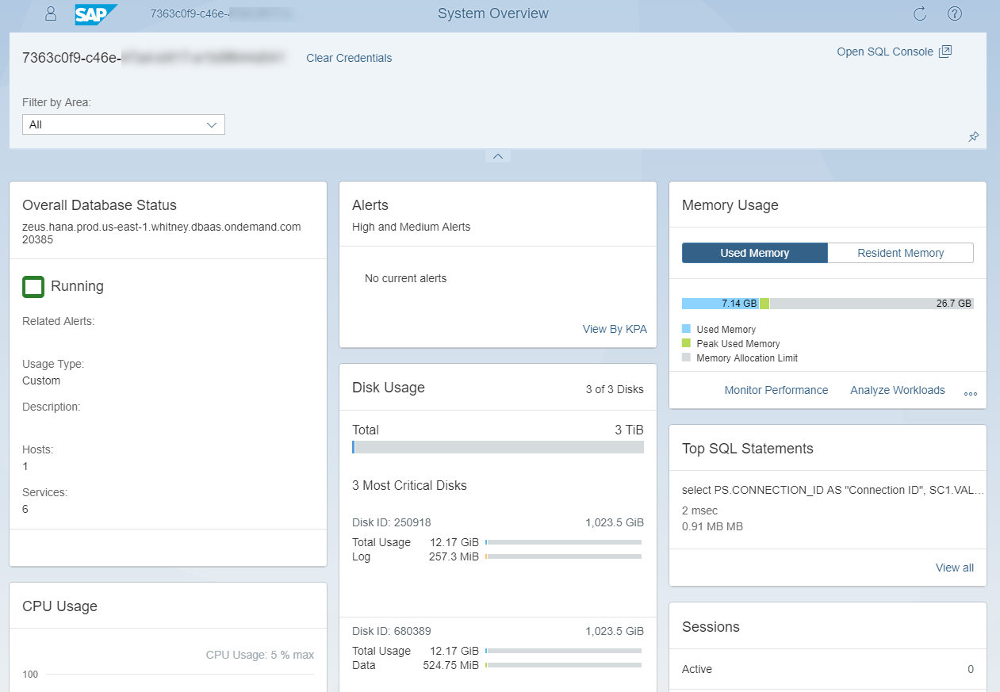

>**Note**: Keep this tab open as you will be using it later.

Open the **SQL Console**.

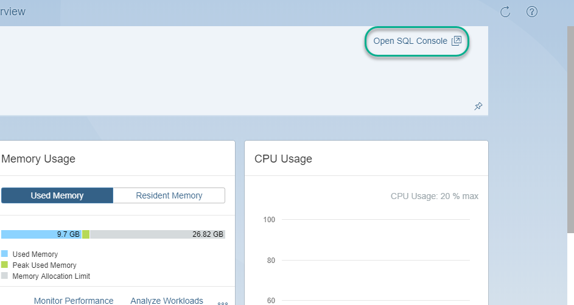

Execute the following statement to complete the validation below.

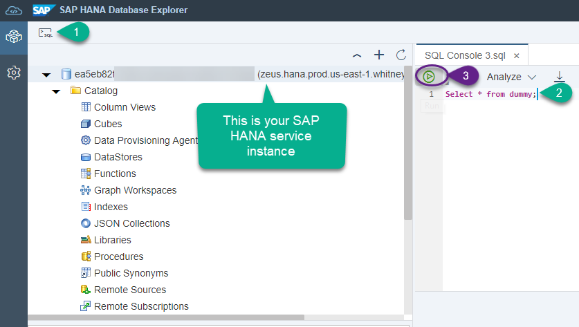

[VALIDATE_1]
[ACCORDION-END]

---
