## Prerequisites
- You have a productive account in SAP Integration Suite and SAP Extension Suite, a subaccount in SAP Business Technology Platform, Cloud Foundry environment and a space.
- You have [created an instance of the SAP HANA service for SAP BTP](haas-dm-deploying-haas)
- You have [access to the database cockpit for your SAP HANA service for SAP BTP database instance](haas-dm-connect-hana-cockpit).
- You have enabled Data Provisioning Server in your SAP HANA service for SAP BTP during setup or from the cockpit.
- You have administration rights in your local computer.


## Details
### You will learn
- How to start and register the data provisioning agent with SAP HANA service for SAP BTP in a local computer
- How to configure the file adapter to load text files
- How to create a remote source in SAP HANA service for SAP BTP using the Database Explorer

>**This tutorial cannot be completed with a trial account.**

---

[ACCORDION-BEGIN [Step 1: ](Connect to database with Database Cockpit)]

Navigate into the space in which you are developing in your subaccount.

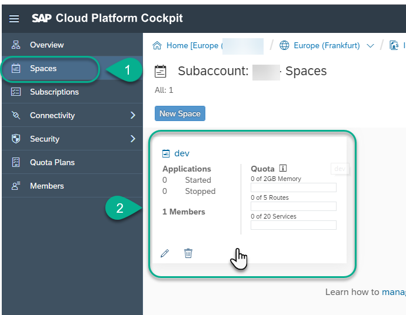

Select `Service Instances` and click the **Dashboard** icon for the service of type `hana-db`

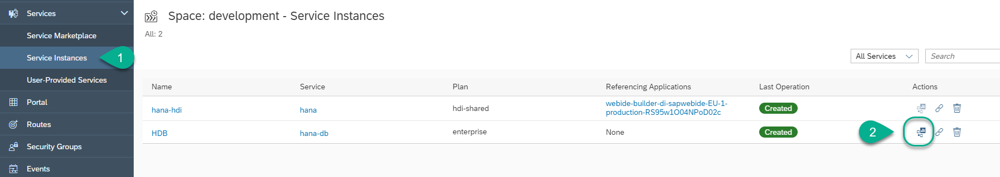


Use your email account to login:

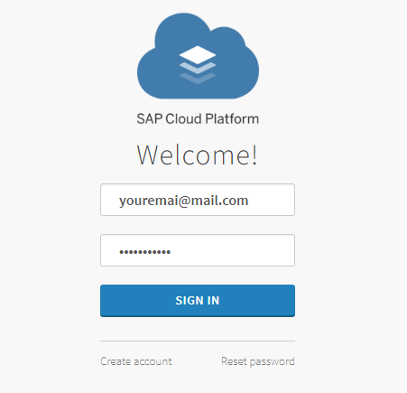

If prompted for authorization, click **Authorize**. Take note of the endpoint

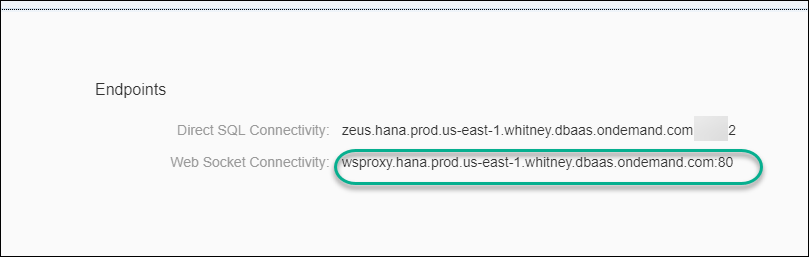

 Click the **SAP HANA cockpit** icon.

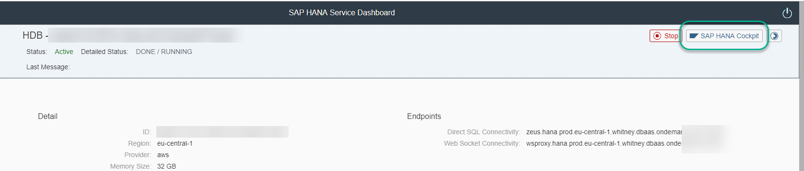

Use the user `SYSTEM` and the password you set as the database password.


Open the SQL console.

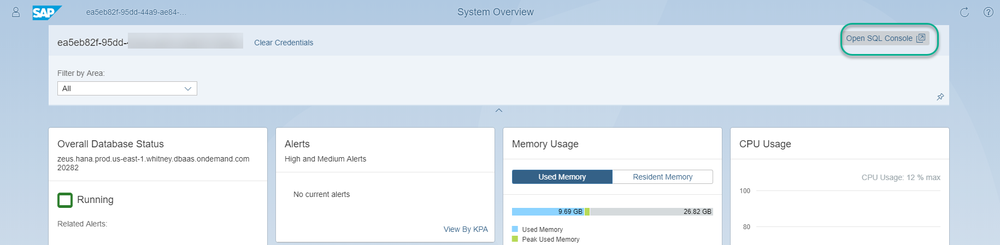

The Database Explorer will automatically open a SQL console connected to your database.

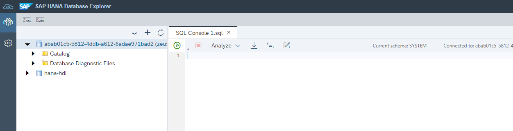


[DONE]
[ACCORDION-END]


[ACCORDION-BEGIN [Step 2: ](Download and install the Data Provisioning Agent)]

Download the Data Provisioning Agent from [the SAP Software Center](https://launchpad.support.sap.com/#/softwarecenter/search/HANA%2520DP%2520Agent). Choose `SPS3` Patch 52 or higher.

> For more information about installing the Data Provisioning Agent for productive environments check the [documentation in SAP Help](https://help.sap.com/viewer/7952ef28a6914997abc01745fef1b607/latest/en-US/6634db61aa43435a977b608878e5313f.html)

Choose a directory in your file system and use the following command to extract the file into it.

> You can download SAPCAR to extract your file from the [SAP Support Portal](https://support.sap.com/en/my-support/software-downloads.html),

```ssh
sapcar -xvf <<DOWNLOADED FILE>>
```


The previous command has created a new directory. Navigate into it and execute **`hdbsetup`**.

> Alternatively, you can use `hdbinst` from a command line.

Go into step 2. Choose an installation path and make a note of it, **you will need it later**:

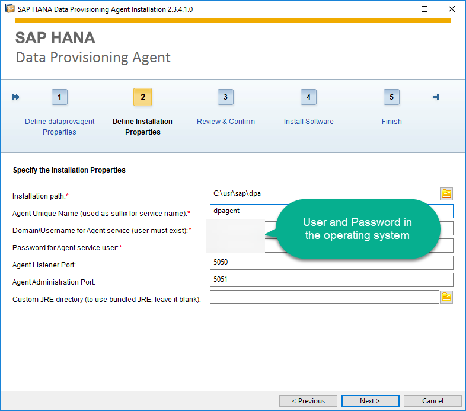

Review the options and click **Install**

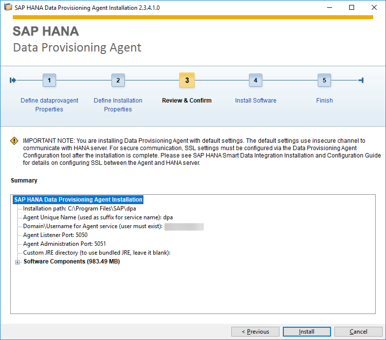

Wait until installation finishes and you get confirmation that **Installation finished successfully**


[DONE]
[ACCORDION-END]


[ACCORDION-BEGIN [Step 3: ](Register the agent)]

You will use the command-line tool to configure the data provisioning agent to connect to your SAP HANA instance using a secure JDBC connection.

Open a command line or terminal with administration rights.

> For Windows, search for `cmd` and use the context menu to choose `Run as Administrator`.
>
>   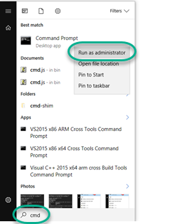

Use the following commands to set the environment variables to the installation path you specified in step 2:

-   For Windows:
    ```ssh
    set DPA_INSTANCE="C:\usr\sap\dpa"
    ```
-   For Linux:
    ```ssh
    export DPA_INSTANCE=/usr/sap/dpa
    ```

Switch to that directory using command **`cd`**.  For example:

```ssh

cd %DPA_INSTANCE%
```  

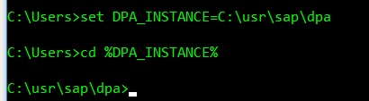

Navigate into the **`bin`** directory. Execute the configuration script `agentcli` with parameter `--configAgent`.

```sh
cd bin
agentcli --configAgent
```

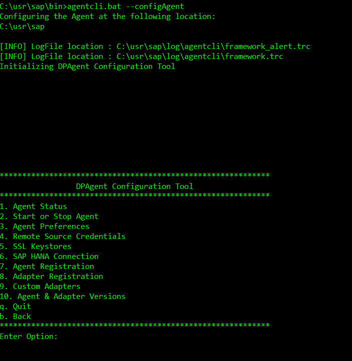

Start with option **2 . Start or Stop Agent** and start the agent with option **1 . Start Agent**.

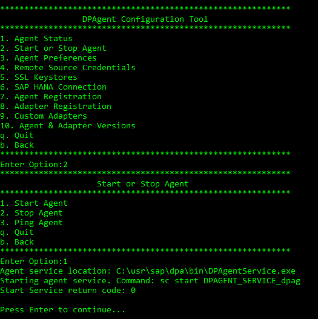

Use **`b` . Back** to go back to the main menu. Continue with option **6 . SAP HANA Connection**.

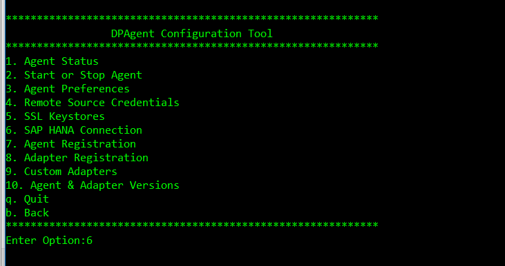

Choose option 3 for **JDBC**.

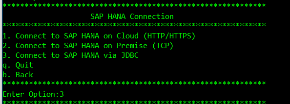

Choose **true** for **Use Web Socket to connect**

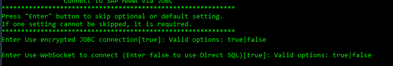

> ###Note: This option is available in the Data Provisioning Agent version 2.3.5.2 or higher.

Get the database ID from the SAP HANA Service Dashboard

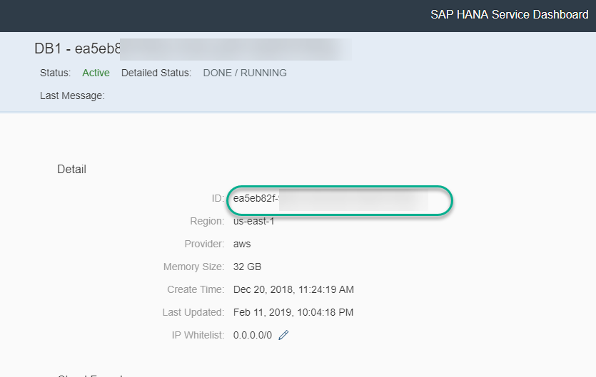

And concatenate `/service/` and database ID to form the **Web Socket URL**


Get the endpoint for Web Socket also from the SAP HANA Service Dashboard

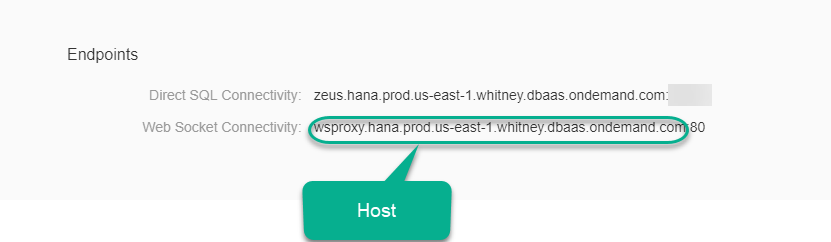

And use it to complete the **Host** and **Port**

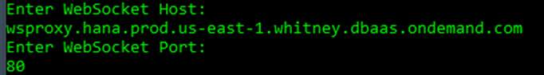

Choose **true** for `Use encrypted JDBC connection`

Use `SYSTEM` (or an administration user in a non-trial environment) and its credentials.

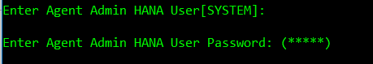

Choose an option for the HTTP proxy.


Enter user `JDCBUSR` and a password. Choose **true**. This user will be created for you.

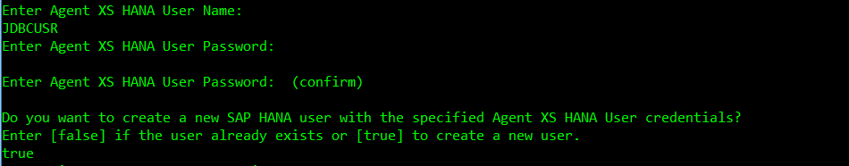

The configuration agent will connect and create the user. Press **Enter** when prompted.


>  Make sure the IP address from which you are connecting the agent is whitelisted.

Enter **`b`** to go back to the main menu. Choose option **7. Agent Registration** and follow the instructions to register your local computer as an agent.

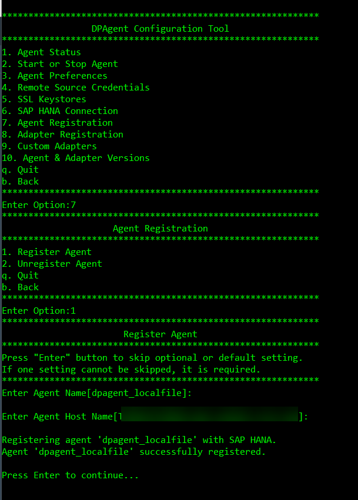

Finally, register an adapter using option 8.


Use `FileAdapter` when prompted. Use **Quit** to exit the configuration agent.

[DONE]
[ACCORDION-END]

[ACCORDION-BEGIN [Step 4: ](Configure an access token)]

From a command prompt, use the following command to set an access token.

```sh
agentcli --setSecureProperty
```

Enter option **8**.

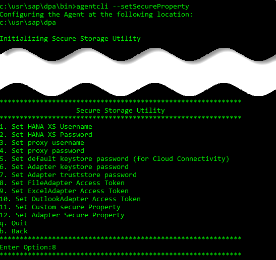

Set a token and make a note of it. This example uses **`HANAToken`**

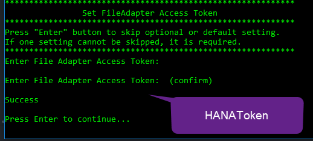

Press **Enter** and quit the configuration tool.

[DONE]
[ACCORDION-END]

[ACCORDION-BEGIN [Step 5: ](Prepare a file for upload)]

Download [this sample file](https://github.com/SAPDocuments/Tutorials/blob/master/tutorials/haas-dm-connect-sdi/salarydata.csv) into the default workspace.

The default workspace is located in `<<ROOT DIRECTORY>>\workspace`, for example, `\usr\sap\dpa\workspace` .

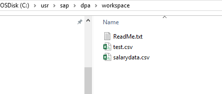

Create a text file called `salarydata.cfg` with the following content:

```text
#Configuration file for data load
CODEPAGE=UTF-8
ERROR_ON_COLUMNCOUNT=false
ESCAPE_CHAR=\
EXPONENTIAL=E
FORCE_DIRECTORY_PATTERN=C:\usr\sap\workspace
FORCE_FILENAME_PATTERN=salarydata.csv
FORMAT=CSV
LENIENT=true
LOCALE=en_US
ROW_DELIMITER=\n
SKIP_HEADER_LINES=1
COLUMN=id;INTEGER;
COLUMN=salary;INTEGER;
COLUMN=start_year;INTEGER;
COLUMN=gender;NVARCHAR(256);
COLUMN=region;NVARCHAR(256);
COLUMN=T-Level;NVARCHAR(256);
```
Save the configuration file in the same directory.

[DONE]
[ACCORDION-END]

[ACCORDION-BEGIN [Step 6: ](Create a Remote Source)]

Go back to the Database Explorer. You will see the adapter under `Catalog -> Data Provisioning Agents`

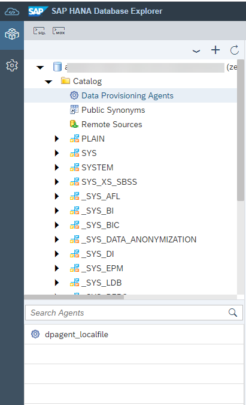

You should see the agent you registered.

Right-click on **Remote Sources**. Choose **Add Remote Source**

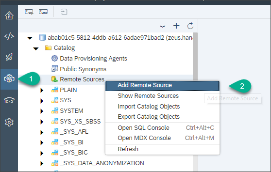

Choose **`FileAdapter`**

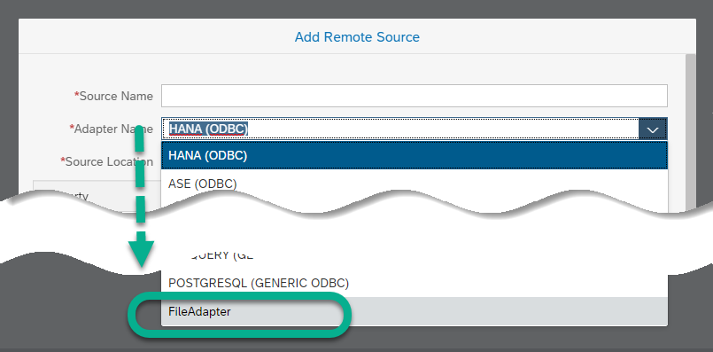

Call the source **`LocalFile`**.  The Source location should automatically choose the agent you registered on step 4.

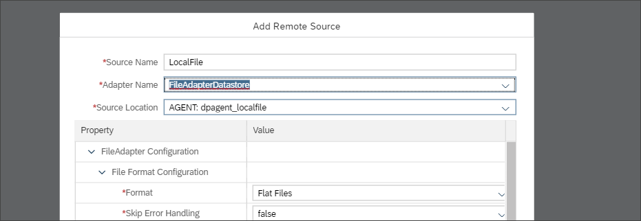

Set the path to the `workspace` directory in which you downloaded the `CSV` file

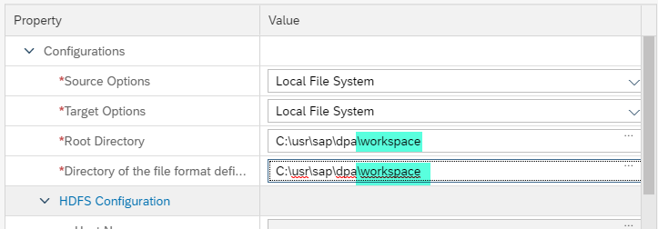

Scroll down to the credentials and choose **Technical User** as the credentials mode and enter the access token in the **`AccessToken`** field. If you used the example token before, enter  `HANAToken`.

Click **Create**

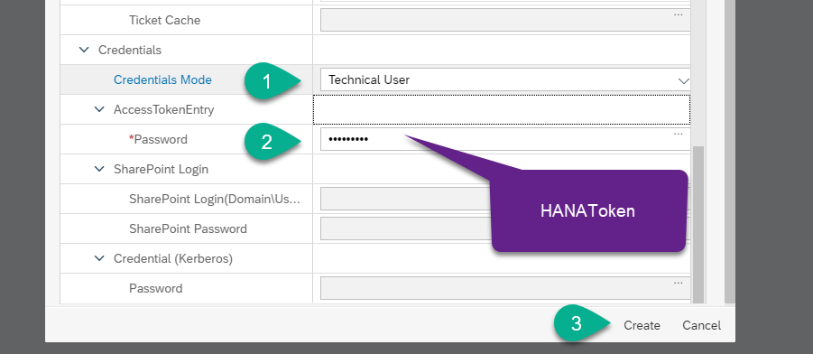

Check the remote objects to make sure configuration has been successful and to complete the validation below.

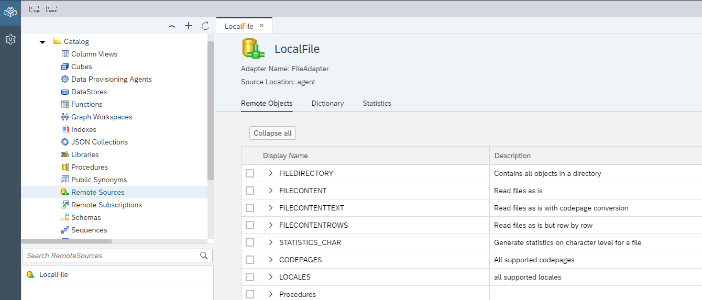

[VALIDATE_1]
[ACCORDION-END]


---
