## Prerequisites
 - This tutorial is designed for SAP HANA service for SAP Business Technology Platform. Consider newer tutorials designed for SAP HANA Cloud.
 - You have created an anonymized view as explained [in this tutorial](haas-dm-calculation-view-differential-privacy)
 - You have created and loaded data in the `PERFORMANCE` table as explained [in this tutorial](haas-dm-create-db-mta)

>**This tutorial cannot be completed with a trial account.**

## Details
### You will learn
  - How to create a calculation view in SAP Web IDE Full Stack
  - How to join data from another calculation view

This calculation view will be consumed in a report in SAP Analytics Cloud

---

[ACCORDION-BEGIN [Step 1: ](Create a Calculation View)]

In the models folder, create a calculation view called `PERFORMANCE_SALARIES`

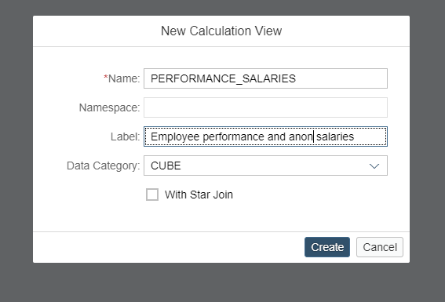

[DONE]
[ACCORDION-END]

[ACCORDION-BEGIN [Step 2: ](Join the calculation view and the table)]

Drop a `join` node into the modelling space

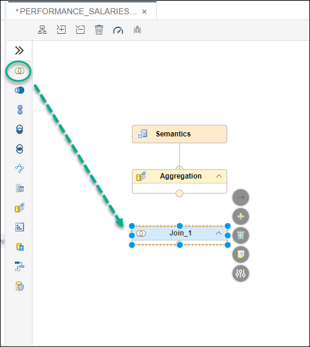

Use the  sign to add the calculation view to the node.

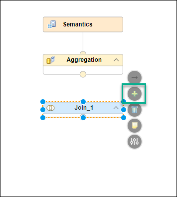

Type in the name of the calculation view. Select if and click **Finish**

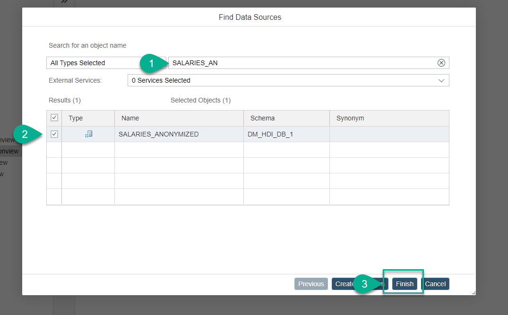

Click on the  sign again and add the table `PERFORMANCE`.  Click **Finish** and you should see both artifacts in the join node:

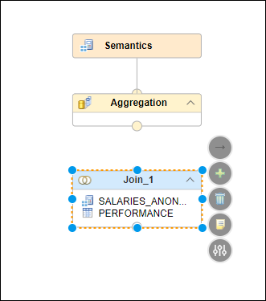

[DONE]
[ACCORDION-END]

[ACCORDION-BEGIN [Step 3: ](Configure the join)]

Double-click on the join node. A panel will open on the right.

Drag and drop the `ID` field to join the entries in `SALARIES_ANONYMIZED` with the records in `PERFORMANCE`.

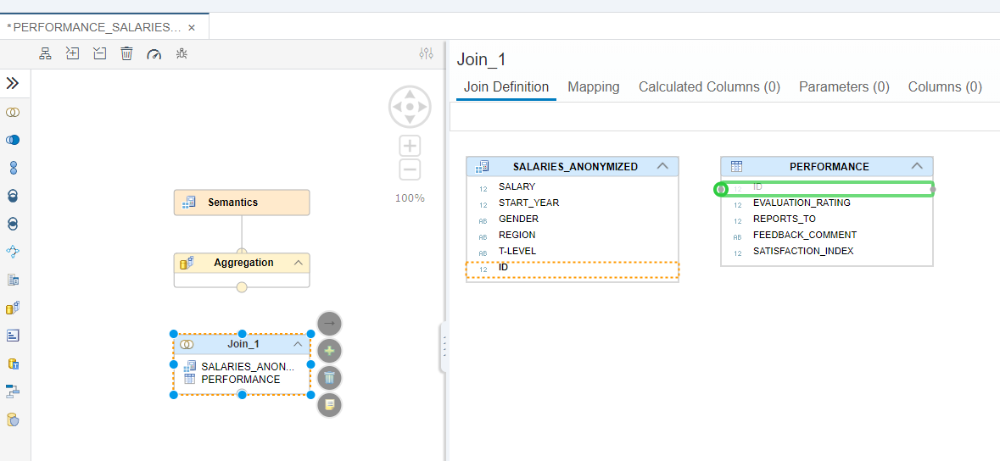

Set the cardinality to `1..1`

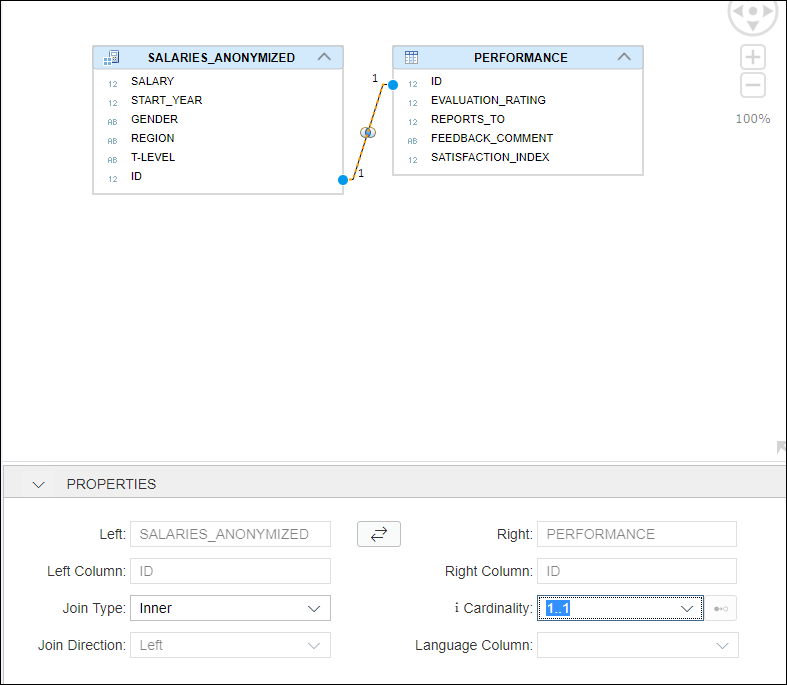

In the mapping tab, add all the columns as output columns. Make sure `ID` is only added once

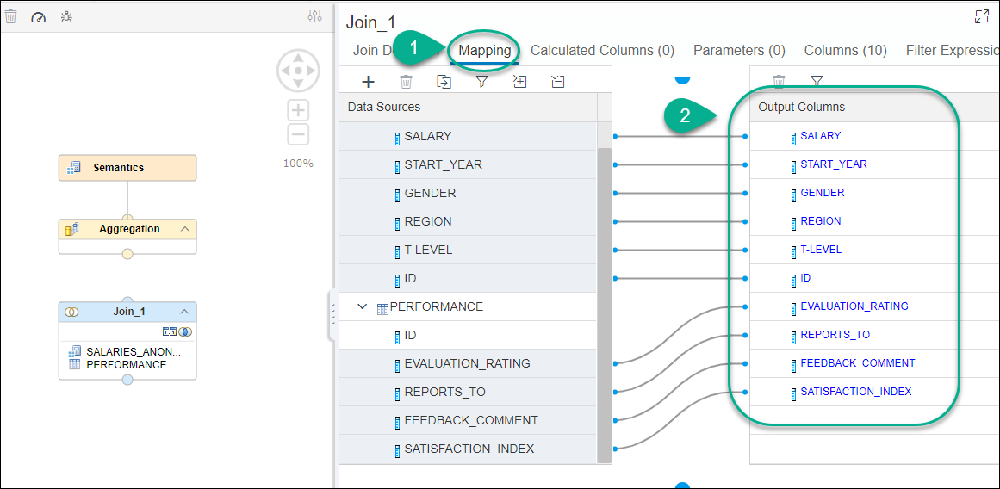

Connect the join node with the aggregation node using the 

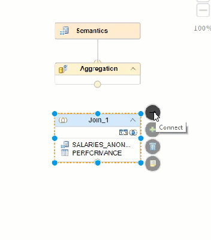

[DONE]
[ACCORDION-END]

[ACCORDION-BEGIN [Step 4: ](Configure semantics)]

Click on the **aggregation** node and double-click on the join parent to add all the columns to the output

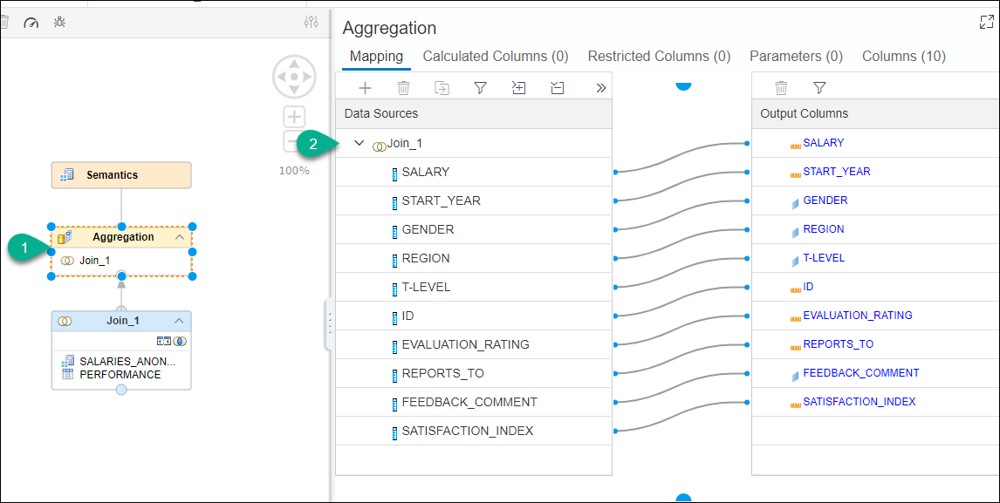

Go into the **Semantics** node and change the `START_YEAR` and `ID` to attributes. Set the aggregation of the remaining measures to `AVG`

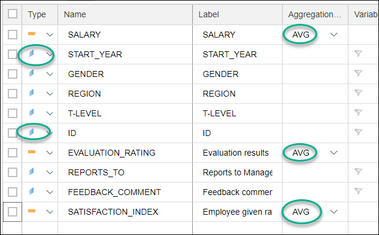

[DONE]
[ACCORDION-END]

[ACCORDION-BEGIN [Step 5: ](Build and test)]

Right-click on the calculation view and select **Build selected files**

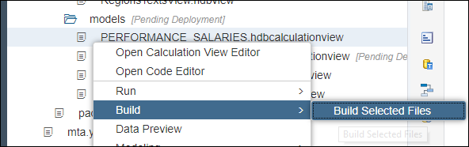

Once the build is successful, right-click on the view and select **Data preview**

> If you get an error, choose `Open HDI container` instead and look for the calculation view under `Column Views` in the database explorer.

Go into the **Analysis** tab. Drag the `T-LEVEL` attribute into the label axis and the `Evaluation Rating` into the values axis.

[VALIDATE_1]
[ACCORDION-END]

---
