## Prerequisites
 - You have created a trial instance of SAP Cloud Platform, SAP HANA Service
 - You are logged in to SAP Web IDE

## Details
### You will learn
  - How to do something
  - Why this technology is helpful


---

[ACCORDION-BEGIN [Step 1: ](Create a new project from template)]

Click `File->New` and choose **Project from Template**.

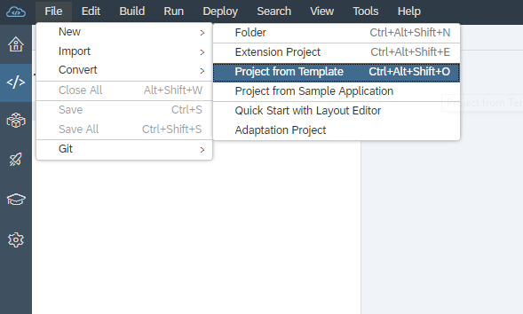

Choose **SAP HANA Multi target application** and click **Next**.

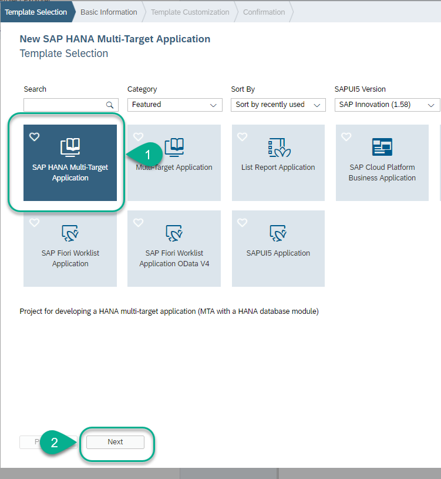

Call the project **DM** and click **Next**.

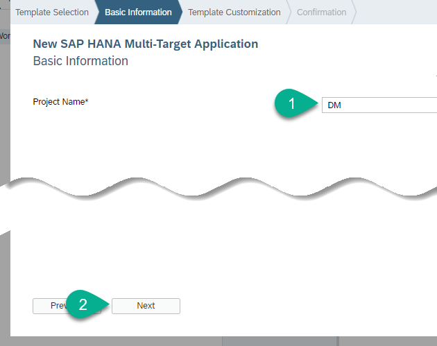

Remove the **namespace**

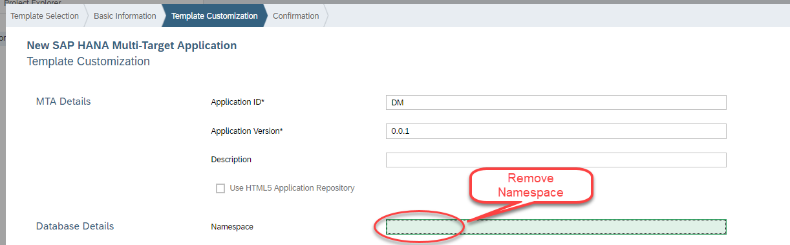

Choose version **2.0 SPS03** and click **Finish**

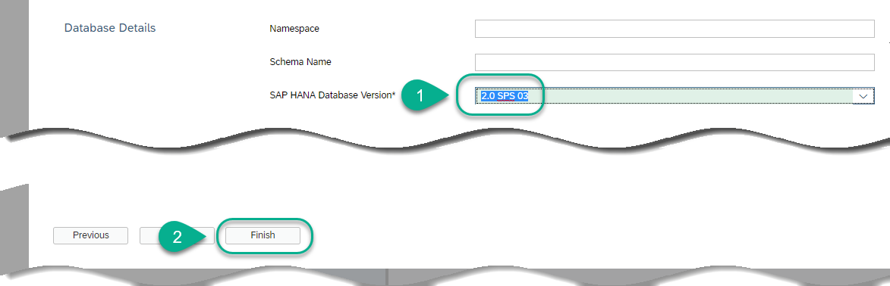

[DONE]
[ACCORDION-END]

[ACCORDION-BEGIN [Step 2: ](Create database artifacts)]

This project will combine artifacts from an HDI container and a classic, replicated schema.

You will first create a table to hold data from performance evaluations received by employees and the rating they give the company in terms of satisfaction. This is a sample record that will be stored in this table:


Right-click on the `src` folder, choose `New -> File`

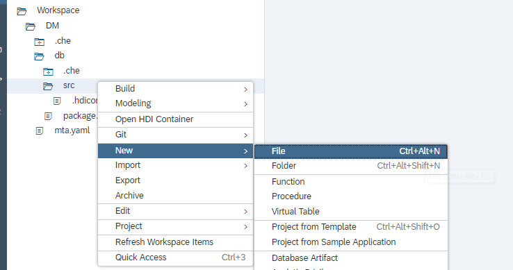

Use the following name

```text
data/performance.hdbdd
```

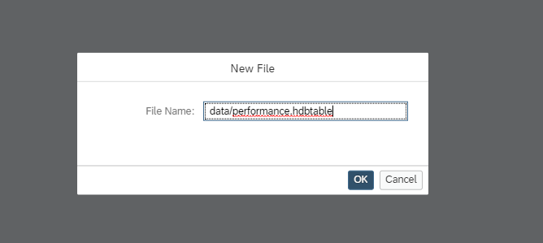

This will create both a folder and a file. Paste the following content into the `hdbdd` file to define a new table:

```sql
column table "PERFORMANCE" (
	"ID" INTEGER  unique not null COMMENT 'Employee ID',
	"EVALUATION_RATING" DOUBLE COMMENT 'Evaluation results',
	"REPORTS_TO" INTEGER not null COMMENT 'Reports to Manager',
	"FEEDBACK_COMMENT" NVARCHAR(512) COMMENT 'Feedback comment',
	"SATISFACTION_INDEX" DOUBLE COMMENT 'Employee given rating',
	PRIMARY KEY ("ID")
)
COMMENT 'Performance evaluation record'

```

**Save** the file.


> **What is going on?**
> You have created a database module and a design time artifact representing a table. When this module is built, Web IDE will automatically create an HDI container and bind it as resource to the database module. It will also create the runtime object (a physical table) in the schema associated to the HDI container.
> &nbsp;
> This approach allows you to modify the structure of the table without worrying about underlying adaptation operations.

[DONE]
[ACCORDION-END]


[ACCORDION-BEGIN [Step 3: ](Create a text index)]

The table you have just defined will have a large text field with comments from the employees. You want to enable a text index to perform text search and mining operations.

Create a new database artifact under the data folder

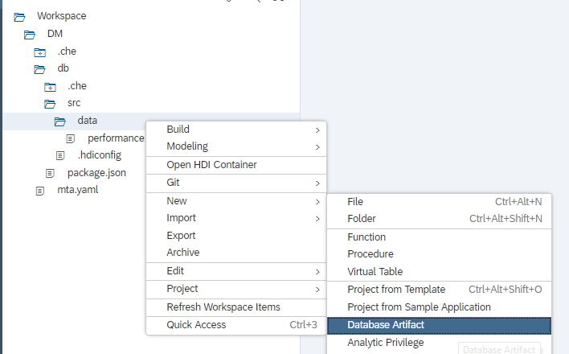

Use the following name

```text
comment_text
```
And choose `hdbfulltextindex`


Paste the following code into it:

```sql
FULLTEXT INDEX "COMMENT_TEXT"
on "PERFORMANCE"("FEEDBACK_COMMENT")
FAST PREPROCESS OFF
TEXT ANALYSIS ON
```

**Save** the file.

[DONE]
[ACCORDION-END]

[ACCORDION-BEGIN [Step 4: ](Build the database module)]

You will be referring to this service later for integrations. For that reason, you will specify a name for the HDI container when it is created by SAP Web IDE.

Open the file `mta.yaml` on the `MTA Editor` tab

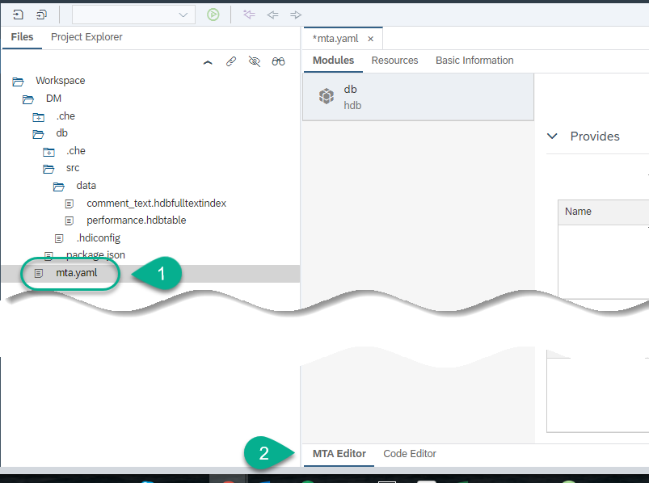

Open the **Resources** tab. Under **Parameters**, use the **+** sign to create the following key-value pair

| key | Value |
|:------|:---------|
| `service-name` | `hana-hdi` |

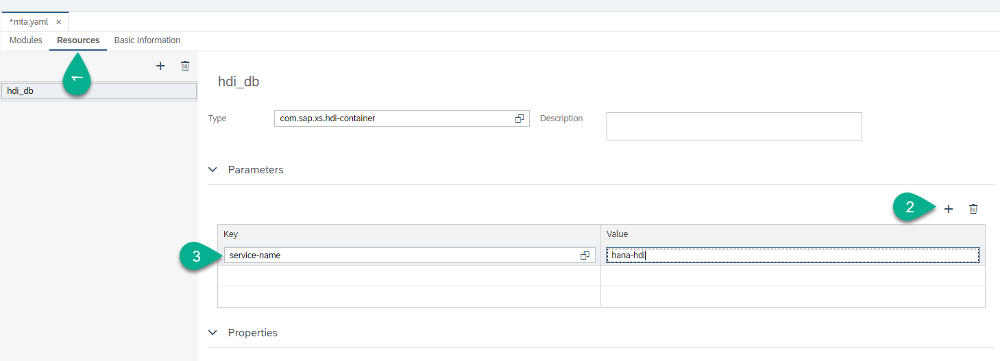

**Save** the file

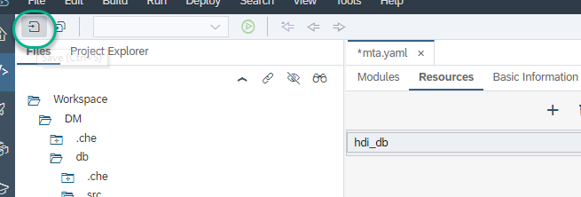

Right-click on the database module and choose **Build**.

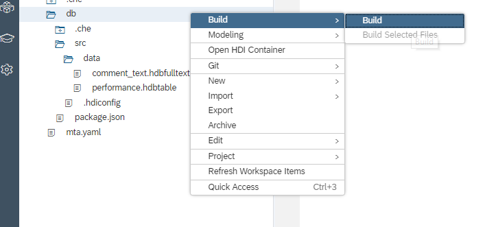

> **What is going on?**
> The console on the bottom will show the progress. First, an HDI container will be created and bound to builder. Scroll up the log to see it in your screen:
>&nbsp;
>  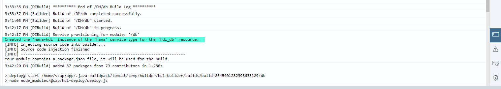
>&nbsp;
>  The container is called `hana-hdi`, which is the name you specified in the deployment configuration file, `mta.yaml`.
> If you continue to scroll down, you will see how the table and text index you have created using design-time artifacts are prepared for deployment and created in a schema called `DM_HDI_DB_1`. Finally, you will see a success message:
>
>&nbsp;
>
>  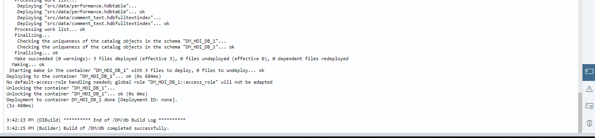
>&nbsp;
> If you list the services using the CLI with command `cf services` or go into the services instances in your space in the SAP Cloud Platform Cockpit, you will see a new service bound to the Web IDE builder.
>&nbsp;
>  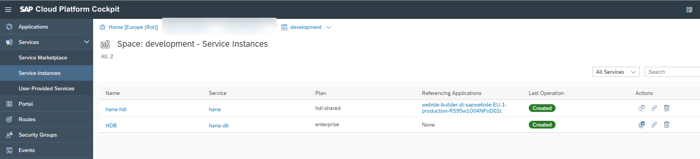


[DONE]
[ACCORDION-END]

[ACCORDION-BEGIN [Step 5: ](Add data from a local file)]

For testing and development purposes, you can use a local file to load data into an HDI container.

Create the configuration for the upload first.  In the `data` folder, create a file called:

```TEXT
loads/dataload.hdbtabledata
```

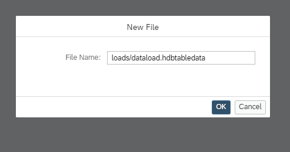

Paste the following content into it:

```sql
{
	"format_version": 1,
	"imports": [{
		"target_table": "PERFORMANCE",
		"source_data": {
			"data_type": "CSV",
			"file_name": "performance.csv",
			"has_header": true,
			"dialect": "HANA",
			"type_config": {
				"delimiter": ","
			}
		}
		}]
}		
```

Download this `csv` file into your computer. Upload it into the **loads** folder using the `Import` option

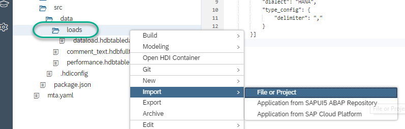

**Build** the **loads** folder

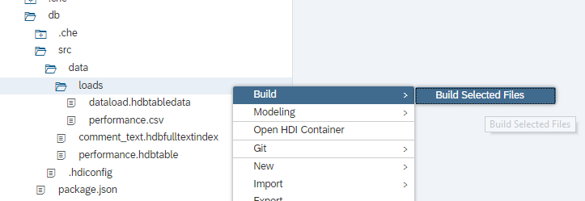

[DONE]
[ACCORDION-END]

[ACCORDION-BEGIN [Step 6: ](Check the data)]

Right click on the `db` module and choose **Open HDI Container**.

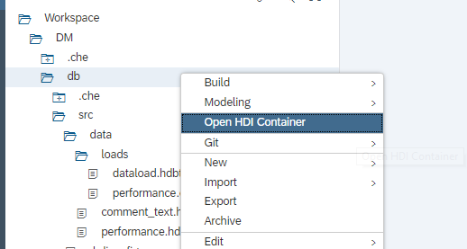

The editor will open the Database Explorer. Select **Tables**


Right-click on the table **PERFORMANCE** and choose **Open Data**

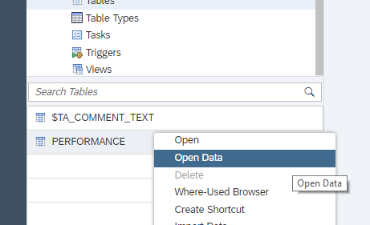

Open the **SQL editor** for this query

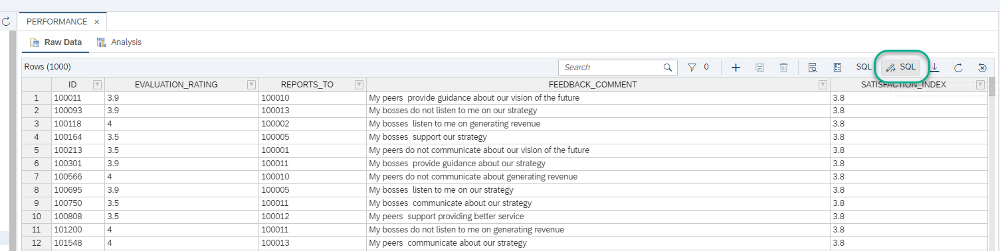

And execute the following SQL statement to complete the validation below:

```sql
SELECT AVG("SATISFACTION_INDEX")
FROM "DM_HDI_DB_1"."PERFORMANCE";
```

[VALIDATE_1]
[ACCORDION-END]


---
