## Prerequisites
 - This tutorial is designed for SAP HANA service for SAP Business Technology Platform. Consider newer tutorials designed for SAP HANA Cloud.
 - You have configured SAP HANA service smart data integration for SAP BTP [as explained in this tutorial](haas-dm-connect-sdi).
 - You have created a remote source and configured the access [as explained in this tutorial](haas-dm-access-cross-container-schema).

>**This tutorial cannot be completed with a trial account.**

## Details
### You will learn
  - How to Create a Virtual Table in SAP Web IDE
  - How to create a flowgraph to load data from the virtual table

>**This tutorial cannot currently be completed with a trial account.**

---

[ACCORDION-BEGIN [Step 1: ](Create a Virtual Table)]

Create a new virtual table in `db/data`.

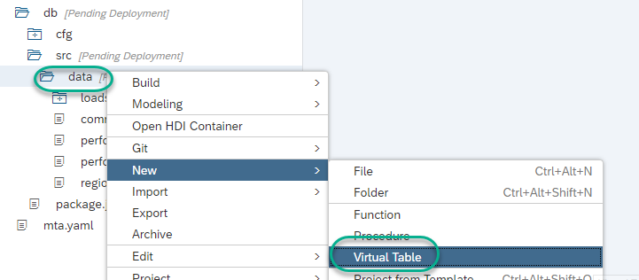

Call it `vt_salary_data` and flag **Generate configuration file**

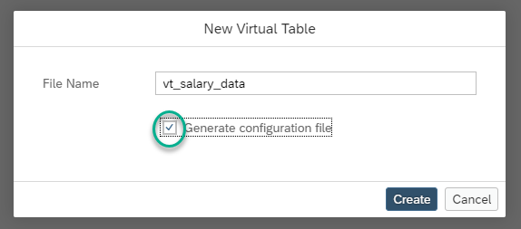

Fill the Properties as follows:

  - Remote Source Name: `LocalFile`
  - Database and Schema name: `<NULL>`
  - Object Name: `salarydata`

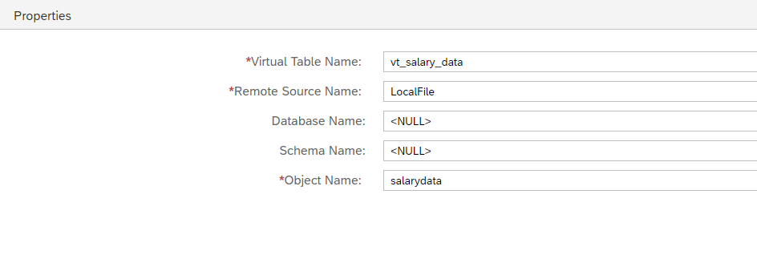

**Save** and open the **File Format Editor**

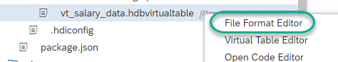

Here you can adapt the inbound file format. Change  **Skipped Header Lines** to 1.

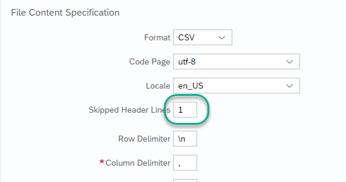

Copy the following lines to the simulation and run it. These have been taken from the `salarydata.csv` file

```text
ID,SALARY,START_YEAR,GENDER,REGION,T-LEVEL
100001,139171,1998,m,APJ,T5
```

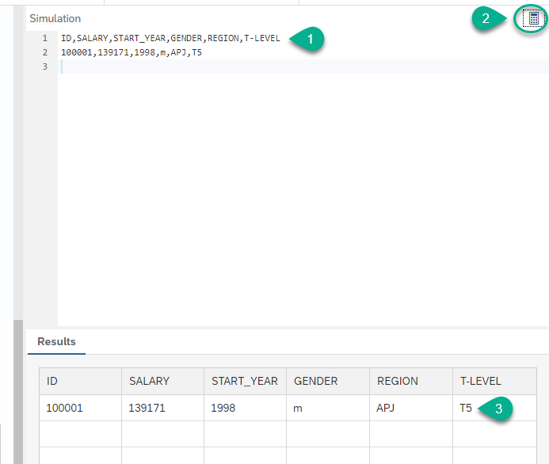

Use the **Copy** function and then use the pencil to edit the data types

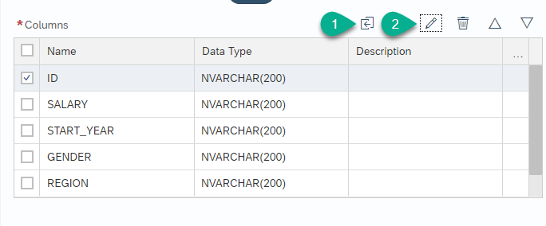

Change the types as follows:

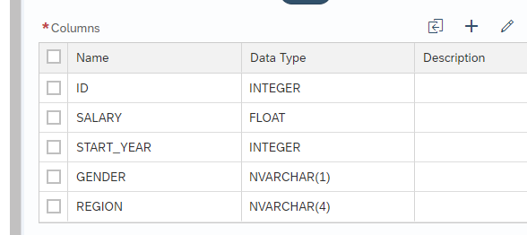

**Save** and **Build** the database module

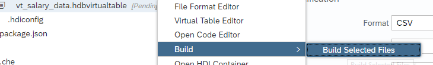


> As a reference, here is the code for the virtual table. You can access this mode by right-clicking on the virtual table artifact and choosing **Open Code Editor**.
>
> ```text
> VIRTUAL TABLE "vt_salary_data" AT "LocalFile"."<NULL>"."<NULL>"."salarydata"
REMOTE PROPERTY 'dataprovisioning_parameters'='<?xml version="1.0"  encoding="UTF-8" standalone="yes"?>
<Parameters>
<Parameter name="FORMAT">CSV</Parameter>
<Parameter name="FORCE_FILENAME_PATTERN">%.csv</Parameter>
<Parameter name="PARTITIONS">0</Parameter>
<Parameter name="CODEPAGE">utf-8</Parameter>
<Parameter name="LOCALE">en_US</Parameter>
<Parameter name="SKIP_HEADER_LINES">1</Parameter>
<Parameter name="ROW_DELIMITER">\n</Parameter>
<Parameter name="QUOTED_TEXT_CONTAIN_ROW_DELIMITER">false</Parameter>
<Parameter name="COLUMN_DELIMITER">,</Parameter>
<Parameter name="EXPONENTIAL">E</Parameter>
<Parameter name="LENIENT">true</Parameter>
<Parameter name="COLUMN">ID;INTEGER;</Parameter>
<Parameter name="COLUMN">SALARY;FLOAT;</Parameter>
<Parameter name="COLUMN">START_YEAR;INTEGER;</Parameter>
<Parameter name="COLUMN">GENDER;NVARCHAR(1);</Parameter>
<Parameter name="COLUMN">REGION;NVARCHAR(4);</Parameter>
<Parameter name="COLUMN">T-LEVEL;NVARCHAR(200);</Parameter>
</Parameters>';
>```

[DONE]
[ACCORDION-END]


[ACCORDION-BEGIN [Step 2: ](Create a Flowgraph artifact)]

Create a new `Flowgraph` in `db/data`

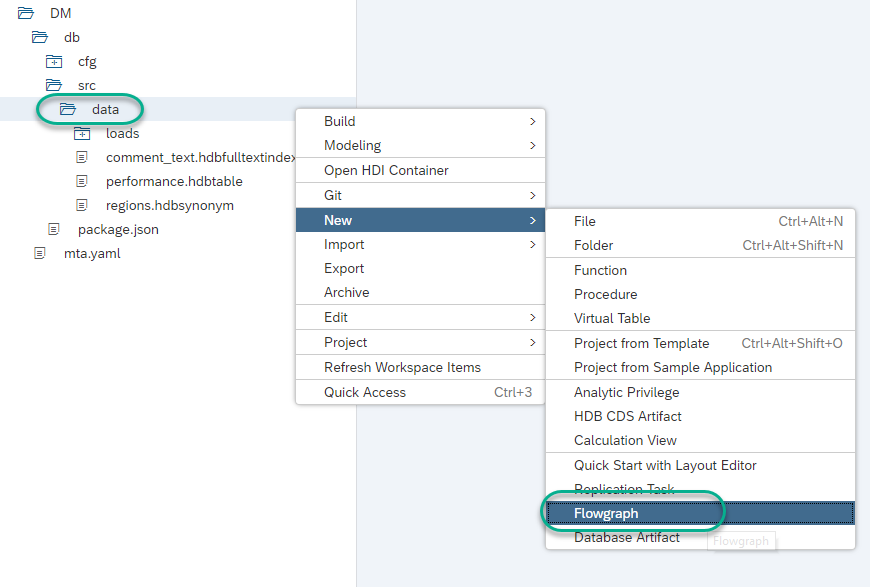

Call it `salary_flow`

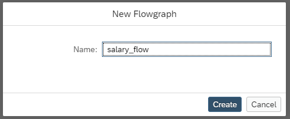

[DONE]
[ACCORDION-END]

[ACCORDION-BEGIN [Step 3: ](Add the data source)]

Click on the **+** button to add a node

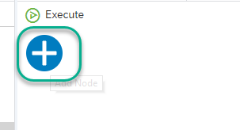

Choose **Data Source**  

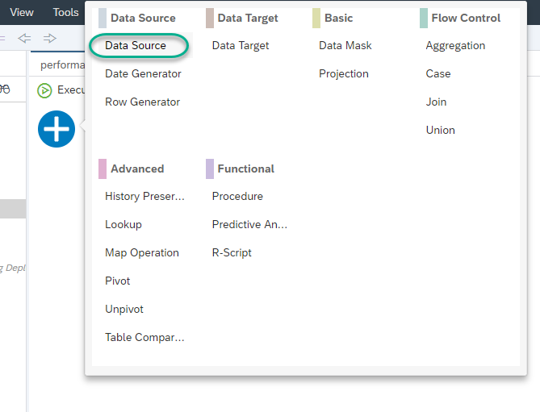

Click on the canvas to drop the node and then click **configure**

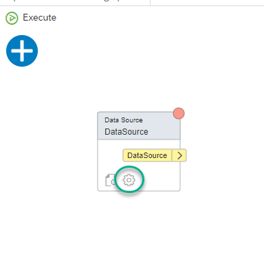

Choose **HANA Object**

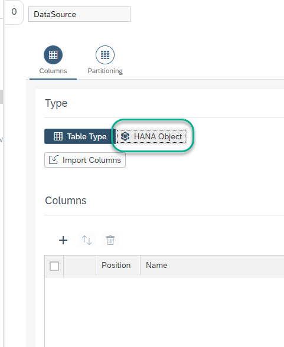

Look for the virtual table `vt_salary_data`. Choose it and click **Create**.

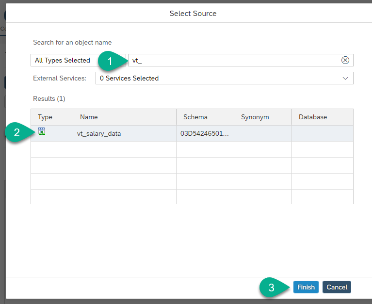

Mark all the control fields and delete them

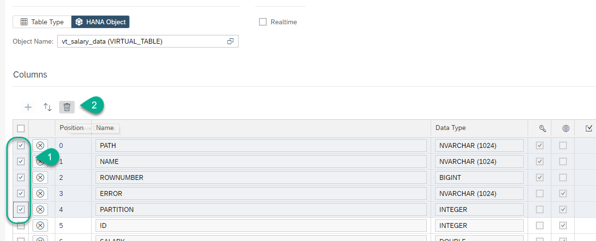

Click **Apply**

[DONE]
[ACCORDION-END]


[ACCORDION-BEGIN [Step 4: ](Add a Data Target)]

Use the **+** sign to create a data target and drag the arrow from  the source to the target

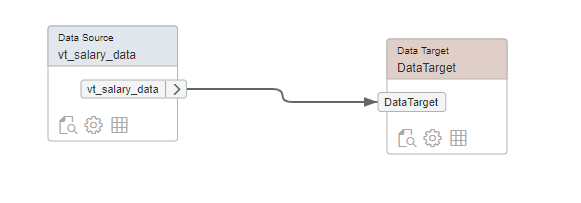

Click **Configure** on the target node

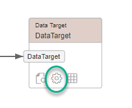

The target mapping should be populated automatically using the source. Use `TGT_SALARIES` as the name of the target table.

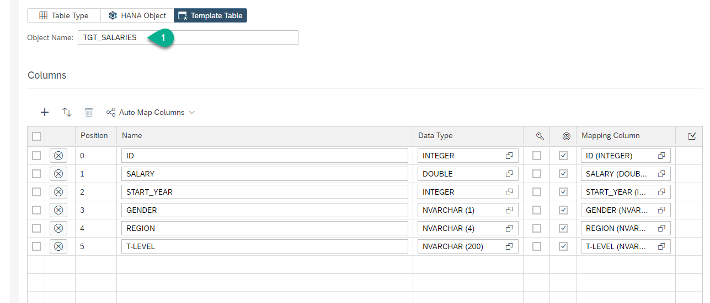

**Save and build** the Flowgraph.

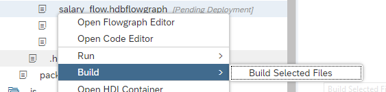

[DONE]
[ACCORDION-END]

[ACCORDION-BEGIN [Step 5: ](Execute the Flowgraph)]

Click on **Execute** in the Flowgraph.

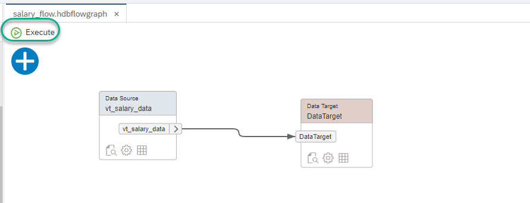

Confirm the warning

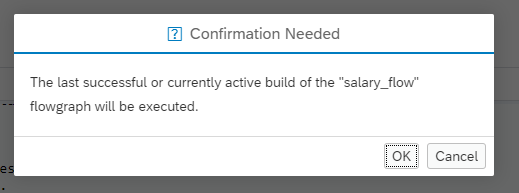

You will see a success message in the console

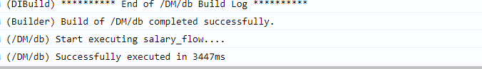

[DONE]
[ACCORDION-END]

[ACCORDION-BEGIN [Step 6: ](Check data)]

Right-click on the database module and choose **Open HDI Container**

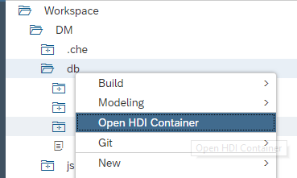

In the HDI container, navigate to **Tables** and you will find the table created by the flowgraph. Right-click on it and choose **Open Data**

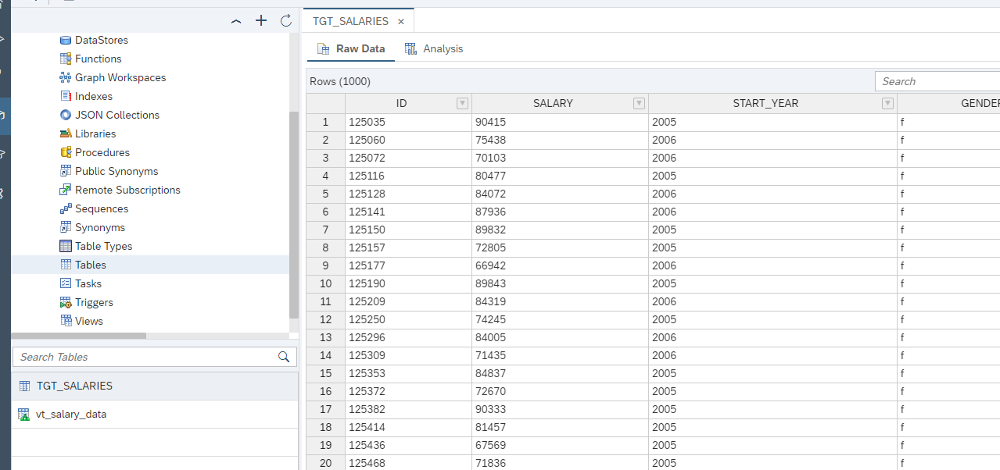

Use 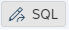 **Edit SQL statement** to modify the select statement for a `SELECT COUNT(*)`. Count the total records to complete the validation below

[VALIDATE_1]
[ACCORDION-END]


---
