## Prerequisites
 - You have a productive account with entitlement to the SAP HANA Service in Cloud Foundry
 - You have [downloaded and configured the Command Line Interface](https://developers.sap.com/tutorials/cp-cf-download-cli.html)


## Details
### You will learn
  - How to use the SAP Cloud Platform Cockpit as a graphical tool to provision your instance
  - How to use the Command Line Interface (CLI) for Cloud Foundry to check the creation progress of your instance

>**This tutorial cannot currently be completed with a trial account.**

---

[ACCORDION-BEGIN [Step 1: ](Access the Cloud Foundry account)]

Open Google Chrome and navigate to the [SAP Cloud Platform Cockpit](https://account.hana.ondemand.com/). Click **Log On**.

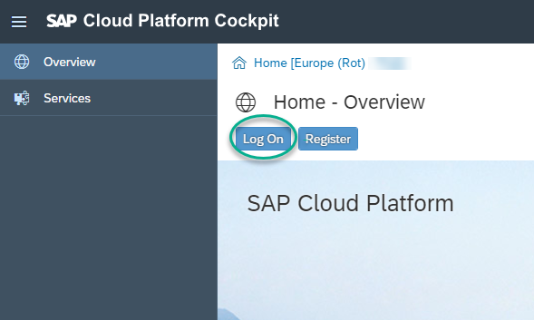

Log in with your username and password.

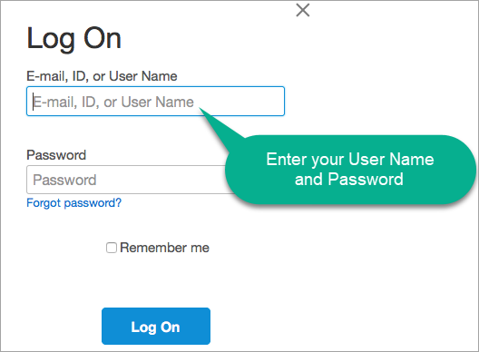

Close the *News and announcements* popup if it appears.

Click on **Cloud Foundry**.

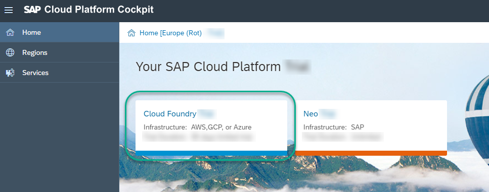

Click on the subaccount.

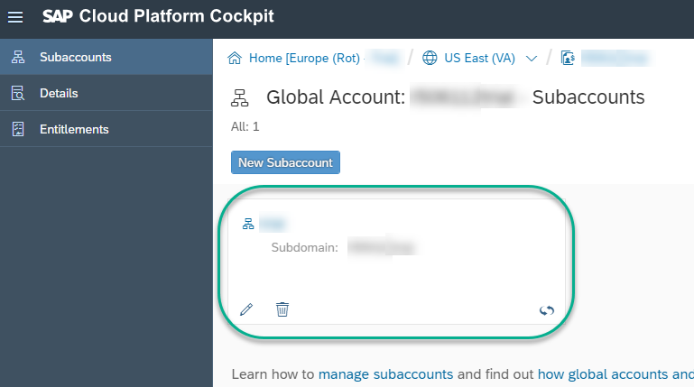

[DONE]
[ACCORDION-END]

[ACCORDION-BEGIN [Step 2: ](Create a new instance of SAP HANA Service)]

Click on **Spaces**.

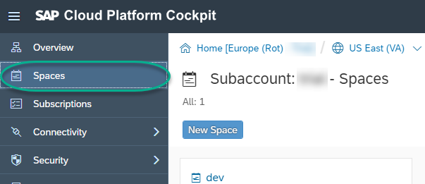

Click on the **dev** space.

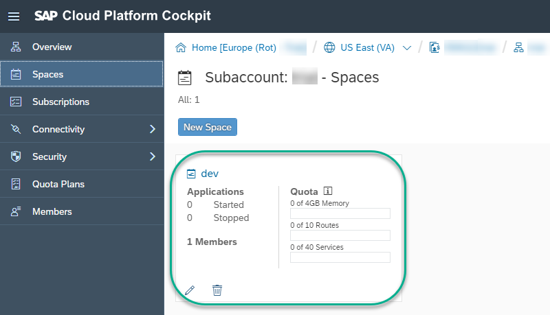

Navigate to **Services** -> **Service Marketplace**. Click on **SAP HANA Service**.


Navigate to **Instances**. Click on **New Instance**.

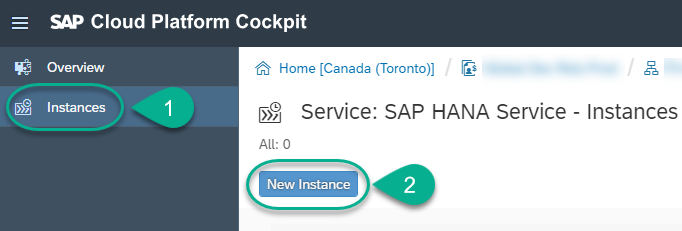

Choose **enterprise** as your plan and then click **Next**.

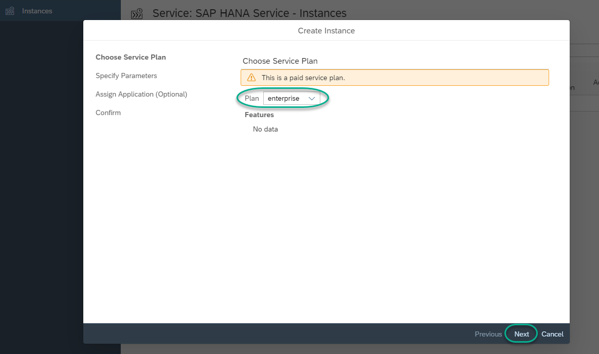

Set `HanaRocks1` as a password. Click **Next**.

>**Note**: This is just a sample password. We recommend choosing a password you will remember as you will not be able to reset it if you forget.

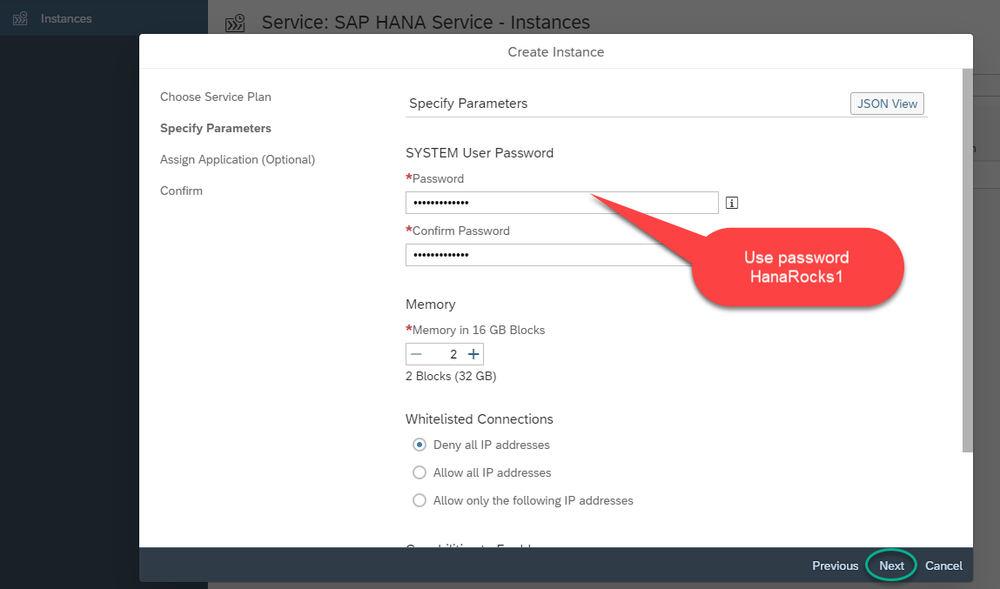

When prompted to bind an application, leave **(None)** and click **Next**.

>**Note**: No binding would happen for the database.

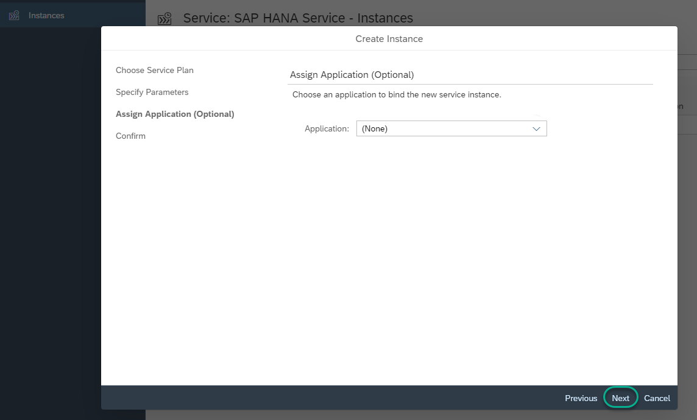

Use `HDB` for the **Instance Name**. Click **Finish**.

>**Note**: This is just a sample name for the database.

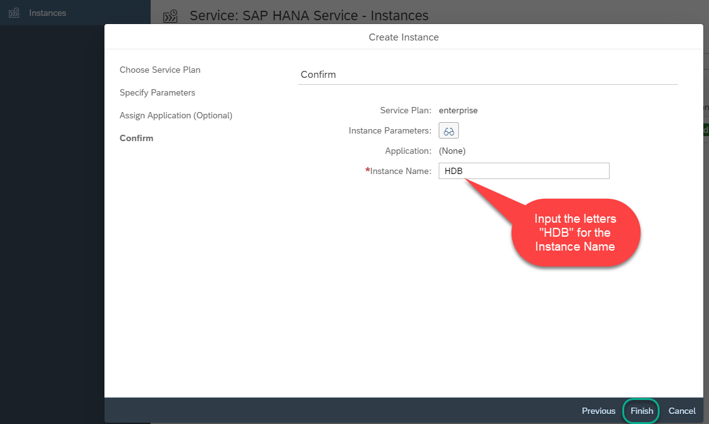

When prompted, click **OK**.

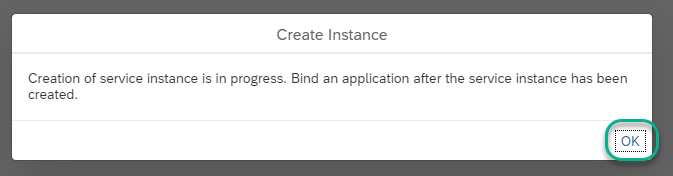

The creation of the instance will be in progress.

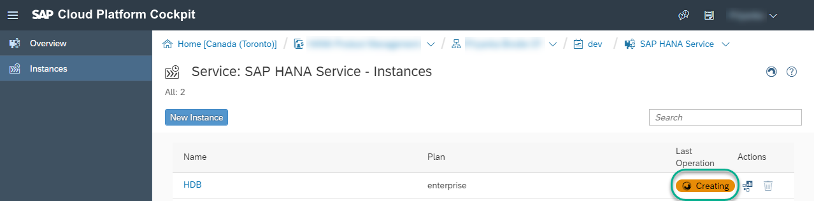

> The service could also be created using the Command Line Interface for Cloud Foundry. Here is a sample command in a Windows console:
> ```ssh
> cf create-service hana-db enterprise HDB -c {	"productProperties": {		"hcu": "2",		"SourceIP": "",		"scriptserver": true,		"dpserver": true,		"docstore": true, "SystemPassword": "HanaRocks1"	}}
> ```
> Check the [SAP Help](https://help.sap.com/viewer/d4790b2de2f4429db6f3dff54e4d7b3a/Cloud/en-US/b7775aafc2de4534a00a38a7d8cd1f6b.html) for more information about creating service instances using the command line interface.


[DONE]
[ACCORDION-END]


[ACCORDION-BEGIN [Step 3: ](Check for service deployment progress in the CLI)]


Use the following commands to list the available services and check the status of your own database being provisioned:

> ```ssh
> cf services
> cf services HDB
> ```

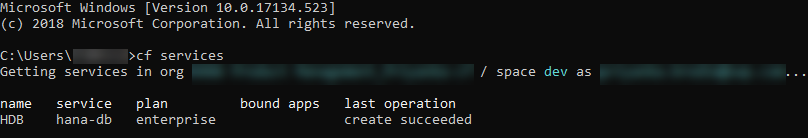

[VALIDATE_1]
[ACCORDION-END]

---
