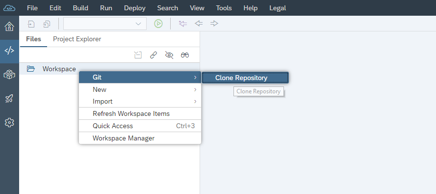
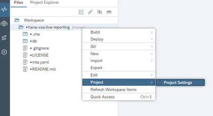
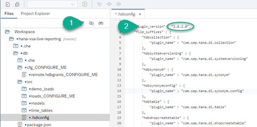
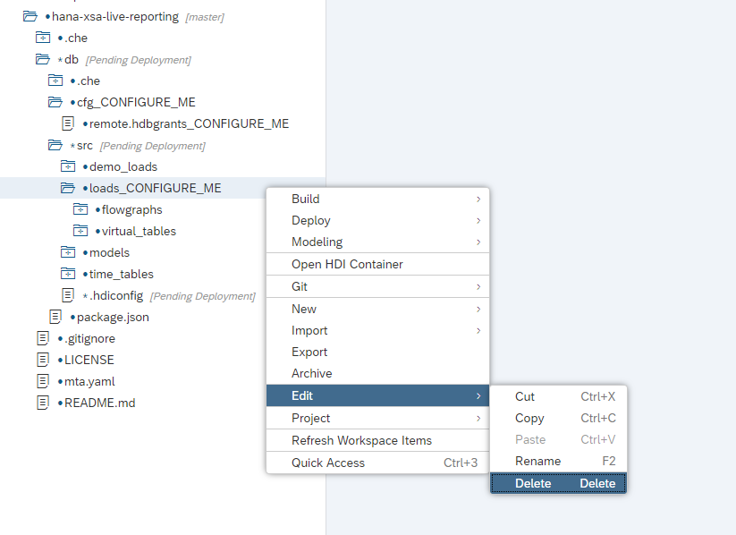
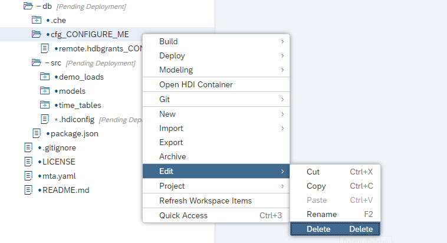
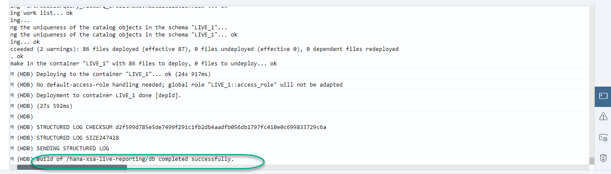
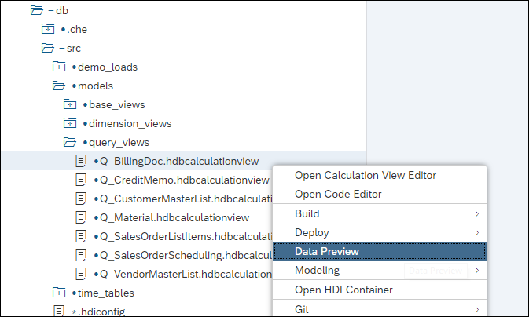

## Prerequisites
 - This tutorial is designed for SAP HANA service for SAP Business Technology Platform. Consider newer tutorials designed for SAP HANA Cloud.
 - You have a productive instance of the [SAP HANA service for SAP BTP on SAP BTP, Cloud Foundry environment](group.hana-service-setup) **or** have signed up for a [SAP BTP trial account](hcp-create-trial-account) **or** an on-premise instance of SAP HANA with XS Advanced (e.g., [SAP HANA, express edition](https://developers.sap.com/topics/hana.html))
 - You will need administration access to a tenant SAP Analytics Cloud to import the pre-built models

>**This tutorial cannot currently be completed with a trial account.**

## Details
### You will learn
  - How to import and deploy the template calculation views into SAP HANA using SAP Web IDE
  - How to remove the pre-built artifacts for Smart Data Integration to explore the templates using the test data

**If you would like to deploy the SAP HANA Operational Reporting Templates for  SAP ERP Central Component (ECC) including the artifacts to integrate with an SAP ERP Central Component system, refer to the [instructions in the repository](https://github.com/SAP-samples/hana-xsa-live-reporting/blob/master/README.md)**

---

[ACCORDION-BEGIN [Step 1: ](Clone repository)]

Right-click on the workspace in SAP Web IDE and choose `Git -> Clone Repository`



Enter the following repository:

```text
https://github.com/SAP-samples/hana-xsa-live-reporting
```


> If you are using the SAP BTP trial and get the error `No hdi-shared plan available found in this space`, switch to the `EU10` region. Check this [blog post](https://blogs.sap.com/2019/04/16/how-to-change-the-region-in-your-cloud-foundry-trial/) for instructions on changing the region.
> Right-click on the repository and choose `Project -> Project Settings` to change the space where it is deployed
> 

</br>

> If you get an error, stating version `2.0.2.0 (installed) is incompatible with 2.0.40.0` in the SAP BTP trial account, change the plugin version in the hidden file `.hdiconfig`
> 

[DONE]
[ACCORDION-END]

[ACCORDION-BEGIN [Step 2: ](Remove data replication artifacts)]

This repository includes virtual tables and `flowgraphs` to replicate data from an SAP ECC system. You will use the sample data instead.

> If you want to deploy the replication artifacts, you will need to configure cross-container access. Follow the instructions in [the README file in the repository](https://github.com/SAP-samples/hana-xsa-live-reporting/blob/master/README.md)

Remove the artifacts related to replication. Right-click on `db/src/loads_CONFIGURE_ME` and delete it.

> 

Remove the folder `db/cfg_CONFIGURE_ME`

> 

[DONE]
[ACCORDION-END]


[ACCORDION-BEGIN [Step 3: ](Build and preview the calculation views)]

Right-click on the `db` folder and choose **Build**.

> 

The build log should show a successful deployment. You can scroll up to check for any errors.

> 

After successful deployment, you can preview the data in each of the models. For example:

> 

[DONE]
[ACCORDION-END]

[ACCORDION-BEGIN [Step 4: ](Install Information Access)]

If you are using a productive instance of the SAP HANA service for SAP BTP, you can use the Information Access (`InA`) protocol to connect with SAP Analytics Cloud or other reporting tools using the HTTP protocol for live connections.

Use these [instructions to deploy the XS Advanced HANA Analytics Adapter](https://blogs.sap.com/2019/04/24/connecting-the-sap-hana-service-on-cloud-foundry-to-sap-analytics-cloud-the-lazy-approach-pt1/) into the SAP BTP, Cloud Foundry environment.

**When configuring the connection from SAP Analytics Cloud, call it `HANALIVE`**.

> Note: For on-premise SAP HANA systems or SAP HANA, express edition, follow the instructions in this [series of blog posts](https://blogs.sap.com/2018/12/24/from-zero-to-analytics-pt1-setting-up-your-own-sap-hana-instance/) instead.

Once connected you can continue by creating reports in SAC to consume the Calculation Views deployed in earlier steps.

[DONE]
[ACCORDION-END]

---
