## Prerequisites
 - You are at the Developer Garage and your workstation has a number assigned to it.

## Details
### You will learn
  - How to log into SAP Web IDE
  - How to clone a pre-configured project and edit it to create your own application

**This mission can only be completed at SAP TechEd.**

---

[ACCORDION-BEGIN [Step 1: ](Log into the SAP Community)]

Register or log into the SAP Community. This will allow you to track progress of the tutorials and earn prizes at the Developer Garage.


[DONE]
[ACCORDION-END]

[ACCORDION-BEGIN [Step 2: ](Log into SAP Cloud Platform)]

Open a new incognito window in Google Chrome.

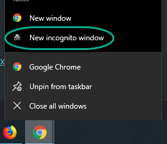

Navigate to <https://account.hana.ondemand.com/>, and click **Log in**.

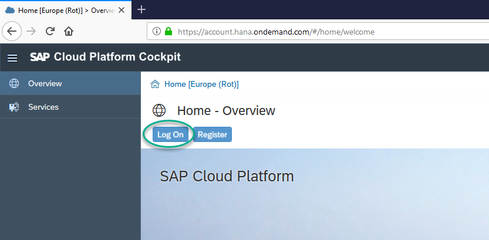

You will find a number assigned to your terminal at the App Space.

Use the following email -- **Replace the XXX placeholder with the number assigned to your terminal**:

```Email
dat365-XXX@teched.cloud.sap
```

Use the password: **Welcome19**


[DONE]
[ACCORDION-END]


[ACCORDION-BEGIN [Step 3: ](Open SAP Web IDE)]

Navigate into the global account ...

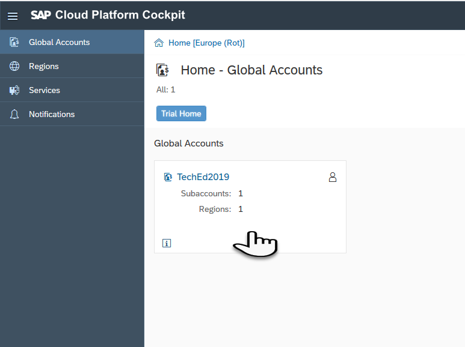

... and then into the **Neo** subaccount.

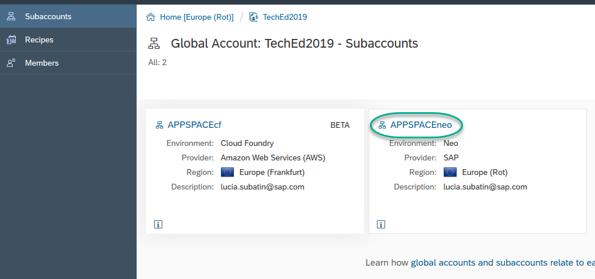

In **Services**, click **SAP Web IDE Full-Stack**.

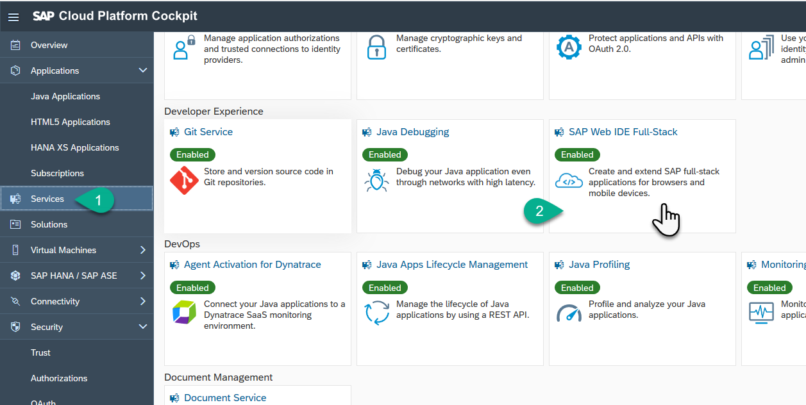

Click **Go to Service**.

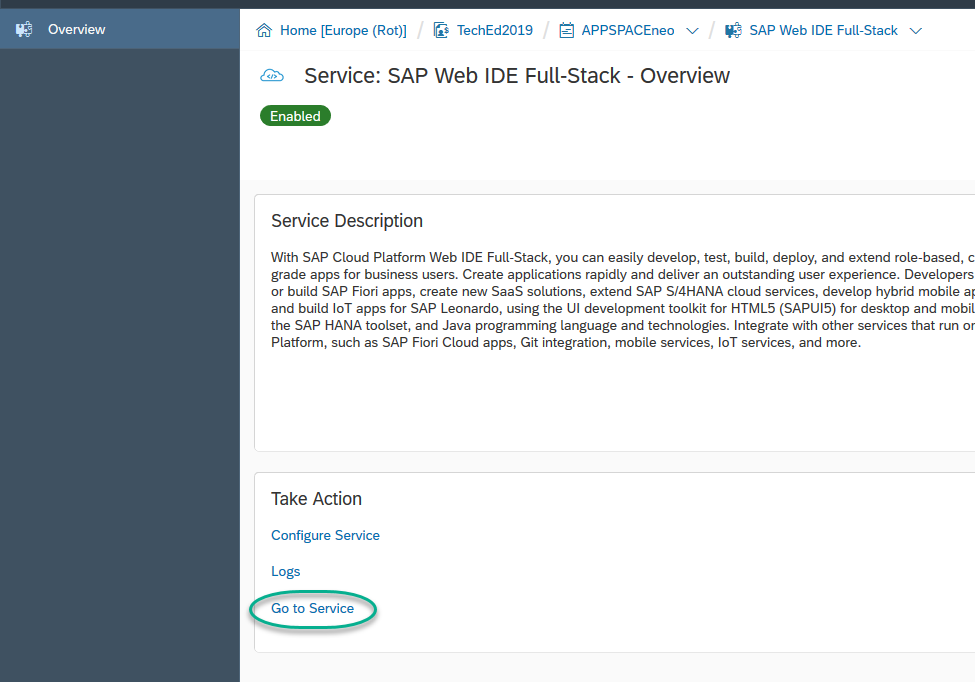

SAP Web IDE Full-Stack opens in a new window. Log in with the same credentials if prompted:


**User**:
```text
dat365-XXX@teched.cloud.sap
```

**Password**: Welcome19


[DONE]
[ACCORDION-END]

[ACCORDION-BEGIN [Step 4: ](Clone a project)]

Make sure you are in the development perspective.

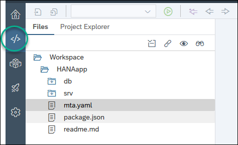

If you see any open tabs, **close them**.

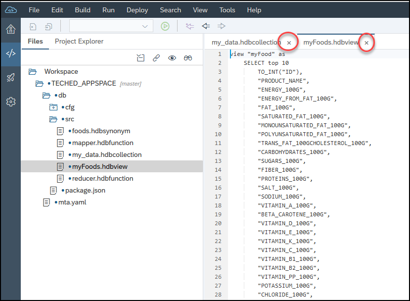

If you see an existing project, remove it by right-clicking on it and choosing **Edit > Delete**.

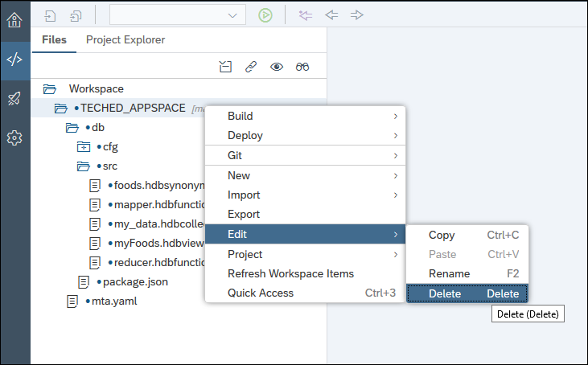

Right-click on the workspace and choose **Git > Clone Repository**.

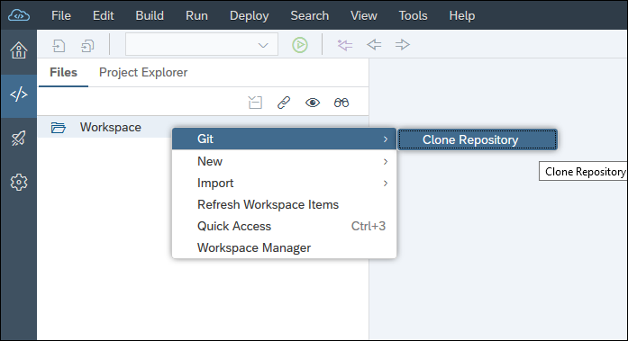

Clone the following repository:

```Repository
TBC - pending approval
```

[DONE]
[ACCORDION-END]

[ACCORDION-BEGIN [Step 5: ](Configure the project for your user)]

Expand the contents in the project. Right-click on the file `mta.yaml` and choose **Open Code Editor**.

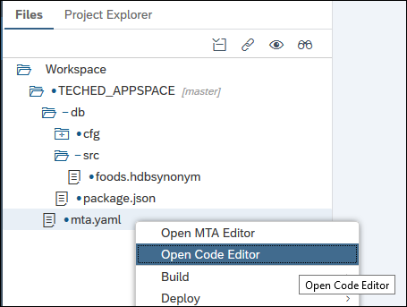

Press **CTRL+H** and paste the following in the **Search for** input:

```Text
<<XXX>>
```
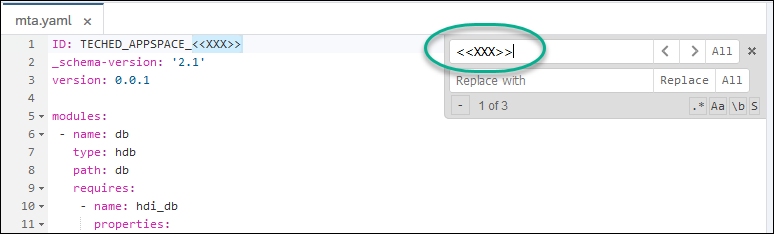

Enter your assigned number in the **Replace with** box. **Remember to include the leading 0** if you have one.

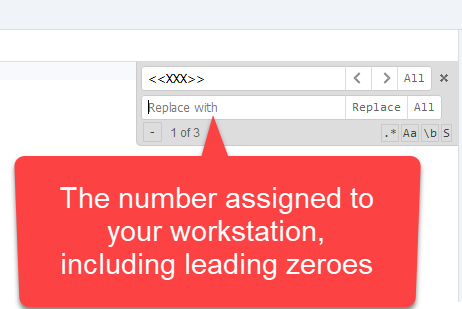

Click **Replace All**.

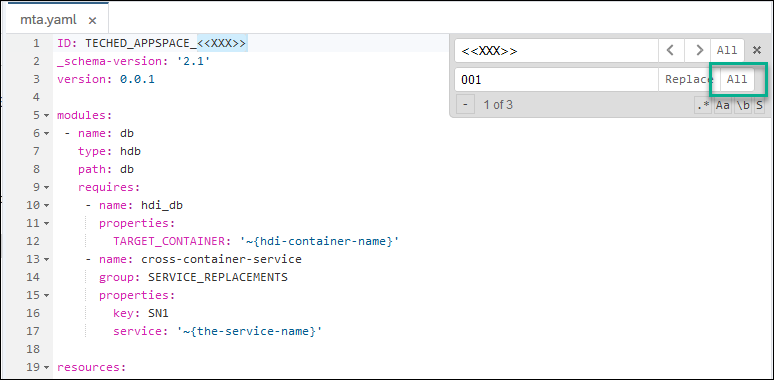

Save the `mta.yaml` file.

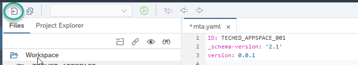

[DONE]
[ACCORDION-END]

[ACCORDION-BEGIN [Step 6: ](Build the project)]

Right-click on the `db` module and choose **Build**.

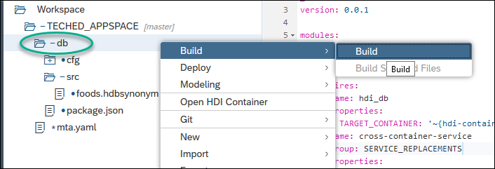

Check the last two lines of the build log to complete the validation below.

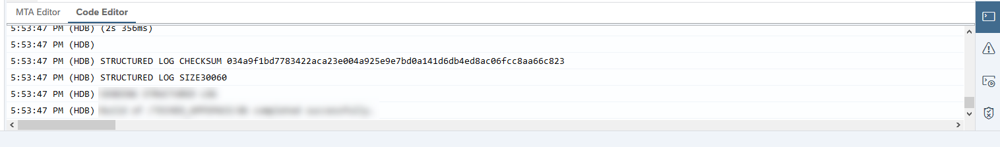


[VALIDATE_1]
[ACCORDION-END]


---
