## Prerequisites
 - You have [cloned a project into SAP Web IDE for Full Stack](hana-advanced-analytics-teched-1)


## Details
### You will learn
  - How to create a database view
  - How to use fuzzy search on a text column

**This mission can only be completed at SAP TechEd.**

---

[ACCORDION-BEGIN [Step 1: ](Explore the data)]

The project you have just cloned is using tables in a shared HDI container, which you can access through synonyms

Right-click on the `db` folder and choose **Open HDI container**

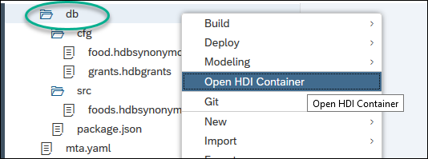

You should see your own HDI container. Click on **Synonyms**. Choose the table `COMM_FOODS` and then click **Generate SELECT statement**

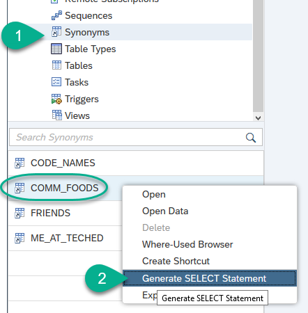

Scroll all the way down to the `FROM` statement to answer the validation below

[VALIDATE_1]
[ACCORDION-END]

[ACCORDION-BEGIN [Step 2: ](Choose your favorite food)]

Press `F8` or click  to execute the statement. You will see some of the foods included in the table.

Think of your favorite food, replace the placeholder below and introduce the following into fuzzy search as a where clause to look for it

```sql
where contains(product_name, '<<YOUR FAVORITE FOOD HERE>>', fuzzy(0.8,'textsearch=compare'))
AND to_nvarchar("PURCHASE_PLACES") <> 'NULL';

```

**Run**  the statement and make sure you get results.

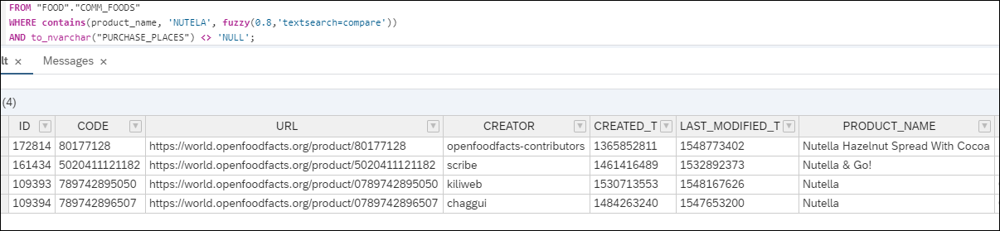

If you do not get any results, try a different food item or use the same example. Leave this SQL tab and results open.

Note how the ingredients are a long text separated by commas.

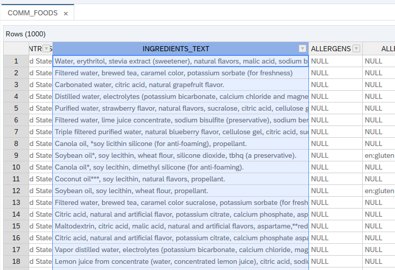


> ## What is going on?
> You can see the fuzzy search in action. This is part of the definition of the table you are querying:
>
>  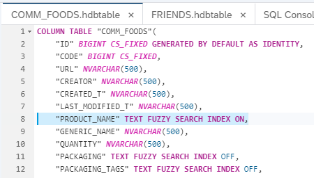
>
> Notice the `FUZZY SEARCH ON` addition to the text field that allows you to search for a word and get similar results regardless of typos and case.


[DONE]
[ACCORDION-END]

[ACCORDION-BEGIN [Step 3: ](Create a view)]

Go back into the development view. Right-click on `db/src` and choose **New -> File**.

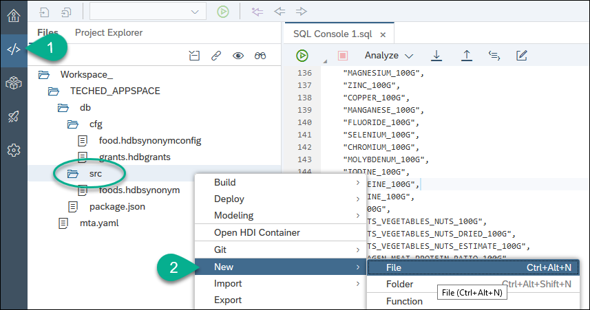

Input the following name to create the design-time artifact for a view using SQL DDL:

```text
data/myFood.hdbview
```

Click **OK** to create both a folder and a file to define your view:

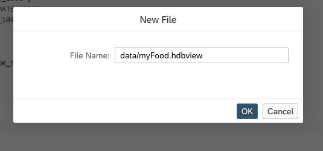

The goal of this view is to get a limited list of foods containing your search term or a similar word.

Paste the following content into the file

```SQL
view "myFood" as
	SELECT top 10
		TO_INT("ID") as "ID",
    "PRODUCT_NAME",
  	"GENERIC_NAME",
  	"QUANTITY",
  	"CITIES",
  	"CITIES_TAGS",
  	"PURCHASE_PLACES",
  	"STORES",
  	"COUNTRIES",
  	"INGREDIENTS_TEXT",
  	"ALLERGENS",
  	"ALLERGENS_TAGS",
  	"TRACES",
  	"TRACES_TAGS",
  	"SERVING_SIZE",
  	"SERVING_QUANTITY",
  	"NO_NUTRIMENTS",
  	"NUTRITION_GRADE_FR",
  	"MAIN_CATEGORY"
  FROM "COMM_FOODS"
  WHERE ...
```

Complete the `where` clause with the SQL statement you executed in the previous step

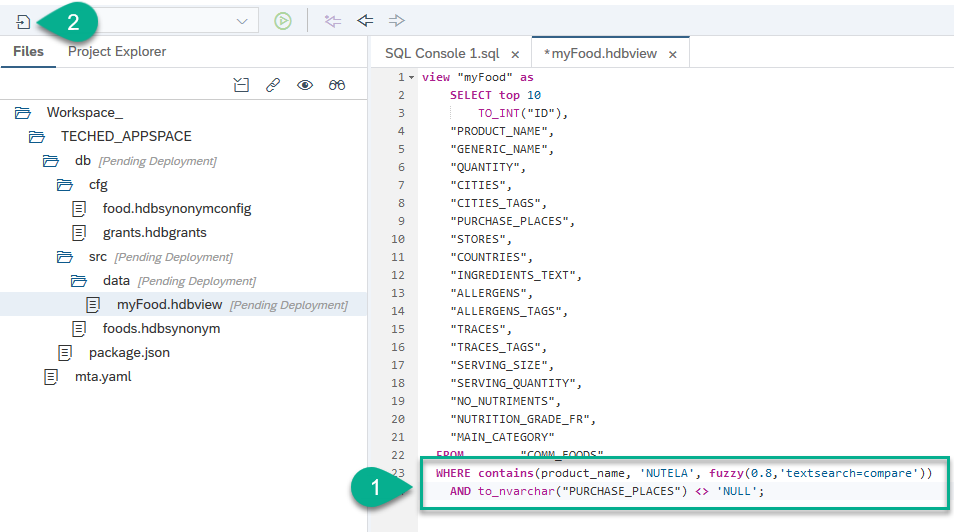

**Save** the view.

[DONE]
[ACCORDION-END]

[ACCORDION-BEGIN [Step 4: ](Build the view)]

It is now time to physically create the view in the database. Right-click on the definition of the view and choose **Build**

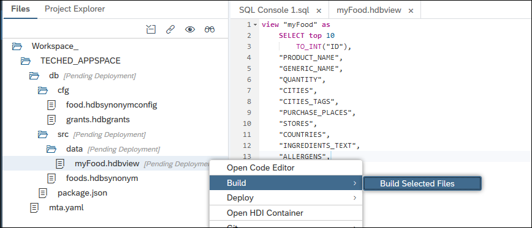

Make sure the build has been successful

[DONE]
[ACCORDION-END]

[ACCORDION-BEGIN [Step 5: ](Check the view)]

Go back into the **Database Explorer**. Right-click on your view and choose **Open Data**

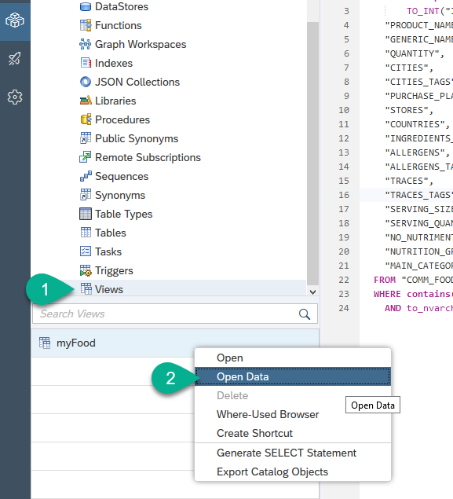

Click on **SQL** and copy the SELECT statement into the validation box below

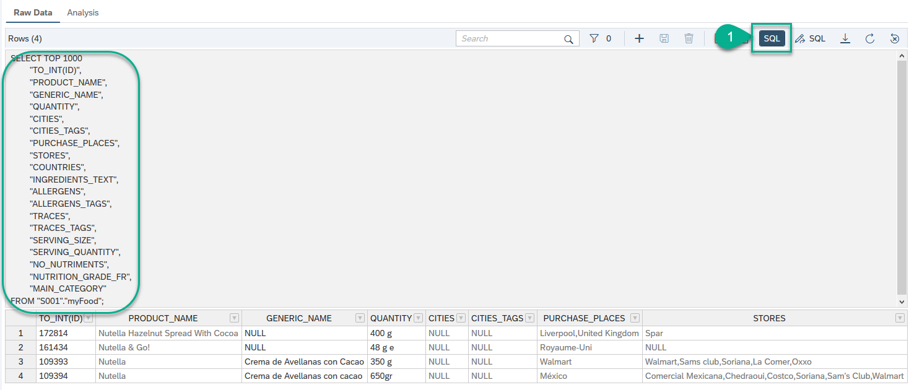

[VALIDATE_2]
[ACCORDION-END]

---
