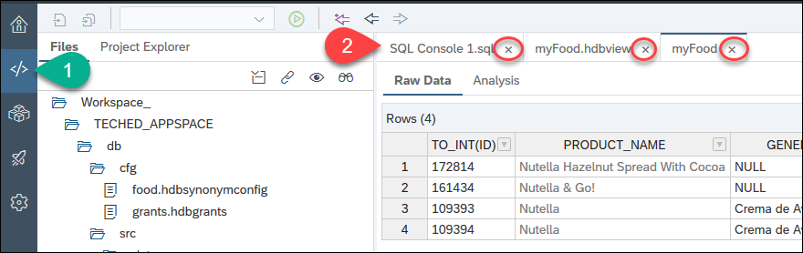
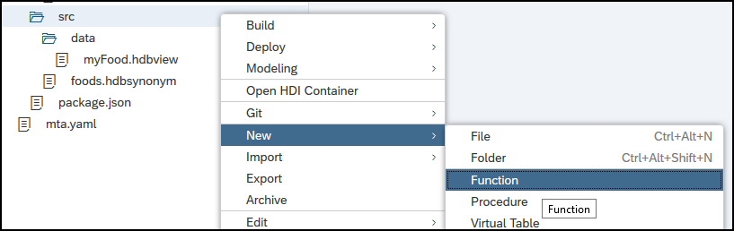
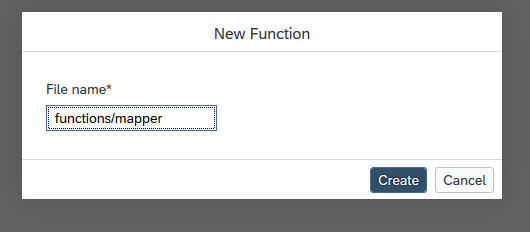
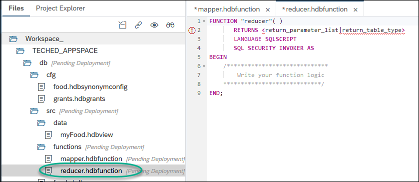
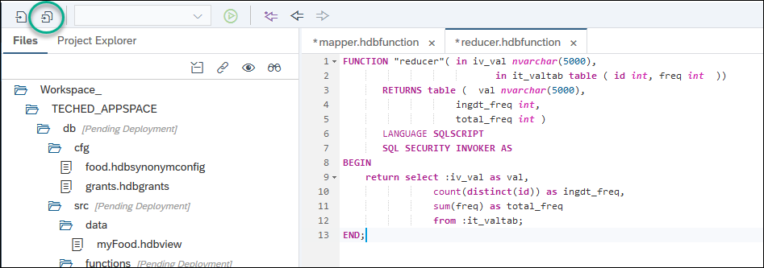
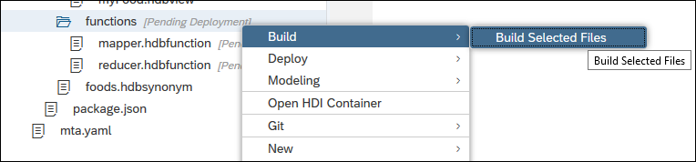
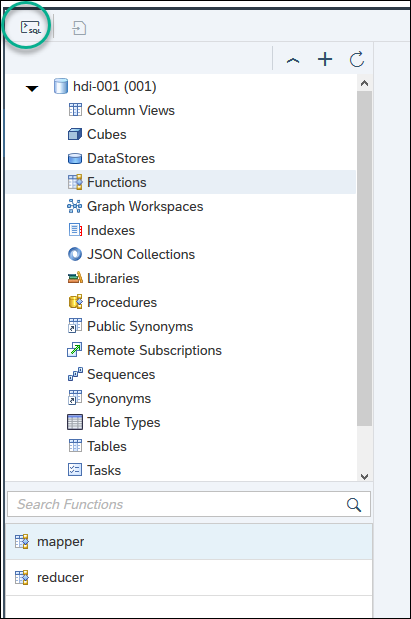

## Prerequisites
 - You [have created a view to search for your favorite food items](hana-advanced-analytics-teched-2)

## Details
### You will learn
  - How to create functions
  - How to use Map Reduce to process large amounts of data in parallel


  **This mission can only be completed at SAP TechEd.**

---

[ACCORDION-BEGIN [Step 1: ](Create a mapper function)]

You can now return to the code and close open tabs.



Under `src`, create a new function by right-clicking on `src` and choosing **New -> Function**



Use the following name:

```text
functions/mapper
```

For example:



Replace the code with the following:

```sql
FUNCTION "mapper"( in iv_id int, in iv_text nvarchar(5000) )
       RETURNS table (id int, val nvarchar(5000), freq int)
       LANGUAGE SQLSCRIPT
       SQL SECURITY INVOKER AS
BEGIN


	USING sqlscript_string AS lib;

	DECLARE lt_split_result table(result nvarchar(5000));

	lt_split_result = lib:split_to_table(:iv_text, ',', 5000);
	RETURN SELECT iv_id AS id, RESULT AS val, count(result) AS freq
				FROM :lt_split_result GROUP BY result;

END;
```


[DONE]
[ACCORDION-END]

[ACCORDION-BEGIN [Step 2: ](Create a reduce function)]

In the new folder, `functions`, create a new function with the name `reducer`



Replace the contents with the following:

```sql
FUNCTION "reducer"( in iv_val nvarchar(5000),
						   in it_valtab table ( id int, freq int  ))
       RETURNS table (	val nvarchar(5000),
					ingdt_freq int,
					total_freq int )
       LANGUAGE SQLSCRIPT
       SQL SECURITY INVOKER AS
BEGIN
	return select :iv_val as val,
				count(distinct(id)) as ingdt_freq,
				sum(freq) as total_freq
				from :it_valtab;
END;

```
**Save** all files



[DONE]
[ACCORDION-END]


[ACCORDION-BEGIN [Step 3: ](Build the functions)]


Right-click on the `functions` folder and choose  **Build Selected Files**



Wait until the build has been successful

> ## What is going on?
>
> Map Reduce is a programming model to split large dataset into parts and process them in parallel, generally in different nodes in a cluster. The parts in the dataset are then reunited into a consistent output.
> You have created two functions. The first one, mapper, takes each list of ingredients from each record, and splits the ingredients into separate records in a table. You are using a reusable library to split text into a table. The function also counts the occurrences of an ingredient within a list. The `MAP_MERGE` operator then merges the results into a single table with the individual ingredient and its original ID.
> The second function, the reducer, will use each group of ingredient tables for each ID, process all groups and return the total count for those ingredients.

[DONE]
[ACCORDION-END]

[ACCORDION-BEGIN [Step 4: ](Test the functions)]

Go back into the database explorer and open a new **SQL** console



Use the following code to call both functions, using the view you created previously as input

```sql

do begin

  declare lt_input table(id int, ingredients_text nvarchar(5000));
  declare lt_result table(val nvarchar(5000), ingdt_freq int, total_freq int );
  declare lv_id int;

  lt_input = select id, to_nvarchar(INGREDIENTS_TEXT) as ingredients_text from "myFood";

    lt_result = map_reduce( :lt_input,
  						"mapper"(:lt_input.id, :lt_input.ingredients_text) group by val as map_result,
  						"reducer"(map_result.val, map_result));
  select * from :lt_result order by total_freq desc;

 end;
```

**Execute**  the code to complete the validation below.

[VALIDATE_1]
[ACCORDION-END]


---
