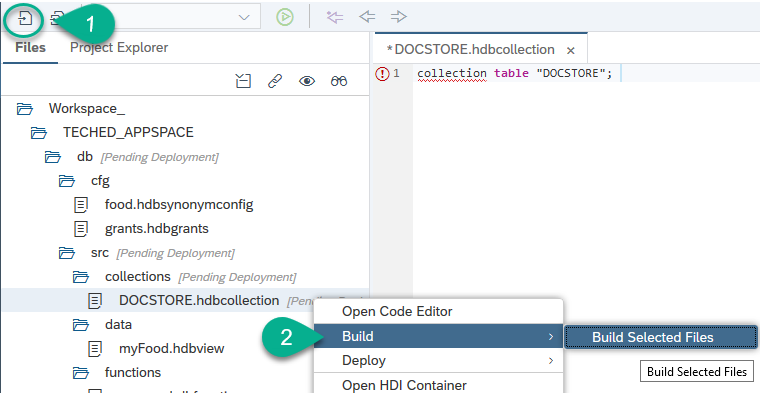
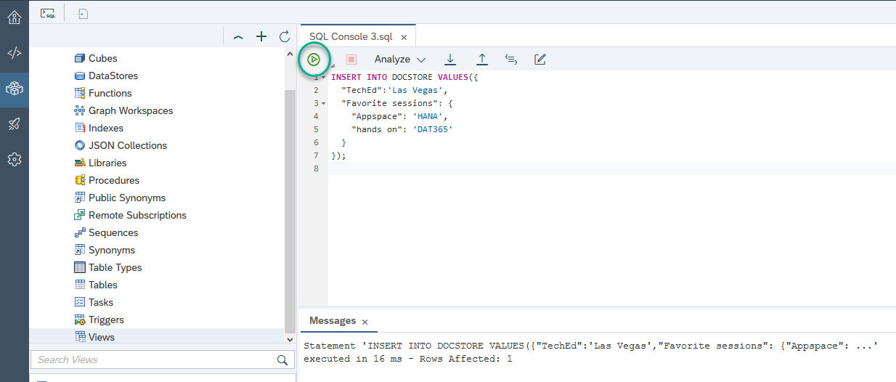
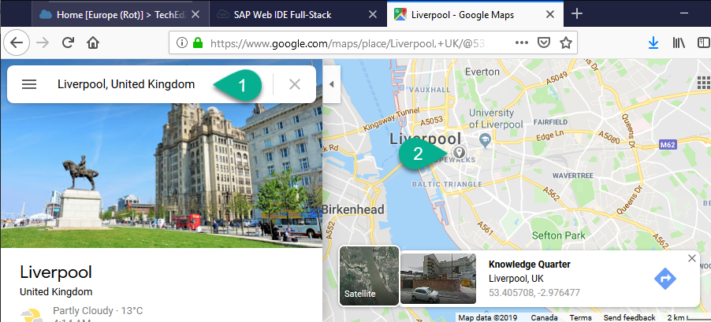
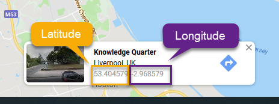
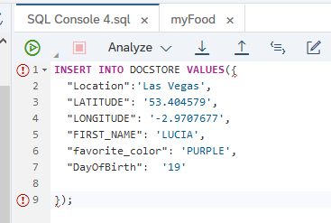
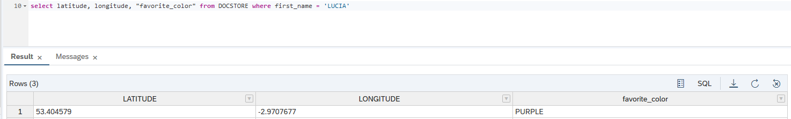
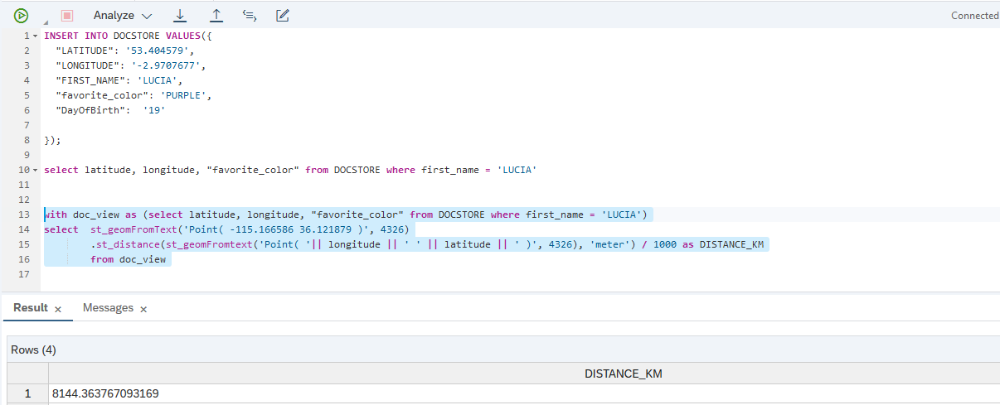

## Prerequisites
 - You [have created `MapReduce` functions](hana-advanced-analytics-teched-3).

## Details
### You will learn
  - How to create a JSON collection
  - How to use SQL to select and insert documents in the collection
  - How to combine the document store with a relational table in SAP HANA

**This mission can only be completed at SAP TechEd.**

---

[ACCORDION-BEGIN [Step 1: ](Create a collection)]

Go back into the development perspective. Under `src`, create a new **File** with the following name:

```Text
collections/DOCSTORE.hdbcollection
```
Enter the following text into it:

```SQL
collection table "DOCSTORE";
```

**Save** and **Build**.



[DONE]
[ACCORDION-END]

[ACCORDION-BEGIN [Step 2: ](Insert a document in the Document Store)]

You now have a document-oriented collection. Unlike a relational database, the _records_ (documents) inserted in this kind of storage are not structured.

Go back to the database explorer and open a new **SQL** console.

Insert your first document:

```SQL
INSERT INTO DOCSTORE VALUES({
  "TechEd":'Las Vegas',
  "Favorite sessions": {
    "Appspace": 'HANA',
    "hands on": 'DAT365'
  }
});
```

Execute the statement to insert the values.



[DONE]
[ACCORDION-END]


[ACCORDION-BEGIN [Step 3: ](Pick a place to purchase your favorite food)]

You will insert another document into your JSON collection. You will include geographical coordinates for the value in the field `PURCHASE_PLACES`.

Open the data preview for the `myFood` view and choose one of the cities or places in the records.


Open a new tab with [Google maps](https://www.google.com/maps) and look for the city of the record you chose. Pick a point in the map and **keep these results open** so you can use the coordinates in the next step.



[DONE]
[ACCORDION-END]

[ACCORDION-BEGIN [Step 4: ](Create a new record)]

Copy the following statement into the SQL console:

```SQL
INSERT INTO DOCSTORE VALUES({
  "LATITUDE": '53.404579',
  "LONGITUDE": '-2.9707677',
  "FIRST_NAME": ' ',
  "favorite_color": ' ',
  "DayOfBirth":  ' '

});
```

Use the latitude and longitude from Google maps to replace the sample latitude and longitude.



Fill in your first name, your favorite color and the day of your birthday. These values will be used to create your code name and transferred to the shared database.

For example:



Execute the statement to insert the values. Note how you are inserting a completely different set of values into the same collection.

[DONE]
[ACCORDION-END]

[ACCORDION-BEGIN [Step 5: ](Use a geospatial function to calculate distance)]

One of the features of the JSON document store in SAP HANA is that the documents can be queried using SQL and can also be combined with relational tables.

Use the  value of `FIRST_NAME` you used to insert a document in the previous step in the where clause to try this out.

```SQL
select latitude, longitude, "favorite_color" from DOCSTORE where first_name = '<<ENTER YOUR FIRST_NAME HERE>>'
```

For example:



You can now use the following SQL statement to calculate distance to your current location. The point is currently set to the SAP TechEd venue in Las Vegas.

```SQL
with doc_view as (select latitude, longitude, "favorite_color" from DOCSTORE where first_name = '<<ENTER YOUR FIRST_NAME HERE>>')
select	st_geomFromText('Point( -115.166586 36.121879 )', 4326)
        .st_distance(st_geomFromtext('Point( '|| longitude || ' ' || latitude || ' )', 4326), 'meter') / 1000 as DISTANCE_KM
		from doc_view

```

For example:



Execute the following statement to complete the validation. Note how the structures in both documents are completely different.

```SQL
select "Favorite sessions"."Appspace"
from docstore
where "TechEd" = 'Las Vegas'
```

[VALIDATE_1]
[ACCORDION-END]

---
