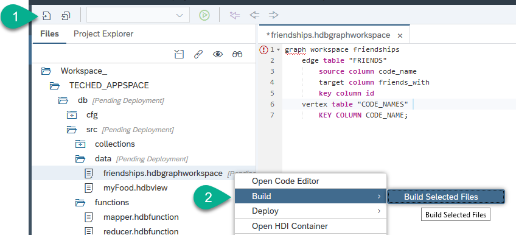
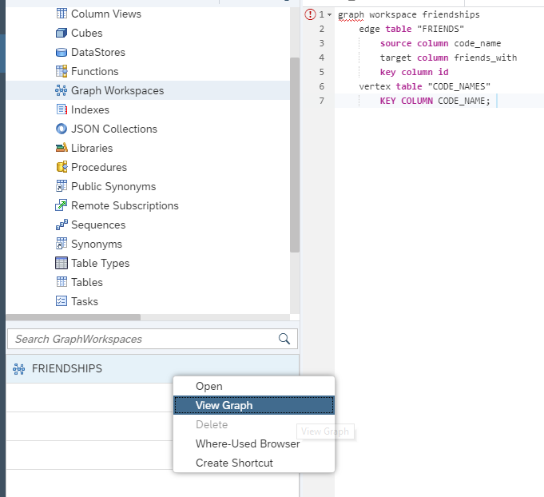
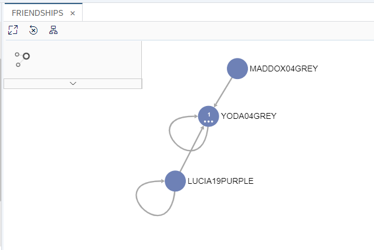

## Prerequisites
 - You [have created a document store](hana-advanced-analytics-teched-4).

## Details
### You will learn
  - How to create a graph workspace
  - How to insert a new node in the graph workspace

  **This mission can only be completed at SAP TechEd.**

---

[ACCORDION-BEGIN [Step 1: ](Create a graph)]

You can now create a graph that queries the tables you have as synonyms from the shared HDI container.

Go back to the development perspective. Under `src\data` create a new file called:

```Text
friendships.hdbgraphworkspace
```

Paste the following content into the file:

```SQL
graph workspace friendships
	edge table "FRIENDS"
		source column code_name
		target column friends_with
		key column id
	vertex table "CODE_NAMES"
		KEY COLUMN CODE_NAME;
```

**Save** and **Build**.



[DONE]
[ACCORDION-END]

[ACCORDION-BEGIN [Step 2: ](Explore the graph)]

You have built a graph using tables and views from a shared HDI container. Other participants who have already completed this mission have added themselves to these tables and are now connected in the graph.

Go into the database explorer. Locate the graph and preview it.



[DONE]
[ACCORDION-END]


[ACCORDION-BEGIN [Step 3: ](See who you are friends with)]

If you look at the definition of the graph, the code names are connected through a `friends with` relationship.

This relationship was established based on the most frequent ingredients of the food items chosen by each of the participants.

Use the following SQL statement to get the most frequent ingredients in your view using the Map Reduce functions and creating your code name from the data in the document store.

Replace the placeholders with your first name and day of birth. For example: 'LUCIA' and '19'.

```SQL

do begin

  declare lt_input table(id int, ingredients_text nvarchar(5000));
  declare lt_result table(val nvarchar(5000), ingdt_freq int, total_freq int );
  declare lt_res_docs table(first_name nvarchar(50), day_of_birth nvarchar(2), favorite_color nvarchar(10));
  declare lv_id int;
  declare lv_color nvarchar(100);
  declare lv_code_name nvarchar(100);
  declare lv_new_friend nvarchar(100) = '0';
  declare lv_main_ingredient nvarchar(100);
  declare lt_here table(code_name nvarchar(100));
  declare lv_count int = 0;


--Get foods from the view
  lt_input = select id, to_nvarchar(INGREDIENTS_TEXT) as ingredients_text from "myFood";

  select top 1 id into lv_id from :lt_input;

--Split ingredients in the food items in the view using map reduce functions
  lt_result = map_reduce( :lt_input,
  						"mapper"(:lt_input.id, :lt_input.ingredients_text) group by val as map_result,
  						"reducer"(map_result.val, map_result));
  select * from :lt_result order by total_freq desc;
--Get codename and favorite color from document store

 lt_res_docs = select "FIRST_NAME", "DayOfBirth" as day_of_birth,  "favorite_color" as favorite_color from DOCSTORE where first_name = '<<ENTER YOUR FIRST NAME HERE>>' and "DayOfBirth" = '<<ENTER YOUR DAY OF BIRTH HERE>>' limit 1;

 select ( first_name || day_of_birth ||  favorite_color ) into lv_code_name from :lt_res_docs limit 1;

 select  favorite_color  into lv_color from :lt_res_docs limit 1;

 ---Match existing friends with same ingredients
  select count(code_name) into lv_count from "ME_AT_TECHED" where ingredient in (select val from :lt_result);
  if lv_count > 0 then
	   select top 1 code_name into lv_new_friend from "ME_AT_TECHED" where ingredient in (select val from :lt_result) group by code_name;
  end if;

	if lv_new_friend = '0' then
		lv_new_friend = lv_code_name;
	end if;

   insert into "ME_AT_TECHED" (code_name, fav_food, ingredient, fav_color ) select :lv_code_name,  :lv_id, val, :lv_color from :lt_result ;

   insert into "FRIENDS" (code_name, friends_with) values (lv_code_name, lv_new_friend);

 end;

```

**Execute** the code.

[DONE]
[ACCORDION-END]

[ACCORDION-BEGIN [Step 4: ](Find yourself in the graph)]

Refresh the preview of the graph and you should see your code name there and who it is connected to.



Congratulations! Your code name is now also part of the shared graph.

[VALIDATE_1]
[ACCORDION-END]

---
