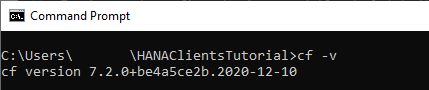
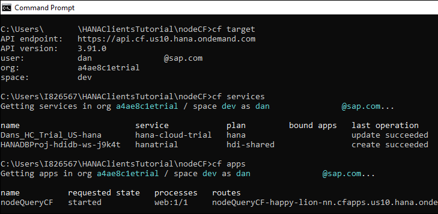
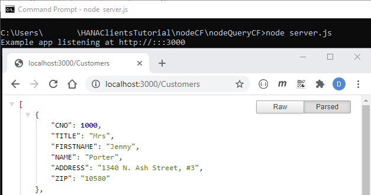

## Prerequisites
 - You have completed the first 4 tutorials in this mission

## Details
### You will learn
  - How to use the command line interface (CLI) to deploy a Node.js app to Cloud Foundry or XS advanced
  - How to view the logs and enable tracing in the deployed app

In the previous tutorials, applications that queried SAP HANA were run on a local machine.  In this tutorial, a simple application will be run within the SAP Cloud Platform which uses Cloud Foundry or within the SAP HANA, express edition which uses XS advanced (and is also based on Cloud Foundry).  For additional details, consult  [The XS Advanced Programming Model](https://help.sap.com/viewer/4505d0bdaf4948449b7f7379d24d0f0d/latest/en-US/df19a03dc07e4ba19db4e0006c1da429.html).  For a more complete example, see the Node.js topics in week 3 of [Software Development on SAP HANA](https://open.sap.com/courses/hana7).

---

[ACCORDION-BEGIN [Step 1: ](Get started with the Command Line Interface (CLI))]

The CLI for the SAP Cloud Platform is named `cf` while the CLI for SAP HANA, express edition is named `xs`.

1. Check to see if you have the CLI installed and verify the version.  

    ```Shell
    cf -v
    ```

      


    For additional details, see [Installing the CLI](https://tutorials.cloudfoundry.org/trycf/docs/cli/) and [Installing the cf CLI](https://docs.cloudfoundry.org/cf-cli/install-go-cli.html).

    ```Shell
    xs -v
    ```

      

    The installer for xs can be downloaded from [SAP Software Downloads](https://launchpad.support.sap.com/#/softwarecenter/support/index) under **SAP HANA PLATFORM EDITION | SAP HANA PLATFORM EDITION 2.0 | XS RUNTIME 1**.

2. Access help by running the following:

    ```Shell
    cf help
    cf help login
    ```

    ```Shell
    xs help
    xs help login
    ```

3. Log in to the Cloud Foundry or XS advanced.

    ```Shell
    cf login
    ```

    

    >If you are an SAP employee, you may need to enter your password plus a two-factor authentication passcode.

    The API URL, if requested, can be found in the [SAP Cloud Platform cockpit](https://account.hanatrial.ondemand.com/trial/).

      
    .

    ```Shell
    xs login
    ```

    

    The API URL if requested can be verified in the XSA is up app.

    

4. Additional examples are shown below to view the target information, running services, and deployed apps.

    ```Shell
    cf target
    cf services
    cf apps
    cf buildpacks
    ```

    ```Shell
    xs target
    xs services
    xs apps
    xs buildpacks
    ```

      

    Additional details can be found at [Getting Started with the cf CLI](https://docs.cloudfoundry.org/cf-cli/getting-started.html) and [Get Started with the XS CLI Client](https://help.sap.com/viewer/4505d0bdaf4948449b7f7379d24d0f0d/latest/en-US/c00ed3f74c12479e9f3a8cdeb6e1519a.html).    

[DONE]
[ACCORDION-END]

[ACCORDION-BEGIN [Step 2: ](Create and run a Node.js app that uses Express and queries SAP HANA)]

1.  Create a folder named `nodeCF` and enter the newly created directory.

    ```Shell (Microsoft Windows)
    mkdir %HOMEPATH%\HANAClientsTutorial\nodeCF\nodeQueryCF
    cd %HOMEPATH%\HANAClientsTutorial\nodeCF\nodeQueryCF
    ```

    ```Shell (Linux or Mac)
    mkdir $HOME/HANAClientsTutorial/nodeCF/nodeQueryCF
    cd $HOME/HANAClientsTutorial/nodeCF/nodeQueryCF
    ```

2.  Initialize the project, install [express](https://www.npmjs.com/package/express), and `@sap/hana-client` from NPM.

    ```Shell
    npm init -y
    npm install express
    npm install @sap/hana-client
    ```

3.  Open a file named `server.js` in an editor.

    ```Shell (Microsoft Windows)
    notepad server.js
    ```

    Substitute `pico` below for your preferred text editor.  

    ```Shell (Linux or Mac)
    pico server.js
    ```

4. Add the code below to `server.js`.  Update the values for host and port, user name and password.  

    ```JavaScript    
    var express = require('express');
    var hana = require('@sap/hana-client');
    var app = express();

    app.get('/', function (req, res) {
       res.send('Hello World');
    })

    app.get('/Customers', function (req, res) {
      var connOptions = {
          serverNode: 'XXXXXX.hana.trial-XXXXX.hanacloud.ondemand.com:443',
          //serverNode: 'linux-bj72:39015',
          UID: 'USER1',
          PWD: 'Password1'
          //traceFile: 'stdout',
          //traceOptions: 'sql=warning'
      };

      var connection = hana.createConnection();
      connection.connect(connOptions, function(err) {
          if (err) {
              return console.error(err);
          }
          var sql = 'select * from HOTEL.CUSTOMER;';
          var rows = connection.exec(sql, function(err, rows) {
              if (err) {
                  return console.error(err);
              }
              console.log(rows);
              res.send(rows);
              connection.disconnect(function(err) {
                  if (err) {
                      return console.error(err);
                  }   
              });
          });
      });
    })

    const port = process.env.PORT || 3000;
    var server = app.listen(port, function () {
       var host = server.address().address
       var port = server.address().port
       console.log("Example app listening at http://%s:%s", host, port)
    })
    ```

5. Run and test the app locally.

    ```Shell
    node server.js
    ```

    

[DONE]
[ACCORDION-END]


[ACCORDION-BEGIN [Step 3: ](Deploy and test the app in SAP Cloud Platform or XS Advanced)]

1. Create a deployment descriptor.

    ```Shell (Microsoft Windows)
    cd ..
    notepad manifest.yml
    ```

    Substitute `pico` below for your preferred text editor.  

    ```Shell (Linux or Mac)
    cd ..
    pico manifest.yml
    ```    

    Add the code below to `manifest.yml`.

    ```yaml
    ---
    applications:
    - name: nodeQueryCF
      random-route: true
      type: nodejs
      path: nodeQueryCF
      command: node server.js
      memory: 128M
    ```

    For additional details, consult [App Manifest Attribute Reference](https://docs.cloudfoundry.org/devguide/deploy-apps/manifest-attributes.html).

2. Deploy the app to Cloud Foundry or XS advanced.

    ```Shell
    cf push
    ```

    
    .

    ```Shell
    xs push
    ```
    .
    

    Alternatively, the URL of the app can be found by running the following command:

    ```Shell
    cf app nodeQueryCF
    ```

    ```Shell
    xs app nodeQueryCF
    ```

3.  Test the app.

      
    .

    


For additional details see:

[Developing Node.js in the Cloud Foundry Environment](https://help.sap.com/viewer/65de2977205c403bbc107264b8eccf4b/Cloud/en-US/3a7a0bece0d044eca59495965d8a0237.html)

[Tutorial: Setting up your JavaScript Application in XS Advanced](https://help.sap.com/viewer/4505d0bdaf4948449b7f7379d24d0f0d/latest/en-US/30d629eab05d41b9b853d417bdb2fc08.html)

[DONE]
[ACCORDION-END]

[ACCORDION-BEGIN [Step 4: ](Additional commands)]

1.  The app can be stopped and started with the below commands:

    ```Shell
    cf stop nodeQueryCF
    cf start nodeQueryCF
    ```

2.  The applications lifecycle events can be seen with the below command:

    ```Shell
    cf events nodeQueryCF
    ```

    

3.  The logs of the application can be seen with the below command:

    ```Shell
    cf logs --recent nodeQueryCF
    ```

    The following command will show the tail of the log.

    ```Shell
    cf logs nodeQueryCF
    ```

4.  As of version 2.7, the SAP HANA client interfaces can output trace information to `stdout` or `stderr`.

    ```Shell
    cf set-env nodeQueryCF HDB_SQLDBC_TRACEFILE stdout
    cf set-env nodeQueryCF HDB_SQLDBC_TRACEOPTS SQL=WARN
    cf restage nodeQueryCF
    cf env nodeQueryCF
    cf logs nodeQueryCF
    ```
    > Alternatively, the trace settings can be specified in the application code.

    Refresh the browser and notice that the trace information can now be seen.

    

5.  The deployed app can also be managed in the associated cockpit.

    SAP Cloud Platform Cockpit  

    

    SAP HANA XS Advanced Cockpit

    

    Note that the number of running instances can be [scaled](https://docs.cloudfoundry.org/devguide/deploy-apps/cf-scale.html) if needed.

Congratulations, you have built, deployed and run an app that queries SAP HANA in Cloud Foundry and XS advanced as well as become familiar with the command line interface.

[VALIDATE_1]
[ACCORDION-END]


---
