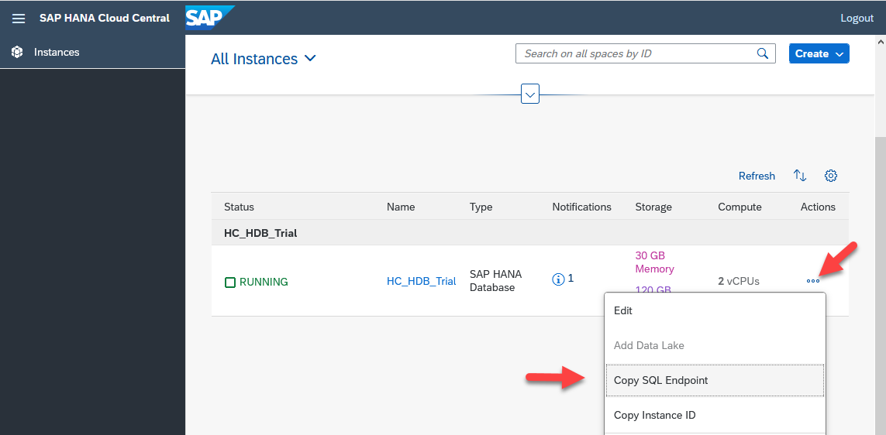
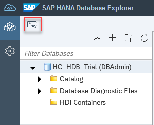
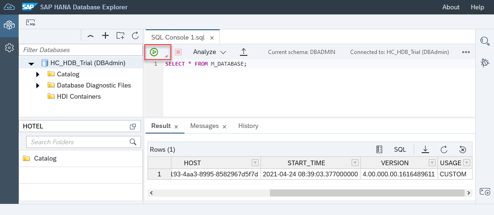
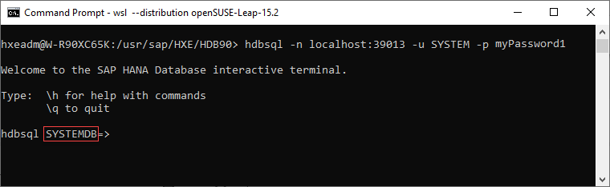
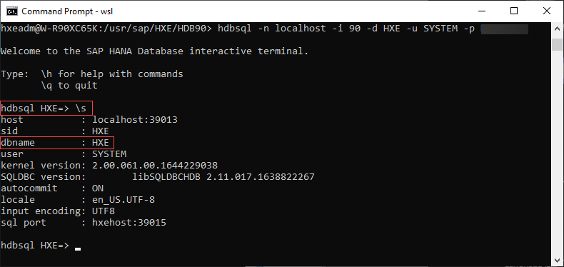

## Prerequisites
 - A Microsoft Windows, Linux or Mac computer
 - A machine that can run SAP HANA, express edition if the SAP HANA Cloud trial is not used

## Details
### You will learn
  - How to create an instance of SAP HANA Cloud or SAP HANA, express edition
  - How to connect to a SAP HANA Cloud or an SAP HANA, express edition database

This tutorial will provide guidance on setting up an instance of [SAP HANA](https://www.sap.com/products/hana.html) running in the cloud or on-premise so that it can then be connected to using a few of the [SAP HANA Client](https://help.sap.com/viewer/product/SAP_HANA_CLIENT/latest/en-US) interfaces.  

For more information on SAP HANA, consult [What Is SAP HANA](https://help.sap.com/viewer/eb3777d5495d46c5b2fa773206bbfb46/latest/en-US/d3b1adcdbb571014a93eff11ad9a1d89.html).

>Note, for connections from additional sources such as SAP Analytics Cloud, Jupyter Notebooks, SAP Business Warehouse, SAP Data Intelligence Cloud, and SAP ERP Central Component see [Connection Guides for SAP HANA Cloud](https://saphanajourney.com/hana-cloud/learning-track/connecting-guides-for-sap-hana-cloud).

>---

>For connections to the SAP HANA Cloud, Data Lake, see the tutorial [Use Clients to Query Data Lake IQ](group.hana-cloud-clients-data-lake).

>---

>**IMPORTANT**: Complete the first 3 tutorials, and then you can select any of the following tutorials about connecting with different client interfaces.

---

[ACCORDION-BEGIN [Step 1: ](Overview of SAP HANA Cloud and SAP HANA, express edition)]

There are multiple versions of SAP HANA.  The information below is a list of links for the documentation of each version.  Note that this tutorial will discuss SAP HANA Cloud and SAP HANA, express edition.


|  Version     | Notes
|  :------------- | :-------------
|  [SAP HANA Platform 1.0](https://help.sap.com/viewer/product/SAP_HANA_PLATFORM/1.0.12/en-US)           | Released in 2010.  Current version is 1.0 SPS (Support Package Stack) 12.
|  [SAP HANA Platform 2.0](https://help.sap.com/viewer/product/SAP_HANA_PLATFORM/latest/en-US)           | Released in November 2016. Current version is 2.0 SPS 05, which was released on June 26, 2020.
|  **[SAP HANA, express edition](https://help.sap.com/viewer/product/SAP_HANA,_EXPRESS_EDITION/latest/en-US)**    | Released in September 2016.  Current version is 2.0 SPS 05.
|  [SAP HANA service for SAP BTP](https://help.sap.com/viewer/product/HANA_SERVICE_CF/Cloud/en-US)          | Cloud version of SAP HANA 2.0.
|  **[SAP HANA Cloud](https://help.sap.com/viewer/product/HANA_CLOUD/)**   | Released in March 2020 and is the successor of the SAP HANA service.  New features are released quarterly.


[DONE]
[ACCORDION-END]

[ACCORDION-BEGIN [Step 2: ](SAP HANA Cloud)]

Here are a few benefits of using SAP HANA Cloud:

  * Software updates are automatically applied by SAP.

  * Hardware is managed by a cloud provider (e.g. AWS, Azure, or GCP).

  * [Backups](https://help.sap.com/viewer/db19c7071e5f4101837e23f06e576495/cloud/en-US/89d71f01daca4ecaaa069d6a060167f5.html) are automatic and recovery requests are handled via [service requests](https://help.sap.com/viewer/db19c7071e5f4101837e23f06e576495/cloud/en-US/918e714867e1409da47fa01ce03ba8f3.html).  

  * The memory, compute and storage settings can be changed as your needs change.  

  * The ability is provided to expand data storage from in-memory, to native storage extensions, to a data lake, while providing a common access layer that enables you to have further control over performance and cost.  See also [Lower Your Data Management Costs With SAP HANA Cloud](https://saphanajourney.com/hana-cloud/resources/lower-your-data-management-costs-with-sap-hana-cloud/).


  Here are a few differences between SAP HANA Cloud and an on-premise version:  

  * Every SAP HANA Cloud instance is one SAP HANA database.  An on-premise version can have multiple databases per install, which is known as multi-tenant.  

  * Connections to an SAP HANA Cloud instance must be secure and require a minimum SAP HANA client version of 2.4.167.

  * The administration user for SAP HANA Cloud is named DBADMIN while for an SAP HANA 2.0 database it is SYSTEM.  For additional details see [Predefined Users](https://help.sap.com/viewer/c82f8d6a84c147f8b78bf6416dae7290/cloud/en-US/de4ee8bbbb5710148a04f023da147c8d.html), [SAP HANA Cloud Administrator DBADMIN](https://help.sap.com/viewer/f9c5015e72e04fffa14d7d4f7267d897/cloud/en-US/5b35402c47b344d882ac13c661aff1c0.html), and [Predefined Users in HANA 2.0](https://help.sap.com/viewer/b3ee5778bc2e4a089d3299b82ec762a7/latest/en-US/de4ee8bbbb5710148a04f023da147c8d.html).  

[DONE]
[ACCORDION-END]


[ACCORDION-BEGIN [Step 3: ](Connect to SAP HANA Cloud)]

1. >To complete the tutorials in this mission, an SAP HANA instance is needed. Step 3 and 5 in this tutorial provide two different, free options that can be used to set up an SAP HANA instance.  Only one of these steps needs to be completed if you currently do not have access to an SAP HANA instance.

    Continue on with this tutorial once you have created an SAP HANA Cloud trial instance as shown below.

    !


    The instructions on how to setup a free SAP HANA Cloud trial within the SAP Business Technology Platform (SAP BTP), are well covered in a number of other sources listed below.  

    * [Help Thomas Get Started with SAP HANA](hana-trial-advanced-analytics)

    * [Getting Started with your trial of SAP HANA Cloud](https://saphanajourney.com/hana-cloud/learning-track/getting-started-with-your-trial-of-sap-hana-cloud/)


    For more information on SAP BTP see the following:

    * [https://www.sap.com/products/business-technology-platform.html](https://www.sap.com/products/business-technology-platform.html)

    * [https://developers.sap.com/topics/business-technology-platform.html](https://developers.sap.com/topics/business-technology-platform.html)  

    * [https://help.sap.com/viewer/product/BTP/Cloud/en-US](https://help.sap.com/viewer/product/BTP/Cloud/en-US)

    Once the SAP HANA Cloud instance is created, take note of the endpoint (host:port) needed to connect to the database.  The endpoint can be obtained via the copy menu item.  This will be needed in subsequent tutorials in this mission.  

    

    >Note that the SAP HANA Cloud, HANA database trial instances are shut down overnight and will need to be restarted before working with them the next day.  

2. Open the SAP HANA database explorer by choosing **Actions > Open SAP HANA Database Explorer** from SAP HANA Cloud Central.

    

    You will be asked to enter the credentials for the database.  Enter **DBADMIN** and the password that was specified when the instance was created.

    

    >Note, the credentials can be persisted so they do not need to be entered again by entering them into the SAP HANA Cockpit app.  

    The SAP HANA database explorer provides the ability to browse catalog objects and execute SQL statements from the SQL console.  For more information, see the tutorial group [Get Started with the SAP HANA Database Explorer](group.hana-cloud-get-started) and SAP Help Portal topic [SAP HANA Database Explorer](https://help.sap.com/viewer/a2cea64fa3ac4f90a52405d07600047b/cloud/en-US).  


3. Open a SQL console by clicking the **Open SQL Console** toolbar item in the top-left of the screen.  

      

4. Run the following query to see the name of the database you are currently connected to.  

    ```SQL
    SELECT * FROM M_DATABASE;
    ```

      

5. In the SAP HANA database explorer, the current schema shows DBADMIN.  A schema is a container for other database objects such as tables and views.

    

    Another way to see the current schema and the connected user is via SQL as shown below.  The DUMMY table is available in every HANA database that has one column and one row.  It provides a convenient  way to call a function or perform a simple test.

    ```SQL
    SELECT CURRENT_USER, CURRENT_SCHEMA FROM DUMMY;
    ```

6. To see the list of services, enter the following SQL statement:

    ```SQL
    SELECT * FROM M_SERVICES;
    ```

7. To see information about the database server, enter the following SQL statement:

    ```SQL
    SELECT * FROM M_HOST_INFORMATION;
    ```

>Views starting with `M_` are examples of [monitoring views](https://help.sap.com/viewer/c1d3f60099654ecfb3fe36ac93c121bb/latest/en-US/d3c10d23e8334a35afa8d9bdbc102366.html) and contain statistics and status details.

Congratulations! You have connected to SAP HANA Cloud and performed a few queries.

[DONE]
[ACCORDION-END]

[ACCORDION-BEGIN [Step 4: ](SAP HANA, express edition)]

SAP provides a free streamlined version of SAP HANA that runs on developer laptops called [SAP HANA, express edition](https://www.sap.com/cmp/td/sap-hana-express-edition.html).

SAP HANA runs on a few versions of Linux.  SAP HANA, express edition provides virtual machine images that can be run on Microsoft Windows, macOS and Linux machines as well as binary installs as described at [SAP HANA, express edition - Implement](https://help.sap.com/viewer/product/SAP_HANA,_EXPRESS_EDITION/latest/en-US?task=implement_task).  In terms of availability, a choice between either the server or the server + applications can be made.  The applications include the SAP HANA cockpit, the SAP HANA database explorer and the SAP HANA Web IDE.  Further details about a specific version can be found in the [release notes](https://search.sap.com/search.html?t=%22SAP%20HANA%2C%20express%20edition%202.0%20SPS%200%25%20Revision%22&n=1&s=boost&src=defaultSourceGroup).    

Choose an option and proceed to install SAP HANA, express edition.  The server-only install, which requires less memory, is sufficient to complete the tutorials in this mission.  Be sure to note the SAP HANA database master password, as it will be needed later for connecting.

At this point, you should have a running instance of SAP HANA, express edition.

[DONE]
[ACCORDION-END]

[ACCORDION-BEGIN [Step 5: ](Connect to SAP HANA, express edition)]

>This step only needs to be completed if you currently do not have access to an SAP HANA Instance and did not setup an SAP HANA instance through the SAP HANA Cloud Trial as explained in step 3.

A default installation will contain one [system](https://help.sap.com/viewer/6b94445c94ae495c83a19646e7c3fd56/latest/en-US/39da3d057f56427ab1bb7f738ca9e7ce.html) database named **SYSTEMDB** and one [tenant](https://help.sap.com/viewer/6b94445c94ae495c83a19646e7c3fd56/latest/en-US/623afd167e6b48bf956ebb7f2142f058.html) database named **HXE**.

The system database contains information about the tenant database(s) and is used for overall administration.  The default port for the system database is **39013**.  Later in this tutorial mission, a connection to the tenant database will be made and tables will be created and populated with data.  For more information, see [SAP HANA Tenant Databases Operations Guide](https://help.sap.com/viewer/78209c1d3a9b41cd8624338e42a12bf6/latest/en-US/0ba9f43aed594a449d497fabf6bc381e.html).

The SAP HANA, express edition VM install includes a command line tool (part of the SAP HANA client install) called [HDBSQL](https://help.sap.com/viewer/f1b440ded6144a54ada97ff95dac7adf/latest/en-US/c22c67c3bb571014afebeb4a76c3d95d.html) that can be used to query the database.  


The following steps will demonstrate connecting to and examining a SAP HANA, express edition database.  

1.  Enter the following to connect to the system database:

    ```Shell
    hdbsql -n localhost:39013 -u SYSTEM -p Your_Password
    ```

    

    Notice that the database being connected to is SYSTEMDB.

    The example above uses localhost since hdbsql is running on the same machine that the database is trying to connect to.  The host name, `hxehost`, is seen in the terminal above.  

    >If hdbsql is not found and you are logged in with another user, try connecting as the user `hxeadm` and run the command again.
    ```Shell
    su hxeadm
    ```
    If the hdbsql command cannot be found, simply read through the following examples.  The installation and further examples of running HDBSQL will be covered in subsequent tutorials.

2.  Determine the IP address of the machine that is running SAP HANA, express edition.  Record the value as it will be needed in later tutorials in this mission.  It is important to note the IP address or host name of the machine, as this will be needed in later tutorials.

    ```Shell
    ip addr
    ```

3.  The following are a some examples of [interactive options](https://help.sap.com/viewer/f1b440ded6144a54ada97ff95dac7adf/latest/en-US/c24d054bbb571014b253ac5d6943b5bd.html) followed by a SQL query, which when run against **SYSTEMDB** returns information about the databases running on the SAP HANA instance.

    ```SQL
    \al
    \s
    SELECT * FROM SYS_DATABASES.M_SERVICES WHERE SQL_PORT != 0;
    \serverstats
    ```

    

    The `\al` or align interactive option when enabled increases the readability of the output.  

    The `\s` command shows status information.  It shows that that the SAP System Identification (SID) is **HXE**, that the connected database is **SYSTEMDB**, and the currently logged in user is **SYSTEM**.

    The result of the SELECT against the `M_SERVICES` table shows that there are two databases, named **SYSTEMDB** and **HXE** and that they are accessible on ports **39013** and **39015**.  

    The '\serverstats' retrieves resource consumption information about the last executed SQL statement which can be helpful when diagnosing SQL statements.

    The instance number can be derived from a port number using the second and third numbers in the port number 39013.  In this case, the instance number is 90.  

    If the SQL statement returns more than one screen of text, entering a space will show the next screen of results.  See also the pager option `\pa`.  

4.  Enter one of the below commands to exit from viewing the results of the select statement.  Note that commands can be prefixed with a forward slash(\\) or a colon(:).

    ```HDBSQL
    \q
    :q
    ```

5.  Connect using the instance number and database name as shown below.

    ```Shell
    hdbsql -n localhost -i 90 -d HXE -u SYSTEM -p Your_Password
    ```

6.  Enter the following to display database connection information.

    ```HDBSQL
    \s
    ```

    Notice that this time the database connected to is HXE.  

    

For further information, see [Port Assignment in Tenant Databases](https://help.sap.com/viewer/6b94445c94ae495c83a19646e7c3fd56/latest/en-US/440f6efe693d4b82ade2d8b182eb1efb.html) and [Connecting to SAP HANA Databases and Servers](https://help.sap.com/viewer/f1b440ded6144a54ada97ff95dac7adf/latest/en-US/b250e7fef8614ea0a0973d58eb73bda8.html).  

Congratulations!  You now have access to an SAP HANA instance and understand some of the differences between SAP HANA Cloud and SAP HANA, express edition.

[VALIDATE_1]
[ACCORDION-END]


---
