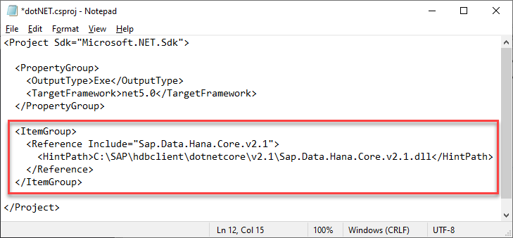

## Prerequisites
 - You have completed the first 3 tutorials in this mission.

## Details
### You will learn
  - How to install the .NET SDK
  - How to create and debug a .NET application that queries an SAP HANA database

[.NET](https://en.wikipedia.org/wiki/.NET_Core) is a free and open source software framework for Microsoft Windows, Linux and Mac operating systems and is the successor to the .NET Framework.  .NET was previously known as .NET Core.

---

[ACCORDION-BEGIN [Step 1: ](Install the .NET SDK)]

The first step is to check if you have the .NET SDK  installed and what version it is.  Enter the following command:

```Shell
dotnet --version  
```  
If the `dotnet` command is not recognized, it means that the .NET SDK has not been installed. If the SDK is installed, the command returns the currently installed version, such as 5.0.101.  

If the .NET SDK is not installed, download it from [Download .NET](https://dotnet.microsoft.com/download) and run the installer on Microsoft Windows or Mac.
> Note: Select the 'Build Apps: Download .NET SDK' option.


On Linux, follow the instructions for the appropriate Linux version such as [openSUSE 15 Package Manager - Install .NET Core](https://docs.microsoft.com/en-us/dotnet/core/install/linux-package-manager-opensuse15).

In order for the shell to recognize that the .NET SDK is installed and for any `dotnet` commands in future steps to be recognized, a new shell window needs to be opened.

>For further details on supported versions, see SAP Note [3006307 - SAP HANA Client Supported Platforms for 2.7](https://launchpad.support.sap.com/#/notes/3006307).

[DONE]
[ACCORDION-END]

[ACCORDION-BEGIN [Step 2: ](Create a .NET application that queries an SAP HANA database)]

1.  Create a new console app with the below commands:

    ```Shell (Microsoft Windows)
    cd %HOMEPATH%/HANAClientsTutorial
    dotnet new console -o dotNET
    ```  

    On Linux or Mac, you need to modify the `HDBDOTNETCORE` variable to point to the location of the `libadonetHDB.so` or `libadonetHDB.dylib` file before creating a new console app. There are two ways to set an environment variable.

    You can either set it using the export command on a Shell window or in a user's profile script. When an environment variable is modified from the Shell, its existence ends when the user's sessions ends. This could become an issue when you want the variable to persist across multiple user sessions.

    Hence, choose the second option to set `HDBDOTNETCORE`.

    Open an editor to edit the file `.bash_profile` or `.profile`.

    ```Shell (Linux or Mac)
    pico ~/.bash_profile
    ```
    Replace `pico` with your preferred text editor.

    Add the following line to it.

    ```Shell (Linux or Mac)
    export HDBDOTNETCORE=/home/dan/sap/hdbclient/dotnetcore
    ```

    Run the source command to immediately apply all the changes made to the `.bash_profile` file

    ```Shell (Linux or Mac)
    source ~/.bash_profile
    ```

    Now, you may run the following command to create the console app.

    ```Shell (Linux or Mac)
    cd $HOME/HANAClientsTutorial
    dotnet new console -o dotNET
    ```

2.  Open the `dotNET.csproj` file:

    ```Shell (Microsoft Windows)
    cd dotNET
    notepad dotNET.csproj
    ```

    ```Shell (Linux or Mac)
    cd dotNET
    pico dotNET.csproj
    ```

    Add the following below the `PropertyGroup` section (within the `Project` section) to indicate where to load the SAP HANA Client .NET driver from.  Modify the `HintPath` section with the information about where the dll is located on your machine.

    ```Shell (Microsoft Windows)
    <ItemGroup>
      <Reference Include="Sap.Data.Hana.Core.v2.1">
        <HintPath>C:\SAP\hdbclient\dotnetcore\v2.1\Sap.Data.Hana.Core.v2.1.dll</HintPath>
      </Reference>
    </ItemGroup>
    ```

    ```Shell (Linux or Mac)
    <ItemGroup>
      <Reference Include="Sap.Data.Hana.Core.v2.1">
        <HintPath>/home/dan/sap/hdbclient/dotnetcore/v2.1/Sap.Data.Hana.Core.v2.1.dll</HintPath>
      </Reference>
    </ItemGroup>
    ```
    

    Once the `dotNet.csproj` file has been updated, save and close the file.    

    >The SAP HANA Client interface for .NET is compatible with version 2.1, 3.x, and 5.x releases of .NET.

3.  Open an editor to edit the file `Program.cs`.
    ```Shell (Windows)
    notepad Program.cs
    ```

    ```Shell (Linux or Mac)
    pico Program.cs
    ```

4.  Replace the entire contents of `Program.cs` with the code below:  

    ```C#
using System;
using Sap.Data.Hana;
namespace dotNETQuery
{
    class Program
    {
        static void Main(string[] args)
        {
            try
            {
                // Option 1, retrieve the connection parameters from the hdbuserstore
                // User1UserKey retrieved from hdbuserstore contains server:port, UID and PWD
                using (var conn = new HanaConnection("key=User1UserKey;encrypt=true;sslValidateCertificate=false"))

                //Option2, specify the connection parameters
                //using (var conn = new HanaConnection("Server=10.7.168.11:39015;UID=User1;PWD=Password1;encrypt=true;sslValidateCertificate=false"))

                // encrypt and sslValidateCertificate should be true for HANA Cloud connections
                // As of SAP HANA Client 2.6, connections on port 443 enable encryption by default
                // sslValidateCertificate should be set to false when connecting
                // to an SAP HANA, express edition instance that uses a self-signed certificate.

                {
                    conn.Open();
                    Console.WriteLine("Connected");
                    var query = "SELECT TITLE, FIRSTNAME, NAME FROM HOTEL.CUSTOMER";
                    using (var cmd = new HanaCommand(query, conn))
                    using (var reader = cmd.ExecuteReader())
                    {
                        Console.WriteLine("Query result:");
                        // Print column names
                        var sbCol = new System.Text.StringBuilder();
                        for (var i = 0; i < reader.FieldCount; i++)
                        {
                            sbCol.Append(reader.GetName(i).PadRight(20));
                        }
                        Console.WriteLine(sbCol.ToString());
                        // Print rows
                        while (reader.Read())
                        {
                            var sbRow = new System.Text.StringBuilder();
                            for (var i = 0; i < reader.FieldCount; i++)
                            {
                                sbRow.Append(reader[i].ToString().PadRight(20));
                            }
                            Console.WriteLine(sbRow.ToString());
                        }
                        conn.Close();
                    }
                }
            }
            catch (Exception ex)
            {
                Console.WriteLine("Error - " + ex.Message);
                Console.WriteLine(ex.ToString());
            }
        }
    }
}
    ```

    Save and close the `Program.cs` file after replacing the code.

    >Note that the address, port, UID and PWD will be retrieved from the `hdbuserstore`.   

    The above app makes use of some of the SAP HANA client .NET driver  methods, such as [HanaConnection](https://help.sap.com/viewer/f1b440ded6144a54ada97ff95dac7adf/latest/en-US/d19390d16d6110149af29776dce510bc.html).  Connection details for this class can be found at [Microsoft ADO.NET Connection Properties](https://help.sap.com/viewer/f1b440ded6144a54ada97ff95dac7adf/latest/en-US/469e137b6d611014ac27bffe40be2f18.html).  Further .NET API details can be found in the [.NET API browser](https://docs.microsoft.com/en-us/dotnet/api/?view=net-5.0).

5.  Run the app:

    ```Shell
    dotnet run
    ```
    >Before running the program make sure to be in the directory where Program.cs is saved

    

[DONE]
[ACCORDION-END]


[ACCORDION-BEGIN [Step 3: ](Debug the application)]

1. If you have not already done so, download [Visual Studio Code](https://code.visualstudio.com/Download).

2. If you have not already done so, in Visual Studio Code, choose **File | Add Folder to Workspace**, and then add the `HANAClientsTutorial` folder.

    

3. Open the file `Program.cs`.

    

    Visual Studio Code will recognize the `cs` file extension and will suggest installing the C# for Visual Studio Code extension.  Click **Install**.

4. Place a breakpoint on the line sbRow.Append line.  Select **Run | Start Debugging | .NET Core**.  A configuration will be added.  Choose **Run | Start Debugging**.

    Notice that the debug view becomes active and that the RUN option is .NET Launch.

    Notice that the program stops running at the breakpoint that was set.

    Observe the variable values in the leftmost pane.  Step through code.

      

    For further information on debugging .NET apps consult [Tutorial: Debug a .NET Core console application using Visual Studio Code](https://docs.microsoft.com/en-us/dotnet/core/tutorials/debugging-with-visual-studio-code) and [Instructions for setting up the .NET Core debugger](https://github.com/OmniSharp/omnisharp-vscode/blob/master/debugger.md).

Congratulations! You have now created and debugged a .NET application that connects to and queries an SAP HANA database.  


[VALIDATE_1]
[ACCORDION-END]

---
