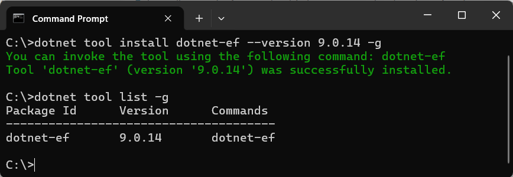
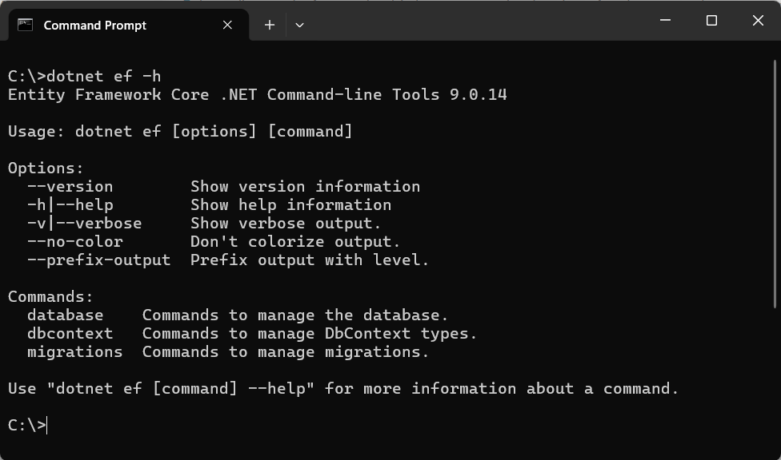
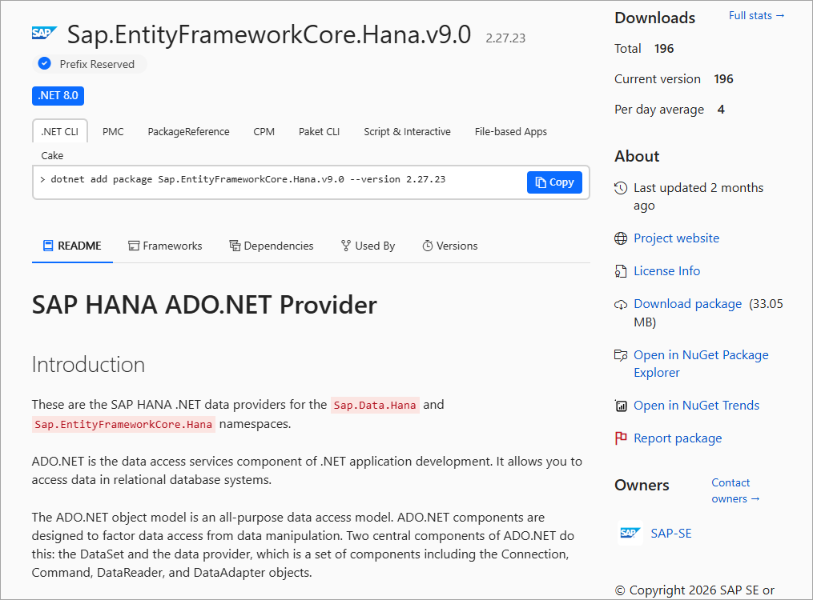
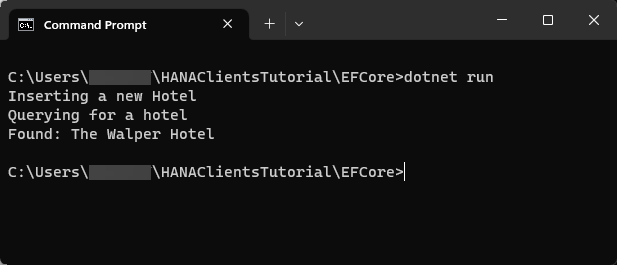
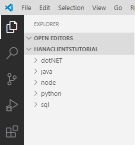
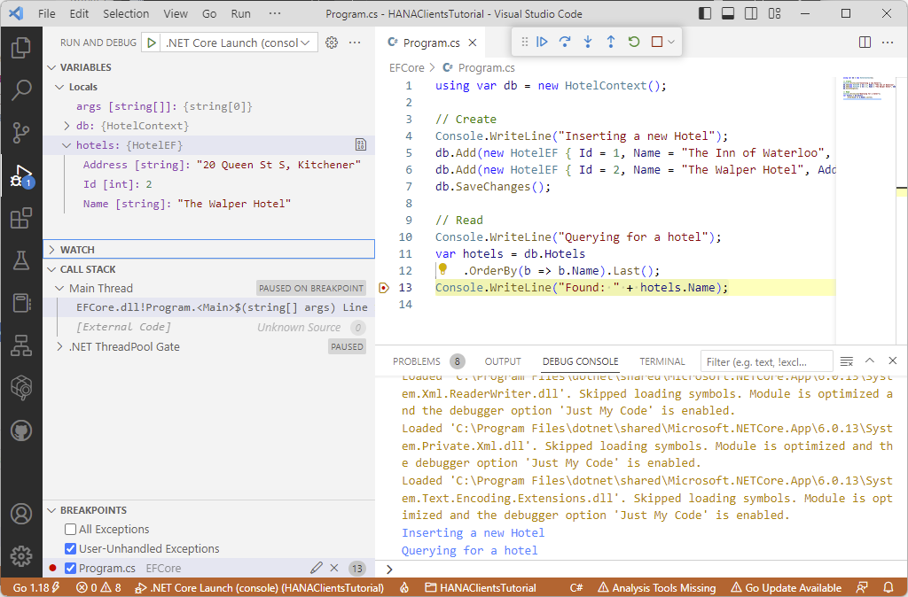
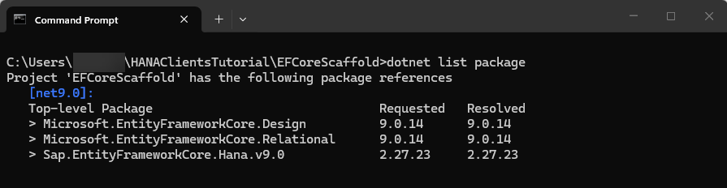
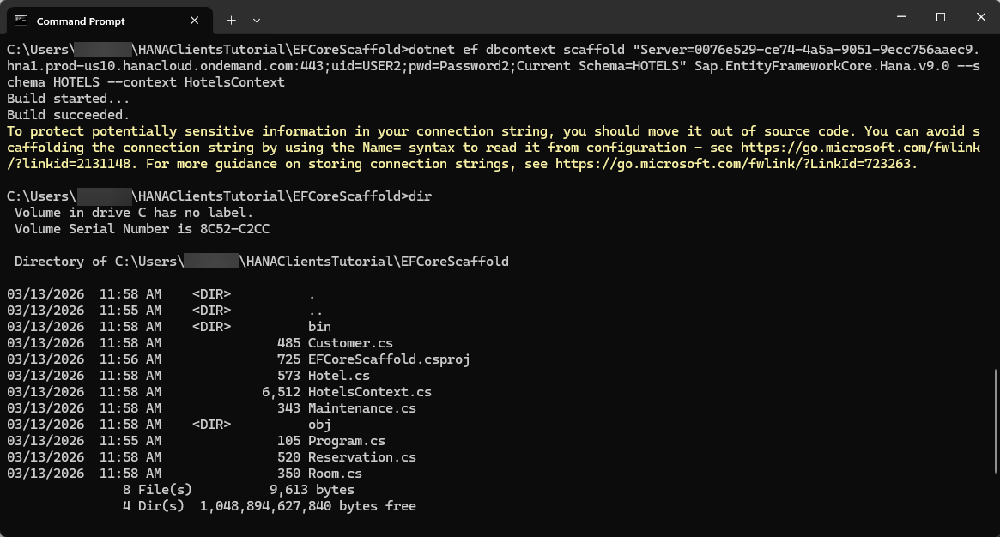
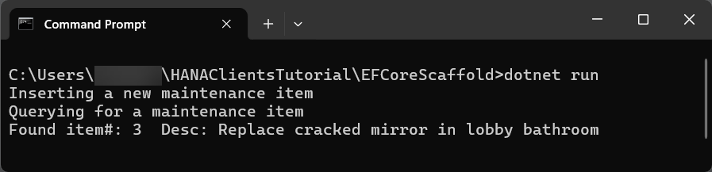
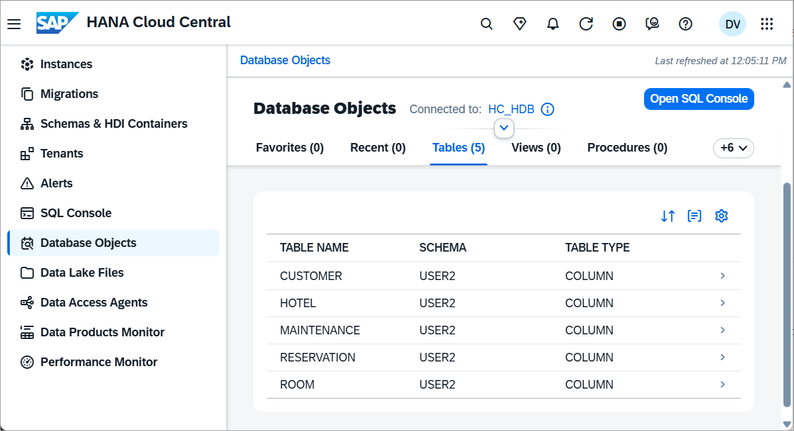

# Connect Using the Microsoft Entity Framework Core (EF Core)

<!-- description --> Create and debug an EF Core application that connects to SAP HANA.

## Prerequisites

- You have completed the first 3 tutorials in this mission
- You have completed the previous tutorial on .NET in this mission

## You will learn

- How to install the .NET Core EF CLI
- How to create and debug an EF Core application that queries an SAP HANA database
- How to use the scaffold command to generate entity classes for pre-existing schema tables

## Intro

[.NET](https://en.wikipedia.org/wiki/.NET_Core) is a free and open-source software framework for Microsoft Windows, Linux, and Mac operating systems and is the successor to the .NET Framework.  Entity Framework Core is a modern object-database mapper for .NET and can reduce data access code in an application.  

---

### Install the .NET Core EF CLI

The `dotnet` tool command can be used to install and manage tools that extend .NET.  The following are a few examples that can be run to show help, to list the local and globally installed tools, to uninstall `dotnet-ef` if an incompatible version is installed, and to search the repository for version details of the `dotnet-ef` tool.

```Shell
dotnet tool -?
dotnet tool list -?
dotnet tool list
dotnet tool list -g
dotnet tool uninstall dotnet-ef -g
dotnet tool search dotnet-ef --detail
```

The SAP HANA Client 2.27 release supports EF Core 8.0 among other versions.  For a list versions and support dates see [EF Core releases and planning](https://learn.microsoft.com/en-us/ef/core/what-is-new/) and SAP Note [3165810 - SAP HANA Client Supported Platforms](https://launchpad.support.sap.com/#/notes/3165810).

Run the following command to install version 8 of the dotnet-ef tool.

```Shell
dotnet tool install dotnet-ef --version 9.0.14 -g
dotnet tool list -g
```  



The help for the .NET Command Line Tools can be displayed as shown below.

```Shell
dotnet ef -h
```



### Create a .NET Core EF application that queries an SAP HANA database

1. Create a new console app with the below commands:

    ```Shell (Microsoft Windows)
    cd %HOMEPATH%/HANAClientsTutorial
    dotnet new console -o EFCore
    ```  

    ```Shell (Linux or Mac)
    cd $HOME/HANAClientsTutorial
    dotnet new console -o EFCore
    ```

2. Add the required packages including the SAP HANA .NET data provider which is available on [nuget](https://www.nuget.org/packages/Sap.EntityFrameworkCore.Hana.v9.0).  A list of available providers from SAP is available at [SAP-SE](https://www.nuget.org/profiles/SAP-SE).

    ```Shell
    cd EFCore
    dotnet add package Sap.EntityFrameworkCore.Hana.v9.0
    dotnet add package Microsoft.EntityFrameworkCore.Relational --version 9.0.14
    ```

    

    The packages can be listed using the command below.

    ```Shell
    dotnet list package
    ```

3. Run the app to validate that SAP hdbclient DLLs can be loaded:

    ```Shell
    dotnet run
    ```

    The expected output is `Hello, World!`.

4. Open an editor and create a file named `HotelModel.cs`.

    ```Shell (Windows)
    notepad HotelModel.cs
    ```

    ```Shell (Linux or Mac)
    pico HotelModel.cs
    ```

5. Copy the below code into `HotelModel.cs` with the code below:  

    ```C#
    using Microsoft.EntityFrameworkCore;
    using Sap.EntityFrameworkCore.Hana;

    public class HotelContext : DbContext
    {
        public DbSet<HotelEF> Hotel { get; set; }

        public HotelContext()
        {
            var folder = Environment.SpecialFolder.LocalApplicationData;
            var path = Environment.GetFolderPath(folder);

            Database.EnsureDeleted();
            Database.EnsureCreated();
        }

        protected override void OnConfiguring(DbContextOptionsBuilder options) {
            options.UseHana("Server=xxxxxxxx-.hanacloud.ondemand.com:443;UserName=User2;Password=Password2;Current Schema=USER2");
        }
    }

    public class HotelEF
    {
        public int Id { get; set; } = 0;
        public string Name { get; set; } = string.Empty;
        public string Address { get; set; } = string.Empty;
    }
    ```

    Be sure to update the host URL and optionally the user name and password.  Note that calls to EnsureDeleted and EnsureCreated will delete and recreate the objects in the schema USER2. As documented at [RelationalDatabaseCreator.EnsureDeleted Method](https://learn.microsoft.com/en-us/dotnet/api/microsoft.entityframeworkcore.storage.relationaldatabasecreator.ensuredeleted), it will delete all objects in the schema USER2.


6. Open an editor to edit the file `Program.cs`.

    ```Shell (Windows)
    notepad Program.cs
    ```

    ```Shell (Linux or Mac)
    pico Program.cs
    ```

7. Replace the entire contents of `Program.cs` with the code below. Save and close the file when finished.

    ```C#
    using var db = new HotelContext();

    // Create
    Console.WriteLine("Inserting a new Hotel");
    db.Add(new HotelEF { Id = 1, Name = "The Inn of Waterloo", Address = "475 King St N, Waterloo" });
    db.Add(new HotelEF { Id = 2, Name = "The Walper Hotel", Address = "20 Queen St S, Kitchener" });
    db.SaveChanges();

    // Read
    Console.WriteLine("Querying for a hotel");
    var hotels = db.Hotel
        .OrderBy(b => b.Name).Last();
    Console.WriteLine("Found: " + hotels.Name);
    ```

    Further details on SAP HANA Client entity core driver can be found at [Entity Framework Core Support](https://help.sap.com/docs/SAP_HANA_CLIENT/f1b440ded6144a54ada97ff95dac7adf/3e6ef454ffc94cda8fefb0acf5be007b.html).  Further .NET API details can be found in the [.NET API browser](https://learn.microsoft.com/en-us/dotnet/api/?view=efcore-6.0).

8. Run the app:

    ```Shell
    dotnet run
    ```

    >Before running the program make sure to be in the directory where Program.cs is saved

    

### Debug the application

1. Open Visual Studio Code. If needed, download the application [here](https://code.visualstudio.com/Download).

2. If you have not already done so, choose **File | Add Folder to Workspace**, and then add the `HANAClientsTutorial` folder.

    

3. Open the file `Program.cs` and set a breakpoint.

4. Select **Run | Start Debugging | .NET Core**.  A configuration will be added.  Choose **Run | Start Debugging**.

    Notice that the debug view becomes active and that the RUN option is .NET Launch.

    Notice that the program stops running at the breakpoint that was set.

    Observe the variable values in the leftmost pane.  Step through code.

      

    For further information on debugging .NET apps consult [Tutorial: Debug a .NET Core console application using Visual Studio Code](https://docs.microsoft.com/en-us/dotnet/core/tutorials/debugging-with-visual-studio-code) and [Instructions for setting up the .NET Core debugger](https://github.com/OmniSharp/omnisharp-vscode/blob/master/debugger.md).

### Generate scaffolding classes for an existing schema

The following steps demonstrate the process of generating entity type classes and a DbContext class based on an existing database schema.  Additional details can be found at [Scaffolding (Reverse Engineering)](https://learn.microsoft.com/en-us/ef/core/managing-schemas/scaffolding/?tabs=dotnet-core-cli).

1. Create a new console app with the below commands:

    ```Shell (Microsoft Windows)
    cd %HOMEPATH%/HANAClientsTutorial
    dotnet new console -o EFCoreScaffold
    ```  

    ```Shell (Linux or Mac)
    cd $HOME/HANAClientsTutorial
    dotnet new console -o EFCoreScaffold
    ```

2. Install the required packages.

    ```Shell
    cd EFCoreScaffold
    dotnet add package Sap.EntityFrameworkCore.Hana.v9.0
    dotnet add package Microsoft.EntityFrameworkCore.Relational --version 9.0.14
    dotnet add package Microsoft.EntityFrameworkCore.Design --version 9.0.14
    ```

    The list of installed packages can be seen using the below command.

    ```Shell
    dotnet list package
    ```

    

    Additional details can be found at [dotnet add package](https://learn.microsoft.com/en-us/dotnet/core/tools/dotnet-add-package) and [Microsoft.EntityFrameworkCore.Design](https://www.nuget.org/packages/Microsoft.EntityFrameworkCore.Design)

3. Use the scaffold command to generate entity classes for the HOTELS schema.  Update the SQL endpoint.

    ```Shell
    dotnet ef dbcontext scaffold "Server=xxxxxxxx-.hanacloud.ondemand.com:443;uid=USER2;pwd=Password2;Current Schema=HOTELS" Sap.EntityFrameworkCore.Hana.v9.0 --schema HOTELS --context HotelsContext
    ```

    Notice that classes have been generated for each object in the schema HOTELS.

    

    Should you wish to regenerate the files in the future and overwrite the existing files, the `--force` parameter can be used.  Additional details on the scaffold command can be found at [.NET Core CLI](https://learn.microsoft.com/en-us/ef/core/cli/dotnet#dotnet-ef-dbcontext-scaffold).

4. Open an editor to edit the file `Program.cs`.

    ```Shell (Windows)
    notepad Program.cs
    ```

    ```Shell (Linux or Mac)
    pico Program.cs
    ```

5. Replace the entire contents of `Program.cs` with the code below. Save and close the file when finished.

    ```C#
    using EFCoreScaffold;

    using var db = new MyHotelsContext(true);

    // Create
    Console.WriteLine("Inserting a new maintenance item");
    db.Add(new Maintenance { Mno = 3, Description = "Replace cracked mirror in lobby bathroom" });
    db.SaveChanges();

    // Read
    Console.WriteLine("Querying for a maintenance item");
    var maintenanceItems = db.Maintenances
        .OrderBy(b => b.Hno).Last();
    Console.WriteLine("Found item#: " + maintenanceItems.Mno + "  Desc: " + maintenanceItems.Description);
    ```

6. Open an editor to edit the file `HotelsContext.cs`.  

    ```Shell (Windows)
    notepad HotelsContext.cs
    ```

    ```Shell (Linux or Mac)
    pico HotelsContext.cs
    ```

7. Delete the `OnConfiguring` method.  This will be added to the `MyHotelsContext.cs` class.

8. Open an editor to create and edit a new file named `MyHotelsContext.cs`.  

    ```Shell (Windows)
    notepad MyHotelsContext.cs
    ```

    ```Shell (Linux or Mac)
    pico MyHotelsContext.cs
    ```

9. Add the code below. Update the Server= line to match your SAP HANA Cloud SQL endpoint.  Save and close the file when finished.  Note that the schema is changed to be USER2.

    ```C#
    using Microsoft.EntityFrameworkCore;
    using Sap.EntityFrameworkCore.Hana;

    namespace EFCoreScaffold;
    internal class MyHotelsContext : HotelsContext
    {
        public MyHotelsContext(bool createTables) : base()
        {
            if (createTables)
            {
                // Delete the existing database tables and re-create new tables.
                Database.EnsureDeleted();
                Database.EnsureCreated();
            }
        }

        protected override void OnConfiguring(DbContextOptionsBuilder optionsBuilder)
        {
            optionsBuilder.UseHana("Server=xxxxxxxx-.hanacloud.ondemand.com:443;uid=USER2;pwd=Password2;Current Schema=USER2");
        }
    }
    ```

10. Run the app:

    ```Shell
    dotnet run
    ```

    

    Notice that tables such as CUSTOMER, HOTEL, MAINTENANCE etc have now been created in the USER2 schema.

    

### Knowledge check

Congratulations! You have now created and debugged a .NET application that connects to and queries an SAP HANA database.  

---
