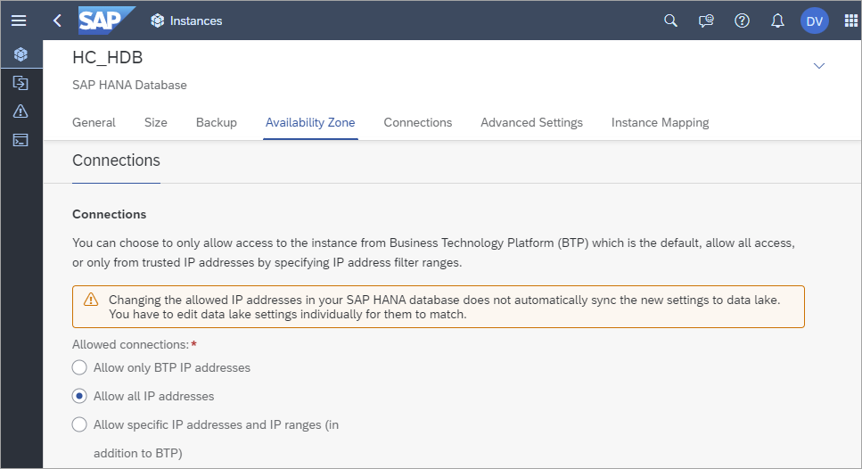
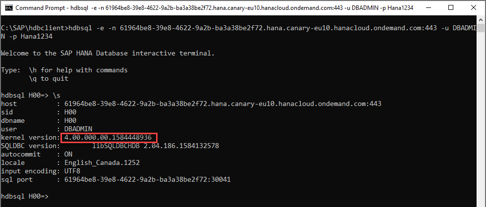
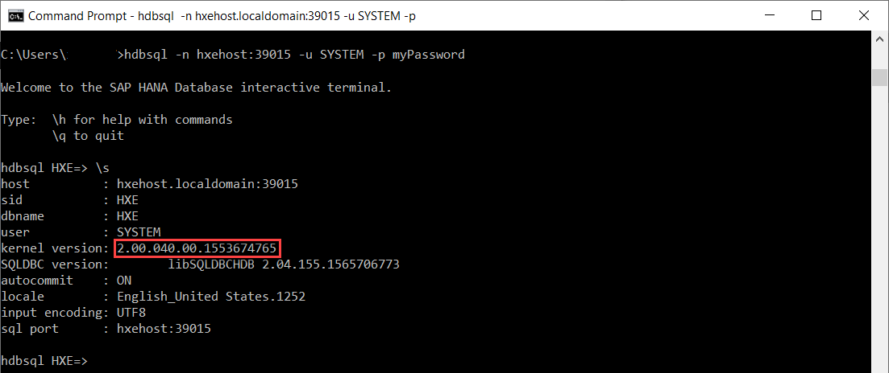
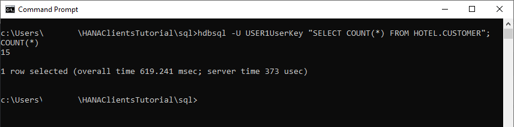

## Prerequisites
 - You have completed the first 2 tutorials in this mission.

## Details
### You will learn
  - How to connect to SAP HANA from a client machine using HDBSQL
  - How to create a user, schema, tables and import data

HDBSQL is used in this tutorial as it is part of the SAP HANA client install.  HDBSQL is a very basic tool for executing SQL scripts and providing an interface for interactive queries.  Another more user-friendly option to execute SQL operations is the SAP HANA database explorer which is part of a HANA Cloud instance or a server + applications SAP HANA, express edition install.  

---

[ACCORDION-BEGIN [Step 1: ](Connect to SAP HANA using hdbsql)]

This section demonstrates how to connect to a SAP HANA instance using [HDBSQL](https://help.sap.com/viewer/f1b440ded6144a54ada97ff95dac7adf/2.4/en-US/c22c67c3bb571014afebeb4a76c3d95d.html) from the SAP HANA client installation.

1. Copy and paste the following command to see the command line options and press the space bar to advance though the information.  

    ```Shell
    hdbsql -h | more
    ```

2. Connect to either SAP HANA Cloud or SAP HANA, express edition using host, port, and credentials. As mentioned previously, the host and port can be found in the SAP Cloud Platform cockpit.   

    - To connect to SAP HANA Cloud, see the following general command.  
    >Note: the connection must be encrypted (-e).  Starting with the 2.6 SAP HANA client, connections on port 443 enable encryption by default so the -e parameter is not needed for SAP HANA Cloud connections.

        ```Shell
        hdbsql -e -n <host name>:<port> -u <user> -p <password>
        ```

        The following is a connection example for the SAP HANA Cloud.  

        ```Shell
        hdbsql -e -n 69964be8-39e8-4622-9a2b-ba3a38be2f75.hana.canary-eu10.hanacloud.ondemand.com:443 -u DBADMIN -p your_password
        ```

        > The HANA Cloud instance can be configured to enable applications running from outside the SAP Cloud Platform to connect.  The current setting is shown in the screenshot below.  

        

        > If you are on a Linux or Mac machine and the hdbsql connection fails with the error message below, it indicates that the client could not locate a trust store in the default location.  
        >
        >_Cannot create SSL context:  SSL trust store cannot be found: `/Users/user1/.ssl/trust.pem`_

        > A public root certificate to validate the server's certificate is needed.  More information about the required DigiCert root certificate can be found at  [Secure Communication Between SAP HANA Cloud and JDBC/ODBC Clients](https://help.sap.com/viewer/c82f8d6a84c147f8b78bf6416dae7290/cloud/en-US/dbd3d887bb571014bf05ca887f897b99.html).  
        >
        > It can be downloaded from [Download PEM](https://dl.cacerts.digicert.com/DigiCertGlobalRootCA.crt.pem), renamed to `trust.pem` and saved to the specified location.  For further details, see [Secure connection from HDBSQL to SAP HANA Cloud](https://blogs.sap.com/2020/04/14/secure-connection-from-hdbsql-to-sap-hana-cloud/).
        >
        >Starting with the 2.6 SAP HANA client, if the root certificate is available to OpenSSL, it is no longer required to also be in `trust.pem`.

    - For SAP HANA, express edition, there are two options shown below to connect.

        ```Shell
        hdbsql -n <ip address>:39015 -u <user> -p <password>
        or
        hdbsql -n <ip address> -d <database name> -i <instance number> -u <user> -p <password>
        ```

        Below are two connection examples for SAP HANA, express edition.

        ```Shell
        hdbsql -n <ip address>:39015 -u SYSTEM -p your_password
        or
        hdbsql -n <ip address> -d HXE -i 90 -u SYSTEM -p your_password
        ```

        Notice that either the host and port combination or the host, database name and instance number can be used to connect.

3. Type `\s` for status information

    ```Shell
    \s
    ```

    Notice that for the SAP HANA Cloud instance, the version number is 4.x.  

    


    Notice that for the HANA, express edition, the version number is 2.x.  

      

[DONE]
[ACCORDION-END]

[ACCORDION-BEGIN [Step 2: ](Create user and schema)]

In this section, create a user named `USER1`.  `USER1` will be the owner of the tables that will be created in a subsequent section and will be used to connect to the database.

On Linux or a Mac, turn off page by page scroll output.  Also, consult the `-j` `hdbsql` option.  This enables multiple commands to be pasted at one time and does not require each result to be exited by pressing q.  

```HDBSQL (Linux or Mac)
\pa off
```

1. Create `USER1`.  Select the command below based on the version of SAP HANA being used.  Note that the message  _'0 rows affected'_ means that query was successful.

    ```SQL
    CREATE USER USER1 PASSWORD Password1 no force_first_password_change;
    ```

    To verify that the user was created, enter the following command.
    ```SQL
    SELECT USER_NAME FROM USERS;
    ```

    Also notice that a schema with the same name is created for this user.  

    ```SQL
    SELECT SCHEMA_NAME FROM SCHEMAS;
    ```

2. Create a new schema and grant `USER1` the ability to create new objects in it.

    ```SQL
    CREATE SCHEMA HOTEL;
    GRANT CREATE ANY ON SCHEMA HOTEL TO USER1;
    ```

3. Connect as `USER1` and notice that current user changes from `DBADMIN` or `SYSTEM` to `USER1`.

    ```SQL
    SELECT CURRENT_USER, CURRENT_SCHEMA FROM DUMMY;
    CONNECT USER1 PASSWORD Password1;
    SELECT CURRENT_USER, CURRENT_SCHEMA FROM DUMMY;
    ```

For further information on SQL to create a user or schema, see [CREATE USER Statement](https://help.sap.com/viewer/4fe29514fd584807ac9f2a04f6754767/latest/en-US/20d5ddb075191014b594f7b11ff08ee2.html) and [CREATE SCHEMA Statement](https://help.sap.com/viewer/4fe29514fd584807ac9f2a04f6754767/latest/en-US/20d4ecad7519101497d192700ce5f3df.html).

[DONE]
[ACCORDION-END]

[ACCORDION-BEGIN [Step 3:](Store connection details in secure user store (hdbuserstore))]

Remembering and entering IP addresses, ports, user IDs and passwords can be difficult. [Secure User Store](https://help.sap.com/viewer/b3ee5778bc2e4a089d3299b82ec762a7/latest/en-US/dd95ac9dbb571014a7d7f0234d762fdb.html) offers a convenient means of storing this information and making it available to the SAP HANA client interfaces.

1. Exit out of `hdbsql` and type `hdbuserstore` to see a list of available commands such as Set, List and Delete.

    ```Shell
    \q
    hdbuserstore
    ```
    `hdbuserstore` is included with the install of the SAP HANA database clients.

2. Using `hdbuserstore`, specify a key named `USER1UserKey` that has the host, port and credentials.  Details on where to find these values are covered in the third and fifth steps of the [first tutorial](hana-clients-choose-hana-instance) in this mission.

    ```Shell
    hdbuserstore Set USER1UserKey <host name>:<port> USER1 Password1
    hdbuserstore List
    ```

3. Connect with `USER1` as the username.  

    ```Shell
    hdbsql -attemptencrypt -U USER1UserKey
    ```

    > Uppercase U is for specifying a key from the user store, lower case u is for user.  

    >---

    > Starting with the 2.6 SAP HANA client, connections on port 443 enable encryption by default so the `attemptencrypt` parameter is not needed for SAP HANA Cloud connections.

[Using Stored Connection Information](https://help.sap.com/viewer/b3ee5778bc2e4a089d3299b82ec762a7/latest/en-US/dd95ac9dbb571014a7d7f0234d762fdb.html) contains details on how an application can use a `hdbuserstore` key.


[DONE]
[ACCORDION-END]

[ACCORDION-BEGIN [Step 4: ](Create tables and import data)]

1. Exit HDBSQL by entering \q.

2. Create a folder for the exercises in this tutorial, enter that directory, and begin editing a file named `hotel.sql`.
    ```Shell (Microsoft Windows)
    mkdir %HOMEPATH%\HANAClientsTutorial\sql
    cd %HOMEPATH%\HANAClientsTutorial\sql
    notepad hotel.sql
    ```

    Substitute `pico` below for your preferred text editor.  

    ```Shell (Linux or Mac)
    mkdir -p $HOME/HANAClientsTutorial/sql
    cd $HOME/HANAClientsTutorial/sql
    pico hotel.sql
    ```

3. Copy the following SQL into the file `hotel.sql`.  

    ```SQL
    CREATE COLUMN TABLE hotel.city(
    	zip CHAR(5) PRIMARY KEY,
    	name VARCHAR(30) NOT NULL,
    	state CHAR(2) NOT NULL
    );
    CREATE COLUMN TABLE hotel.customer(
    	cno INTEGER PRIMARY KEY,
    	title CHAR(7),
    	firstname VARCHAR(20),
    	name VARCHAR(40) NOT NULL,
    	zip CHAR(5),
    	address VARCHAR(40) NOT NULL
    );
    CREATE COLUMN TABLE hotel.hotel(
    	hno INTEGER PRIMARY KEY,
    	name VARCHAR(50) NOT NULL,
    	zip CHAR(5),
    	address VARCHAR(40) NOT NULL
    );
    CREATE COLUMN TABLE hotel.room(
    	hno INTEGER,
    	type CHAR(6),
    	free NUMERIC(3),
    	price NUMERIC(6, 2),
    	PRIMARY KEY (hno, type)
    );
    CREATE COLUMN TABLE hotel.reservation(
      resno INTEGER NOT NULL GENERATED BY DEFAULT AS IDENTITY,
    	rno INTEGER NOT NULL,
    	cno INTEGER,
    	hno INTEGER,
    	type CHAR(6),
    	arrival DATE NOT NULL,
    	departure DATE NOT NULL,
    	PRIMARY KEY (
    		"RESNO", "ARRIVAL"
    	)
    );

    INSERT INTO hotel.city VALUES('12203', 'Albany', 'NY');
    INSERT INTO hotel.city VALUES('60601', 'Chicago', 'IL');
    INSERT INTO hotel.city VALUES('60615', 'Chicago', 'IL');
    INSERT INTO hotel.city VALUES('45211', 'Cincinnati', 'OH');
    INSERT INTO hotel.city VALUES('33575', 'Clearwater', 'FL');
    INSERT INTO hotel.city VALUES('75243', 'Dallas', 'TX');
    INSERT INTO hotel.city VALUES('32018', 'Daytona Beach', 'FL');
    INSERT INTO hotel.city VALUES('33441', 'Deerfield Beach', 'FL');
    INSERT INTO hotel.city VALUES('48226', 'Detroit', 'MI');
    INSERT INTO hotel.city VALUES('90029', 'Hollywood', 'CA');
    INSERT INTO hotel.city VALUES('92714', 'Irvine', 'CA');
    INSERT INTO hotel.city VALUES('90804', 'Long Beach', 'CA');
    INSERT INTO hotel.city VALUES('11788', 'Long Island', 'NY');
    INSERT INTO hotel.city VALUES('90018', 'Los Angeles', 'CA');
    INSERT INTO hotel.city VALUES('70112', 'New Orleans', 'LA');
    INSERT INTO hotel.city VALUES('10580', 'New York', 'NY');
    INSERT INTO hotel.city VALUES('10019', 'New York', 'NY');
    INSERT INTO hotel.city VALUES('92262', 'Palm Springs', 'CA');
    INSERT INTO hotel.city VALUES('97213', 'Portland', 'OR');
    INSERT INTO hotel.city VALUES('60018', 'Rosemont', 'IL');
    INSERT INTO hotel.city VALUES('95054', 'Santa Clara', 'CA');
    INSERT INTO hotel.city VALUES('20903', 'Silver Spring', 'MD');
    INSERT INTO hotel.city VALUES('20037', 'Seattle', 'WA');
    INSERT INTO hotel.city VALUES('20005', 'Seattle', 'WA');
    INSERT INTO hotel.city VALUES('20019', 'Seattle', 'WA');
    INSERT INTO hotel.city VALUES('45455', 'San Diego', 'CA');
    INSERT INTO hotel.city VALUES('33344', 'Boston', 'MD');
    INSERT INTO hotel.city VALUES('88811', 'Springfield', 'WA');
    INSERT INTO hotel.city VALUES('15505', 'Twin Peaks', 'MO');
    INSERT INTO hotel.city VALUES('77709', 'Gardner', 'MA');

    INSERT INTO hotel.customer VALUES(1000, 'Mrs', 'Jenny', 'Porter', '10580', '1340 N. Ash Street, #3');
    INSERT INTO hotel.customer VALUES(1001, 'Mr', 'Peter', 'Brown', '48226', '1001 34th St., APT.3');
    INSERT INTO hotel.customer VALUES(1002, 'Company', NULL, 'Datasoft', '90018', '486 Maple St.');
    INSERT INTO hotel.customer VALUES(1003, 'Mrs', 'Rose', 'Brian', '75243', '500 Yellowstone Drive, #2');
    INSERT INTO hotel.customer VALUES(1004, 'Mrs', 'Mary', 'Griffith', '20005', '3401 Elder Lane');
    INSERT INTO hotel.customer VALUES(1005, 'Mr', 'Martin', 'Randolph', '60615', '340 MAIN STREET, #7');
    INSERT INTO hotel.customer VALUES(1006, 'Mrs', 'Sally', 'Smith', '75243', '250 Curtis Street');
    INSERT INTO hotel.customer VALUES(1007, 'Mr', 'Mike', 'Jackson', '45211', '133 BROADWAY APT. 1');
    INSERT INTO hotel.customer VALUES(1008, 'Mrs', 'Rita', 'Doe', '97213', '2000 Humboldt St., #6');
    INSERT INTO hotel.customer VALUES(1009, 'Mr', 'George', 'Howe', '75243', '111 B Parkway, #23');
    INSERT INTO hotel.customer VALUES(1010, 'Mr', 'Frank', 'Miller', '95054', '27 5th St., 76');
    INSERT INTO hotel.customer VALUES(1011, 'Mrs', 'Susan', 'Baker', '90018', '200 MAIN STREET, #94');
    INSERT INTO hotel.customer VALUES(1012, 'Mr', 'Joseph', 'Peters', '92714', '700 S. Ash St., APT.12');
    INSERT INTO hotel.customer VALUES(1013, 'Company', NULL, 'TOOLware', '20019', '410 Mariposa St., #10');
    INSERT INTO hotel.customer VALUES(1014, 'Mr', 'Antony', 'Jenkins', '20903', '55 A Parkway, #15');

    INSERT INTO hotel.hotel VALUES(10, 'Congress', '20005', '155 Beechwood St.');
    INSERT INTO hotel.hotel VALUES(11, 'Regency', '20037', '477 17th Avenue');
    INSERT INTO hotel.hotel VALUES(12, 'Long Island', '11788', '1499 Grove Street');
    INSERT INTO hotel.hotel VALUES(13, 'Empire State', '12203', '65 Yellowstone Dr.');
    INSERT INTO hotel.hotel VALUES(14, 'Midtown', '10019', '12 Barnard St.');
    INSERT INTO hotel.hotel VALUES(15, 'Eighth Avenue', '10019', '112 8th Avenue');
    INSERT INTO hotel.hotel VALUES(16, 'Lake Michigan', '60601', '354 OAK Terrace');
    INSERT INTO hotel.hotel VALUES(17, 'Airport', '60018', '650 C Parkway');
    INSERT INTO hotel.hotel VALUES(18, 'Sunshine', '33575', '200 Yellowstone Dr.');
    INSERT INTO hotel.hotel VALUES(19, 'Beach', '32018', '1980 34th St.');
    INSERT INTO hotel.hotel VALUES(20, 'Atlantic', '33441', '111 78th St.');
    INSERT INTO hotel.hotel VALUES(21, 'Long Beach', '90804', '35 Broadway');
    INSERT INTO hotel.hotel VALUES(22, 'Indian Horse', '92262', '16 MAIN STREET');
    INSERT INTO hotel.hotel VALUES(23, 'Star', '90029', '13 Beechwood Place');
    INSERT INTO hotel.hotel VALUES(24, 'River Boat', '70112', '788 MAIN STREET');
    INSERT INTO hotel.hotel VALUES(25, 'Ocean Star', '44332', '16 MAIN STREET');
    INSERT INTO hotel.hotel VALUES(26, 'Bella Ciente', '77111', '13 Beechwood Place');

    INSERT INTO hotel.room VALUES(10, 'single', 20, 135.00);
    INSERT INTO hotel.room VALUES(10, 'double', 45, 200.00);
    INSERT INTO hotel.room VALUES(13, 'single', 12, 45.00);
    INSERT INTO hotel.room VALUES(13, 'double', 15, 80.00);
    INSERT INTO hotel.room VALUES(12, 'single', 10, 70.00);
    INSERT INTO hotel.room VALUES(12, 'double', 13, 100.00);
    INSERT INTO hotel.room VALUES(17, 'single', 4, 115.00);
    INSERT INTO hotel.room VALUES(17, 'double', 11, 180.00);
    INSERT INTO hotel.room VALUES(18, 'single', 15, 90.00);
    INSERT INTO hotel.room VALUES(18, 'double', 19, 150.00);
    INSERT INTO hotel.room VALUES(18, 'suite', 5, 400.00);
    INSERT INTO hotel.room VALUES(14, 'single', 20, 85.00);
    INSERT INTO hotel.room VALUES(14, 'double', 35, 140.00);
    INSERT INTO hotel.room VALUES(15, 'single', 50, 105.00);
    INSERT INTO hotel.room VALUES(15, 'double', 230, 180.00);
    INSERT INTO hotel.room VALUES(15, 'suite', 12, 500.00);
    INSERT INTO hotel.room VALUES(16, 'single', 10, 120.00);
    INSERT INTO hotel.room VALUES(16, 'double', 39, 200.00);
    INSERT INTO hotel.room VALUES(16, 'suite', 20, 500.00);
    INSERT INTO hotel.room VALUES(19, 'single', 45, 90.00);
    INSERT INTO hotel.room VALUES(19, 'double', 145, 150.00);
    INSERT INTO hotel.room VALUES(19, 'suite', 60, 300.00);
    INSERT INTO hotel.room VALUES(20, 'single', 11, 60.00);
    INSERT INTO hotel.room VALUES(20, 'double', 24, 100.00);
    INSERT INTO hotel.room VALUES(21, 'single', 2, 70.00);
    INSERT INTO hotel.room VALUES(21, 'double', 10, 130.00);
    INSERT INTO hotel.room VALUES(22, 'single', 34, 80.00);
    INSERT INTO hotel.room VALUES(22, 'double', 78, 140.00);
    INSERT INTO hotel.room VALUES(22, 'suite', 55, 350.00);
    INSERT INTO hotel.room VALUES(25, 'single', 44, 100.00);
    INSERT INTO hotel.room VALUES(25, 'double', 115, 190.00);
    INSERT INTO hotel.room VALUES(25, 'suite', 6, 450.00);
    INSERT INTO hotel.room VALUES(23, 'single', 89, 160.00);
    INSERT INTO hotel.room VALUES(23, 'double', 300, 270.00);
    INSERT INTO hotel.room VALUES(23, 'suite', 100, 700.00);
    INSERT INTO hotel.room VALUES(24, 'single', 10, 125.00);
    INSERT INTO hotel.room VALUES(24, 'double', 9, 200.00);
    INSERT INTO hotel.room VALUES(24, 'suite', 78, 600.00);

    INSERT INTO hotel.reservation VALUES(1, 100, 1000, 18, 'single', '2019-11-13', '2019-11-15');
    INSERT INTO hotel.reservation VALUES(2, 110, 1001, 20, 'double', '2019-12-24', '2020-01-06');
    INSERT INTO hotel.reservation VALUES(3, 120, 1002, 15, 'suite', '2004-11-14', '2004-11-18');
    INSERT INTO hotel.reservation VALUES(4, 130, 1009, 21, 'single', '2019-02-01', '2019-02-03');
    INSERT INTO hotel.reservation VALUES(5, 150, 1006, 17, 'double', '2019-03-14', '2019-03-24');
    INSERT INTO hotel.reservation VALUES(6, 140, 1013, 18, 'double', '2004-04-12', '2004-04-30');
    INSERT INTO hotel.reservation VALUES(7, 160, 1011, 17, 'single', '2004-04-12', '2004-04-15');
    INSERT INTO hotel.reservation VALUES(8, 170, 1014, 25, 'suite', '2004-09-01', '2004-09-03');
    INSERT INTO hotel.reservation VALUES(9, 180, 1001, 22, 'double', '2004-12-23', '2005-01-08');
    INSERT INTO hotel.reservation VALUES(10, 190, 1013, 24, 'double', '2004-11-14', '2004-11-17');
    ```

4. Execute the SQL with the command below.  This is an example of running commands in non-interactive mode.

    ```Shell
    hdbsql -attemptencrypt -U USER1UserKey -I hotel.sql
    ```

    Confirm that 30 records have been inserted.  

    ```Shell
    hdbsql -attemptencrypt -U USER1UserKey "SELECT COUNT(*) FROM HOTEL.CITY";
    ```

    

    View the inserted data using the following query.  

    ```Shell
    hdbsql -attemptencrypt -U USER1UserKey "SELECT * FROM HOTEL.CITY";
    ```

> ### Some Tips

>For further information, see [CREATE TABLE Statement](https://help.sap.com/viewer/4fe29514fd584807ac9f2a04f6754767/latest/en-US/20d58a5f75191014b2fe92141b7df228.html).


> ---

>Should you wish to remove the contents of a table, the table itself, a schema or a user, the following statements can be executed.  Do not execute these now as `USER1` and the hotel data set will be used subsequently in this tutorial.  

>```SQL
DELETE FROM HOTEL.CITY;
DROP TABLE HOTEL.CITY;
DROP SCHEMA HOTEL CASCADE;
DROP USER USER1 CASCADE;
```

>For further information, see [Grant Statement(Access Control)](https://help.sap.com/viewer/4fe29514fd584807ac9f2a04f6754767/latest/en-US/20f674e1751910148a8b990d33efbdc5.html), [Object Privileges](https://help.sap.com/viewer/b3d0daf2a98e49ada00bf31b7ca7a42e/latest/en-US/d6311b15a7e74e01b3f660f7d175b318.html?q=object%20privileges), and [SET SCHEMA](https://help.sap.com/viewer/4fe29514fd584807ac9f2a04f6754767/latest/en-US/20fd550375191014b886a338afb4cd5f.html).

> ---


> HDBSQL can [run commands](https://help.sap.com/viewer/f1b440ded6144a54ada97ff95dac7adf/2.4/en-US/6097e699826343d0879244185d680a0d.html) in three different modes; interactive, non-interactive, and batch.  An example of each is shown below.
> ```SQL
> SELECT * FROM HOTEL.CITY; -- interactive
> hdbsql -attemptencrypt -U USER1UserKey "SELECT * FROM HOTEL.CITY"; -- non-interactive
> hdbsql -attemptencrypt -U USER1UserKey -I cities.sql -- batch
>```

> ---


Congratulations! You have now created a user and some tables using HDBSQL.  This user will be used to connect and query the data in the following tutorials.

[VALIDATE_1]
[ACCORDION-END]


---
