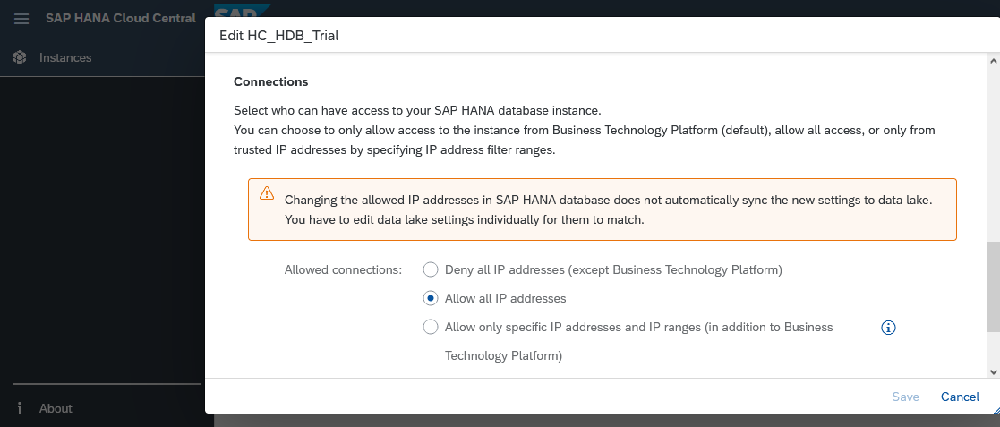
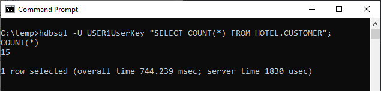
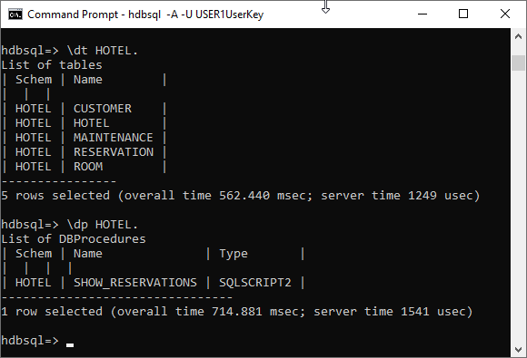
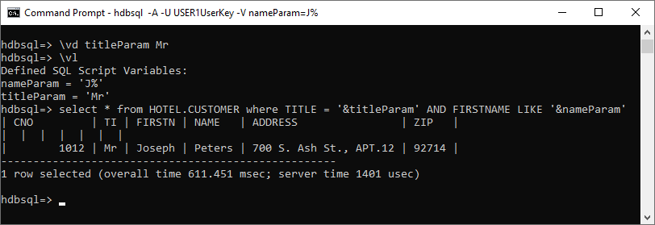
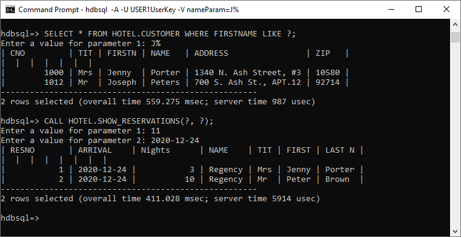

# Create a User, Tables and Import Data Using SAP HANA HDBSQL
<!-- description --> Use the command line tool HDBSQL to connect to a SAP HANA database, create a user, and create tables which will be used in subsequent tutorials in this mission.

## Prerequisites
 - You have completed the first 2 tutorials in this mission.

## You will learn
  - How to connect to SAP HANA from a client machine using HDBSQL
  - How to create a user, schema, tables and import data

## Intro
HDBSQL is used in this tutorial as it is part of the SAP HANA client install.  HDBSQL is a basic tool for executing SQL scripts and providing an interface for interactive queries.  Another more user-friendly option to execute SQL operations is the [SQL Console](hana-dbx-hcc) that is part of SAP HANA Cloud Central or the [SAP HANA database explorer](group.hana-cloud-get-started) which is part of a server + applications SAP HANA, express edition install.  

---

### Connect to SAP HANA using hdbsql


This step demonstrates how to connect to a SAP HANA instance using [HDBSQL](https://help.sap.com/docs/SAP_HANA_CLIENT/f1b440ded6144a54ada97ff95dac7adf/c22c67c3bb571014afebeb4a76c3d95d.html) from the SAP HANA client installation.

1. Copy and paste the following command to see the command line options and press the space bar to advance though the information.  

    ```Shell
    hdbsql -h | more
    ```

2. Connect to either SAP HANA Cloud or SAP HANA, express edition using host, port, and credentials.  Details on where to find these values are covered in the third and fifth steps of the [first tutorial](hana-clients-choose-hana-instance) in this mission.   

    - To connect to SAP HANA Cloud, see the following general command.  
    >The connection must be encrypted (-e).  Starting with the 2.6 SAP HANA client, connections on port 443 enable encryption by default so the -e parameter is not needed for SAP HANA Cloud connections.

        ```Shell
        hdbsql -n <host name>:<port> -u <user> -p <password>
        ```

        The following is a connection example for the SAP HANA Cloud.  

        ```Shell
        hdbsql -n 3b2gf55e-4214-4bd9-adfc-f547d8e2d384.hana.trial-us10.hanacloud.ondemand.com:443 -u DBADMIN -p your_password
        ```

        > The HANA Cloud instance can be configured to enable applications running from outside the SAP BTP to connect.  The current setting is shown in SAP HANA Cloud Central in the screenshot below.  An example of configuring this setting is shown in [Allow connections to SAP HANA Cloud instance from selected IP addresses — using the command line](https://blogs.sap.com/2020/10/30/allow-connections-to-sap-hana-cloud-instance-from-selected-ip-addresses-using-the-command-line/).

        > 


        >---

        >The SAP HANA Cloud, HANA database trial instance will be automatically stopped overnight.   That means you need to restart your instance before working with it each new day.

        >---

        > Connections to a HANA Cloud instance must use encryption.  The default encryption library on Windows is mscrypto and on Linux and macOS it is OpenSSL.  The following example demonstrates how one could use the SAP provided conmmoncrypto library instead of the default encryption library.  Note, the following steps require that the SAP HANA Client be downloaded from the SAP Software Downloads as the download includes the SAP Common Crypto library (libsapcrypto).  Note that the environment variables can also be set by running source hdbclienv.sh or hdbclienv.bat.

        >```Shell (Linux or Mac)
        mkdir ~/.ssl
        # Download the public root certificate used by HANA Cloud
        wget --no-check-certificate https://cacerts.digicert.com/DigiCertGlobalRootCA.crt.pem -O ~/.ssl/DigiCertGlobalRootCA.crt.pem
        # Show the command help for the sapgenpse
        sapgenpse -h
        # SECDIR & LD_LIBRARY_PATH environment variables are required when using the commoncrypto library
        export SECUDIR=~/sap/hdbclient
        export LD_LIBRARY_PATH=~/sap/hdbclient:$LD_LIBRARY_PATH
        # macOS only
        export DYLD_LIBRARY_PATH=~/sap/hdbclient
        # Create a PSE (Personal Security Environment) which will be used to contain the public root certificate of SAP HANA Cloud.  
        # Press enter twice to not provide a pin
        sapgenpse gen_verify_pse -p "$SECUDIR/sapcli.pse"
        >```

        >```Shell (Linux or Mac)
        # Add the certificate to the PSE
        sapgenpse maintain_pk -p "$SECUDIR/sapcli.pse" -a ~/.ssl/DigiCertGlobalRootCA.crt.pem
        # View the contents of the PSE
        sapgenpse maintain_pk -p "$SECUDIR/sapcli.pse" -l
        # Connect using the SAP commoncrypto library rather than OpenSSL. Replace the host, user, and password values.
        hdbsql -sslprovider commoncrypto -n 3b2gf55e-4214-4bd9-adfc-f547d8e2d384.hana.trial-us10.hanacloud.ondemand.com:443 -u <USER> -p <Password>
        >```

        >```Shell (Windows)
        REM In a browser download https://cacerts.digicert.com/DigiCertGlobalRootCA.crt.pem
        REM Show the command help for the sapgenpse
        sapgenpse -h
        REM SECDIR environment variable is required when using the commoncrypto library
        set SECUDIR=C:\SAP\hdbclient
        REM Create a PSE (Personal Security Environment) which will be used to contain the public root certificate of SAP HANA Cloud.  
        REM Press enter twice to not provide a pin
        sapgenpse gen_verify_pse -p "%SECUDIR%/sapcli.pse"
        REM if the above command fails, try using the -log option for additional output.
        >```

        >```Shell (Windows)
        REM Add the certificate to the PSE
        sapgenpse maintain_pk -p "%SECUDIR%/sapcli.pse" -a %USERPROFILE%/Downloads/DigiCertGlobalRootCA.crt
        REM View the contents of the PSE
        sapgenpse maintain_pk -p "%SECUDIR%/sapcli.pse" -l
        REM Connect using the SAP commoncrypto library rather than OpenSSL. Replace the host, user, and password values.
        hdbsql -sslprovider commoncrypto -n 3b2gf55e-4214-4bd9-adfc-f547d8e2d384.hana.trial-us10.hanacloud.ondemand.com:443 -u <USER> -p <Password>
        >```

        > For additional details see [Server Certificate Authentication](https://help.sap.com/docs/SAP_HANA_CLIENT/f1b440ded6144a54ada97ff95dac7adf/a95754380f4c4c05b728524f9cd652e3.html).


        >---

        > If you are on a Linux or Mac machine and the hdbsql connection fails with the error message below, it indicates that the OpenSSL library could not locate a trust store in the default location.  
        >
        >_Cannot create SSL context:  SSL trust store cannot be found: `/Users/user1/.ssl/trust.pem`_

        > A public root certificate to validate the server's certificate is needed.  More information about the required DigiCert root certificate can be found at  [Secure Communication Between SAP HANA Cloud and JDBC/ODBC Clients](https://help.sap.com/docs/hana-cloud-database/sap-hana-cloud-sap-hana-database-security-guide/secure-communication-between-sap-hana-and-sap-hana-clients).  
        >
        > It can be downloaded from [Download PEM](https://dl.cacerts.digicert.com/DigiCertGlobalRootCA.crt.pem), renamed to `trust.pem` and saved to the specified location.  For further details, see [Secure connection from HDBSQL to SAP HANA Cloud](https://blogs.sap.com/2020/04/14/secure-connection-from-hdbsql-to-sap-hana-cloud/).
        >
        >Starting with the 2.6 SAP HANA client, if the root certificate is available to OpenSSL, it is no longer required to also be in `trust.pem`.

    - For SAP HANA, express edition, there are two options shown below to connect.

        ```Shell
        hdbsql -n <ip address>:39015 -u <user> -p <password>
        or
        hdbsql -n <ip address> -d <database name> -i <instance number> -u <user> -p <password>
        ```

        Below are two connection examples for SAP HANA, express edition.

        ```Shell
        hdbsql -n <ip address>:39015 -u SYSTEM -p your_password
        or
        hdbsql -n <ip address> -d HXE -i 90 -u SYSTEM -p your_password
        ```

        Notice that either the host and port combination or the host, database name and instance number can be used to connect.

3. Type `\s` for status information

    ```Shell
    \s
    ```

    Notice that for the SAP HANA Cloud instance, the version number is 4.x.  

    


    Notice that for the HANA, express edition, the version number is 2.x.  

      


### Create user and schema


This step creates two users and a schema.  `USER1` will be the owner of the tables that will be created in a subsequent step and will be used to connect to the database. 

On Linux or a Mac, turn off page by page scroll output.  Also, consult the `-j` `hdbsql` option.  This enables multiple commands to be pasted at one time and does not require each result to be exited by pressing q.  

```HDBSQL (Linux or Mac)
\pa off
```

1. Create `USER1`.  Select the command below based on the version of SAP HANA being used.  Note that the message  _'0 rows affected'_ means that query was successful.

    ```SQL
    CREATE USER USER1 PASSWORD Password1 no force_first_password_change;
    CREATE USER USER2 PASSWORD Password2 no force_first_password_change;  --Used in the Node.js connection pool example and the entity framework tutorial.
    ```

    >The end of this tutorial contains SQL statements to delete the user, schema and objects created.  This may be helpful if you wish to recreate the sample dataset used in this tutorial.

    To verify that the user was created, enter the following command.
    ```SQL
    SELECT USER_NAME FROM USERS;
    ```

    Also notice that a schema with the same name is created for this user.  

    ```SQL
    SELECT SCHEMA_NAME FROM SCHEMAS;
    ```

2. Enable `USER1` the ability to create schema, connect as `USER1`, create a schema, and set it as the current schema.

    ```SQL
    SELECT CURRENT_USER, CURRENT_SCHEMA FROM DUMMY;
    GRANT CREATE SCHEMA TO USER1;
    CONNECT USER1 PASSWORD Password1;
    CREATE SCHEMA HOTEL;
    SET SCHEMA HOTEL;
    SELECT CURRENT_USER, CURRENT_SCHEMA FROM DUMMY;
    ```

    Notice that the current user and schema have also changed from `DBADMIN` or `SYSTEM` to `USER1` and that the schema is now HOTEL.

For further information on SQL to create a user or schema, see [CREATE USER Statement](https://help.sap.com/docs/hana-cloud-database/sap-hana-cloud-sap-hana-database-sql-reference-guide/create-user-statement-access-control), [CREATE SCHEMA Statement](https://help.sap.com/docs/hana-cloud-database/sap-hana-cloud-sap-hana-database-sql-reference-guide/create-schema-statement-data-definition),
 [Grant Statement(Access Control)](https://help.sap.com/docs/hana-cloud-database/sap-hana-cloud-sap-hana-database-sql-reference-guide/grant-statement-access-control), and [Privileges](https://help.sap.com/docs/hana-cloud-database/sap-hana-cloud-sap-hana-database-security-guide/privileges).


### Store connection details in secure user store (hdbuserstore)


Remembering and entering IP addresses, ports, user IDs and passwords can be difficult. [SAP HANA User Store](https://help.sap.com/docs/SAP_HANA_CLIENT/f1b440ded6144a54ada97ff95dac7adf/708e5fe0e44a4764a1b6b5ea549b88f4.html) offers a convenient means of storing this information and making it available to the SAP HANA client interfaces.

1. Exit out of `hdbsql` and type `hdbuserstore` to see a list of available commands such as Set, List and Delete.

    ```Shell
    \q
    hdbuserstore
    ```
    `hdbuserstore` is included with the install of the SAP HANA client.

2. Using `hdbuserstore`, specify a key named `USER1UserKey` that has the host, port and credentials.  Details on where to find these values are covered in the third and fifth steps of the [first tutorial](hana-clients-choose-hana-instance) in this mission.

    ```Shell
    hdbuserstore Set USER1UserKey <host name>:<port> USER1 Password1
    hdbuserstore List
    ```

3. Connect with `USER1` as the username.  

    ```Shell
    hdbsql -U USER1UserKey
    ```

    > Uppercase U is for specifying a key from the user store, lower case u is for user.  

    >---

    > Starting with the 2.6 SAP HANA client, connections on port 443 enable encryption by default so the `-e or -attemptencrypt` parameters are not needed for SAP HANA Cloud connections.

[Using Stored Connection Information](https://help.sap.com/docs/SAP_HANA_CLIENT/f1b440ded6144a54ada97ff95dac7adf/708e5fe0e44a4764a1b6b5ea549b88f4.html) contains details on how an application can use a `hdbuserstore` key.


### Create tables and insert data


1. Exit HDBSQL by entering \q.

2. Create a folder for the exercises in this tutorial, enter that directory, and begin editing a file named `hotel.sql`.
    ```Shell (Microsoft Windows)
    mkdir %HOMEPATH%\HANAClientsTutorial\sql
    cd %HOMEPATH%\HANAClientsTutorial\sql
    notepad hotel.sql
    ```

    Substitute `pico` below for your preferred text editor.  

    ```Shell (Linux or Mac)
    mkdir -p $HOME/HANAClientsTutorial/sql
    cd $HOME/HANAClientsTutorial/sql
    pico hotel.sql
    ```

3. Copy the following SQL into the file `hotel.sql`.  

    ```SQL
    SET SCHEMA HOTEL;
    CREATE COLUMN TABLE HOTEL(
      hno INTEGER PRIMARY KEY,
      name NVARCHAR(50) NOT NULL,
      address NVARCHAR(40) NOT NULL,
      city NVARCHAR(30) NOT NULL,
      state NVARCHAR(2) NOT NULL,
      zip NVARCHAR(6)
    );
    CREATE COLUMN TABLE ROOM(
      hno INTEGER,
      type NVARCHAR(6),
      free NUMERIC(3),
      price NUMERIC(6, 2),
      PRIMARY KEY (hno, type),
      FOREIGN KEY (hno) REFERENCES HOTEL
    );
    CREATE COLUMN TABLE CUSTOMER(
      cno INTEGER PRIMARY KEY,
      title NVARCHAR(7),
      firstname NVARCHAR(20),
      name NVARCHAR(40) NOT NULL,
      address NVARCHAR(40) NOT NULL,
      zip NVARCHAR(6)
    );
    CREATE COLUMN TABLE RESERVATION(
      resno INTEGER NOT NULL GENERATED BY DEFAULT AS IDENTITY,
      rno INTEGER NOT NULL,
      cno INTEGER,
      hno INTEGER,
      type NVARCHAR(6),
      arrival DATE NOT NULL,
      departure DATE NOT NULL,
      PRIMARY KEY (
        "RESNO", "ARRIVAL"
      ),
      FOREIGN KEY(hno) REFERENCES HOTEL,
      FOREIGN KEY(cno) REFERENCES CUSTOMER
    );
    CREATE COLUMN TABLE MAINTENANCE(
      mno INTEGER PRIMARY KEY,
      hno INTEGER,
      description NVARCHAR(100),
      date_performed DATE,
      performed_by NVARCHAR(40)
    );

    CREATE OR REPLACE PROCEDURE SHOW_RESERVATIONS(
      IN IN_HNO INTEGER, IN IN_ARRIVAL DATE)
      SQL SECURITY INVOKER
      READS SQL DATA
      AS BEGIN
        SELECT
          R.RESNO,
          R.ARRIVAL,
          DAYS_BETWEEN (R.ARRIVAL, R.DEPARTURE) as "Nights",
          H.NAME,
          CUS.TITLE,
          CUS.FIRSTNAME AS "FIRST NAME",
          CUS.NAME AS "LAST NAME"
        FROM
          RESERVATION AS R
          LEFT OUTER JOIN
          HOTEL AS H
          ON H.HNO = R.HNO
          LEFT OUTER JOIN
          CUSTOMER AS CUS
          ON CUS.CNO = R.CNO
          WHERE R.ARRIVAL = :IN_ARRIVAL AND
          H.HNO = :IN_HNO
        ORDER BY
          H.NAME ASC,
          R.ARRIVAL DESC;
      END;

    INSERT INTO HOTEL VALUES(10, 'Congress', '155 Beechwood St.', 'Seattle', 'WA', '20005');
    INSERT INTO HOTEL VALUES(11, 'Regency', '477 17th Avenue', 'Seattle', 'WA', '20037');
    INSERT INTO HOTEL VALUES(12, 'Long Island', '1499 Grove Street', 'Long Island', 'NY', '11788');
    INSERT INTO HOTEL VALUES(13, 'Empire State', '65 Yellowstone Dr.', 'Albany', 'NY', '12203');
    INSERT INTO HOTEL VALUES(14, 'Midtown', '12 Barnard St.', 'New York', 'NY', '10019');
    INSERT INTO HOTEL VALUES(15, 'Eighth Avenue', '112 8th Avenue', 'New York', 'NY', '10019');
    INSERT INTO HOTEL VALUES(16, 'Lake Michigan', '354 OAK Terrace', 'Chicago', 'IL', '60601');
    INSERT INTO HOTEL VALUES(17, 'Airport', '650 C Parkway', 'Rosemont', 'IL', '60018');
    INSERT INTO HOTEL VALUES(18, 'Sunshine', '200 Yellowstone Dr.', 'Clearwater', 'FL', '33575');
    INSERT INTO HOTEL VALUES(19, 'Beach', '1980 34th St.', 'Daytona Beach', 'FL', '32018');
    INSERT INTO HOTEL VALUES(20, 'Atlantic', '111 78th St.', 'Deerfield Beach', 'FL', '33441');
    INSERT INTO HOTEL VALUES(21, 'Long Beach', '35 Broadway', 'Long Beach', 'CA', '90804');
    INSERT INTO HOTEL VALUES(22, 'Indian Horse', '16 MAIN STREET', 'Palm Springs', 'CA', '92262');
    INSERT INTO HOTEL VALUES(23, 'Star', '13 Beechwood Place', 'Hollywood', 'CA', '90029');
    INSERT INTO HOTEL VALUES(24, 'River Boat', '788 MAIN STREET', 'New Orleans', 'LA', '70112');
    INSERT INTO HOTEL VALUES(25, 'Ocean Star', '45 Pacific Avenue', 'Atlantic City', 'NJ', '08401');
    INSERT INTO HOTEL VALUES(26, 'Bella Ciente', '1407 Marshall Ave', 'Longview', 'TX', '75601');

    INSERT INTO ROOM VALUES(10, 'single', 20, 135.00);
    INSERT INTO ROOM VALUES(10, 'double', 45, 200.00);
    INSERT INTO ROOM VALUES(12, 'single', 10, 70.00);
    INSERT INTO ROOM VALUES(12, 'double', 13, 100.00);
    INSERT INTO ROOM VALUES(13, 'single', 12, 45.00);
    INSERT INTO ROOM VALUES(13, 'double', 15, 80.00);
    INSERT INTO ROOM VALUES(14, 'single', 20, 85.00);
    INSERT INTO ROOM VALUES(14, 'double', 35, 140.00);
    INSERT INTO ROOM VALUES(15, 'single', 50, 105.00);
    INSERT INTO ROOM VALUES(15, 'double', 230, 180.00);
    INSERT INTO ROOM VALUES(15, 'suite', 12, 500.00);
    INSERT INTO ROOM VALUES(16, 'single', 10, 120.00);
    INSERT INTO ROOM VALUES(16, 'double', 39, 200.00);
    INSERT INTO ROOM VALUES(16, 'suite', 20, 500.00);
    INSERT INTO ROOM VALUES(17, 'single', 4, 115.00);
    INSERT INTO ROOM VALUES(17, 'double', 11, 180.00);
    INSERT INTO ROOM VALUES(18, 'single', 15, 90.00);
    INSERT INTO ROOM VALUES(18, 'double', 19, 150.00);
    INSERT INTO ROOM VALUES(18, 'suite', 5, 400.00);
    INSERT INTO ROOM VALUES(19, 'single', 45, 90.00);
    INSERT INTO ROOM VALUES(19, 'double', 145, 150.00);
    INSERT INTO ROOM VALUES(19, 'suite', 60, 300.00);
    INSERT INTO ROOM VALUES(20, 'single', 11, 60.00);
    INSERT INTO ROOM VALUES(20, 'double', 24, 100.00);
    INSERT INTO ROOM VALUES(21, 'single', 2, 70.00);
    INSERT INTO ROOM VALUES(21, 'double', 10, 130.00);
    INSERT INTO ROOM VALUES(22, 'single', 34, 80.00);
    INSERT INTO ROOM VALUES(22, 'double', 78, 140.00);
    INSERT INTO ROOM VALUES(22, 'suite', 55, 350.00);
    INSERT INTO ROOM VALUES(23, 'single', 89, 160.00);
    INSERT INTO ROOM VALUES(23, 'double', 300, 270.00);
    INSERT INTO ROOM VALUES(23, 'suite', 100, 700.00);
    INSERT INTO ROOM VALUES(24, 'single', 10, 125.00);
    INSERT INTO ROOM VALUES(24, 'double', 9, 200.00);
    INSERT INTO ROOM VALUES(24, 'suite', 78, 600.00);
    INSERT INTO ROOM VALUES(25, 'single', 44, 100.00);
    INSERT INTO ROOM VALUES(25, 'double', 115, 190.00);
    INSERT INTO ROOM VALUES(25, 'suite', 6, 450.00);

    INSERT INTO CUSTOMER VALUES(1000, 'Mrs', 'Jenny', 'Porter', '1340 N. Ash Street, #3', '10580');
    INSERT INTO CUSTOMER VALUES(1001, 'Mr', 'Peter', 'Brown', '1001 34th St., APT.3', '48226');
    INSERT INTO CUSTOMER VALUES(1002, 'Company', NULL, 'Datasoft', '486 Maple St.', '90018');
    INSERT INTO CUSTOMER VALUES(1003, 'Mrs', 'Rose', 'Brian', '500 Yellowstone Drive, #2', '75243');
    INSERT INTO CUSTOMER VALUES(1004, 'Mrs', 'Mary', 'Griffith', '3401 Elder Lane', '20005');
    INSERT INTO CUSTOMER VALUES(1005, 'Mr', 'Martin', 'Randolph', '340 MAIN STREET, #7', '60615');
    INSERT INTO CUSTOMER VALUES(1006, 'Mrs', 'Sally', 'Smith', '250 Curtis Street', '75243');
    INSERT INTO CUSTOMER VALUES(1007, 'Mr', 'Mike', 'Jackson', '133 BROADWAY APT. 1', '45211');
    INSERT INTO CUSTOMER VALUES(1008, 'Mrs', 'Rita', 'Doe', '2000 Humboldt St., #6', '97213');
    INSERT INTO CUSTOMER VALUES(1009, 'Mr', 'George', 'Howe', '111 B Parkway, #23', '75243');
    INSERT INTO CUSTOMER VALUES(1010, 'Mr', 'Frank', 'Miller', '27 5th St., 76', '95054');
    INSERT INTO CUSTOMER VALUES(1011, 'Mrs', 'Susan', 'Baker', '200 MAIN STREET, #94', '90018');
    INSERT INTO CUSTOMER VALUES(1012, 'Mr', 'Joseph', 'Peters', '700 S. Ash St., APT.12', '92714');
    INSERT INTO CUSTOMER VALUES(1013, 'Company', NULL, 'TOOLware', '410 Mariposa St., #10', '20019');
    INSERT INTO CUSTOMER VALUES(1014, 'Mr', 'Antony', 'Jenkins', '55 A Parkway, #15', '20903');
    INSERT INTO RESERVATION VALUES(1, 100, 1000, 11, 'single', '2020-12-24', '2020-12-27');
    INSERT INTO RESERVATION VALUES(2, 110, 1001, 11, 'double', '2020-12-24', '2021-01-03');
    INSERT INTO RESERVATION VALUES(3, 120, 1002, 15, 'suite', '2020-11-14', '2020-11-18');
    INSERT INTO RESERVATION VALUES(4, 130, 1009, 21, 'single', '2019-02-01', '2019-02-03');
    INSERT INTO RESERVATION VALUES(5, 150, 1006, 17, 'double', '2019-03-14', '2019-03-24');
    INSERT INTO RESERVATION VALUES(6, 140, 1013, 20, 'double', '2020-04-12', '2020-04-30');
    INSERT INTO RESERVATION VALUES(7, 160, 1011, 17, 'single', '2020-04-12', '2020-04-15');
    INSERT INTO RESERVATION VALUES(8, 170, 1014, 25, 'suite', '2020-09-01', '2020-09-03');
    INSERT INTO RESERVATION VALUES(9, 180, 1001, 22, 'double', '2020-12-23', '2021-01-08');
    INSERT INTO RESERVATION VALUES(10, 190, 1013, 24, 'double', '2020-11-14', '2020-11-17');

    INSERT INTO MAINTENANCE VALUES(10, 24, 'Replace pool liner and pump', '2019-03-21', 'Discount Pool Supplies');
    INSERT INTO MAINTENANCE VALUES(11, 25, 'Renovate the bar area.  Replace TV and speakers', '2020-11-29', 'TV and Audio Superstore');
    INSERT INTO MAINTENANCE VALUES(12, 26, 'Roof repair due to storm', null, null);

    SELECT SCHEMA_NAME, OBJECT_NAME, OBJECT_TYPE, OWNER_NAME FROM "PUBLIC"."OWNERSHIP" WHERE OWNER_NAME = 'USER1';
    ```

4. Execute the SQL with the command below.  This is an example of running commands in non-interactive mode.

    ```Shell
    hdbsql -U USER1UserKey -I hotel.sql
    ```

    Confirm that 15 records have been inserted.  

    ```Shell
    hdbsql -U USER1UserKey "SELECT COUNT(*) FROM HOTEL.CUSTOMER";
    ```

    

    View the list of created objects.

    ```SQL
    hdbsql -U USER1UserKey
    \dt HOTEL.
    \dp HOTEL.
    ```

     

    For further information, see [CREATE TABLE Statement](https://help.sap.com/docs/hana-cloud-database/sap-hana-cloud-sap-hana-database-sql-reference-guide/create-table-statement-data-definition) and [INSERT Statement](https://help.sap.com/docs/hana-cloud-database/sap-hana-cloud-sap-hana-database-sql-reference-guide/insert-statement-data-manipulation).


    > ### Some Tips

    >Identifiers such as table names are automatically upper cased unless they are within "".  
    >
    ```SQL
    SELECT * FROM HoTeL.RoOm;  --succeeds
    SELECT * FROM "HoTeL"."RoOm"; --fails
    SELECT * FROM "HOTEL"."ROOM"; --succeeds
    ```

    >For further details, consult [Identifiers and case sensitivity](https://help.sap.com/docs/hana-cloud-database/sap-hana-cloud-sap-hana-database-sql-reference-guide/introduction-to-sql#loio209f5020751910148fd8fe88aa4d79d9__identifiers_case).

    > ---

    >Should you wish to remove the contents of a table, the table itself, a schema or a user, the following statements can be executed.  Do not execute these now as `USER1` and the hotel data set will be used subsequently in this tutorial.  

    >```SQL
    DELETE FROM HOTEL.CITY;
    DROP TABLE HOTEL.CITY;
    DROP SCHEMA HOTEL CASCADE;
    DROP USER USER1 CASCADE;
    >```


### Interactive, non-interactive, substitution variables, and prepared statements


1. HDBSQL can [run commands](https://help.sap.com/docs/SAP_HANA_CLIENT/f1b440ded6144a54ada97ff95dac7adf/6097e699826343d0879244185d680a0d.html) interactively, or non-interactively.  A few examples are shown below.

    ```SQL
    SELECT * FROM HOTEL.CUSTOMER; -- interactive
    hdbsql -U USER1UserKey "SELECT * FROM HOTEL.CUSTOMER"; -- non-interactive
    hdbsql -U USER1UserKey -I hotel.sql -- batch file
    ```

2. [Substitution variables](https://help.sap.com/docs/SAP_HANA_CLIENT/f1b440ded6144a54ada97ff95dac7adf/18ce51f468bc4cfe9112e6be79953e93.html) can used to pass parameters.  

    Create a file named `findCustomers.sql`.

    ```Shell (Windows)
    notepad findCustomers.sql
    ```

    ```Shell (Linux or Mac)
    pico findCustomers.sql
    ```

    Given the following SQL statement:

    ```SQL (findCustomers.sql)
    SELECT * FROM HOTEL.CUSTOMER WHERE FIRSTNAME LIKE '&nameParam'
    ```

    We can call the query by executing the following command:

    ```Shell
    hdbsql -A -U USER1UserKey -V nameParam=J% -I findCustomers.sql
    ```

    

    It is also possible to define new variables and list the defined variables as shown below.

    ```SQL
    \vd titleParam Mr
    \vl
    SELECT * FROM HOTEL.CUSTOMER WHERE TITLE = '&titleParam' AND FIRSTNAME LIKE '&nameParam'
    ```

    

    See [SAP HANA HDBSQL Options](https://help.sap.com/docs/SAP_HANA_CLIENT/f1b440ded6144a54ada97ff95dac7adf/c24d054bbb571014b253ac5d6943b5bd.html) for details on the options to list and define substitution variables.

3. As of version 2.13, HDBSQL will prompt for required parameters.  A few examples follow.

    ```SQL
    SELECT * FROM HOTEL.CUSTOMER WHERE FIRSTNAME LIKE ?;
    ```

    ```SQL
    CALL HOTEL.SHOW_RESERVATIONS(?, ?);
    ```

    

    In the above examples, the statements are prepared first, then the parameters are sent afterwards during the execute phase. In the previous step which used substitution variables, however, there is no separate prepare step.  If a statement is going to be executed repeatedly, but with different parameters, in general, prepared statements can execute quicker.

### Knowledge check

Congratulations! You have now created a user and some tables using HDBSQL.  This user will be used to connect and query the data in the following tutorials.


---
