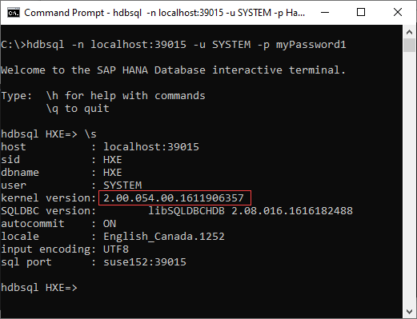

## Details
### You will learn
  - How to connect to SAP HANA from a client machine using HDBSQL
  - How to create a user, schema, tables and import data

HDBSQL is used in this tutorial as it is part of the SAP HANA client install.  HDBSQL is a very basic tool for executing SQL scripts and providing an interface for interactive queries.  Another more user-friendly option to execute SQL operations is the SAP HANA database explorer which is part of a HANA Cloud instance or a server + applications SAP HANA, express edition install.  

---

[ACCORDION-BEGIN [Step 1: ](Connect to SAP HANA using hdbsql)]

This section demonstrates how to connect to a SAP HANA instance using [HDBSQL](https://help.sap.com/viewer/f1b440ded6144a54ada97ff95dac7adf/2.4/en-US/c22c67c3bb571014afebeb4a76c3d95d.html) from the SAP HANA client installation.

1. Copy and paste the following command to see the command line options and press the space bar to advance though the information.  

    ```Shell
    hdbsql -h | more
    ```

2. Connect to either SAP HANA Cloud or SAP HANA, express edition using host, port, and credentials. As mentioned previously, the host and port can be found in the SAP Cloud Platform cockpit.   

    - To connect to SAP HANA Cloud, see the following general command.  
    >Note: the connection must be encrypted (-e).

        ```Shell
        hdbsql -e -n <host name>:<port> -u <user> -p <password>
        ```

        The following is a connection example for the SAP HANA Cloud.  

        ```Shell
        hdbsql -e -n 61964be8-39e8-4622-9a2b-ba3a38be2f75.hana.canary-eu10.hanacloud.ondemand.com:443 -u DBADMIN -p your_password
        ```

        > The HANA Cloud instance can be configured to enable applications running from outside the SAP Cloud Platform to connect.  The current setting is shown in the screenshot below.  

        

        > If you are on a Linux or Mac machine and the hdbsql connection fails with the error message below, it indicates that the client could not locate a trust store in the default location.  
        >
        >_Cannot create SSL context:  SSL trust store cannot be found: `/Users/user1/.ssl/trust.pem`_

        > A public root certificate to validate the server's certificate is needed.  More information about the DigiCert root certificate required can be found at  [Secure Communication Between SAP HANA Cloud and JDBC/ODBC Clients](https://help.sap.com/viewer/c82f8d6a84c147f8b78bf6416dae7290/cloud/en-US/dbd3d887bb571014bf05ca887f897b99.html).  
        >
        > It can be downloaded from [Download PEM](https://dl.cacerts.digicert.com/DigiCertGlobalRootCA.crt.pem), renamed to trust.pem and saved to the specified location.  For further details, see [Secure connection from HDBSQL to SAP HANA Cloud](https://blogs.sap.com/2020/04/14/secure-connection-from-hdbsql-to-sap-hana-cloud/).

    - For SAP HANA, express edition, there are two options shown below to connect.

        ```Shell
        hdbsql -n <ip address>:39015 -u <user> -p <password>
        or
        hdbsql -n <ip address> -d <database name> -i <instance number> -u <user> -p <password>
        ```

        Below are two connection examples for SAP HANA, express edition.

        ```Shell
        hdbsql -n <ip address>:39015 -u SYSTEM -p your_password
        or
        hdbsql -n <ip address> -d HXE -i 90 -u SYSTEM -p your_password
        ```

        Notice that either the host and port combination or the host, database name and instance number can be used to connect.

3. Type `\s` for status information

    ```Shell
    \s
    ```

    Notice that for the SAP HANA Cloud instance, the version number is 4.x.  

    


    Notice that for the HANA, express edition, the version number is 2.x.  

      

[DONE]
[ACCORDION-END]

[ACCORDION-BEGIN [Step 2: ](Create user and schema)]

In this section, create a user named `USER1`.  `USER1` will be the owner of the tables that will be created in a subsequent section and will be used to connect to the database.

On Linux or a Mac, turn off page by page scroll output.  Also consult the `-j` `hdbsql` option.  This enables multiple commands to be pasted at one time and does not require each result to be exited by pressing q.  

```HDBSQL (Linux or Mac)
\pa on
```

1. Create `USER1`.  Note that the message  _'0 rows affected'_ means that query was successful.

    ```SQL for SAP HANA Cloud
    CREATE USER USER1 PASSWORD Password1 no force_first_password_change SET USERGROUP DEFAULT;
    ```

    The `SET USERGROUP` command is only required for SAP HANA Cloud as the `DBADMIN` user does not have the privilege `USER ADMIN`.  


    ```SQL for SAP HANA, express edition
    CREATE USER USER1 PASSWORD Password1 no force_first_password_change;
    ```

    To verify that the user was created, enter the following command.
    ```SQL
    SELECT USER_NAME FROM USERS;
    ```

    Also notice that a schema with the same name is created for this user.  

    ```SQL
    SELECT SCHEMA_NAME FROM SCHEMAS;
    ```

2. Create a new schema and grant `USER1` the ability to create new objects in it.

    ```SQL
    CREATE SCHEMA HOTEL;
    GRANT CREATE ANY ON SCHEMA HOTEL TO USER1;
    ```

3. Connect as `USER1` and notice that current user changes from `DBADMIN` or `SYSTEM` to `USER1`.

    ```SQL
    SELECT CURRENT_USER, CURRENT_SCHEMA FROM DUMMY;
    CONNECT USER1 PASSWORD Password1;
    SELECT CURRENT_USER, CURRENT_SCHEMA FROM DUMMY;
    ```

For further information on SQL to create a user or schema, see [CREATE USER Statement](https://help.sap.com/viewer/4fe29514fd584807ac9f2a04f6754767/latest/en-US/20d5ddb075191014b594f7b11ff08ee2.html) and [CREATE SCHEMA Statement](https://help.sap.com/viewer/4fe29514fd584807ac9f2a04f6754767/latest/en-US/20d4ecad7519101497d192700ce5f3df.html).

[DONE]
[ACCORDION-END]

[ACCORDION-BEGIN [Step 3:](Store connection details in secure user store (hdbuserstore))]

Remembering and entering IP addresses, ports, user IDs and passwords can be difficult. [Secure User Store](https://help.sap.com/viewer/b3ee5778bc2e4a089d3299b82ec762a7/latest/en-US/dd95ac9dbb571014a7d7f0234d762fdb.html) offers a convenient means of storing this information and making it available to the SAP HANA client interfaces.

1. Exit out of `hdbsql` and type `hdbuserstore` to see a list of available commands such as Set, List and Delete.

    ```Shell
    \q
    hdbuserstore
    ```
    `hdbuserstore` is included with the install of the SAP HANA database clients.

2. Using `hdbuserstore`, specify a key named `USER1UserKey` that has the host, port and credentials.  Details on where to find these values are covered in [first tutorial](hana-clients-choose-hana-instance) in this mission.

    ```Shell
    hdbuserstore Set USER1UserKey <host name>:<port> USER1 Password1
    hdbuserstore List
    ```

3. Connect with `USER1` as the username.

    ```Shell
    hdbsql -attemptencrypt -U User1UserKey
    ```

    >Uppercase U is for specifying a key from the user store, lower case u is for user.  

    >When connecting using `-U`, a connection is not attempted until a query is issued.  <!-- This will be corrected in 2.5 https://git.wdf.sap.corp/#/c/4482920/ -->

[Using Stored Connection Information](https://help.sap.com/viewer/b3ee5778bc2e4a089d3299b82ec762a7/latest/en-US/dd95ac9dbb571014a7d7f0234d762fdb.html) contains details on how an application can use a `hdbuserstore` key.


[DONE]
[ACCORDION-END]

[ACCORDION-BEGIN [Step 4: ](Create tables and import data)]

1. Exit HDBSQL by entering \q.

2. Create a folder for the exercises in this tutorial, enter that directory, and begin editing a file named `hotel.sql`.
    ```Shell (Microsoft Windows)
    mkdir %HOMEPATH%\HANAClientsTutorial\sql
    cd %HOMEPATH%\HANAClientsTutorial\sql
    notepad hotel.sql
    ```

    Substitute `pico` below for your preferred text editor.  

    ```Shell (Linux or Mac)
    mkdir -p $HOME/HANAClientsTutorial/sql
    cd $HOME/HANAClientsTutorial/sql
    pico hotel.sql
    ```

3. The instructions at [SAP HANA Cloud SQL Demo Data](https://help.sap.com/viewer/db19c7071e5f4101837e23f06e576495/cloud/en-US/7d9fafec64a749d1a9bcf11c121077da.html) provide SQL statements to create the Hotels demo tables and populate them with data.  Copy all the SQL statements, **except for the first line** which creates the schema hotel, into `hotel.sql`.  The schema hotel was created in a previous step.

4. Execute the SQL with the command below.  This is an example of running commands in non-interactive mode.

    ```Shell
    hdbsql -attemptencrypt -U USER1UserKey -I hotel.sql
    ```

    Confirm that 30 records have been inserted.  

    ```Shell
    hdbsql -attemptencrypt -U USER1UserKey "SELECT COUNT(*) FROM HOTEL.CITY";
    ```

    View the inserted data using the following query.  

    ```Shell
    hdbsql -attemptencrypt -U USER1UserKey "SELECT * FROM HOTEL.CITY";
    ```

> ### Some Tips

>For further information, see [CREATE TABLE Statement](https://help.sap.com/viewer/4fe29514fd584807ac9f2a04f6754767/latest/en-US/20d58a5f75191014b2fe92141b7df228.html).


> ---

>Should you wish to remove the contents of a table, the table itself, a schema or a user, the following statements can be executed.  Do not execute these now as `USER1` and the hotel data set will be used subsequently in this tutorial.  

>```SQL
DELETE FROM HOTEL.CITY;
DROP TABLE HOTEL.CITY;
DROP SCHEMA HOTEL CASCADE;
DROP USER USER1 CASCADE;
```

>For further information, see [Grant Statement(Access Control)](https://help.sap.com/viewer/4fe29514fd584807ac9f2a04f6754767/latest/en-US/20f674e1751910148a8b990d33efbdc5.html), [Object Privileges](https://help.sap.com/viewer/b3d0daf2a98e49ada00bf31b7ca7a42e/latest/en-US/d6311b15a7e74e01b3f660f7d175b318.html?q=object%20privileges), and [SET SCHEMA](https://help.sap.com/viewer/4fe29514fd584807ac9f2a04f6754767/latest/en-US/20fd550375191014b886a338afb4cd5f.html).

> ---


> HDBSQL can [run commands](https://help.sap.com/viewer/f1b440ded6144a54ada97ff95dac7adf/2.4/en-US/6097e699826343d0879244185d680a0d.html) in three different modes; interactive, non-interactive, and batch.  An example of each is shown below.
> ```SQL
> SELECT * FROM HOTEL.CITY; -- interactive
> hdbsql -attemptencrypt -U USER1UserKey "SELECT * FROM HOTEL.CITY"; -- non-interactive
> hdbsql -attemptencrypt -U USER1UserKey -I cities.sql -- batch
>```

> ---


Congratulations! You have now created a user and some tables using HDBSQL.  This user will be used to connect and query the data in the following tutorials.

[VALIDATE_1]
[ACCORDION-END]


---
