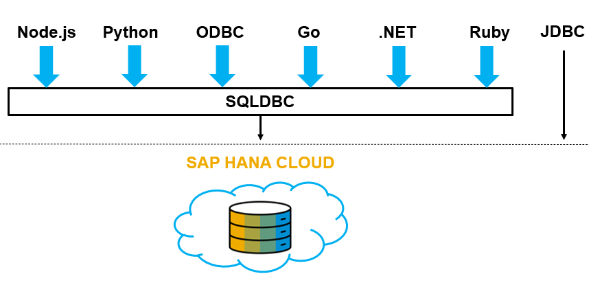
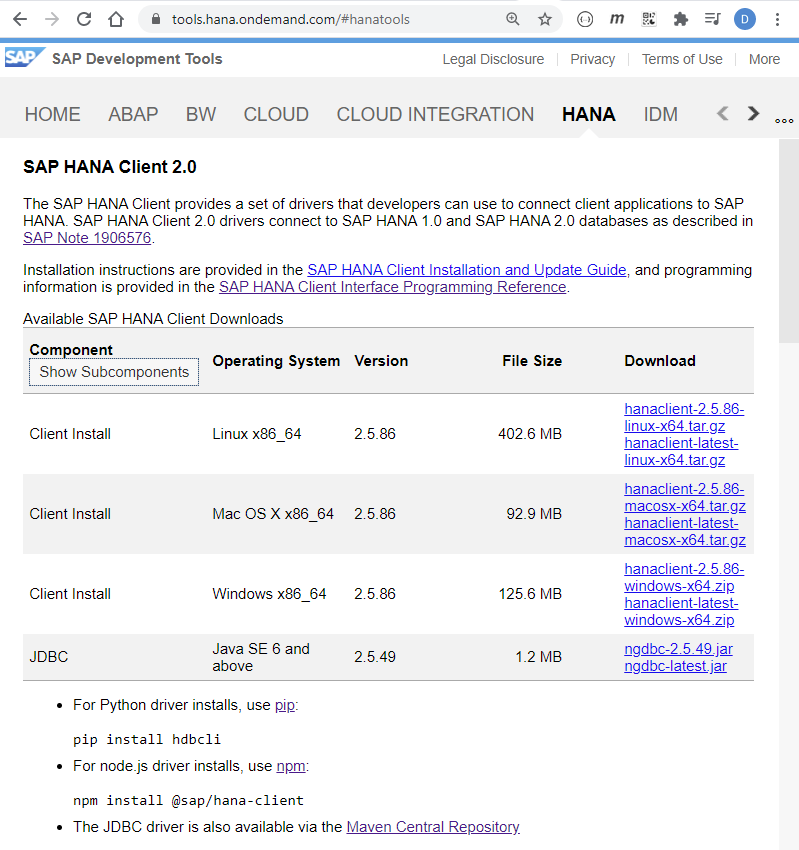
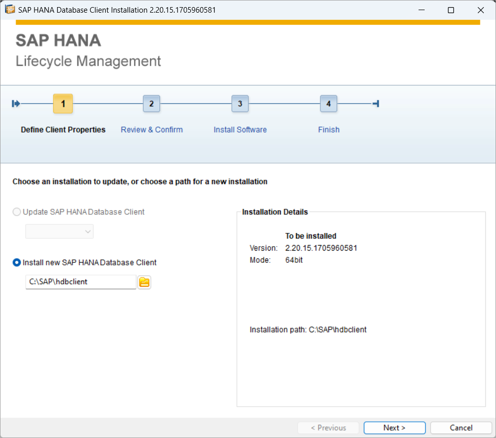
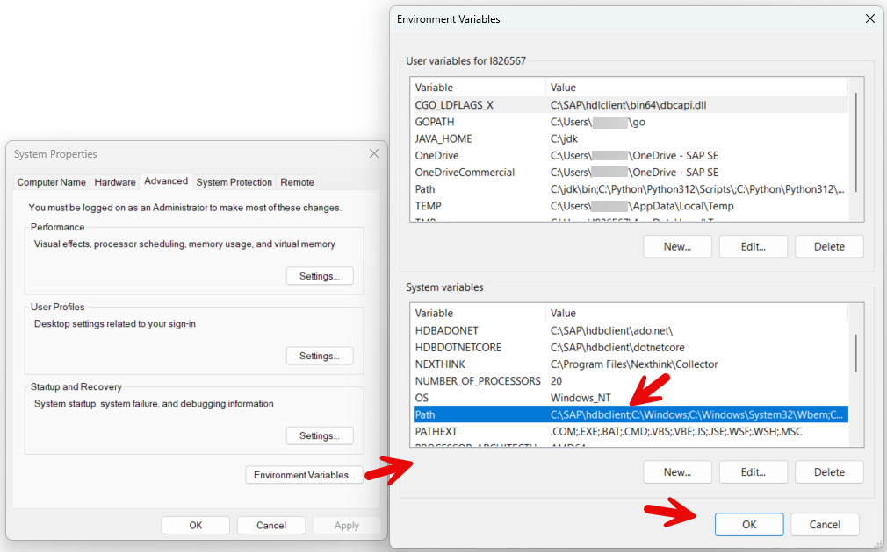
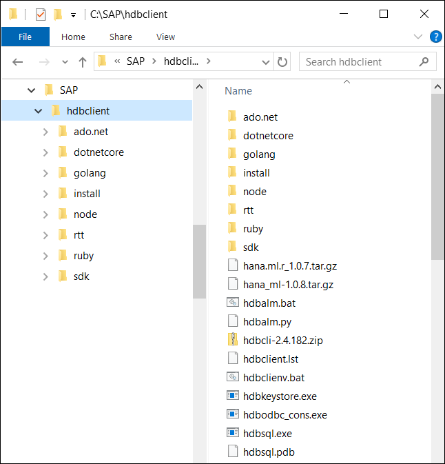
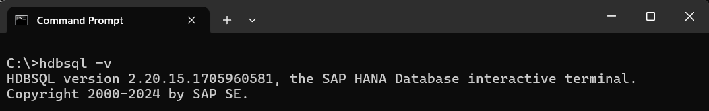
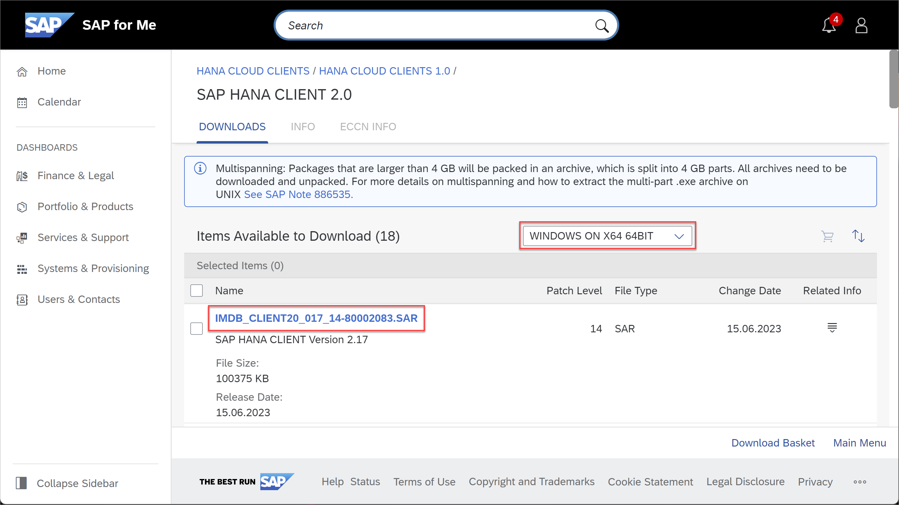

# Install the SAP HANA Client
<!-- description --> Learn about the multiple ways to install the SAP HANA client.

## Prerequisites
 - A Microsoft Windows, Mac, or Linux machine

## You will learn
  - How to install the SAP HANA client
  - The two locations where SAP HANA client installs can be downloaded from

## Intro
This tutorial will demonstrate how to install the SAP HANA client.  The next tutorial in this mission will demonstrate how to use HDBSQL, which is a command line utility included with the client's installation, to connect to SAP HANA.  The tutorials  cover Microsoft Windows, Linux and Mac.  If there are commands that are different depending on the platform, multiple sets of commands will be provided, and the title will say Shell (Microsoft Windows) or Shell (Linux or Mac).  On Microsoft Windows, in this tutorial, the shell used is the Command Prompt.

---

### The SAP HANA Client


The SAP HANA client provides a set of utilities and drivers to connect to and query a SAP HANA database from multiple programming APIs, such as Node.js, Python or Java as shown below.  

  

For a complete list, see [SAP HANA Client Interface Programming Reference](https://help.sap.com/docs/SAP_HANA_CLIENT/f1b440ded6144a54ada97ff95dac7adf/ce5509c492af4a9f84ee519d5659f186.html).  

For a list of newly added features, see [New and Changed Features in the SAP HANA Client](https://help.sap.com/docs/SAP_HANA_CLIENT/79ae9d3916b84356a89744c65793b924/22485d2937c4427fbbedefe3cc158571.html) or the [release notes](https://launchpad.support.sap.com/#/notes/2941449).

The SAP HANA client can be used to connect to different versions of SAP HANA.  For example, a `2.18.x` client can connect to SAP HANA Cloud or SAP HANA 2.0.  For more information, see [SAP HANA client and server cross-version compatibility](https://launchpad.support.sap.com/#/notes/0001906576).


### Install from SAP Development Tools


1. Download the client installer for your platform (Microsoft Windows, Linux, or Mac) from the [SAP Development Tools](https://tools.hana.ondemand.com/#hanatools) website under the HANA tab and the SAP HANA Client 2.0 section.

    >An alternate location to download the client installer (SAP Software Center) is described in step 3 which includes the SAP Common Crypto library and additional platforms such as Windows 32-bit and AIX.  SAP Software Center also may contain newer versions and patches before they are available on the SAP Development Tools site.

    

2. On Microsoft Windows, unzip the downloaded file in a temporary location.

    On Linux or a Mac, use the following:

    ```Shell (Linux or Mac)
    tar -zxvf hanaclient*.tar.gz
    ```  

3. Start the graphical installer `hdbsetup` or use the command line installer `hdbinst`.  

    ```Shell (Microsoft Windows)
    hdbsetup.exe
    ```

    ```Shell (Linux or Mac)
    ./hdbsetup
    ```  

    Set the install directory to `C:\SAP\hdbclient` on Microsoft Windows or to `users/your_user/sap/hdbclient` on Linux or macOS and complete the installation.  

    

    > If the install fails, try running the installer with administrator privilege (i.e. On Microsoft Windows, right-click on `hdbsetup.exe` and choose Run as an administrator).

    > If an older version is already installed, it can be upgraded or it can be uninstalled by running `hdbuninst` from the folder where the client is installed.  For example, `c:\sap\hdbclient\install\hdbuninst`

4. After the installation process is completed, update your `Path` environment variable so that the SAP HANA client programs such as `hdbsql` can be found on your path.  On Microsoft Windows, click the **Start** icon and search for **environment variables**.

    


    >For details on how to configure your path on a Mac see [this](https://blogs.sap.com/2020/04/03/quick-tip-how-to-add-hdbsql-to-a-path-on-macos/) blog post.

    >---

    >To configure your path on Linux:

    >Open an editor to edit the file `.bash_profile`, `.profile`, or `.zshrc` (macOS with zsh).

    >```Shell (Linux or Mac)
    pico ~/.bash_profile
    >```

    >This tutorial uses notepad and `pico` as default text editors, but any text editor will do.
    >`Pico` can be installed on SUSE Linux with

    >```Shell (Linux SUSE)
    sudo zypper install pico
    >```

    >Add the following line to the .bash_profile after adjusting the path to match the location of where the SAP HANA client was installed.

    >```Shell (Linux or Mac)
    export PATH=$PATH:/home/dan/sap/hdbclient
    >```

    >Run the source command to immediately apply all the changes made to the `.bash_profile` file

    >```Shell (Linux or Mac)
    source ~/.bash_profile
    >```

5. In the `hdbclient` folder, notice that files such as `hdbsql` and the client database drivers are available.  

    


6. Run the following command in a newly opened shell to verify the installation succeeded and the path is correct.

    ```Shell
    hdbsql -v
    ```

    

The install from  SAP Development Tools does not contain the SAP Cryptographic Library.  This can be seen by examining the `C:\SAP\hdbclient\manifest` file.  

The SAP Cryptographic Library is only required when client-side data encryption is used, for LDAP Authentication, or for cases where a preference is to use the SAP Common Crypto Library over the libraries provided by the OS.  For more information, see the following:  

  - [Client-Side Data Encryption in the Security Guide](https://help.sap.com/docs/SAP_HANA_PLATFORM/b3ee5778bc2e4a089d3299b82ec762a7/d7dc0b57c68d442ebc2af3815d9ea11e.html)  

  - [Client-Side Data Encryption Guide](https://help.sap.com/docs/SAP_HANA_PLATFORM/a7bd9a05faca4d6f8d26b1848a00a578/101498bb299745b586007fcac404a966.html)  

  - [Download and Install SAP Common Crypto Library in the SAP HANA Client Installation and Update Guide](https://help.sap.com/docs/SAP_HANA_CLIENT/8e208b44c0784f028b948958ef1d05e7/463d3ceeb7404eca8762dfe74e9cff62.html)  


### Alternate Install Option, SAP Software Center


Another download location is the [SAP Software Center](https://me.sap.com/softwarecenter), which requires signing in before downloading.  SAP Software Center provides additional platforms such as 32-bit Windows and AIX.  Versions of the SAP HANA client downloaded from here include the SAP Common Crypto Library.

> For additional details on supported platforms, see SAP Note [3165810 - SAP HANA Client Supported Platforms](https://launchpad.support.sap.com/#/notes/3165810) and SAP Note [2938939 - SAP HANA Client Legacy Platforms](https://launchpad.support.sap.com/#/notes/2938939).

1. Select **Support Packages & Patches**, **By Alphabetical Index**, and **H**.  Then choose either **HANA Cloud Clients**, **HANA Cloud Clients 1.0**, **SAP HANA Client 2.0** or **SAP HANA Platform Edition**, **SAP HANA Platform Edition 2.0**, **SAP HANA Client 2.0**.  Download the software.  

    If you have a license for SAP HANA Cloud, follow the instructions at [Download and Install the SAP HANA Client](https://help.sap.com/docs/hana-cloud/sap-hana-cloud-getting-started-guide/download-and-install-sap-hana-client).   

    If you have a license for an on-premise version of SAP HANA, follow the instructions provided at  [Install the SAP HANA Client on Microsoft Windows](https://help.sap.com/docs/SAP_HANA_CLIENT/8e208b44c0784f028b948958ef1d05e7/c5d4a5c3bb57101486b683177bee7725.html).   

    The downloaded software is the same regardless of which one is used.

    

2. Extract the software using SAPCAR.

    The downloaded file is a `.sar` file and the utility SAPCAR is needed to extract it.  SAPCAR can also be downloaded from SAP Software Center.

    The command to extract a `.sar` file is shown below.  The command options are extract, verbose and file.

    ```Shell (Microsoft Windows Command Prompt)
    SAPCAR_1010-70006231.EXE -xvf IMDB_CLIENT*.SAR
    ```

    ```Shell (Linux or Mac)
    chmod u+x SAPCAR
    ./SAPCAR_1010-70006178.EXE -xvf IMDB_CLIENT*.SAR
    ```

3.  Install the software as shown in the previous step.

    >For further information on SAPCAR or if you are having troubles using it, see [SAP HANA, SAPCAR, and macOS](https://blogs.sap.com/2020/03/18/sap-hana-sapcar-and-macos/).  

### Knowledge check

Congratulations! You now have the SAP HANA client installed.


---
