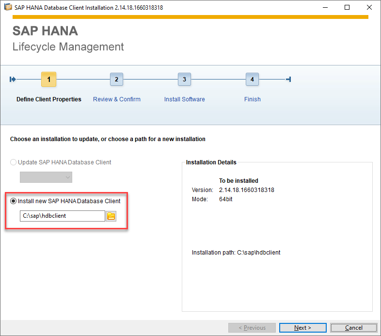
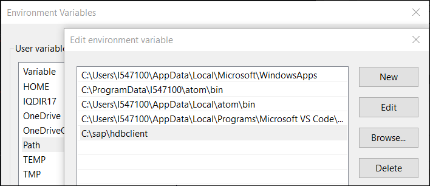
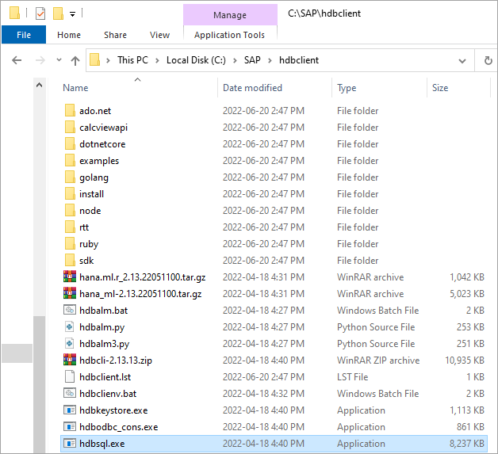

## Prerequisites
 - A Windows, Mac, or Linux machine

## Details
### You will learn
  - How to install the SAP HANA clients
  - The two locations where SAP HANA client installs can be downloaded from

This tutorial will demonstrate how to install the SAP HANA clients.  The next tutorial in this mission will demonstrate how to use `HDBSQL`, which is a command line utility included with the client's installation, to connect to SAP HANA.

---

[ACCORDION-BEGIN [Step 1: ](SAP HANA clients overview)]

The SAP HANA clients provide a set of utilities and drivers to connect to and query a SAP HANA database from multiple programming APIs such as Node.js, Python or Java.  For a complete list, see [SAP HANA Client Interface Programming Reference](https://help.sap.com/viewer/f1b440ded6144a54ada97ff95dac7adf/latest/en-US).  For a list of newly added features consult [SAP HANA Client Interfaces (New and Changed)](https://help.sap.com/viewer/42668af650f84f9384a3337bcd373692/latest/en-US/cfd0b10e42a047c7bc8d6135dc6b9f4c.html), (New and Changed Features in the SAP HANA Client)[https://help.sap.com/viewer/79ae9d3916b84356a89744c65793b924/latest/en-US], or the [release notes](https://launchpad.support.sap.com/#/notes/2829936).

The SAP HANA clients can be used to connect to different versions of an SAP HANA server.  For example, the Windows 2.4.x client can connect to a SAP HANA 1.9+ server, a 2.X server or an SAP HANA instance in the cloud.  For more information on this topic see [SAP HANA client and server cross-version compatibility](https://launchpad.support.sap.com/#/notes/0001906576).

[DONE]
[ACCORDION-END]

[ACCORDION-BEGIN [Step 2: ](Installation from SAP Development Tools)]

Download the client installer for your platform (Windows, Mac or Linux) from the [SAP Development Tools](https://tools.hana.ondemand.com/#hanatools) website under the HANA tab and the SAP HANA Client 2.0 section.


On Windows, unzip the downloaded file in a temporary location (i.e. C:\Temp).

On Linux or a Mac, use the below command.
```Terminal on Linux or Mac
tar -zxvf hanaclient.tar.gz
```  

On Windows run `hdbsetup.exe`, on Linux or a Mac run `./hdbsetup`.  Set the install directory to a location such as `C:\sap\hdbclient`.  



After the installation process is completed, update your path environment variable so that the SAP HANA client programs such as hdbsql.exe can be found on your path.  On Windows, click on the Windows Start icon and search for environment variables.



In the `hdbclient` folder, notice that files such as hdbsql.exe and the client database drivers are available.  
>  
> 

Run the below command in a newly opened Command Prompt to verify the installation succeeded and the path is correct.

```Command Prompt
hdbsql -v
```


> To uninstall at a later time, run `hdbuninst`.  


The install from  SAP Development Tools does not contain the SAP Cryptographic Library.  This can be seen by examining the `C:\SAP\hdbclient\manifest.mf` file.  

The SAP Cryptographic Library is only required when client-side data encryption is used, for LDAP Authentication or for cases where a preference is to use the SAP Common Crypto Library over the libraries provided by the OS.  For further details see the following links.  

 [Client-Side Data Encryption in the Security Guide](https://help.sap.com/viewer/b3ee5778bc2e4a089d3299b82ec762a7/latest/en-US/d7dc0b57c68d442ebc2af3815d9ea11e.html)  

 [Client-Side Data Encryption Guide](https://help.sap.com/viewer/a7bd9a05faca4d6f8d26b1848a00a578/latest/en-US/101498bb299745b586007fcac404a966.html)  

 [Download and Install SAP Common Crypto Library in the SAP HANA Client Installation and Update Guide](https://help.sap.com/viewer/8e208b44c0784f028b948958ef1d05e7/latest/en-US/463d3ceeb7404eca8762dfe74e9cff62.html)  

 [Connect to SAP HANA with a Secure Connection from Python](https://developers.sap.com/tutorials/hana-python-secure-connection.html)


[DONE]
[ACCORDION-END]


[ACCORDION-BEGIN [Step 3: ](Installation from SAP Software Downloads)]

Another download location is the [Software Downloads](https://support.sap.com/en/my-support/software-downloads.html) site which requires signing in before downloading.  This version of the SAP HANA client download includes the SAP Common Crypto.  If you have a license for SAP HANA Cloud, follow the instructions at [Download and Install the SAP HANA Client](https://help.sap.com/viewer/db19c7071e5f4101837e23f06e576495/cloud/en-US/16155c86453943a5b62236535ecc7429.html).   If you have a license for an on-premise version of SAP HANA, follow the instructions provided at  [SAP HANA Client Installation and Update Guide](https://help.sap.com/viewer/e7e79e15f5284474b965872bf0fa3d63/latest/en-US/d41dee64bb57101490ffc61557863c06.html).   The downloaded software is the same regardless of which one is used.

> 

The downloaded file is a `.sar` file and the utility SAPCAR is needed to extract it.  SAPCAR can also be downloaded from Software Downloads.

The command to extract a `.sar` file is shown below.  The command options are extract, verbose and file.  
```Command Prompt Windows
SAPCAR.EXE -xvf IMDB_CLIENT20_004_182-80002083.SAR
```

```Terminal Linux or Mac
chmod u+e SAPCAR
./SAPCAR.EXE -xvf IMDB_CLIENT20_004_182-80002083.SAR
```

For further information on SAPCAR or if you are having troubles using it, see [SAP HANA, SAPCAR, and macOS](https://blogs.sap.com/2020/03/18/sap-hana-sapcar-and-macos/)  

Congratulations, you now have the SAP HANA clients installed.

[VALIDATE_1]
[ACCORDION-END]


---
