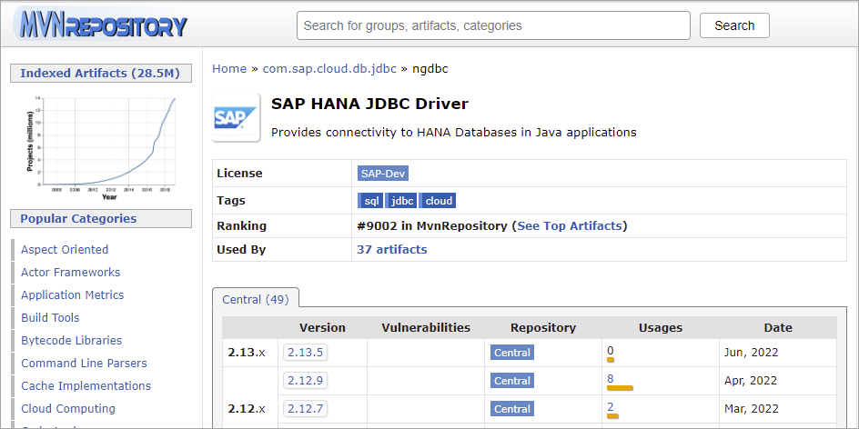
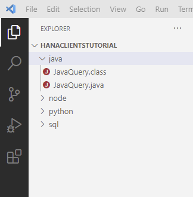
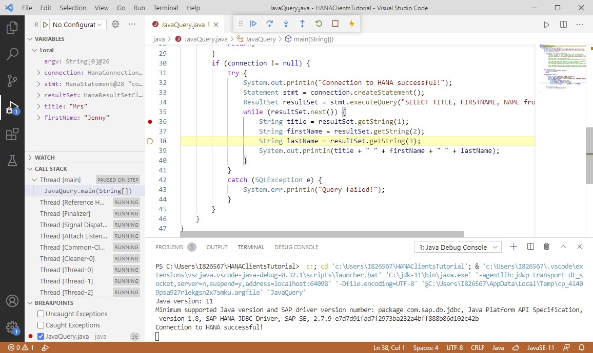
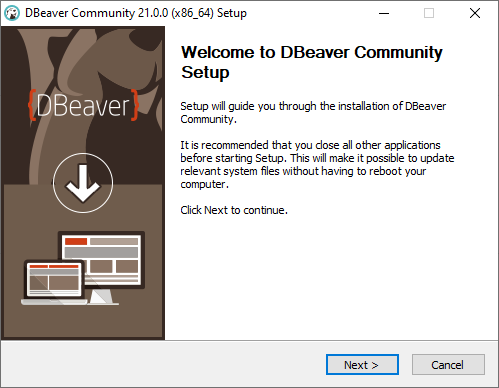
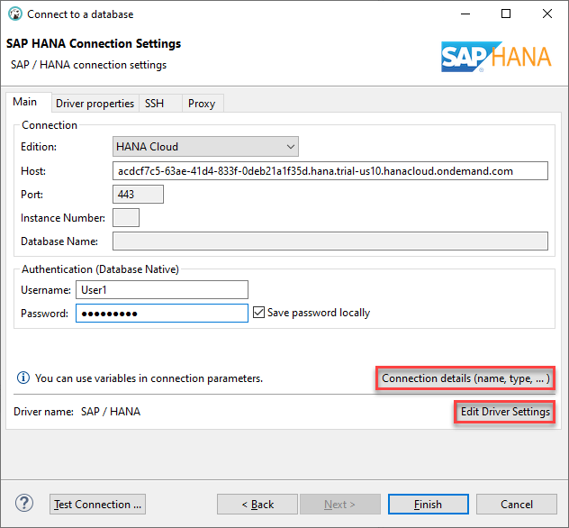

## Prerequisites
 - You have completed the first 3 tutorials in this mission.

## Details
### You will learn
  - How to install Java
  - How to create and debug a Java application that queries a SAP HANA database
  - How to connect to SAP HANA in `DBeaver` using the SAP HANA JDBC driver

[Java Database Connectivity](https://en.wikipedia.org/wiki/Java_Database_Connectivity) (JDBC) provides an [API](https://docs.oracle.com/javase/8/docs/technotes/guides/jdbc/) for accessing databases from Java.  An application written to the JDBC standard can be ported to other databases.  Database vendors provide JDBC drivers for their database products.


---

[ACCORDION-BEGIN [Step 1: ](Install a JDK)]

Ensure that you have a Java Development Kit (JDK) installed and make sure it is accessible from your path.  Details on which Java versions are supported can be found in  SAP note [3006307 - SAP HANA Client Supported Platforms for 2.7](https://launchpad.support.sap.com/#/notes/3006307) and [Oracle Java SE Support Roadmap](https://www.oracle.com/java/technologies/java-se-support-roadmap.html).  

A few options include:

* [Java JDK](https://www.oracle.com/technetwork/java/javase/overview/index.html) such as [Java SE 11 (LTS)](https://www.oracle.com/java/technologies/javase-jdk11-downloads.html)

* [A SAP supported version of the `OpenJDK`](https://sap.github.io/SapMachine/#download)


To verify that the JDK is correctly set up, run the following:

```Shell
java -version
javac -version
```

If these commands fail, ensure that the folder they are located in, is included in your path.  

[DONE]
[ACCORDION-END]

[ACCORDION-BEGIN [Step 2: ](The SAP HANA JDBC driver)]

The SAP HANA driver for JDBC is a [Multi-Release JAR file](https://openjdk.java.net/jeps/238) and as such supports multiple versions of Java.  It is available in the client installation folder at `C:\SAP\hdbclient\ngdbc.jar` and in the [maven repository](https://mvnrepository.com/artifact/com.sap.cloud.db.jdbc/ngdbc).



1. Run the following command for version information.  If needed, adjust the path to match the installation location on your machine.

    ```Shell (Microsoft Windows)
    java -jar C:\SAP\hdbclient\ngdbc.jar -v
    ```  

    ```Shell (Linux or Mac)
    java -jar ~/sap/hdbclient/ngdbc.jar -v
    ```

2. Run the command again without the `-v` to open the configuration window, which provides driver information and the ability to set trace information:

    

    >The JDBC driver has a different version number than the rest of the SAP HANA interfaces.

    The trace options are further described at [JDBC Tracing and Trace Options](https://help.sap.com/viewer/f1b440ded6144a54ada97ff95dac7adf/latest/en-US/4033f8e603504c0faf305ab77627af03.html).


3. Run the following and use either connection details stored in the user store or specify the connection details.

    ```Shell (Windows)
    java -jar C:\SAP\hdbclient\ngdbc.jar -k USER1UserKey -o encrypt=True -o validatecertificate=false -c "SELECT  * FROM HOTEL.CUSTOMER"

    or

    java -jar C:\SAP\hdbclient\ngdbc.jar -u USER1,Password1 -n your_host:your_port -o encrypt=True -o validatecertificate=false -c "SELECT  * FROM HOTEL.CUSTOMER"
    ```  

    ```Shell (Linux or Mac)
    java -jar ~/sap/hdbclient/ngdbc.jar -u USER1,Password1 -n your_host:your_port -o encrypt=True -o validatecertificate=false -c "SELECT  * FROM HOTEL.CUSTOMER"
    ```
    

See [JDBC Command-Line Connection Options](https://help.sap.com/viewer/f1b440ded6144a54ada97ff95dac7adf/latest/en-US/9ac4e1eedbbc4961bce0db6ad64b3612.html) for additional details on parameters of `ngdbc.jar`.

[DONE]
[ACCORDION-END]

[ACCORDION-BEGIN [Step 3: ](Create a Java application that queries SAP HANA)]

1. The following commands create a folder named `java`, enter the newly created directory, create a file named `JavaQuery.java`, and open the file in notepad.

    ```Shell (Microsoft Windows)
    mkdir %HOMEPATH%\HANAClientsTutorial\java
    cd %HOMEPATH%\HANAClientsTutorial\java
    notepad JavaQuery.java
    ```

    Substitute `pico` below for your preferred text editor.

    ```Shell (Linux or Mac)
    mkdir -p $HOME/HANAClientsTutorial/java
    cd $HOME/HANAClientsTutorial/java
    pico JavaQuery.java
    ```

2. Copy the following code into `JavaQuery.java`:

    ```Java
    import java.sql.*;
    import com.sap.db.jdbc.Driver;
    public class JavaQuery {
        public static void main(String[] argv) {
            System.out.println("Java version: " + com.sap.db.jdbc.Driver.getJavaVersion());
            System.out.println("Minimum supported Java version and SAP driver version number: " + com.sap.db.jdbc.Driver.getVersionInfo());
            Connection connection = null;
            try {  
                connection = DriverManager.getConnection(  
                    //Option 1, retrieve the connection parameters from the hdbuserstore
                    //The below URL gets the host, port and credentials from the hdbuserstore.
                    "jdbc:sap://dummy_host:0/?KEY=USER1UserKey&encrypt=true&validateCertificate=false");

                    //Option2, specify the connection parameters
                    //"jdbc:sap://10.11.123.134:39015/?encrypt=true&validateCertificate=false", "User1", "Password1");

                    //As of SAP HANA Client 2.6, connections on port 443 enable encryption by default
                    //validateCertificate should be set to false when connecting
                    //to an SAP HANA, express edition instance that uses a self-signed certificate.

                    //As of SAP HANA Client 2.7, it is possible to direct trace info to stdout or stderr
                    //"jdbc:sap://10.11.123.134:39015/?encrypt=true&validateCertificate=false&traceFile=stdout&traceOptions=CONNECTIONS", "User1", "Password1");

            }
            catch (SQLException e) {
                System.err.println("Connection Failed:");
                System.err.println(e);
                return;
            }
            if (connection != null) {
                try {
                    System.out.println("Connection to HANA successful!");
                    Statement stmt = connection.createStatement();
                    ResultSet resultSet = stmt.executeQuery("SELECT TITLE, FIRSTNAME, NAME from HOTEL.CUSTOMER;");
                    while (resultSet.next()) {
                        String title = resultSet.getString(1);
                        String firstName = resultSet.getString(2);
                        String lastName = resultSet.getString(3);
                        System.out.println(title + " " + firstName + " " + lastName);
                    }
                }
                catch (SQLException e) {
                    System.err.println("Query failed!");
                }
            }
        }
    }
    ```

3. Compile the `.java` file into a `.class` file using the following command:

    ```Shell (Microsoft Windows)
    javac -cp C:\SAP\hdbclient\ngdbc.jar;. JavaQuery.java
    ```  

    ```Shell (Linux or Mac)
    javac -cp ~/sap/hdbclient/ngdbc.jar:. JavaQuery.java
    ```  


4. Run `JavaQuery.class` and indicate where the SAP HANA JDBC driver is located.  Note that the host, port, UID and PWD will be retrieved from the `hdbuserstore`.

    ```Shell (Microsoft Windows)
    java -classpath C:\SAP\hdbclient\ngdbc.jar;. JavaQuery
    ```  

    ```Shell (Linux or Mac)
    java -classpath ~/sap/hdbclient/ngdbc.jar:. JavaQuery
    ```  

    

See [JDBC Connection Options in Java Code](https://help.sap.com/viewer/f1b440ded6144a54ada97ff95dac7adf/latest/en-US/1c86038c05464d31a7dcae14f2d8a7dd.html) for additional details on the `getConnection` method of the `DriverManager`.  

See [Connect to SAP HANA Cloud via JDBC](https://help.sap.com/viewer/db19c7071e5f4101837e23f06e576495/2020_04_QRC/en-US/030a162d380b4ec0bc6a284954c8256d.html) for additional details on the certificate used during the connection.


[DONE]
[ACCORDION-END]

[ACCORDION-BEGIN [Step 4: ](Debug the application)]

Visual Studio Code provides plugins for Java and can be used to debug an application.  

1. If you have not already done so, download [Visual Studio Code](https://code.visualstudio.com/Download).

2. If you have not already done so, in Visual Studio Code, choose **File | Open Folder**, and then select the `HANAClientsTutorial` folder.

    

3. Open the file `JavaQuery.java`, and if asked, install the recommended extensions.

    

4. Once the Java Extension Pack has been installed, expand the Java Project Explorer and click on the **+** icon to add the JDBC driver as a referenced library.

    

    The JDBC driver is located at `C:\SAP\hdbclient\ngdbc.jar`.

5. Place a breakpoint and then select **Run | Start Debugging**.  

    Notice that the debug view becomes active.  

    Notice that the program stops running at the breakpoint that was set. Step through the code by pressing F10 and observe the variable values in the variables pane.

    


[DONE]
[ACCORDION-END]

[ACCORDION-BEGIN [Step 5: ](Browse SAP HANA using DBeaver)]
`DBeaver` is a free and open source database tool and can be used with the SAP HANA JDBC driver.

The following steps demonstrate how to configure `DBeaver` to connect to SAP HANA Cloud or SAP HANA, express edition using the JDBC driver.

1. [Download](https://dbeaver.io/download/) and install the community edition of `DBeaver`.

    

2. Create a new SAP HANA database connection.

    

    Specify the connection type and fill in the host and port.

    

    Click on **Connection details** to specify the connection name.

    

    Click on **Edit Driver Settings** and choose to download the latest HANA JDBC driver.

    

3. After finishing the wizard, the catalog of the database can be viewed and SQL statements can be executed.

    

    `DBeaver` can also be used to create an entity relationship (ER) diagram, perform a comparison of two selected objects, execute import and export operations, view spatial data on a map, and perform data analysis with its grouping and `calc` panels.

Congratulations! You have now created and debugged a Java application that connects to and queries an SAP HANA database and used the JDBC driver in a third party tool.

[VALIDATE_1]
[ACCORDION-END]


---
