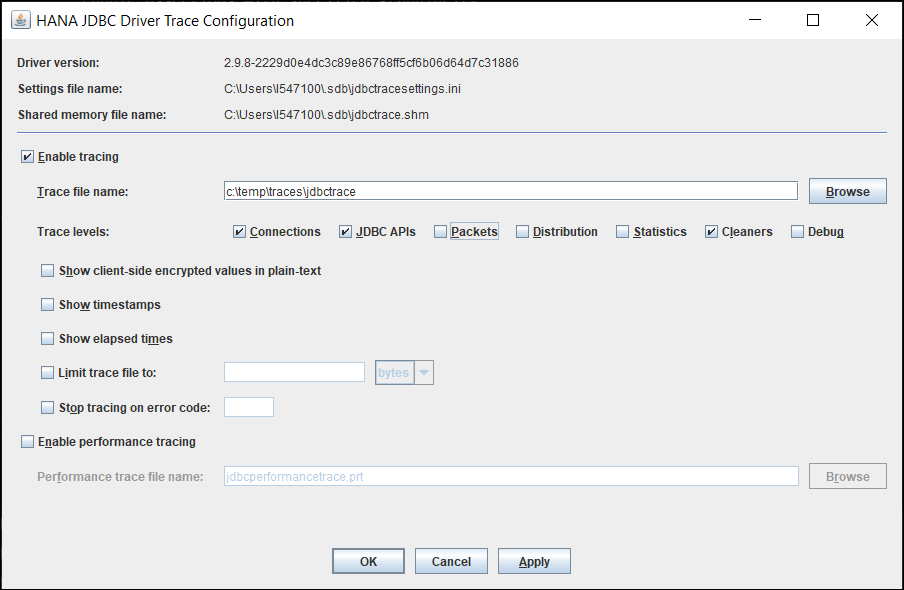

## Prerequisites
 - You have completed the first 3 tutorials in this mission.

## Details
### You will learn
  - How to install Java
  - How to create and debug a Java application that queries a SAP HANA database

[Java Database Connectivity](https://en.wikipedia.org/wiki/Java_Database_Connectivity) (JDBC) provides an API for accessing databases from Java.  An application written to the JDBC standard can be ported to other databases.  Database vendors provide JDBC drivers for their database products.


---

[ACCORDION-BEGIN [Step 1: ](Install JDK)]

Ensure that you installed a JDK and make sure it is accessible from your path.  

* [Java JDK](https://www.oracle.com/technetwork/java/javase/overview/index.html)

* [`SapMachine OpenJDK`](https://sap.github.io/SapMachine/#download) (download the long-term support JDK)

To verify that it is correctly set up, run the following:

```Shell
java -version
javac -version
```

If these commands fail, ensure that they are included in your path.  

[DONE]
[ACCORDION-END]

[ACCORDION-BEGIN [Step 2: ](SAP HANA JDBC client)]

The SAP HANA client driver for JDBC is a [Multi-Release JAR file](https://openjdk.java.net/jeps/238) and as such supports [multiple versions](https://launchpad.support.sap.com/#/notes/2499500) of Java.


The JDBC driver is available at `C:\SAP\hdbclient\ngdbc.jar`. Run the following command for version information:

```Shell on Windows
java -jar C:\SAP\hdbclient\ngdbc.jar -v
```  

```Terminal on Linux or Mac
java -jar ~/sap/hdbclient/ngdbc.jar -v
```

Alternatively, run the following to open the configuration window, which provides driver information and the ability to set trace information:

```Shell
java -jar C:\SAP\hdbclient\ngdbc.jar
```

>The JDBC driver has a different version number than the rest of the HANA clients.

>

>The following will execute a simple query:

>```Shell
java -jar C:\SAP\hdbclient\ngdbc.jar -u USER1,Password1 -n your_host:your_port -o encrypt=True -o validatecertificate=false -c "SELECT * FROM HOTEL.CUSTOMER"
```  

The JDBC driver is also available on the [maven repository](https://mvnrepository.com/artifact/com.sap.cloud.db.jdbc/ngdbc).

[DONE]
[ACCORDION-END]

[ACCORDION-BEGIN [Step 3: ](Create Java application that queries SAP HANA)]

1. Create a folder named `java`, enter the newly created directory, create a file named `JavaQuery.java`, and open the file in notepad.

    ```Shell on Windows
    mkdir %HOMEPATH%\HANAClientsTutorial\java
    cd %HOMEPATH%\HANAClientsTutorial\java
    echo.> JavaQuery.java
    notepad JavaQuery.java
    ```

    Substitute `kate` below for your preferred text editor.

    ```Terminal on Linux or Mac
    mkdir $HOME/HANAClientsTutorial/java
    cd $HOME/HANAClientsTutorial/java
    echo > JavaQuery.java
    kate JavaQuery.java
    ```

2. Copy the following code into `JavaQuery.java`:

    ```Java
    import java.sql.*;
    public class JavaQuery {
        public static void main(String[] argv) {
            Connection connection = null;
            try {  //encrypt and validateCertificate should be true for HANA Cloud connections
                connection = DriverManager.getConnection(  
                    //"jdbc:sap://10.7.168.11:39015/?encrypt=true&validateCertificate=false", "User1", "Password1");
                    //The below URL gets the host, port and credentials from the hdbuserstore.
                    "jdbc:sap://dummy_host:0/?KEY=USER1UserKey&encrypt=true&validateCertificate=false");  
            }
            catch (SQLException e) {
                System.err.println("Connection Failed:");
                System.err.println(e);
                return;
            }
            if (connection != null) {
                try {
                    System.out.println("Connection to HANA successful!");
                    Statement stmt = connection.createStatement();
                    ResultSet resultSet = stmt.executeQuery("SELECT TITLE, FIRSTNAME, NAME from HOTEL.CUSTOMER;");
                    while (resultSet.next()) {
                        String title = resultSet.getString(1);
                        String firstName = resultSet.getString(2);
                        String lastName = resultSet.getString(3);
                        System.out.println(title + " " + firstName + " " + lastName);
                    }
                }
                catch (SQLException e) {
                    System.err.println("Query failed!");
                }
            }
        }
    }
    ```

3. Compile the `.java` file into a `.class` file using the following command:

    ```Shell
    javac JavaQuery.java
    ```

4. Run `JavaQuery.class` and indicate where the SAP HANA client JDBC driver is located.  Note that the host, port, UID and PWD will be retrieved from the `hdbuserstore`.

    ```Shell on Windows
    java -classpath C:\SAP\hdbclient\ngdbc.jar;. JavaQuery
    ```  

    ```Terminal on Linux or Mac
    java -classpath ~/sap/hdbclient/ngdbc.jar:. JavaQuery
    ```  

    

See [JDBC Connection Options in Java Code](https://help.sap.com/viewer/f1b440ded6144a54ada97ff95dac7adf/latest/en-US/1c86038c05464d31a7dcae14f2d8a7dd.html) for additional details on the `getConnection` method of the `DriverManager`.  


[DONE]
[ACCORDION-END]

[ACCORDION-BEGIN [Step 4: ](Debug the application)]

Eclipse is a popular IDE for Java application development and provides a debugger.  [Download](https://www.eclipse.org/downloads/packages/) the Eclipse IDE for Java or the Eclipse IDE for Enterprise Java Developers if you wish to be able to browse the SAP HANA catalog using Data Tools.

1. Unzip the downloaded file and start the Eclipse IDE.  

2. Create a new Java project, and add the JDBC driver as an external jar file.  

    

2. Add a new Java class named `JavaQuery` and replace its contents with the previous code.

      

4. Set a breakpoint and click the debug toolbar to run the application and to step through the code.  

    

[DONE]
[ACCORDION-END]


[ACCORDION-BEGIN [Step 5: ](Browse SAP HANA using Eclipse Data Tools)]

The Eclipse IDE for Enterprise Java Developers includes a database source explorer that can be configured with a JDBC driver.  The following steps demonstrate how to configure it to enable connections to SAP HANA.

1. Open the Data Source Explorer.  

    

2. Create a profile for SAP HANA.

    

3. Specify where to find the SAP HANA JDBC driver.  

    

4. Specify the driver class name and the Connection URL.  

    

5. Browse the database catalog and execute SQL queries.

    

Congratulations! You have now created and debugged a Java application that connects to and queries an SAP HANA database.

[VALIDATE_1]
[ACCORDION-END]


---
