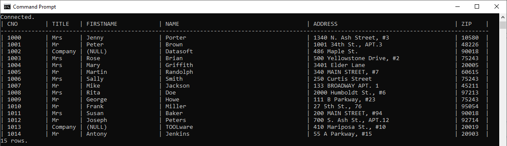

## Prerequisites
 - You have completed the first 3 tutorials in this mission.

## Details
### You will learn
  - How to install Java
  - How to create and debug a Java application that queries a SAP HANA database

[Java Database Connectivity](https://en.wikipedia.org/wiki/Java_Database_Connectivity) (JDBC) provides an API for accessing databases from Java.  An application written to the JDBC standard can be ported to other databases.  Database vendors provide JDBC drivers for their database products.


---

[ACCORDION-BEGIN [Step 1: ](Install a JDK)]

Ensure that you installed a Java Development Kit (JDK) and make sure it is accessible from your path.  Details on which Java versions are supported can be found in  SAP note [2939501 - SAP HANA Client Supported Platforms for 2.5 and later](https://launchpad.support.sap.com/#/notes/2939501) and [Oracle Java SE Support Roadmap](https://www.oracle.com/java/technologies/java-se-support-roadmap.html).

* [Java JDK](https://www.oracle.com/technetwork/java/javase/overview/index.html) such as [Java SE 11 (LTS)](https://www.oracle.com/java/technologies/javase-jdk11-downloads.html)

* [A SAP supported version of the `OpenJDK`](https://sap.github.io/SapMachine/#download)


To verify that it is correctly set up, run the following:

```Shell
java -version
javac -version
```

If these commands fail, ensure that the folder they are located in, is included in your path.  

[DONE]
[ACCORDION-END]

[ACCORDION-BEGIN [Step 2: ](The SAP HANA JDBC driver)]

The SAP HANA driver for JDBC is a [Multi-Release JAR file](https://openjdk.java.net/jeps/238) and as such supports [multiple versions](https://launchpad.support.sap.com/#/notes/2499500) of Java.  It is available in the client installation folder at `C:\SAP\hdbclient\ngdbc.jar` and in the [maven repository](https://mvnrepository.com/artifact/com.sap.cloud.db.jdbc/ngdbc).

1. Run the following command for version information.  If needed, adjust the path to match the installation location on your machine.

    ```Shell (Microsoft Windows)
    java -jar C:\SAP\hdbclient\ngdbc.jar -v
    ```  

    ```Shell (Linux or Mac)
    java -jar ~/sap/hdbclient/ngdbc.jar -v
    ```

2. Run the command again without the `-v` to open the configuration window, which provides driver information and the ability to set trace information:

    

    >The JDBC driver has a different version number than the rest of the SAP HANA interfaces.

    The trace options are further described at [JDBC Tracing and Trace Options](https://help.sap.com/viewer/f1b440ded6144a54ada97ff95dac7adf/latest/en-US/4033f8e603504c0faf305ab77627af03.html).


3. Run the following after replacing `your_host` and `your_port` to execute a simple query:  

    ```Shell (Windows)
    java -jar C:\SAP\hdbclient\ngdbc.jar -u USER1,Password1 -n your_host:your_port -o encrypt=True -o validatecertificate=false -c "SELECT  * FROM HOTEL.CUSTOMER"
    ```  

    ```Shell (Linux or Mac)
    java -jar ~/sap/hdbclient/ngdbc.jar -u USER1,Password1 -n your_host:your_port -o encrypt=True -o validatecertificate=false -c "SELECT  * FROM HOTEL.CUSTOMER"
    ```
    

See [JDBC Command-Line Connection Options](https://help.sap.com/viewer/f1b440ded6144a54ada97ff95dac7adf/latest/en-US/9ac4e1eedbbc4961bce0db6ad64b3612.html) for additional details on parameters of `ngdbc.jar`.

[DONE]
[ACCORDION-END]

[ACCORDION-BEGIN [Step 3: ](Create a Java application that queries SAP HANA)]

1. Create a folder named `java`, enter the newly created directory, create a file named `JavaQuery.java`, and open the file in notepad.

    ```Shell (Microsoft Windows)
    mkdir %HOMEPATH%\HANAClientsTutorial\java
    cd %HOMEPATH%\HANAClientsTutorial\java
    notepad JavaQuery.java
    ```

    Substitute `pico` below for your preferred text editor.

    ```Shell (Linux or Mac)
    mkdir -p $HOME/HANAClientsTutorial/java
    cd $HOME/HANAClientsTutorial/java
    pico JavaQuery.java
    ```

2. Copy the following code into `JavaQuery.java`:

    ```Java
    import java.sql.*;
    public class JavaQuery {
        public static void main(String[] argv) {
            Connection connection = null;
            try {  
                connection = DriverManager.getConnection(  
                    //"jdbc:sap://10.11.123.134:39015/?encrypt=true&validateCertificate=false", "User1", "Password1");
                    //As of SAP HANA Client 2.6, connections on port 443 enable encryption by default
                    //validateCertificate should be set to false when connecting
                    //to an SAP HANA, express edition instance that uses a self-signed certificate.

                    //The below URL gets the host, port and credentials from the hdbuserstore.
                    "jdbc:sap://dummy_host:0/?KEY=USER1UserKey&encrypt=true&validateCertificate=false");  
            }
            catch (SQLException e) {
                System.err.println("Connection Failed:");
                System.err.println(e);
                return;
            }
            if (connection != null) {
                try {
                    System.out.println("Connection to HANA successful!");
                    Statement stmt = connection.createStatement();
                    ResultSet resultSet = stmt.executeQuery("SELECT TITLE, FIRSTNAME, NAME from HOTEL.CUSTOMER;");
                    while (resultSet.next()) {
                        String title = resultSet.getString(1);
                        String firstName = resultSet.getString(2);
                        String lastName = resultSet.getString(3);
                        System.out.println(title + " " + firstName + " " + lastName);
                    }
                }
                catch (SQLException e) {
                    System.err.println("Query failed!");
                }
            }
        }
    }
    ```

3. Compile the `.java` file into a `.class` file using the following command:

    ```Shell
    javac JavaQuery.java
    ```

4. Run `JavaQuery.class` and indicate where the SAP HANA JDBC driver is located.  Note that the host, port, UID and PWD will be retrieved from the `hdbuserstore`.

    ```Shell (Microsoft Windows)
    java -classpath C:\SAP\hdbclient\ngdbc.jar;. JavaQuery
    ```  

    ```Shell (Linux or Mac)
    java -classpath ~/sap/hdbclient/ngdbc.jar:. JavaQuery
    ```  

    

See [JDBC Connection Options in Java Code](https://help.sap.com/viewer/f1b440ded6144a54ada97ff95dac7adf/latest/en-US/1c86038c05464d31a7dcae14f2d8a7dd.html) for additional details on the `getConnection` method of the `DriverManager`.  


[DONE]
[ACCORDION-END]

[ACCORDION-BEGIN [Step 4: ](Debug the application)]

Eclipse is a popular integrated development environment (IDE) for Java application development and provides a debugger.  [Download](https://www.eclipse.org/downloads/packages/) the Eclipse IDE for Java or if you wish to additionally browse the SAP HANA catalog using Data Tools, as shown in step 5, download Eclipse IDE for Enterprise Java Developers.

1. Unzip the downloaded file and start the Eclipse IDE.  

    >Eclipse shows views appropriate to a certain task.  For Java development, it provides a Java perspective.  You may wish to change the perspective to the Java perspective via **Window | Perspective | Open Perspective | Java**

>

2. Create a new Java project named `JavaQuery` via the **File | New | Java Project** wizard.

    Add the JDBC driver as an external jar file.  

    

2. Add a new Java class named `JavaQuery` and replace its contents with the previous code.

      

4. Set a breakpoint and click the debug toolbar to run the application and to step through the code.  

    

[DONE]
[ACCORDION-END]


[ACCORDION-BEGIN [Step 5: ](Browse SAP HANA using Eclipse Data Tools)]

The Eclipse IDE for Enterprise Java Developers includes a database source explorer that can be configured with a JDBC driver.  The version of Eclipse can be confirmed by selecting **Help | About Eclipse IDE**.


The following steps demonstrate how to configure it to enable connections to SAP HANA.


1. Open the Data Source Explorer by choosing **Window | Show View | Other | Data Management | Data Source Explorer**

    

2. Create a connection profile for SAP HANA.

    

3. Select **New Driver Definition**.

    

4. Specify where to find the SAP HANA JDBC driver.  

    

5. Specify the driver class name as `com.sap.db.jdbc.Driver` and the Connection URL.  

    ```Java
    jdbc:sap://dummy_host:0/?KEY=USER1UserKey&encrypt=true&validateCertificate=false
    ```

    

    Validate the settings by selecting `Test Connection` before finishing the wizard.

6. Browse the database catalog and execute SQL queries.

    

    >To execute SQL queries in eclipse, open SQL Scrapbook. SQL Scrapbook is similar to a SQL command line and allows you to query tables from inside eclipse.

    >It can be opened by selecting the SQL Scrapbook icon from the right corner of the Data Source Explorer window.

    >


Congratulations! You have now created and debugged a Java application that connects to and queries an SAP HANA database.

[VALIDATE_1]
[ACCORDION-END]


---
