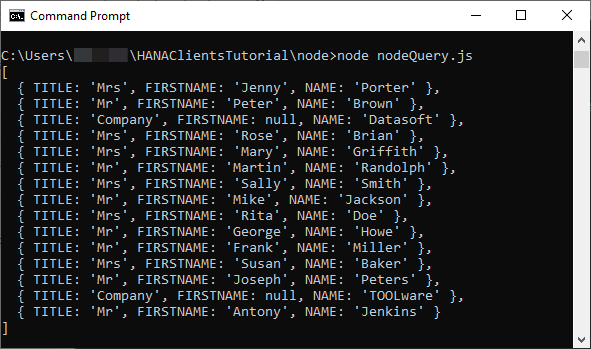
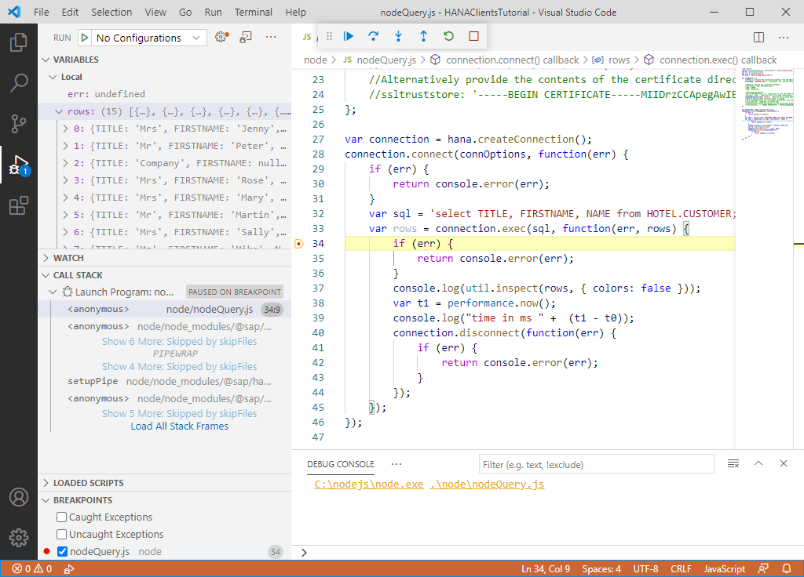

## Prerequisites
 - You have completed the first 3 tutorials in this mission.

## Details
### You will learn
  - How to install Node.js and the SAP HANA client Node.js driver
  - How to create a Node.js application that queries a SAP HANA database

Node.js provides a JavaScript runtime outside of the browser and uses an asynchronous event driven programming model.  For more details, see [Introduction to Node.js](https://nodejs.dev/).  

---

[ACCORDION-BEGIN [Step 1: ](Install Node.js)]

Ensure you have Node.js installed and check its version. Enter the following command:

```Shell
node -v  
```  

If Node.js is installed, the currently installed version is returned, such as v15.3.0.

If Node.js is not installed, download the long-term support (LTS) version of Node.js from [Download Node.js](https://nodejs.org/en/download/).

>An install for Node.js is not provided on Linux. You may choose to install it via a package manager. For more details, please navigate to [this link](https://nodejs.org/en/download/package-manager/).

During the installation, there is no need to check the following box as you do not need to install Chocolatey.  


>The SAP HANA client provides a 32-bit and a 64-bit install, as does Node.js.  The Node.js driver provided with the SAP HANA client is available for 64-bit only and supports Node.js versions 8.11.2 and higher.  For additional details see SAP note [3006307 - SAP HANA Client Supported Platforms for 2.7 and higher](https://launchpad.support.sap.com/#/notes/3006307).

---

> Another option is to use a docker image that contains [Node.js](https://github.com/nodejs/docker-node#docker-run) as shown below.
>
>```Shell
>docker run -it --name=nodealpine node:alpine /bin/bash
>```

[DONE]
[ACCORDION-END]

[ACCORDION-BEGIN [Step 2: ](Install SAP HANA client for Node.js from NPM)]

Node.js packages are available using [NPM](https://www.npmjs.com/), which is the standard package manager for Node.js.  

1. Enter `hana client`, and click **Search**.

      

    The page for the SAP HANA Node.js package on npm is shown below.

      

     It contains additional sample code, a weekly download counter, information about previous versions and the command to install the package using the npm command line interface (`cli`).

2. Create a folder named `node` and enter the newly created directory.

    ```Shell (Microsoft Windows)
    mkdir %HOMEPATH%\HANAClientsTutorial\node
    cd %HOMEPATH%\HANAClientsTutorial\node
    ```

    ```Shell (Linux or Mac)
    mkdir $HOME/HANAClientsTutorial/node
    cd $HOME/HANAClientsTutorial/node
    ```

3. Initialize the project and install the `hana-client` driver from NPM.

    ```Shell
    npm init -y
    npm install @sap/hana-client
    ```

    >The hana-client driver is also available from the HANA client install folder.  The install location was set during the install.

    >```Shell
    >npm install C:\SAP\hdbclient\node
    ```

    >If you encounter an error about permissions, on Microsoft Windows, run or open the command prompt as an administrator, or use `sudo` on Linux or Mac.

4. The following command lists the Node.js modules that are now installed locally into the `HANAClientsTutorial\node` folder.  Note that the extraneous message can be ignored.  

    ```Shell
    npm list
    ```

    

> ### Some Tips

>At this point, the SAP HANA client module has been installed into the `HANAClientsTutorials\node\node_modules` folder and added as a dependency in the `packages.json` file.  The following is some extra optional information on NPM.  

> ---

>Node.js modules can also be installed globally. To see the list of Node.js modules installed globally enter the following command.  

>The depth parameter can be used to specify the number of levels to show when displaying module dependencies.  By setting depth=x, a tree-structure is outputted that shows modules that are x levels below the top-level module.

>```Shell
>npm list -g
>npm list -g --depth=0
>```  

>Command line help for NPM is available.  A few examples of this are shown below.

>```Shell
>npm help
>npm help list
>```  

>Additional information can be found out for a module, such as the debug module, via the info command.

>```Shell
>npm info @sap/hana-client
>```  

>The following commands can be used to view the latest available version of a package, remove a package, add a specific version of a package and then update it to the latest version.

>```Shell
>npm view @sap/hana-client version
>npm uninstall @sap/hana-client
>npm install @sap/hana-client@2.4.167
>npm list @sap/hana-client
>npm update @sap/hana-client
>npm list @sap/hana-client
>```


[DONE]
[ACCORDION-END]

[ACCORDION-BEGIN [Step 3: ](Create a Node.js application that queries SAP HANA)]

1. Open a file named `nodeQuery.js` in an editor.

    ```Shell (Microsoft Windows)
    notepad nodeQuery.js
    ```

    Substitute `pico` below for your preferred text editor.  

    ```Shell (Linux or Mac)
    pico nodeQuery.js
    ```

2. Add the code below to `nodeQuery.js`.  Note that the values for host, port, user name and password are provided by the previously configured `hdbuserstore` key USER1UserKey.  

    ```JavaScript
    'use strict';
    const { PerformanceObserver, performance } = require('perf_hooks');
    var util = require('util');
    var hana = require('@sap/hana-client');

    var connOptions = {
        //Option 1, retrieve the connection parameters from the hdbuserstore
        serverNode: '@USER1UserKey',  //host,port, uid, and pwd retrieved from hdbuserstore

        //Option 2, specify the connection parameters
        //serverNode: 'your host:your port',
        //UID: 'USER1',
        //PWD: 'Password1',

        //Additional parameters
        //As of 2.7 trace info can be directed to stdout or stderr
        //traceFile: 'stdout',
        //traceOptions: 'sql=warning',
        //As of SAP HANA Client 2.6, connections on port 443 enable encryption by default (HANA Cloud).
        //encrypt: 'true',  //Must be set to true when connecting to HANA as a Service
        sslValidateCertificate: 'false',  //Must be set to false when connecting to an SAP HANA, express edition instance that uses a self-signed certificate.
        //Used to specify where the trust store is located.  
        //As of SAP HANA Client 2.6 for OpenSSL connections, this can be ignored as root certificates are read from the default OS location.
        //ssltruststore: '/home/dan/.ssl/trust.pem',
        //Alternatively provide the contents of the certificate directly (DigiCertGlobalRootCA.pem)
        //DigiCert Global Root CA: https://cacerts.digicert.com/DigiCertGlobalRootCA.crt.pem used for SAP HANA cloud
        //on-premise cert can be retrieved using openssl s_client -connect localhost:39015
        //This option is not supported with the mscrypto provider (the default provider on Windows)
        //ssltruststore: '-----BEGIN CERTIFICATE-----MIIDrzCCApegAwIBAgIQCDvgVpBCRrGhdWrJWZHHSjANBgkqhkiG9w0BAQUFADBhMQswCQYDVQQGEwJVUzEVMBMGA1UEChMMRGlnaUNlcnQgSW5jMRkwFwYDVQQLExB3d3cuZGlnaWNlcnQuY29tMSAwHgYDVQQDExdEaWdpQ2VydCBHbG9iYWwgUm9vdCBDQTAeFw0wNjExMTAwMDAwMDBaFw0zMTExMTAwMDAwMDBaMGExCzAJBgNVBAYTAlVTMRUwEwYDVQQKEwxEaWdpQ2VydCBJbmMxGTAXBgNVBAsTEHd3dy5kaWdpY2VydC5jb20xIDAeBgNVBAMTF0RpZ2lDZXJ0IEdsb2JhbCBSb290IENBMIIBIjANBgkqhkiG9w0BAQEFAAOCAQ8AMIIBCgKCAQEA4jvhEXLeqKTTo1eqUKKPC3eQyaKl7hLOllsBCSDMAZOnTjC3U/dDxGkAV53ijSLdhwZAAIEJzs4bg7/fzTtxRuLWZscFs3YnFo97nh6Vfe63SKMI2tavegw5BmV/Sl0fvBf4q77uKNd0f3p4mVmFaG5cIzJLv07A6Fpt43C/dxC//AH2hdmoRBBYMql1GNXRor5H4idq9Joz+EkIYIvUX7Q6hL+hqkpMfT7PT19sdl6gSzeRntwi5m3OFBqOasv+zbMUZBfHWymeMr/y7vrTC0LUq7dBMtoM1O/4gdW7jVg/tRvoSSiicNoxBN33shbyTApOB6jtSj1etX+jkMOvJwIDAQABo2MwYTAOBgNVHQ8BAf8EBAMCAYYwDwYDVR0TAQH/BAUwAwEB/zAdBgNVHQ4EFgQUA95QNVbRTLtm8KPiGxvDl7I90VUwHwYDVR0jBBgwFoAUA95QNVbRTLtm8KPiGxvDl7I90VUwDQYJKoZIhvcNAQEFBQADggEBAMucN6pIExIK+t1EnE9SsPTfrgT1eXkIoyQY/EsrhMAtudXH/vTBH1jLuG2cenTnmCmrEbXjcKChzUyImZOMkXDiqw8cvpOp/2PV5Adg06O/nVsJ8dWO41P0jmP6P6fbtGbfYmbW0W5BjfIttep3Sp+dWOIrWcBAI+0tKIJFPnlUkiaY4IBIqDfv8NZ5YBberOgOzW6sRBc4L0na4UU+Krk2U886UAb3LujEV0lsYSEY1QSteDwsOoBrp+uvFRTp2InBuThs4pFsiv9kuXclVzDAGySj4dzp30d8tbQkCAUw7C29C79Fv1C5qfPrmAESrciIxpg0X40KPMbp1ZWVbd4=-----END CERTIFICATE-----'
    };

    //Synchronous  example querying a table
    var connection = hana.createConnection();
    connection.connect(connOptions);
    var sql = 'select TITLE, FIRSTNAME, NAME from HOTEL.CUSTOMER;';
    var t0 = performance.now()
    var result = connection.exec(sql);
    console.log(util.inspect(result, { colors: false }));
    var t1 = performance.now();
    console.log("time in ms " +  (t1 - t0));
    connection.disconnect();

    //Asynchronous example calling a stored procedure
    var connection = hana.createConnection();
    connection.connect(connOptions, function(err) {
        if (err) {
            return console.error(err);
        }
        const statement = connection.prepare('CALL HOTEL.SHOW_RESERVATIONS(?,?)');
        const parameters = [11, '2020-12-24'];
        var results = statement.execQuery(parameters, function(err, results) {
            if (err) {
                return console.error(err);
            }
            while (results.next()) {
                console.log(util.inspect(results.getValues(), { colors: false }));
            }
            statement.drop();
            connection.disconnect(function(err) {
                if (err) {
                    return console.error(err);
                }   
            });
        });
    });
    ```  

4. Run the app.  

    ```Shell
    node nodeQuery.js
    ```


Note the above app makes use of some of the SAP HANA client Node.js driver methods, such as [connect](https://help.sap.com/viewer/f1b440ded6144a54ada97ff95dac7adf/latest/en-US/d7226e57dbd943aa9d8cd0b840da3e3e.html), [execute](https://help.sap.com/viewer/f1b440ded6144a54ada97ff95dac7adf/latest/en-US/ef5564058b1747ce99fd3d1e03266b39.html) and [disconnect](https://help.sap.com/viewer/f1b440ded6144a54ada97ff95dac7adf/latest/en-US/fdafeb1d881947bb99abd53623996b70.html).

In nodeQuery.js, synchronous and asynchronous queries are performed.  Notice that asynchronous method calls use callback functions.  See [JavaScript Asynchronous Programming and Callbacks](https://nodejs.dev/learn/javascript-asynchronous-programming-and-callbacks) for additional details.

>To enable debug logging of the SAP  HANA Node.js client, enter the following command and then rerun the app.

>```Shell (Microsoft Windows)
>set DEBUG=*
node nodeQuery.js
>```  

>```Shell (Linux or Mac)
export DEBUG=*
node nodeQuery.js
>```    

> 

> The value of the environment variable DEBUG can be seen and removed with the commands below.

>```Shell (Microsoft Windows)
>set DEBUG
>set DEBUG=
>set DEBUG
>```  

>```Shell (Linux or Mac)
>printenv | grep DEBUG
>unset DEBUG
>printenv | grep DEBUG
>```


[DONE]
[ACCORDION-END]

[ACCORDION-BEGIN [Step 4: ](Debug the application)]

Visual Studio Code can run and debug a Node.js application.  It is a lightweight but powerful source code editor which is available on Windows, macOS and Linux.

1. [Download Visual Studio Code.](https://code.visualstudio.com/Download)

2. In Visual Studio Code, choose **File | Add Folder to Workspace** and then add the `HANAClientsTutorial` folder.

    

3. Open the file `nodeQuery.js`.

4. Place a breakpoint inside the `connection.exec` callback.  Select **Run | Start Debugging | Node.js**.  

    Notice that the debug view becomes active.  

    Notice that the program stops running at the breakpoint that was set. Observe the variable values in the leftmost pane.  Step through code.

    


Congratulations! You have created and debugged a Node.js application that connects to and queries an SAP HANA database.

[VALIDATE_1]
[ACCORDION-END]


---
